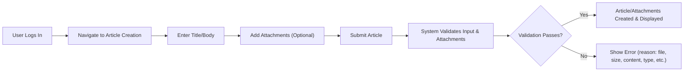

# Requirements Analysis Report for Economic/Political Discussion Board

## Service Description
A minimal, focused online forum enabling users to discuss economic and political topics through articles, attachments, and comments. Simplicity, reliability, and attachment support are the service’s defining business features.

## Functional Requirements

### Article and Attachment Management
- WHEN a registered user creates a new article, THE system SHALL provide fields for title (1–100 chars), body (1–10,000 chars), and allow attaching zero or more files and/or images subject to business attachment rules.
- WHEN submitting an article, THE system SHALL record creation time, author identity, and metadata for all attachments.
- WHEN editing an existing article, THE system SHALL allow the author to update the title, body, and attachments so long as the article is not deleted.
- IF a user attempts to edit or delete an article authored by someone else, THEN THE system SHALL refuse the operation and display an explicit permission error message referencing the user’s rights.
- WHEN a user deletes their own article, THE system SHALL hide it from general user view but retain it for admin review and audit purposes; WHEN an admin deletes any article, THE system SHALL remove it fully along with all attachments and comments, and log the deletion including admin id and reason.
- WHEN a user attaches images/files to articles, THE system SHALL accept only images (JPEG, PNG, GIF) and documents (PDF, DOCX, XLSX, TXT, ZIP), up to 10 files per article, each ≤10MB and total ≤50MB per article (expandable per business config); THE system SHALL preview images as thumbnails prior to publishing.
- IF upload fails or does not pass validation (file type, size, or malware scan), THEN THE system SHALL display a specific descriptive error and allow correction before resubmission.
- WHEN an article is deleted, THE system SHALL remove all associated attachments at the same time, permanently and irreversibly.

### Commenting and Discussion Flows
- WHEN a logged-in user views an article, THE system SHALL permit them to submit comments (text only, 1–1,000 chars per business rule).
- WHEN a user submits a comment, THE system SHALL associate it with the article, record its creation time and author, and display it immediately if it passes content validation.
- WHEN deleting their own comment, THE user SHALL be able to remove it; THE system SHALL then hide or remove it so that it is no longer accessible or visible in the article.
- IF a user attempts to edit/delete another user’s comments, THEN THE system SHALL display a permission error and prevent the action.
- WHEN an admin deletes a comment, THE system SHALL log the event and permanently remove the record, referencing moderation reason in audit log.
- WHEN multiple users report a comment or article for abuse, THE system SHALL flag it for admin moderation and notify admins for review.

### Profile and Account Management
- WHEN registering a new account, THE system SHALL require email, display name, and password in compliance with user data business rules; THE system SHALL enforce email uniqueness.
- WHEN updating a profile, THE user SHALL be able to change display name, email (pending verification), password, and avatar image (which must be a valid JPEG/PNG ≤2MB).
- WHEN a user deletes their own account, THE system SHALL anonymize author name on all their articles/comments but retain discussion content for audit/history.
- WHEN logging in, THE system SHALL validate credentials and, upon success, start a new authenticated session following authentication business process (described separately).

### Administrative/Moderation Operations
- WHEN an admin account is authorized, THE system SHALL grant access to moderation tools, including article, comment, and user management.
- WHEN an admin reviews flagged/abusive content, THE system SHALL display options to edit, hide, or remove the item, always logging the moderator’s action, timestamp, and brief justification.
- WHEN deleting a user account (by admin), THE system SHALL remove PII but keep authored content anonymized for record/audit.
- WHEN an admin takes any moderation action (removal, ban, or edit), THE system SHALL require confirmation before finalizing and write the event to the audit log.

## Non-Functional Requirements

### Simplicity & Minimalism
- THE system SHALL maintain the fewest possible steps from registration/login to first post (max 5 steps to publish an article from new account), with clear minimal interface flows.
- THE system SHALL avoid unnecessary features, pages, fields, or configuration; only required settings and information must be requested.

### Performance & Reliability
- WHEN a user loads up to 50 articles or comments, THE system SHALL return results within 2 seconds for 95% or more of requests.
- WHEN uploading files/images ≤10MB, THE system SHALL complete or fail the upload within 10 seconds; IF performance drops below this baseline for 3 consecutive periods, THEN THE system SHALL restrict new uploads and notify users until service recovers.
- THE system SHALL provide 99.5% uptime (exclusive of pre-scheduled maintenance) over each 30-day period.

### File Attachment Restrictions
- THE system SHALL enforce: Only JPEG, PNG, GIF for images; PDF, DOCX, XLSX, TXT, ZIP for docs; up to 10 attachments/article (max 50MB total), each individual file ≤10MB.
- THE system SHALL block executable files or files with embedded scripts.
- THE system SHALL preview images before upload, show filenames/types for all attachments, and enable users to remove attachments before publishing.
- THE system SHALL scan all uploaded files for malware/viruses before accepting.
- THE system SHALL store attachments in a manner that prevents unauthorized access and generates secure, expiring download links only for authorized users.

### Usability
- THE system SHALL display helpful, contextual error and confirmation messages for all user actions.
- All actions (article post, comment, upload, profile update, etc.) SHALL be performable by new users in no more than 3 distinct UI steps per action.

### Privacy & Compliance
- WHEN a user registers or updates data, THE system SHALL secure personal info and attachments from unauthorized access at all times.
- WHEN users delete their account or are deleted by admin, THE system SHALL erase their PII and anonymize authorship on historic content (articles/comments).
- THE system SHALL always comply with current privacy regulations (GDPR, KR-PIPA, etc.), offer users a downloadable copy of all stored personal and content data, require acceptance of privacy policy/terms on registration, and maintain an audit record of such consents.

## Acceptance Criteria

| Requirement                         | Acceptance Criteria                                                    |
|-------------------------------------|-----------------------------------------------------------------------|
| Article Creation/Management         | User creates, edits, or deletes only own articles; admin can fully moderate; all attachment business rules respected.                       |
| Commenting                          | Users add/delete only own comments; admins have full moderation power; no cross-user modification permitted.                                 |
| Attachments                         | Only listed file types/sizes accepted; error clearly shown on invalid; images preview/titles visible pre-upload.                              |
| Profile                             | Own profile may be updated with full validation; email verified/change process enforced, with clear error handling and anonymization.         |
| Moderation/Admin Actions            | Complete logging, traceability, and permission enforcement for all admin operations; user and admin cannot edit/delete each others’ records.   |
| Performance                         | All business timelines and reliability targets met (posting, upload, retrieval, error notification) as defined above.                       |
| Simplicity                          | Required actions completed in at most 3 to 5 business steps, with clear business language/cues and minimal user confusion.                   |
| Privacy/Compliance                  | All user PII and content handled per privacy regulation, with user-initiated download and deletion; compliance logs maintained.               |

## Business Process Flows (Mermaid)

### Article Creation & Attachment Upload

---

All requirements above are written in business process terms and EARS format for backend developer consumption, with no technical implementation details.