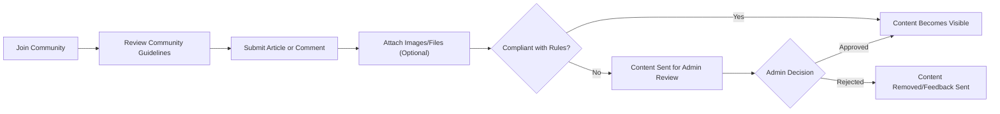

# Business Model for Economic/Political Discussion Board

## Value Delivery Summary
The discussion board provides a focused online space where individuals can freely and respectfully engage in economic and political conversation. THE platform SHALL offer a safe, accessible, and minimally structured medium for the sharing of articles, opinions, and commentary. Users can publish original articles, participate in ongoing debates, and attach images or files to enrich their contributions.

THE core value proposition of the discussion board is to foster informed public discourse and to create a sustainable, non-toxic environment for civil discussion on pressing economic and political issues. Rather than competing with large-scale social platforms, the board targets thoughtful, topic-specific conversation with a minimal feature set to reduce barriers to participation and moderation overhead.

THE platform creates non-monetary value through:
- Enabling free expression and structured debate on important societal themes.
- Lowering barriers to content creation by supporting article attachments (images, documents).
- Preserving and archiving high-quality conversations for research, learning, and future reference.

## Community Engagement Model
THE system SHALL be open for registration to any user willing to abide by community guidelines and rules of respectful engagement.

WHEN a user joins the platform, THE system SHALL present clear community expectations regarding civility, topic focus, and appropriate attachment usage.

THE engagement model includes:
- Provision for users to publish and edit their own articles in relevant economic/political categories.
- Commenting on articles to promote back-and-forth dialogue and exchange of perspectives.
- Image and file attachments to allow users to provide supporting evidence, data, or references.
- Basic moderation tools available to administrators to ensure adherence to community guidelines and remove inappropriate content or abusive actors.

THE system SHALL encourage repeat participation through visible recent activity, prompt notifications of replies or new articles, and recognition of constructive contribution (e.g., visible engagement levels). All engagement SHALL remain aligned with the principles of neutrality, inclusion, and privacy.

Mermaid diagram (Community Participation Workflow):

## Potential Revenue Streams (if any)
THE primary intent of the discussion board is to provide non-commercial value via community engagement and public discussion. However, even for non-profit or minimally resourced platforms, THE system SHALL have a minimal financial sustainability plan:
- THE service MAY accept voluntary donations from users for operational sustainability.
- THE service MAY display unobtrusive, context-relevant sponsorship banners limited to economic or political education-related initiatives (optional and subject to admin approval).
- THE platform SHALL NOT require paid registration, nor place any core features behind a paywall.

Alternative revenue concepts MAY be considered in the future, but only insofar as they do not impede community-focused, open-access priorities.

## Sustainability Plan
THE sustainability of the discussion board hinges on operational continuity, ongoing community health, and adaptability:

- Operational resources: THE system SHALL minimize cost burdens by using standard hosting, low-overhead software solutions, and optimized content storage/deletion policies for attachments.
- Volunteer moderation: WHERE paid staff are not available, THE platform SHALL rely on engaged administrators for content moderation and community management.
- Community self-governance: THE system SHALL encourage reporting of abuse and constructive feedback from participants to keep the space healthy and self-sustaining.
- Regular periodic evaluation: THE system SHALL provide administrators with simple dashboards/reporting so platform health and risk factors are visible at a glance.
- Data preservation: THE system SHALL implement clear retention/deletion policies for user-generated content and ensure compliance with privacy regulations as defined in the [Compliance and Privacy Requirements](./10-compliance-and-privacy.md) document.

## Success Metrics
To evaluate the health and impact of the discussion board, the following metrics SHALL be tracked and reported to stakeholders:

| Metric | Description |
|--------|-------------|
| Registered Users | The total count of unique users who maintain active accounts |
| Articles Published | Number of distinct discussion articles submitted |
| Comments Created | Total comments attached to articles |
| Engagement Rate | Articles and comments per user per month |
| Attachment Usage | Number and volume of images/files uploaded |
| Admin Actions | Interventions per period (edits, removals, user blocks) |
| Community Health | Aggregate score from user feedback and abuse reports |

WHEN tracking these metrics, THE system SHALL maintain user privacy and ensure all reporting is anonymized and compliant with local regulations.

Success is defined as steady growth in thoughtful participation, minimal abuse or spam, high perceived value from community members, and the continued operational viability of the platform.

