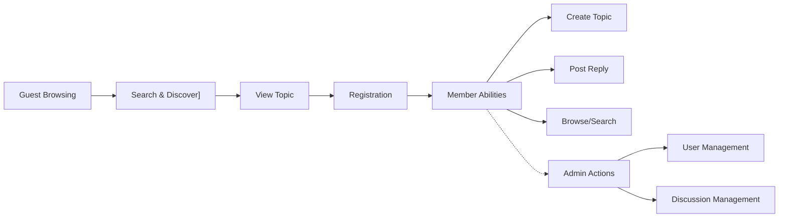

# Core Value Proposition for Economic/Political Discussion Board

## Key Benefits

- **Democratized Access to Discourse:** THE discussion board SHALL provide an open forum for meaningful economic and political discussions accessible to anyone, anywhere.
- **Simplicity and Ease of Use:** THE platform SHALL focus on intuitive interfaces and minimal learning curve, enabling users with various technical backgrounds to participate without barriers.
- **Community-Driven Quality:** WHEN users initiate and participate in discussions, THE platform SHALL foster quality content by emphasizing visible, structured conversations and clarity in discourse.
- **Role-Based Security and Inclusion:** THE service SHALL assign permissions according to clearly defined roles (guest, member, admin), ensuring safe, welcoming participation while protecting against unauthorized actions.
- **Low Friction Onboarding:** WHEN a new user wishes to participate, THE system SHALL offer hassle-free registration and entry into the community.
- **Search and Discovery:** THE system SHALL enable users to find relevant discussions through robust search and filtering, maximizing engagement and knowledge sharing.
- **Accessibility:** THE board SHALL be usable by participants of diverse ability, geography, and device type, as a strategic commitment to inclusivity.

## Competitive Differentiators

- **Superb Usability for Non-Experts:** WHERE users have limited experience with online forums, THE system SHALL support their engagement through clear navigation, help documentation, and explicit workflow guidance.
- **Focused Purpose, No Clutter:** WHERE the board's subject matter is economics and politics, THE platform SHALL streamline features to support those topics exclusively, avoiding distractions found in multi-topic forums.
- **Open Participation, Controlled Abuse:** IF a user is not authenticated (guest), THEN THE system SHALL restrict creation of topics and replies, maintaining openness for browsing but reducing spam and misuse.
- **No Unnecessary Complexity:** THE service SHALL avoid implementing extraneous features (such as moderation, advanced analytics, or complex voting mechanisms) unless business needs dictate, allowing resources to be dedicated to core functionality.
- **Fast, Reliable Performance:** THE system SHALL provide immediate feedback and near-instantaneous responses to common actions (such as posting or searching), ensuring a seamless user experience.
- **Clear Value for Each Stakeholder:**
    - Guests: Access to information and discussions without registration barrier.
    - Members: Ability to engage, share views, and build reputation.
    - Admins: Tools for oversight, basic content management, and user support if/when needed.

## Unique Service Features

- **Secure Registration and Authentication:** THE service SHALL provide user registration, email/password authentication, and session management using industry-standard practices.
- **Topic Creation and Reply Workflows:** WHEN a member initiates a new discussion or posts a reply, THE system SHALL support this with clear, accessible processes and validation.
- **Browsing and Search Capabilities:** THE platform SHALL enable efficient exploration of conversations through search by keyword, filtering by category or recency, and paginated browsing.
- **Logical Role Segmentation:** THE system's architecture SHALL strictly segment capabilities:
    - Guests browse/search only
    - Members post, reply, search, and browse
    - Admins (when active) manage users/content, providing a potential moderation and escalation path
- **Inclusive and Sustainable Design:** THE board SHALL maintain accessibility standards, mobile responsiveness, and clear, structured layouts, supporting sustained community growth and participation.
- **Privacy and Data Control:** THE platform SHALL store only minimal, essential user information and communicate privacy commitments transparently.

## Visual Overview (Mermaid)

## EARS Examples

- WHEN a member wishes to initiate a new topic, THE platform SHALL provide a simple, validated submission form.
- IF a guest attempts to post content, THEN THE system SHALL refuse and prompt for authentication.
- WHERE users search for topics, THE system SHALL return results almost instantly for common queries.
- THE service SHALL segment user roles and permissions clearly, providing confidence in data security and community fairness.

## Strategic Value Statement

THE economic/political discussion board SHALL deliver straightforward, reliable, and accessible community engagement for all participants, filling a gap in the market for non-technical audiences and enthusiasts seeking civil discourse on complex topics with minimal barriers.

---

*This document provides business requirements only. All technical implementation decisions (architecture, APIs, database design, etc.) are at the discretion of the development team. This report describes WHAT the system must deliver, not HOW to build it.*