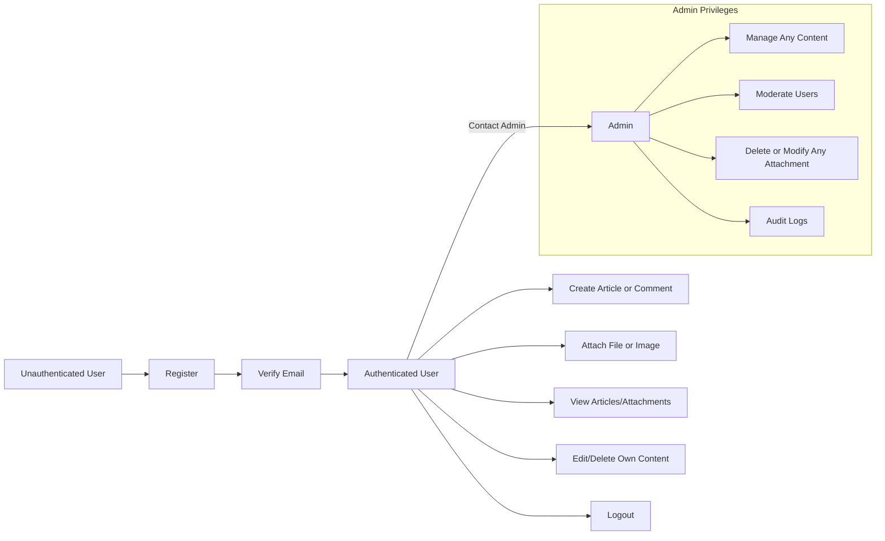

# User Actors and Permissions for Economic/Political Discussion Board

## Actor Definitions

### "user"
A registered member whose primary functions are creating, editing, and deleting their own articles and comments. Users can join discussions, attach files and images to their own content, and view all shared content. Users have no administrative privileges: they cannot alter or remove others’ content or attachments, nor manage user accounts.

### "admin"
A system administrator who oversees all content and user management. Admins may modify or delete any article, comment, or file attachment, and can ban, suspend, or unblock user accounts as warranted. The admin is responsible for content moderation, user safety, and ensuring board compliance.

## Permission Matrix

| Action                                      | user | admin |
|---------------------------------------------|------|-------|
| Register, log in, log out                   |  ✅  |  ✅   |
| Create article                              |  ✅  |  ✅   |
| Edit/delete own article                     |  ✅  |  ✅   |
| Edit/delete any article                     |  ❌  |  ✅   |
| Attach image or file (own article/comment)  |  ✅  |  ✅   |
| Remove image/file from own content          |  ✅  |  ✅   |
| Remove/modify any attachment                |  ❌  |  ✅   |
| Comment on article                          |  ✅  |  ✅   |
| Edit/delete own comment                     |  ✅  |  ✅   |
| Edit/delete any comment                     |  ❌  |  ✅   |
| View all articles/attachments               |  ✅  |  ✅   |
| Ban, suspend, or unblock users              |  ❌  |  ✅   |
| List or search all users                    |  ❌  |  ✅   |

## Authentication Requirements

- WHEN a user registers with email and password, THE system SHALL require the user to verify their email before allowing article or comment posting.
- WHEN registration completes, THE system SHALL prevent posting and commenting until the email is verified.
- WHEN logging in, THE system SHALL accept valid credentials and issue JWT access and refresh tokens with payload containing userId, role, and permissions.
- THE access token SHALL expire after 30 minutes; THE refresh token SHALL expire after 14 days.
- IF an access token has expired, THE system SHALL require a valid refresh token or renewed authentication to continue.
- WHEN a user logs out, THE system SHALL invalidate their refresh token and clear their session.
- WHEN a password reset is requested, THE system SHALL securely verify ownership before permitting any password change.
- WHEN a user changes their password, THE system SHALL revoke all their sessions and require re-authentication.
- WHEN an unverified user attempts to post or comment, THE system SHALL restrict the action and display a notification of pending email verification.

## Access Control Rules

### Content Ownership and Permissions
- WHEN a user creates an article or comment, THE system SHALL associate the content and any attachments with the user's account.
- IF a user (who is not the content owner or admin) attempts to modify or remove content or attachments, THEN THE system SHALL deny the action and issue an authorization error.
- WHEN an admin modifies or removes any content or attachment, THE system SHALL log the action for audit and traceability.
- WHEN an authenticated user requests to view any article or attachment, THE system SHALL grant access regardless of authorship.

### Attachment Rights and Limits
- WHEN a user attaches a file or image to an article or comment, THE system SHALL restrict modification or removal permissions for that attachment to the owner and admin only.
- WHEN validating uploaded attachments, THE system SHALL verify that file type, extension, and size meet all business and security rules (see validation requirements).
- IF a user attempts to attach a file/image to content not owned by them, THEN THE system SHALL reject the request and provide a clear error message.

### Administrative Privileges
- WHEN the actor is admin, THE system SHALL grant full access to manage, review, and modify all content, comments, attachments, and user accounts via API.
- THE system SHALL log all admin actions for monitoring and compliance.

## Visual Representation: User Permission Workflow

## Summary

A minimal discussion board provides registered users with the ability to post and manage their own content—including attachments—while ensuring that only authorized actors (owners or admins) may alter or remove content and files. Authentication and access are enforced through API using JWT tokens with session management for security. The admin role provides necessary oversight and moderation, including global content/user management and a complete audit trail for moderation activities. All permission enforcement must protect user content against unauthorized edits while allowing robust discussion, simplicity, and ease of use for both normal users and administrators.