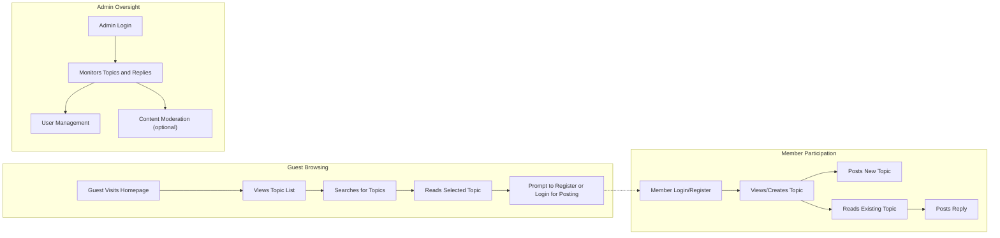

# Service Operation Overview for Economic/Political Discussion Board

## User Interaction Summary

The economic/political discussion board is designed to foster accessible, clear, and civil discussion for users interested in economic and political topics. The platform prioritizes ease of use, inclusivity, and minimal barriers to participation, focusing on a straightforward interaction model suitable for non-technical users. The major user roles identified are guest, member, and admin. Each engages with the system in distinct but straightforward ways.

| Functionality         | Guest        | Member       | Admin        |
|----------------------|--------------|--------------|--------------|
| Browse Topics        | ✅           | ✅           | ✅           |
| Search Topics        | ✅           | ✅           | ✅           |
| Read Replies         | ✅           | ✅           | ✅           |
| Create Topic         | ❌           | ✅           | ✅           |
| Post Reply           | ❌           | ✅           | ✅           |
| User Registration    | ✅           | ❌           | ✅           |
| User Login/Logout    | ✅           | ✅           | ✅           |
| Manage Users         | ❌           | ❌           | ✅           |
| Moderate Content     | ❌           | ❌           | ✅           |

### Core Interaction Principles
- Guests can view and search discussions without registering, but cannot participate by posting.
- Members (registered users) can create new topics and post replies, as well as browse and search.
- Admins have all member rights and additional abilities to manage users and moderate content if needed (for future extensibility).

## Main User Journeys

### 1. Browsing and Searching Discussions
- **WHEN** a user visits the homepage, **THE system SHALL** display a list of current discussion topics, sorted by most recent activity.
- **WHEN** a user performs a search, **THE system SHALL** provide a filtered list of topics and posts relevant to the search query with results shown instantly for typical queries.
- **WHILE** a guest is browsing, **THE system SHALL** restrict actions to viewing only, with clear prompts to register or log in for posting.

### 2. Registration and Login
- **WHEN** a guest attempts to register, **THE system SHALL** allow submission of email and password, and SHALL confirm via a user-friendly verification process.
- **WHEN** a member logs in, **THE system SHALL** establish a secure, timed user session and provide full posting privileges for the session duration.
- **IF** login credentials are invalid, **THEN THE system SHALL** present an error explaining the reason and offer retry options.

### 3. Creating Topics
- **WHEN** a member or admin chooses to create a new topic, **THE system SHALL** guide the user through a simple form requiring a title and content.
- **WHEN** the topic form is submitted, **THE system SHALL** validate entries (title and content must be present and of reasonable length; e.g., titles 5-100 characters, content up to 5,000 characters).
- **IF** a submission is invalid, **THEN THE system SHALL** present specific error messages and allow for correction.
- **WHEN** a topic is successfully created, **THE system SHALL** display it at the top of the topic list, visible to all users.

### 4. Posting Replies
- **WHEN** a member or admin views a topic, **THE system SHALL** present a reply input for text content.
- **WHEN** a member posts a reply, **THE system SHALL** validate the reply is non-empty and under 2,000 characters.
- **IF** a reply submission fails validation, **THEN THE system SHALL** display an error, not create the reply, and offer guidance to correct the issue.
- **WHEN** a reply is posted successfully, **THE system SHALL** add it to the discussion thread in chronological order.

### 5. Session and Logout
- **WHEN** a user chooses to log out, **THE system SHALL** terminate the session immediately and remove posting privileges until next login.
- **WHILE** a session is active, **THE system SHALL** auto-renew it transparently within a safe timeout window (e.g., up to 30 minutes of inactivity).

## Discussion Workflow Overview

Below is a conceptual workflow diagram illustrating major user flows. All actions are initiated from a simple, intuitive interface designed to minimize friction and maximize clarity for both new and returning users.

### Stepwise Discussion Workflow
1. Guest users land on the homepage, browse and search topics, and are prompted to register or log in to participate.
2. Registered members can fully participate: create topics, post replies, and search discussions.
3. Admins perform all member functions plus user management and content moderation (as needed for system health and compliance).

## Accessibility and User Experience Notes
- **THE system SHALL** maintain simple navigation and clear affordances; every primary interaction is accessible from the homepage or top-level navigation.
- **THE system SHALL** not require complex workflows or multi-step forms, except for registration and topic creation, which are kept as concise as possible.
- **WHILE** users interact with search, reply, or topic creation, **THE system SHALL** provide immediate feedback, fast error messaging, and clear guidance.

## Summary
This operation overview provides a foundation for understanding who can do what in the discussion board, how information flows, and what key requirements are placed on the system to maximize user clarity and participation. For further details about user roles and permissions, refer to [User Roles and Permissions](./05-user-roles-and-permissions.md), and to understand broader business objectives, see the [Service Overview](./01-service-overview.md).
