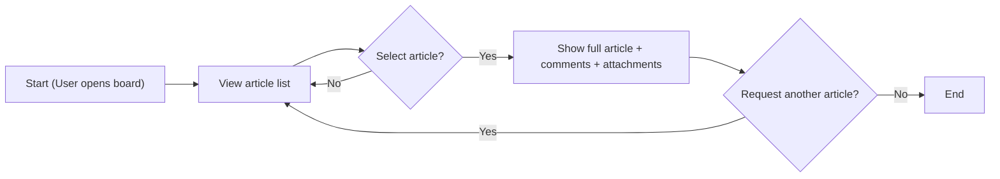
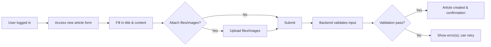
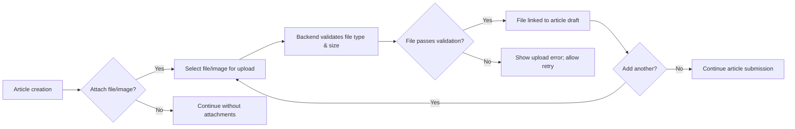
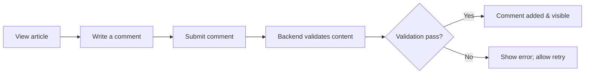

# User Journeys and Flows for the Simple Economic/Political Discussion Board

## Introduction

This document defines core user journeys and system flows for the minimal economic/political discussion board, "discussionBoard." Requirements are specified in business language with EARS format and sufficient detail to directly enable backend implementation without ambiguity or need for further clarification. The purpose is to guarantee correct, minimal, and robust support of posting, browsing, commenting, as well as file and image attachments, with user authentication and administrative moderation. All flows, permissions, and business logic specified here are authoritative for subsequent phases in backend generation.

---

## Main User Flows

### 1. Browsing Articles and Discussions

#### Business Workflow
- Anyone (registered or not) may access the public list of articles for viewing.
- Article summaries (title, author (if public), date) are visible in the main list; clicking on an article provides full content, associated comments, and downloadable/viewable attachments.
- Pagination divides large result sets.
- Hidden or removed articles/attachments are invisible to regular users (visible or logged for admin only).
- Search by article title and author is permitted if enabled.

#### EARS-Format Requirements
- THE discussionBoard SHALL allow any person to view a list of published articles.
- THE discussionBoard SHALL display article summary (title, author, date) in the main list.
- THE discussionBoard SHALL, IF an article is selected, provide the full article with all comments and attachments.
- THE discussionBoard SHALL paginate article lists if entries exceed a configurable page size.
- IF an article or attachment is flagged or removed by an admin, THEN THE discussionBoard SHALL not show it to regular users.
- WHEN a user accesses a non-existent or deleted article, THE discussionBoard SHALL show a clear “not found” error.
- THE discussionBoard SHALL order articles from most recent to oldest by default.
- WHEN a search is performed (if enabled), THE discussionBoard SHALL show results matching title and/or author, case-insensitive.

#### Performance & Error Handling
- THE discussionBoard SHALL return paginated article lists within 2 seconds.
- IF backend retrieval fails, THEN THE discussionBoard SHALL display an error message and allow retry.

#### Permission Matrix
- Visitor: Can view article lists and article pages (except hidden/deleted ones).
- Registered user: Same as visitor.
- Admin: Can view all, including flagged/hidden/deleted.

#### Mermaid Flow (Browsing Articles)

---

### 2. Posting a New Article

#### Business Workflow
- Only registered users may access the “create new article” form.
- Article creation requires title and body, allows optional file/image attachments.
- Each article is linked to the author.
- All data is validated (title/content/attachment size and type).
- On successful submission, user receives confirmation and new article link; on failure, clear error is provided with retry possibility.
- Admins may, at any time, edit, moderate, or remove any article and its attachments.

#### EARS-Format Requirements
- WHEN a registered user submits all required article fields, THE discussionBoard SHALL create the article entry and associate any valid attachments.
- THE discussionBoard SHALL reject and explain errors for missing required fields (title, content).
- IF an attachment exceeds max size or has an unsupported type, THEN THE discussionBoard SHALL reject the upload with a reason.
- WHEN the article is created successfully, THE discussionBoard SHALL return new article metadata (id, link, timestamps).
- IF creation fails validation, THEN THE discussionBoard SHALL provide an explicit error message and accept retry.
- THE discussionBoard SHALL link the author, creation date, and all valid attachments to the article entry.
- THE discussionBoard SHALL enforce file/image type and size limits for all attachments.
- WHERE user is not logged in, THE discussionBoard SHALL deny article creation and prompt for authentication.

#### Performance & Error Handling
- THE system SHALL process article creation and return a response within 2 seconds for valid requests.
- IF file upload fails during article creation, THEN THE system SHALL allow retry of the upload, without requiring the user to re-enter article content.

#### Permission Matrix
- Registered user: Can create and view their own and others’ articles; can upload permitted attachments.
- Visitor: Cannot create articles or upload files.
- Admin: Can view/edit/remove all articles and attachments.

#### Mermaid Flow (Posting Article)

---

### 3. Attaching Files and Images

#### Business Workflow
- Only articles (not comments) can have attachments.
- Supported types: common images (png, jpg, jpeg, gif) and generic files (pdf, doc, xls, zip, txt).
- Each file/image is validated before acceptance (type and size).
- Files failing admin-specified policy or failing to validate are rejected.
- Listing of uploaded files appears in article view and form context.
- Admin can moderate/remove any uploaded content.

#### EARS-Format Requirements
- WHEN user uploads file/image with a new article, THE system SHALL verify allowed type and size.
- IF not allowed, THEN THE system SHALL reject and explain error.
- THE discussionBoard SHALL list all accepted attachments in the article view, downloadable/viewable.
- IF upload fails, THEN THE system SHALL allow retry or file deletion.
- IF admin removes a file/image, THEN THE system SHALL prevent regular users from accessing it.

#### Performance & Error Handling
- THE system SHALL accept uploads within 2 seconds (typical file sizes, normal network).
- IF upload times out or fails, THEN THE user SHALL see a clear message and can retry or abandon upload.

#### Permission Matrix
- Registered user: Can upload attachments while posting an article.
- Visitor: Cannot upload attachments.
- Admin: Can delete or moderate any attachment.

#### Mermaid Flow (Attaching Files/Images)

---

### 4. Commenting Process

#### Business Workflow
- Only registered users can submit comments; attachments not supported for comments.
- Comments are text-only; each comment is attributed to its author (user id).
- Each user can edit or delete only their own comments.
- Comments appear in chronological order beneath articles.
- Admins can remove or hide any comment as required.

#### EARS-Format Requirements
- WHEN a registered user submits comment text, THE discussionBoard SHALL create the comment and link to the article and author.
- THE discussionBoard SHALL reject empty or missing comment text with an explicit error.
- IF user is not logged in, THE system SHALL deny comment submission and require authentication.
- IF admin removes a comment, THE system SHALL hide it from regular users immediately.
- THE discussionBoard SHALL allow users to edit/delete only their own comments, unless admin.
- IF submission fails, THE user SHALL be shown an error and allowed to retry.

#### Performance & Error Handling
- THE discussionBoard SHALL add and show new comments within 2 seconds following submission.
- IF server failure occurs, THEN retry is allowed without loss of comment text (where possible).

#### Permission Matrix
- Registered user: Can create, edit, and delete own comments.
- Visitor: Cannot comment.
- Admin: Can moderate/remove/hide all comments.

#### Mermaid Flow (Commenting Process)

---

## Example Walkthrough Scenarios

### Scenario 1: Visitor Browsing and Reading
A new visitor opens the discussion board, reviews the article list, and browses into an article about "Economic Reforms." The attachments and comments are visible. Trying to access a deleted article returns a clear error.

### Scenario 2: Registered User Posting with Images
A logged-in user writes a post on "Currency Policy," drags two image files (jpg, png), and submits. Files are validated for size/type. Success results in a confirmation and see article; validation errors result in clear messaging and retry option without content loss.

### Scenario 3: Commenting
A logged-in user reads an article and posts a comment. Their comment appears instantly. If empty, error is shown and retry permitted. Admin-deleted comments are hidden for users immediately.

---

## Success Criteria & Summary
- All described user flows are minimal and business-driven with actionable permissions and requirements.
- Every function (browse, post, comment, attach) clearly denotes who can do what, when, and with what limitations.
- EARS syntax is used throughout for absolute clarity and testability.
- Attachments are only allowed for articles, not comments.
- Admins have universal moderation ability; users can only manage their own content.
- System responses (listing, posting, upload, commenting) are guaranteed within 2 seconds, with explicit error handling.
- Error states are always met with actionable, user-friendly feedback.
- All diagrams corrected for Mermaid syntax (double quotes on all labels).
- No ambiguous statements or meta-commentary included.
- This document is suitable and fully actionable for backend engineering pipelines.