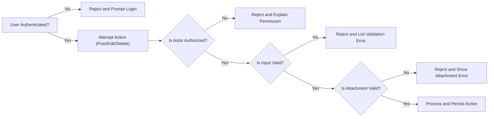

# Business Rules and Validation for Economic/Political Discussion Board

## 1. Introduction and Scope
The purpose of this document is to state in precise, testable terms the business rules, input validation, and error handling requirements for the backend of a simple, production-ready economic/political discussion board (hereafter, “discussionBoard”). All requirements utilize the EARS (Easy Approach to Requirements Syntax) format wherever applicable, to ensure clarity and unambiguous implementation. The focus is strictly on backend logic for article and comment handling with support for minimal image and file attachments. UI, database, and technical API structure are out-of-scope.

## 2. Content Rules

### 2.1. Article Handling
- WHEN a registered user creates an article, THE system SHALL require a non-empty plain-text title.
- WHEN a registered user creates an article, THE system SHALL require non-empty content text.
- WHEN a user attaches files to an article, THE system SHALL permit zero or more attachments per article, subject to limitations specified in Section 3.
- WHEN an article is deleted, THE system SHALL immediately and irreversibly remove any associated attachments from storage.
- WHERE an actor is of type "admin", THE system SHALL allow full read, update, and delete access to all articles.
- THE system SHALL record creation and, if modified, last update timestamps for every article. Creation timestamps SHALL be immutable. Modification timestamps SHALL update only on edit. Timestamps SHALL use ISO 8601 UTC format.
- WHEN an anonymous (not-logged-in) user attempts to create, edit, or delete an article, THE system SHALL reject the action and return an authentication error.
- ONLY the original author of an article or an admin SHALL be permitted to edit or delete it.
- THE system SHALL ensure all authenticated users may read all articles.

### 2.2. Comment Handling
- WHEN a registered user posts a comment, THE system SHALL require non-empty content (no empty or whitespace-only submissions).
- WHEN a comment is deleted, THE system SHALL immediately and irreversibly remove any associated attachments from storage.
- THE system SHALL record creation and, if edited, last modified timestamps for every comment. Creation timestamps SHALL be immutable.
- WHERE an actor is of type "admin", THE system SHALL be able to moderate (edit/delete) any comment on any article.
- ONLY the original author of a comment or an admin SHALL be permitted to edit or delete it.
- THE system SHALL allow users to comment under any article for public discussion.

### 2.3. Authentication and Permissions
- THE system SHALL require a valid JWT-authenticated session to create, update, or delete articles and comments.
- THE system SHALL reject any create, edit, or delete action attempted by unauthenticated users with a specific authentication required error.
- THE system SHALL deny edit and delete actions by users who are neither the author nor an admin, returning a clear permission error.
- THE system SHALL allow all authenticated users to read all articles and comments.

## 3. Attachment Limitations

### 3.1. Allowed File Types
- Images: .jpg, .jpeg, .png, .gif
- Documents: .pdf, .doc, .docx, .xls, .xlsx, .ppt, .pptx
- WHEN a user uploads an attachment, THE system SHALL accept only files with one of the allowed extensions.
- IF a file does not match the allowed types, THEN THE system SHALL reject it and return an error clearly indicating the allowed extensions.

### 3.2. Size and Quantity Constraints
- WHEN a file is uploaded, THE system SHALL reject any attachment larger than 10MB.
- THE system SHALL allow at most 5 attachments per article or comment. This limit applies per item, not globally.
- WHEN multiple files are attached, IF the count exceeds 5, THEN THE system SHALL reject the upload and display an appropriate error.

### 3.3. Storage and Lifecycle
- WHEN an article or comment is deleted, THE system SHALL immediately and irreversibly delete all related attachments from storage.
- WHEN a file is uploaded but not attached to any article or comment after 24 hours, THE system SHALL either delete it automatically or flag for admin review, depending on configuration.

## 4. Validation Rules

### 4.1. Input Handling for Articles and Comments
- WHEN titles or contents are submitted, THE system SHALL trim leading/trailing whitespace from all input fields.
- THE system SHALL reject titles or contents that are empty or contain only whitespace characters.
- THE system SHALL reject article titles longer than 200 characters.
- THE system SHALL reject article or comment content longer than 5,000 characters.
- WHEN input length exceeds limits, THE system SHALL provide a clear error mentioning the applicable size restriction.
- THE system SHALL sanitize all user-provided text by removing HTML, script tags, and any unsafe markup, allowing only basic safe characters (letters, numbers, punctuation).

### 4.2. Attachment Validity
- WHEN a file is uploaded, THE system SHALL check for both extension and MIME type, and SHALL reject any file where these are not consistent or do not match allowed categories.
- THE system SHALL scan any uploaded attachment for virus or malware (as feasible). IF a file fails this scan, THEN THE system SHALL reject the file and log the attempt for admin review.

### 4.3. Authentication Checks for Mutating Actions
- THE system SHALL permit create, edit, or delete actions on articles/comments only for users with valid JWT-authenticated sessions.
- WHEN an unauthenticated user attempts these actions, THE system SHALL deny them and provide an authentication-required error.

### 4.4. No Uniqueness Enforcement
- THE system SHALL NOT require article titles or comment content to be unique; users may submit duplicate (or similar) articles and comments.

## 5. Common Error Scenarios and Handling
- WHEN any error is encountered, THE system SHALL provide a clear, targeted error message with specific recovery guidance where appropriate.
- WHEN attachments are rejected due to file type, size, or count limits, THE system SHALL specify which rule was violated in the error response and allow users to retry with corrected input.
- WHEN an unauthorized or unauthenticated user attempts a restricted action, THE system SHALL always respond with a clear message stating whether permission or authentication failed.
- WHEN input is trimmed or sanitized, IF the data is left empty, THE system SHALL reject the operation and inform the user that input cannot be empty.
- WHEN a backend storage or security error occurs, THE system SHALL provide a generic error message (not technical details) and prevent user retries until the issue is resolved.

### 5.1. Error Table

| Error                                        | WHEN Triggered                                  | User Message                                      |
|-----------------------------------------------|-------------------------------------------------|---------------------------------------------------|
| Unauthorized action                          | Non-owner/non-admin edit/delete                  | "You do not have permission to modify this content." |
| Unauthenticated                              | Create/edit/delete without login                 | "Please log in to perform this action."           |
| Invalid file type                            | Bad file extension or MIME                       | "Attachment type is not supported."               |
| File size too large                          | >10MB attachment                                | "File exceeds the maximum allowed size of 10 MB." |
| Too many attachments                         | >5 per item                                     | "You can upload up to 5 files per item."          |
| Input too long                               | Title >200 or content >5,000 chars               | "Input exceeds maximum allowed length."           |
| Empty or blank content                       | Input is empty or whitespace                     | "Content cannot be empty."                        |
| Storage/system error                         | Backend/storage/malware issues                   | "An error occurred. Please try again later."      |
| Attachment scan failed (virus/malware)        | Security check fails                             | "Potentially harmful file detected. Upload blocked."|

## 6. Diagrams and Rules Tables

### 6.1. Backend Validation and Error Handling Flow

### 6.2. Attachment Constraints Table
| Rule                         | Limit/Value                                 |
|------------------------------|---------------------------------------------|
| Max attachments per item     | 5 (article or comment)                      |
| Max attachment size          | 10 MB                                       |
| Allowed image types          | .jpg, .jpeg, .png, .gif                     |
| Allowed document types       | .pdf, .doc, .docx, .xls, .xlsx, .ppt, .pptx |
| Orphaned file lifetime       | 24 hours                                    |

---

All requirements herein are explicit and actionable, in EARS or equivalent format, to guarantee reliable, minimal, and safe backend operation for the discussion board’s core features. This document is implementation-ready for backend engineering and should be treated as authoritative for the scope described.