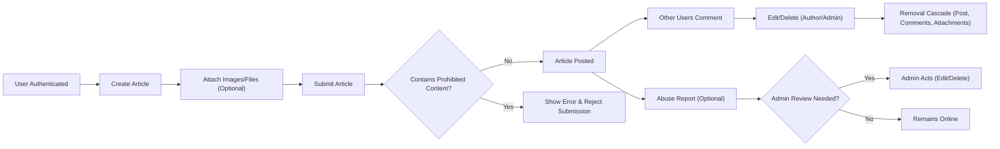

# Business Rules and Validation Requirements for Discussion Board

## Introduction

This document defines the business rules, validation requirements, and moderation logic for the economic/political discussion board service. The goal is to ensure predictable, consistent, and enforceable behaviors across all user activities (posting, commenting, attachment management, and content moderation), without specifying technical implementation details. All requirements use EARS format where applicable. These rules are binding for all backend services and must be strictly enforced.

## Posting and Commenting Rules

### Article Posting
- THE system SHALL require users to be authenticated to create articles.
- WHEN a user creates an article, THE system SHALL require both a title and body content, each subject to the minimum and maximum character validation.
- WHILE composing an article, THE system SHALL allow users to attach images and/or files, subject to attachment rules specified below.
- WHEN an article is posted, THE system SHALL store the creation date/time and associate the article with the posting user.
- WHERE a post contains prohibited words or symbols (see Content Moderation Rules), THE system SHALL reject the submission with a user-facing error message.

### Article Editing & Deletion
- WHERE a user is the original author of an article, THE system SHALL allow them to edit or delete their article at any time.
- WHERE an article is deleted by its author, THE system SHALL also remove all associated comments and attachments (files/images) belonging to that article.
- WHERE an article has been deleted by its author, THE system SHALL block all attempts to access the deleted content.

### Commenting
- THE system SHALL require users to be authenticated to create comments.
- THE system SHALL allow users to add comments to any non-deleted article.
- WHEN a user comments on an article, THE system SHALL require comment content, subject to comment character length validation.
- WHERE a user is the original author of a comment, THE system SHALL allow them to edit or delete their comment at any time.
- WHEN a comment is deleted, THE system SHALL remove it from the article's comment list and block access to its content.

### Limits
- THE system SHALL limit article title length to 100 characters (minimum 1 character, maximum 100 characters).
- THE system SHALL limit article body length to 10,000 characters (minimum 1 character, maximum 10,000 characters).
- THE system SHALL limit comment body length to 1,000 characters (minimum 1 character, maximum 1,000 characters).

## Content Moderation Rules

### Admin Moderation Authority
- WHERE a user is an admin, THE system SHALL allow them to edit or delete any article or comment at any time.
- WHERE an admin deletes content, THE system SHALL permanently remove it and all associated attachments in line with General Validation Logic.
- WHEN content is deleted by an admin, THE system SHALL document the deletion with a reason (chosen from a standard set of reasons: inappropriate content, spam, harassment, legal violation, etc.).

### Prohibited Content & Censorship
- THE system SHALL reject, with a user-facing error, all attempts to submit articles, comments, or attachments that include prohibited content such as:
  - Hate speech, discriminatory or slanderous language
  - Obscene, violent, or sexually explicit material
  - Personal attacks, doxing, or threats
  - Direct solicitation or spam

### Abuse Reporting
- THE system SHALL enable users to report abusive articles or comments.
- WHEN a report is submitted, THE system SHALL record the reporter’s identity, the content in question, the time, and the reason for the report.
- WHEN an item receives reports exceeding a configurable threshold, THE system SHALL flag the item for admin review.

## File and Image Attachment Rules

- THE system SHALL support file and image attachments for articles (not for comments).
- THE system SHALL require at least one article text body character to permit attachments (attachments-only posts are not allowed).
- THE system SHALL limit the total number of attachments per article to 5.
- THE system SHALL restrict total attachment size to 20MB per article post.
- THE system SHALL permit the following file extensions only: JPG, PNG, GIF, PDF, DOCX, XLSX, TXT.
- THE system SHALL reject files detected as viruses or otherwise unsafe at upload.
- WHEN an attachment is deleted (e.g., after post deletion or on edit), THE system SHALL permanently remove the file from storage.
- IF an upload fails, THEN THE system SHALL return a clear error message specifying the cause (file too large, invalid type, virus detected).

## General Validation Logic

- THE system SHALL validate that all required fields (title, body, attachment meta data) are present during post creation.
- THE system SHALL reject any create or edit operation with missing or invalid values (empty title, excessive length, unsupported file type, etc.) and return specific error messages.
- WHEN a user attempts to access or interact with deleted content, THE system SHALL return an error stating the content is no longer available.
- WHEN a user exceeds allowed limits (character count or attachments), THE system SHALL prevent the action and return an appropriate error.
- THE system SHALL not expose or recover deleted content or files to any client, regardless of actor privileges.

## Appendix: Actor Permissions Matrix

| Feature                      | User                  | Admin               |
|------------------------------|-----------------------|---------------------|
| Create article               | ✅                    | ✅                  |
| Edit own article             | ✅                    | ✅                  |
| Delete own article           | ✅                    | ✅                  |
| Edit/delete any article      | ❌                    | ✅                  |
| Attach files/images to post  | ✅                    | ✅                  |
| Remove any attachment        | ❌ (only own)         | ✅                  |
| Comment on article           | ✅                    | ✅                  |
| Edit/delete own comment      | ✅                    | ✅                  |
| Edit/delete any comment      | ❌                    | ✅                  |
| Moderate content             | ❌                    | ✅                  |
| Report abuse                 | ✅                    | ✅                  |

## Example Content Workflow (Mermaid Diagram)

---

This document provides business requirements only. All technical implementation decisions (APIs, database design, storage mechanisms) are at the discretion of the development team. This document describes WHAT the system must do, not HOW it must be built.