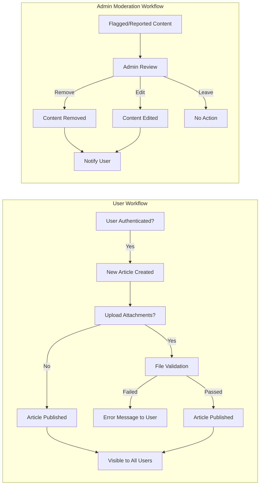

# Functional Requirements for Economic/Political Discussion Board

## Core Functions

- THE discussion board SHALL allow users to create, view, update, and delete their own discussion articles.
- THE discussion board SHALL allow users to comment on articles.
- THE system SHALL enable image and file attachment to articles.
- THE system SHALL allow admins to moderate all content and users.
- THE system SHALL record all key events including creation, updates, deletions, moderation actions, and attachment uploads for traceability.

## User Article Management

### Article Creation
- WHEN a user is authenticated, THE system SHALL allow the user to submit a new discussion article.
- THE system SHALL require each article to have a title and body text.
- THE system SHALL allow optional image and file attachments during article creation.
- THE system SHALL associate newly created articles with the creating user.
- IF required fields (title or body) are missing, THEN THE system SHALL reject article submission and inform the user of the missing information.

### Article Editing
- WHEN a user who owns an article wishes to edit it, THE system SHALL permit modification of the article’s content and attachments.
- WHERE the user does not own the article, THE system SHALL prevent editing and notify the user accordingly.
- WHEN an article is edited, THE system SHALL update the record and persist the changes immediately.
- IF the article being edited is deleted or does not exist, THEN THE system SHALL display a clear error message.

### Article Deletion
- WHEN a user chooses to delete their own article, THE system SHALL permanently remove the article and its associated comments and attachments.
- IF a user attempts to delete an article they do not own, THEN THE system SHALL reject the request and inform the user of insufficient permissions.
- WHEN an article is deleted, THE system SHALL remove associated resources (attachments, comments) from user view.

### Article Listing and Viewing
- THE system SHALL support retrieving a paginated list of articles, ordered by creation date (newest first by default).
- THE system SHALL allow filtering articles based on topic tags, keywords, or author.
- THE system SHALL provide full article detail including metadata, attachments, comment count, and timestamps.
- THE system SHALL allow both authenticated and non-authenticated users to view article lists and details unless article visibility is restricted due to moderation.

### Comment Management
- WHEN a user views an article, THE system SHALL display all related comments in chronological order (oldest first by default).
- WHEN a user is authenticated, THE system SHALL allow posting, editing, and deleting of their own comments.
- WHERE a user does not own a comment, THE system SHALL prevent modification/deletion and notify the user.
- WHEN a comment is deleted, THE system SHALL remove it from further display.
- THE system SHALL associate comments with both the article and the commenting user.

## Attachment Handling

### Image and File Uploads
- WHEN creating or editing an article, THE system SHALL allow users to upload images and files as attachments.
- THE system SHALL limit file types to common image formats (JPEG, PNG, GIF) and document formats (PDF, DOCX, XLSX, TXT).
- THE system SHALL restrict the maximum file size per attachment (e.g., 10 MB per file) and maximum number of attachments per article (e.g., 5 files per article).
- IF an upload fails validation (wrong type, too large, etc.), THEN THE system SHALL present a clear error message and prevent article submission until compliant.
- THE system SHALL generate and store secure URLs for attachment access by authorized users.
- WHEN articles or attachments are deleted, THE system SHALL permanently remove the corresponding files from storage.

### Attachment Access
- WHERE attachments exist for an article, THE system SHALL display links or previews to users with access rights.
- THE system SHALL prevent unauthorized users from retrieving or downloading attachments.
- WHEN an attachment is requested, THE system SHALL verify authorization and respond accordingly.

## Moderation Processes

### Admin Content Moderation
- WHERE offensive, illegal, or inappropriate content is reported or flagged, THE system SHALL allow admins to review and act on the content.
- THE system SHALL enable admins to edit or remove any article, comment, or attachment as needed for compliance.
- WHEN an admin moderates content, THE system SHALL record the moderator, action, time, and reason (if provided).

### User Management
- WHERE inappropriate user behavior is detected or reported, THE system SHALL allow admins to block or delete user accounts.
- IF a user is blocked or deleted, THEN THE system SHALL remove or disable their articles, comments, and future posting privileges.
- THE system SHALL notify users if their content or account has been subject to moderation action, with a reason if possible.

### Abuse and Spam Handling
- WHEN article, comment, or attachment is reported by another user, THE system SHALL provide a workflow for admin review and resolution.
- THE system SHALL permit repeat offenders to be flagged for stricter review or automatic restriction.

## Business Validation Rules

### Content Validation
- THE system SHALL require article titles to not be empty and to meet minimum/maximum length constraints (e.g., 5 to 150 characters).
- THE system SHALL require article body text to meet minimum/maximum length constraints (e.g., 20 to 5000 characters).
- THE system SHALL limit comment length (e.g., 1 to 1000 characters).
- IF input fails these validations, THEN THE system SHALL reject with a precise validation error.

### Attachment Validation
- THE system SHALL only accept permitted file types for attachments and reject all others.
- IF file type or size exceeds the allowed limit, THEN THE system SHALL reject the upload and inform the user.
- THE system SHALL scan uploaded files for viruses or malware and reject unsafe files.

### Permissions and Access Control
- WHERE the role is 'user,' THE system SHALL restrict actions to the user's own articles, comments, and attachments.
- WHERE the role is 'admin,' THE system SHALL impose no content restrictions based on authorship for moderation and user management functions.

## Mermaid Diagram – Major System Workflows

## End of Document
