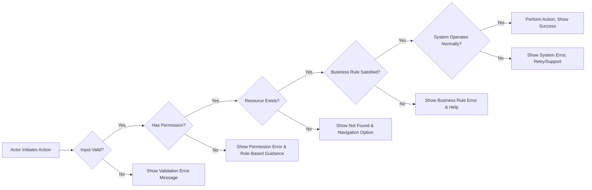

# Error Handling and User-Facing Recovery Scenarios for Discussion Board

## Introduction
Robust error handling and clear, context-appropriate recovery responses are critical for a trustworthy, user-centric discussion board experience. The following business requirements define how all error situations are to be managed, which actors are eligible for what recovery processes, how information must be presented to users, and what notifications or actions should occur for each error category. All requirements are meant to provide actionable, unambiguous guidance to backend engineers strictly from the business logic perspective, free of technical implementation details.

## Error Categories
All backend errors and user-facing exceptions must be managed according to these business-driven categories:

| Category             | Description                                                                | Examples                                                      |
|----------------------|----------------------------------------------------------------------------|---------------------------------------------------------------|
| Validation Errors    | User input fails validation against business requirements                  | Unsupported file type/size, empty fields, over max length      |
| Permission Errors    | Actor attempts an action not authorized by the business rules              | Guest tries to post, user edits others' articles/comments, admin-only setting change by user|
| File Upload Errors   | Problems attaching images or files to articles                             | File too large, unsupported type, corrupt or flagged content   |
| Business Rule Errors | Violations of posting frequency, prohibited content, or site state         | Post rate exceeded, abusive language, duplicate, banned user   |
| System Exceptions    | Unplanned system or infrastructure failures                                | Database error, timeouts, capacity exhausted, backend crash    |
| Not Found            | User or admin attempts to interact with missing resource                   | Editing deleted article, removing removed attachment           |
| Conflict Errors      | Resource version or state conflicts usually due to concurrency             | Simultaneous edits, out-of-date data on update                |

Each scenario below details the expected business behavior, actor, and user-facing response.

## User-friendly Error Messages
- THE system SHALL ensure every error presented to the user is contextually clear, written in natural language, and free of technical details or codes.
- WHEN a validation error occurs (e.g., title too long, file exceeds size limit), THE system SHALL highlight the exact field or attachment responsible, describe the failure, and offer a correction path where possible.
- WHEN a user attempts unauthorized action, THE system SHALL display a message stating the action is not allowed, specify whether login or role change may resolve the issue, and suggest next steps if appropriate.
- WHEN a file upload or attachment is rejected, THE system SHALL state the rule violated (format, size, type, or security scan failure) and what formats or sizes are accepted.
- WHEN the system encounters a business rule error (e.g., rate limit), THE system SHALL inform the user of the limit and when they may retry.
- WHEN a system exception occurs that is not user-correctable, THE system SHALL show a generic but apologetic message, prompt retrying after a short interval, and provide support info if persistent.
- WHEN content is removed or blocked for policy reasons, THE system SHALL notify the content author of the removal and general reason but SHALL NOT expose admin or moderator identities.
- WHEN multiple errors occur from a single request, THE system SHALL aggregate and present all user-relevant failures in a clear list, each mapped to the action or field that failed.

## Handling of Invalid Actions
- WHEN a user submits article/comment content with missing or invalid values, THE system SHALL reject the action, identify all specific rule violations, and instruct the user on how to rectify the failure.
- WHEN file upload fails (invalid type/size, virus, corruption), THE system SHALL display a reasoned message directing the user which files must be changed and what alternative formats/sizes qualify.
- WHEN submitting blank (empty) content for required fields, THE system SHALL block the action and require the user to complete those fields.
- WHEN a user attempts to edit or delete another actor's content outside their role, THE system SHALL deny access and specifically state role-based business policy as the reason.
- WHEN an unauthenticated actor attempts to perform a restricted action (posting, commenting, uploading), THE system SHALL inform them authentication is required and route them to login options.
- WHEN an admin attempts to perform an irreversible or high-privilege action, THE system SHALL demand explicit user confirmation and log it for audit.
- WHEN a user attempts to interact with a removed or expired article/comment/attachment, THE system SHALL show a message that content is no longer available and provide options to return to a relevant previous view (article list, main page, etc.).
- WHEN a user or admin attempts a conflicting or outdated operation (e.g., editing at the same time as another), THE system SHALL provide a reload prompt and display any externally changed data.

## Exception Recovery Flows
- WHEN infrastructure or backend system errors (API/database timeouts, unhandled exceptions) occur, THE system SHALL log all relevant incident details securely, inform affected users with an apologetic, non-technical message, and prompt for repeat action.
- IF repeated failures (>3 in a row) occur for a single actor, THE system SHALL display an alternate pathway for help (support email, feedback form) without exposing technical information.
- WHEN a file fails to upload due to temporary interruption, THE system SHALL preserve all entered content and enable retry without re-entry of unrelated data.
- WHEN file upload is interrupted or client disconnects, THE system SHALL retain the upload state for at least 5 minutes, allowing user to retry inline.
- WHEN an admin removes content or user for policy violation, THE system SHALL notify affected user of action and general policy breached but SHALL NOT expose sensitive moderator/admin detail.
- THE system SHALL process all user-facing error validations within 1 second and all critical system error paths in under 2 seconds for 99%+ of cases.
- WHEN multiple error scenarios are present, THE system SHALL always prioritize messaging that lets the actor resolve at least one blocking issue effectively.
- THE system SHALL never return sensitive stack traces or backend code descriptions to any actor in the frontend or user interfaces.

## Authentication, Authorization and Actor-based Error Handling
- WHEN an actor's session has expired, THE system SHALL require re-authentication with an actionable prompt (e.g., "Your session expired, please log in again.").
- WHEN a user or admin account is locked or deleted, THE system SHALL inform the actor of the account state (locked/deleted) and specify available recovery or help options.
- WHEN a user is blocked or restricted due to abuse or business policy, THE system SHALL clearly describe which policy applies and duration/context for the restriction, without revealing sensitive admin reasoning or details about reporting users.
- THE system SHALL differentiate all error messaging by actor role where relevant: users, admins, unauthenticated guests each receive messaging and resolution instructions reflecting their permissions and business flows.
- WHEN authentication/authorization fails, THE system SHALL avoid generic 'error' and respond with actionable instructions (e.g., forgotten password link, contact admin for blocked account, or sign up for access).

## Edge Case and Performance-driven Scenarios
- WHEN users or admins attempt rapid duplicate submissions (e.g., pressing submit repeatedly), THE system SHALL prevent multiple error displays and provide a single clear notification per action.
- WHEN unforeseen or unclassified errors occur, THE system SHALL default to a business-appropriate fallback message and prompt for retry or feedback.
- WHEN system-wide emergency (e.g., maintenance mode, widespread outage) is active, THE system SHALL display a banner or modal explaining the situation, ETA for resolution, and a support channel if available.
- All error-handling flows SHALL be traceable in logs with relevant actor, timestamp, and outcome, but NO sensitive content or PII must be included in logs unless business policy requires.

## Error and Recovery Flow Diagram (Mermaid)

## Success Criteria
- All error and recovery handling SHALL be presented in clearly worded, actionable, and contextually relevant natural language.
- No error messages SHALL expose technical or internal backend details.
- Every business error or exception state is mapped to a user-facing and actor-specific resolution flow.
- All error and edge-case scenarios in this document are addressed in actual system implementation as described.
- All diagrams syntactically reflect business process logic with correct Mermaid syntax and clear, double-quoted labels only.
- Audit trails/logs only contain what business or legal policy allows – never user content, passwords, or PII except where required under policy.

All requirements above are expressed for direct development use. Technical design, implementation details, and database schemas are out of scope and left to the appropriate team.