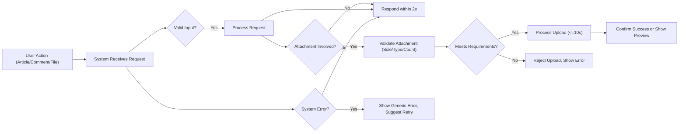

# Performance and Error Handling Requirements for Simple Economic/Political Discussion Board

## Performance Expectations

### General Responsiveness
- WHEN a user performs any basic action, such as viewing articles or submitting comments, THE system SHALL provide a response within 2 seconds under normal operating conditions (up to 100 concurrent users).
- WHERE network latency is external, THE system SHALL minimize server-side logic to under 1 second for all standard requests.
- THE discussion board SHALL prioritize fast delivery of articles, comments, and attachment metadata to maintain uninterrupted user engagement.

### Article and Comment Operations
- WHEN a user requests lists of articles or comments, THE system SHALL deliver a page (up to 20 articles/comments) within 2 seconds of user interaction.
- WHERE pagination is applicable, THE system SHALL ensure each page navigation, including index reloads and comment loading, completes server-side handling within 1.5 seconds.

### Attachment Upload and Download
- WHEN users upload images or files (attachments), THE system SHALL process each upload and respond with success or error confirmation within 10 seconds for files up to 10MB in size.
- IF a file exceeds 10MB, THEN THE system SHALL reject the upload immediately, displaying an explicit error about the size limitation.
- WHERE possible, THE system SHALL begin streaming downloads for attachments so that file transfer starts within 1 second after the request is accepted.

### Scalability Considerations
- WHILE system load remains less than or equal to 100 concurrent users, THE system SHALL maintain all above-stated performance expectations.
- IF load exceeds 100 concurrent users, THEN THE system SHALL gracefully degrade performance by prioritizing viewing (read operations) of articles and comments over writing (create/edit), and deprioritize or restrict attachment operations as needed.

---

## Handling Large Attachments

### Attachment Size and Format Limits
- THE system SHALL restrict attachments to a maximum of 10MB per file and allow up to 3 files per article or comment submission.
- WHEN a user attempts to attach files exceeding these limits (in size/count), THE system SHALL immediately reject the excess uploads and provide an error clearly stating the supported file size and count restrictions.
- WHERE an unsupported file format is uploaded, THE system SHALL reject the upload and return a message listing supported types by extension and context (see [Business Rules and Validation](./05-business-rules-and-validation.md)).

### Processing Expectations
- WHEN multiple attachments are uploaded, THE system SHALL process each independently; A single file failure SHALL NOT block success for other files in the batch.
- THE system SHALL provide users real-time or near-real-time status updates for each file being uploaded, notifying outcome for each one directly.
- WHERE system storage is approaching its allocated limit or operational threshold, THE system SHALL notify users that uploads may be slow, delayed, or temporarily disabled, including a recommendation to try later.

### Attachment Download
- WHEN users download attachments, THE system SHALL initiate the download within 1 second of request acceptance, barring external network or infrastructure failures.
- IF an attachment retrieval attempt fails (for example, file missing or detected as corrupted), THEN THE system SHALL show a clear, actionable error and SHALL NOT expose technical internals or sensitive information about the backend or file infrastructure.

---

## User Feedback in Error Cases

### Principles for Error Reporting
- THE system SHALL clearly distinguish between user-actionable errors (such as file too large, unsupported format, authentication failure) and system errors (such as server timeout, internal exceptions, storage issues).
- WHEN an error occurs, THE system SHALL provide a concise, descriptive error message in plain language for end-users, stripped of technical jargon.
- WHERE additional help or action can resolve the error, THE system SHALL guide users to next steps (e.g., try again, log in, contact admin).

### Error Recovery Flows
- IF a file upload fails due to user error (e.g., file too large or unsupported type), THEN THE system SHALL allow the user to retry the action after rectifying the file or input.
- IF an article or comment submission fails because the session is invalid or authentication is lost, THEN THE system SHALL prompt the user to log back in and SHALL preserve any unsent text so users do not lose their progress.
- IF a transient error is detected (for example, network problem or temporary backend downtime), THEN THE system SHALL inform the user and suggest a retry; when possible, the system SHALL preserve the submission draft for resuming without data loss.

### Error Scenario Matrix

| User Action                | Potential Error              | System Response                                  |
|----------------------------|------------------------------|--------------------------------------------------|
| Post article/comment       | User not authenticated       | Prompt login, preserve current input              |
| Upload attachment          | File size > 10MB             | Reject upload, show explicit size limit message   |
| Upload attachment          | Unsupported file format      | Reject upload, list allowed types                 |
| Pagination or navigation   | Timeout/server unavailable   | Notify user, suggest browser/fetch refresh        |
| Download attachment        | File missing/corrupted       | Show non-technical "file unavailable" message     |

---

## Diagram: Core Performance and Error Handling Flows

---

## EARS Format Summary Requirements

- WHEN a user performs any supported action (article view, comment, upload/download attachment), THE system SHALL respond within stated timeframes and provide clear feedback on outcome.
- IF any business rule is violated (attachment too large, unsupported type, excessive count), THEN THE system SHALL display a plain language message and explain how to correct the input.
- WHILE user activity stays within system capacity (<=100 concurrent users), THE platform SHALL maintain specified performance levels and degrade gracefully beyond that threshold.
- WHERE a transient error or infrastructure problem disrupts an action, THE system SHALL support user retry and preserve application state where feasible.
- IF a system error occurs which cannot be recovered by user action, THEN THE system SHALL present a concise, non-technical error with recommended next steps and SHALL log the detailed incident for administrators.

---

## Reference Documents
- See [Business Rules and Validation](./05-business-rules-and-validation.md) for input validation and constraints.
- Additional logic in [Data Flow and Lifecycle](./08-data-flow-and-lifecycle.md).
