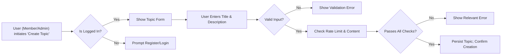
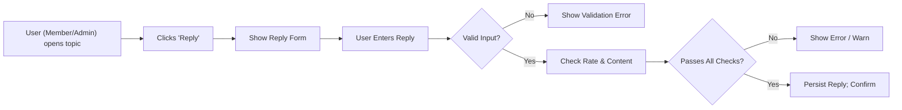
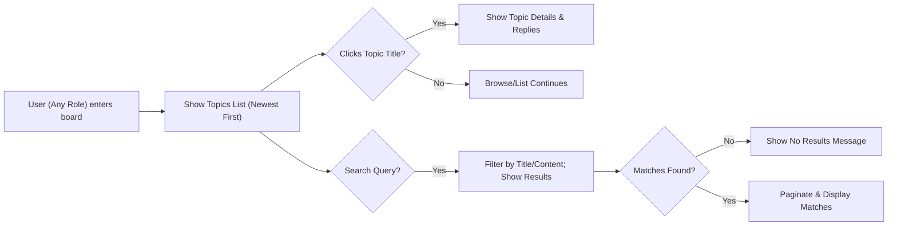

# Primary User Scenarios

## Scenario 1: Creating a New Topic

### Context and Description
A registered member (user role: member) wishes to share a new question, opinion, or issue regarding economics or politics with the community by posting a new discussion topic. Guests (not logged in) may attempt to access this feature, but their actions are limited by permissions. Admins can also create topics.

### Step-by-Step User Journey
1. Member logs in to the discussion board.
2. Member clicks ‘Create Topic’.
3. System presents a form collecting at minimum: Title, Description/Content.
4. Member fills out the form and submits the topic.
5. System validates the input (e.g., required fields not empty, string length limits, no offensive words).
6. On success, the new topic is created and visible to all users.
7. On failure, an error message is presented with action steps.
8. Admin may also create topics; Guest users are prompted to register/login if they attempt topic creation.

### Key Business Requirements (EARS Format)
- WHEN a member requests the topic creation form, THE system SHALL present input fields for Title and Description/Content.
- WHEN required fields are missing during topic creation, THE system SHALL prevent submission and show a validation error.
- WHEN a guest user attempts to access the topic creation function, THE system SHALL redirect or prompt for registration/login.
- WHEN a topic submission passes validation, THE system SHALL create a new public topic associated with the creator’s user ID and timestamp.
- IF a topic creation fails (e.g., network error, validation failure), THEN THE system SHALL display a clear error message and retain the entered data when possible.
- WHILE a topic is being created, THE system SHALL provide feedback (e.g., ‘posting...’ indicator) until completion or error.
- THE system SHALL enforce maximum lengths for topic titles (100 characters) and description (2,000 characters).
- THE system SHALL prevent posting of content containing banned words or unsafe input.

### Business Rules & Constraints
- Title and Description/Content fields are both mandatory.
- Only members or admins may create topics.
- Each topic is timestamped and associated with the user who created it.
- Sensitive or offensive language is not allowed in any input field (business validation rule, not technical spec).
- One member cannot create more than 5 topics in a rolling 24-hour window (anti-spam policy).

### Error and Exception Scenarios
- IF topic creation fails due to rate limiting, THEN THE system SHALL inform the user of posting limits and explain when they can post again.
- IF a guest tries to create a topic, THEN THE system SHALL prompt for registration/login.
- IF forbidden content is detected, THEN THE system SHALL show an appropriate warning and halt the submission.

### Mermaid Diagram

---

## Scenario 2: Posting a Reply

### Context and Description
A logged-in member or admin wants to respond to an existing topic by posting a reply. Guests can read but not post replies.

### Step-by-Step User Journey
1. Member or admin is logged in and views a topic’s discussion page.
2. User clicks ‘Reply’ or uses reply form located at the end of the topic thread.
3. System provides a form for reply input (text required, 1-1,000 characters).
4. User submits reply.
5. System validates input (not empty, respects moderation/business constraints, length limit).
6. On valid input, system attaches reply to the topic, records user, timestamp, and displays reply.
7. On error, system shows an appropriate message and preserves input.

### Key Business Requirements (EARS Format)
- WHEN a member or admin requests the reply form, THE system SHALL present an input box for reply content.
- WHEN reply content submitted is empty or exceeds 1,000 characters, THE system SHALL display a validation error and prevent posting.
- WHEN a guest attempts to reply, THE system SHALL present registration/login prompt.
- WHEN valid reply content is submitted, THE system SHALL attach the reply to the topic and record user and timestamp.
- IF submission fails due to network or business rule violation, THEN THE system SHALL show a clear error and preserve user input for resubmission.
- WHILE a reply is being posted, THE system SHALL indicate progress to the user until done or error.
- THE system SHALL check all replies for banned content.

### Business Rules & Constraints
- Replies must not exceed 1,000 characters, no empty submissions.
- Only members and admins can post replies; guests cannot.
- Replies are timestamped and associated with the posting user.
- No more than 20 replies per member/admin in any 24-hour rolling window (anti-abuse).

### Error and Exception Scenarios
- IF a user exceeds 20 replies in 24 hours, THEN THE system SHALL prevent posting and explain the rule.
- IF a guest attempts to reply, THEN THE system SHALL require registration/login.
- IF banned content is detected in a reply, THEN THE system SHALL reject submission and show warning.

### Mermaid Diagram

---

## Scenario 3: Searching and Browsing Discussions

### Context and Description
Any user (guest, member, or admin) may wish to discover and read economic or political topics and discussions by browsing recent posts or searching by keywords.

### Step-by-Step User Journey
1. User opens the discussion board.
2. System displays a list of most recent topics (paginated, e.g., 20 per page, sorted newest-first).
3. User can scroll through pages, optionally clicking on topic titles to read full content and replies.
4. User may enter keywords in a search field to filter topics by title, content, or tags.
5. System returns matching topics and offers facets/filters (if implemented, e.g., by date).
6. Clicking a topic reveals the discussion thread. All users can read content, but only members/admins can post.

### Key Business Requirements (EARS Format)
- WHEN any user opens the discussion board, THE system SHALL show a paginated list of the most recent 20 topics, sorted by newest first.
- WHEN a user submits a search query, THE system SHALL return all topics matching the query in their title or content, paginated.
- WHEN a user clicks a topic title, THE system SHALL display all topic details and existing replies in chronological order.
- WHERE there are more than 20 topics, THE system SHALL provide pagination controls.
- IF no topics match a search, THEN THE system SHALL display a clear ‘no results’ message.
- THE system SHALL allow all users (guests, members, admins) to browse, search, and read all public discussions.

### Business Rules & Constraints
- Discussion browsing and searching is open to all including guests.
- Content is read-only for guests; post/reply functions require authentication.
- Each topic view increments a public view counter (metric for engagement).

### Error and Exception Scenarios
- IF a search operation fails (e.g., due to server error), THEN THE system SHALL display an error with an option to retry.
- IF a user requests a non-existent topic, THEN THE system SHALL show a ‘topic not found’ error.
- WHILE search results are loading, THE system SHALL display a loading indicator.

### Mermaid Diagram

