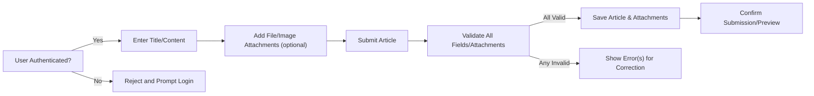
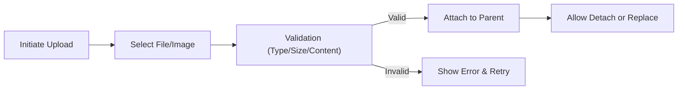
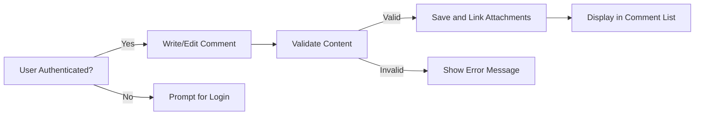
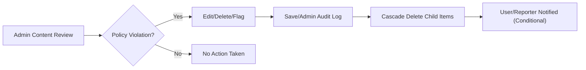
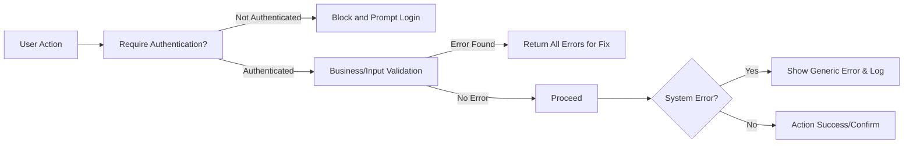

# User Flows and Scenarios for Economic/Political Discussion Board

## Article Submission Flow

### Overview
This section details the full business workflow for submitting an article (discussion post), covering all user and admin participant roles, data validations, and error paths for the economic/political discussion board.

### Article Submission (Business Requirements in EARS Format)
- THE discussionBoard SHALL enable every registered user (user) to create a new article with a required title and main content text.
- WHEN a user enters the article submission screen, THE discussionBoard SHALL require user authentication and check session validity.
- WHEN a user fills the article fields and adds attachments, THE discussionBoard SHALL validate for title length, content length, and total number of attachments, referring to [Business Rules and Validation](./07-business-rules-and-validation.md).
- WHERE attachments are added, THE discussionBoard SHALL require each file/image to pass validation for allowed types (e.g., png, jpg, pdf, docx), file size, and content safety (e.g., virus scan, content rules).
- IF any required field is empty or attachment validation fails, THEN THE discussionBoard SHALL block submission and explain all detected errors at once, allowing user to revise and resubmit.
- WHEN all requirements are met, THE discussionBoard SHALL create the article, store references to all attachments, attribute the author by user id, and log the precise submission timestamp.
- WHERE actor is admin, THE discussionBoard SHALL allow option to create or edit articles on behalf of any given user.

### Article Submission Flow Diagram

## File/Image Attachment Flow

### Overview
Covers all user steps and system responses required for successfully attaching files and images to articles or comments.

### Attachment Handling (EARS Format)
- THE discussionBoard SHALL allow registered users to upload and associate files/images with any article or comment they have permission to submit or edit.
- WHEN a user initiates file/image upload, THE discussionBoard SHALL require selection of attachment, then validate that the file extension, MIME type, and file size are included in the allowed set.
- IF the file fails validation for type or size, THEN THE discussionBoard SHALL block upload, display detailed error, and permit user to retry.
- WHEN file passes all validations, THE discussionBoard SHALL attach it to the intended article/comment and permit user (or admin) to remove it until submission is finalized.
- IF the parent entity (article or comment) is deleted, THEN THE discussionBoard SHALL cascade deletion to all associated attachments.

### Attachment Flow Diagram

## Comment Flow

### Overview
Describes user-driven actions of commenting, editing, deleting on articles, and the expanded permissions of admins to moderate all comments.

### Comment Workflow (EARS Format)
- THE discussionBoard SHALL allow all registered users to add, edit, or delete their own comments to any visible article.
- WHEN a user opens the comment input, THE discussionBoard SHALL check authentication and session validity.
- WHEN submitting a comment, THE discussionBoard SHALL validate for minimum and maximum content length, and ensure required structure per [Business Rules and Validation](./07-business-rules-and-validation.md).
- IF requirements are not met, THEN THE discussionBoard SHALL display all detected deficiencies to the user.
- WHERE user is admin, THE discussionBoard SHALL allow edit or removal of any comment from any user.
- WHEN comment is accepted, THE discussionBoard SHALL log user id, article id, timestamp, and relate any attached files/images. 
- IF the parent article or the comment itself is deleted, THEN THE discussionBoard SHALL ensure all associated files/images are deleted and comment no longer appears in lists.

### Comment Flow Diagram

## Moderation Flow

### Overview
Defines all business rules and options for admin moderation of articles, comments, attachments, and users.

### Moderation (EARS Format)
- WHERE actor is admin, THE discussionBoard SHALL enable full view, edit, or removal of any article, comment, or attachment on the platform.
- WHEN a potentially problematic article/comment/attachment is found or reported, THE discussionBoard SHALL provide admins a mechanism to flag, edit, or remove the item, capturing moderator id and timestamps for traceability.
- WHEN a user flags content for admin review, THE discussionBoard SHALL create a notification queue for admin processing, including user-provided reasons or context.
- IF an admin deletes any major content entity, THEN THE discussionBoard SHALL ensure all child data (comments, attachments) are also removed and generate an immutable audit trail.
- THE discussionBoard SHALL allow blocking or suspending users for rule violations and log the duration and reasoning.

### Moderation Flow Diagram

## Error & Exception Paths

### Overview
Details business-driven error handling, including authentication errors, validation failures, and system exceptions.

### Business Error Handling (EARS Format)
- IF a non-authenticated user initiates an action requiring login (submission, edit, attachment upload), THEN THE discussionBoard SHALL block the action and prompt for authentication before proceeding.
- IF an action (submission, comment, file upload) fails business validation, THEN THE discussionBoard SHALL return a single, comprehensive error summary for user correction, not piecemeal errors.
- WHEN moderation causes article or comment removal, THE discussionBoard SHALL inform authors and, if appropriate, notify users who reported the content.
- IF attachment upload fails (type, size, security), THEN THE discussionBoard SHALL explicitly state the issue and allow users to retry.
- WHEN system exceptions (backend errors) occur, THE discussionBoard SHALL provide a minimal error message, log the incident, and avoid exposing technical details to users.

### Error/Exception Flow Diagram

---

Every flow above strictly separates business requirements from technical implementation. All EARS requirements are in plain language (with EARS keywords), and every Mermaid flowchart uses strict double quotes for label compatibility. These comprehensive user and moderation scenarios ensure backend implementation will closely align with intended business logic and user experience.