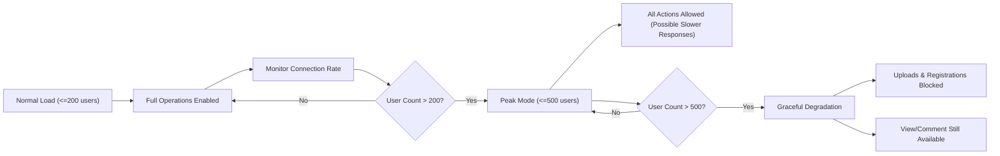
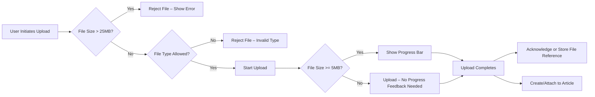

# Performance and Scalability Requirements – Discussion Board

## Introduction and Scope

This document outlines measurable, business-driven performance, scalability, and file upload expectations for the economic/political discussion board service. The aim is to provide backend developers with clear and actionable standards for response speed, supported user concurrency, file handling, and user-facing performance under normal and peak situations.

These requirements focus on user experience and operational consistency rather than technical implementation. The requirements are defined using the EARS (Easy Approach to Requirements Syntax) format wherever applicable.

## Response Time Expectations

### General Principles
- THE system SHALL meet all stated performance targets under normal operational load (200 or fewer active users).
- All latency and throughput goals apply to authenticated and unauthenticated usage equally.
- Response time is measured from the moment the API endpoint receives a request until the complete response is sent to the user.

### Article and Comment Operations
- WHEN a user requests the main article or comment feed, THE system SHALL return the list within 1 second 99% of the time.
- WHEN a user opens a single article (including all images and file metadata), THE system SHALL return the full article within 1.5 seconds 99% of the time.
- WHEN a user posts, edits, or deletes an article or comment, THE system SHALL confirm completion to the user within 1.5 seconds.

### Attachments and Media
- WHEN a user uploads an image or file as part of an article, THE system SHALL acknowledge file receipt within 3 seconds for files up to 25MB.
- WHEN file upload exceeds business-imposed limits or fails, THE system SHALL respond with an appropriate error within 2 seconds.

### User Authentication and General Actions
- WHEN a user logs in, registers, or logs out, THE system SHALL complete the process within 1.5 seconds.
- WHEN a user updates their own profile or settings, THE system SHALL return a success or error response within 2 seconds.

### Search and Filtering
- WHEN a user searches for articles and comments or applies filters to listings, THE system SHALL return accurate results within 2 seconds.

### Edge and Failure Scenarios (User Perspective)
- IF the system cannot meet the above timing requirements due to performance issues, THEN THE system SHALL return a standardized user-friendly error message describing the delay.
- IF an image or file upload is interrupted or fails, THEN THE system SHALL allow the user to retry the upload without loss of previously entered article/comment content.

## Concurrency and Scale

### Expected Regular Concurrency
- THE system SHALL support at least 200 simultaneously active users (defined as unique authenticated sessions making requests in any 5-minute window) without violating any response time requirement listed above.

### Peak and Flash Crowd Scenarios
- WHEN a sudden increase in user activity occurs (up to 500 active users for up to 30 minutes), THE system SHALL continue to serve article viewing and commenting operations with response times not exceeding double the baseline requirements.
- IF the concurrent active user count exceeds 500, THEN THE system SHALL degrade gracefully: rejecting new uploads and registrations with appropriate error messages while permitting read operations and comment posting to continue as resources allow.

### Open/Idle Connections
- THE system SHALL close idle API connections after 60 seconds of inactivity to preserve server resources.

### Sample Mermaid Concurrency Flow – Peak Load Handling

## Limits for File Uploads

### Business File Constraints
- THE system SHALL limit individual file uploads (attachments) to a maximum of 25MB per file.
- WHERE a user attempts to attach more than 5 files to a single article, THE system SHALL prevent submission and show an appropriate message.
- THE system SHALL support standard image file types (JPG, PNG, GIF, WEBP) and general document files (PDF, DOCX, XLSX, PPTX, ZIP, TXT).
- IF a user attempts to upload a disallowed file type, THEN THE system SHALL refuse the file and provide a specific error reason.

### Large File Workflow and User Feedback
- WHEN a user initiates a large file upload (>=5MB), THE system SHALL immediately provide progress feedback (e.g., percent complete, estimated time) until completion or error.
- IF an upload is terminated or the connection is lost, THEN THE system SHALL allow the user to retry the upload within 5 minutes, preserving associated article/comment data in draft state.

### Sample Mermaid Diagram – File Upload Process

## Non-functional, Business-facing KPIs (Acceptance Criteria)
- THE system SHALL meet or exceed all described performance goals during user acceptance testing (UAT).
- THE system SHALL complete critical paths (registration, article viewing, posting, commenting, file upload) within specified times for 99% of transactions under design load.
- IF any performance metric is not achievable in practice, THEN THE development team SHALL document the failed metric, the observed performance, and submit proposed changes to stakeholders for acceptance.

## Summary Table: Core Performance Metrics

| Operation                             | Target Response (99%tile) | Max Allowed at Peak (500 users) |
|---------------------------------------|---------------------------|----------------------------------|
| Main Article/Comment Feed             | 1s                        | 2s                               |
| View Single Article                   | 1.5s                      | 3s                               |
| Post/Edit/Delete Article/Comment      | 1.5s                      | 3s                               |
| Upload Attachment (<=25MB)            | 3s                        | 6s                               |
| Login/Logout/Register                 | 1.5s                      | 3s                               |
| Profile Update                        | 2s                        | 4s                               |
| Search/Filtering                      | 2s                        | 4s                               |

## Related Documents
- For file attachment details, see the [Attachment Process Requirements](./09-attachment-process.md).
- For functional requirements and supported operations, see the [Functional Requirements Document](./02-requirements.md).
- For authentication and user actor definitions, see the [User Actor and Authentication Documentation](./03-user-actors-and-auth.md).

---
*Developer Note: This document defines business requirements only. All technical implementations (architecture, APIs, database design, etc.) are at the discretion of the development team.*
