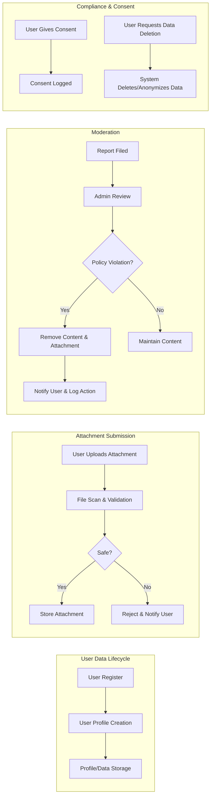

# Privacy and Compliance Requirements for Minimal Economic/Political Discussion Board

## User Privacy

Open, constructive dialogue is supported by privacy policies that minimize user risk:

- WHEN a user registers, THE system SHALL only collect and store the minimum necessary information: email, username, password hash, and optionally an avatar or profile image. No additional demographic or personal data is to be collected.
- THE system SHALL clearly indicate to users which fields are visible to others and which remain private during the registration and profile edit process.
- WHEN a user edits their profile, THE system SHALL allow self-modification or deletion of all fields except system-managed values (e.g., creation date, ID).
- IF a user requests to delete their account, THEN THE platform SHALL remove all personally identifiable data except that which must remain (such as username on historical posts, which must be anonymized).
- WHEN a user downloads their data, THE system SHALL supply a machine-readable archive of profile information, authored discussions, comments, and attachments within seven days.
- THE system SHALL guarantee that user IP addresses, emails, and other identifying information are never exposed in publicly accessible areas or non-authorized API responses.
- WHEN a user is deleted, THE system SHALL anonymize their past content (posts/comments) unless data retention is required by legal authorities.
- Session management SHALL use standard JWT expiration and support revocation for both user and admin sessions.
- All access to sensitive profile data (including admin overrides) SHALL be logged with actor, timestamp, and action details for at least six months.

## Attachment Security

The system enables file and image attachments with security controls to reduce risk of abuse:

- THE system SHALL restrict uploads to safe file types: images (PNG, JPG, JPEG, GIF) and PDF documents. Executable, scripts, and archive formats (such as .exe, .bat, .sh, .zip, .rar) are explicitly rejected.
- WHEN a user uploads an attachment, THE server SHALL automatically scan the file for malware prior to making it available to others.
- THE system SHALL enforce a maximum of 10MB per file attachment and a total user quota of 100MB; attempts to exceed this SHALL fail with an actionable message.
- All uploaded files SHALL be stored in access-controlled locations with unguessable URLs; direct access bypassing the platform (e.g., S3 bucket enumeration) SHALL be prevented.
- IF an attachment violates content policy or is identified as malware, THEN admins SHALL be able to remove it, triggering an audit log event that includes the acting admin and reason.
- WHEN an article or comment is deleted by its author, all related attachments SHALL be deleted immediately unless flagged for compliance investigation. If flagged, only authorized admins retain access.
- THE system SHALL validate access rights before allowing users to download any attachment: only the content author, admins, or permitted users may access the file; unauthorized access attempts SHALL return clear errors without revealing file paths or details.
- All served attachments SHALL include appropriate Content-Disposition and Content-Type headers to mitigate browser vulnerabilities.

## Moderation Policy

Minimal but essential moderation ensures constructive participation and risk mitigation:

- THE admin actor SHALL have the ability to view, edit, or delete any article, comment, or attachment that violates policy or law.
- WHEN a report is filed against user content, THE admin SHALL be notified and review the issue within 48 hours.
- IF an item is removed by moderation, THEN the system SHALL record the reason, responsible admin, and notify the original author including the rationale.
- Users may appeal a moderation decision once; if another admin exists, a secondary review is performed by a different admin. Single-admin setups SHALL log the appeal event and response.
- THE admin actor SHALL be able to bulk-delete content for users who are banned or removed due to violations, and all such actions SHALL be recorded in the audit log.
- Moderation operations SHALL be as transparent and minimally disruptive as practical while meeting basic legal and community standards.
- Audit logs for all moderation actions (removals, attachment flags) SHALL be retained for at least 6 months.
- When moderation removes content, all related attachments SHALL also be removed unless retained for compliance evidence—such files are visible only to authorized administrative reviewers.

## Compliance Standards

Compliance is kept minimal to avoid burden while meeting basic legal expectations (especially for privacy):

- At registration or first use, users SHALL be prompted to provide explicit consent for storage and processing of their personal data.
- IF regulations such as GDPR apply to users, THEN the system SHALL support core requirements: explicit consent, data access, the right to be forgotten, and data export.
- Consent logs SHALL be immutable and securely stored for future reference or review.
- IF the board is accessible to minors/the general public, adult or illegal content is blocked; detected content is removed and the actor(s) banned after administrative review.
- Audit logs covering PII access, moderation, and data exports SHALL be tamper-evident and visible only to authorized administrators.
- Annually, an administrative review SHALL check, and if needed update, compliance procedures to stay current with legal standards.
- A plainly-worded Privacy Policy page SHALL be published describing user data handling, user rights, and the process for contacting admins regarding privacy matters.

## Visual Overview of Content and Moderation Flow

---

These business requirements ensure that user privacy, secure attachment handling, light-touch moderation, and minimal legal compliance are all maintained without introducing unnecessary complexity—enabling practical, safe, and robust operation for a simple discussion board.