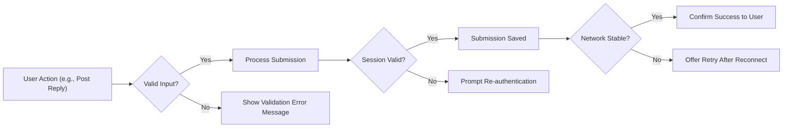

# Secondary and Exception Scenarios for Economic/Political Discussion Board

## Introduction
This document specifies secondary user flows, edge cases, and exception scenarios for the economic/political discussion board. Its goal is to ensure the platform provides clear, user-friendly, and robust error handling and recovery for all stakeholders. In line with the core business objective—enabling accessible, respectful, and reliable discussions—this document outlines requirements for less common but important user and system behaviors.

## Edge Cases

### Duplicate Topics or Replies
- WHEN a user attempts to post a topic or reply that is a duplicate of recent content (by the same user within a defined time or detected as substantively identical), THE system SHALL reject the submission and provide clear user feedback specifying the reason.
- IF a topic or reply is detected as a near-duplicate (determined by business logic for similarity), THEN THE system SHALL prompt the user to confirm if they wish to proceed or edit.
- WHERE system-configured thresholds are met for repetitive submissions, THE system SHALL temporarily limit additional attempts by that user.

### Very Long Threads
- WHEN a discussion thread exceeds preconfigured pagination or display limits (e.g., 1000 replies), THE system SHALL load and display content in incrementally paginated views, always presenting the most recent activity first.
- IF an individual user requests a full export or view of a very long thread, THEN THE system SHALL indicate that this action may take significant time and warn of loading/performance limits.

### Rapid Posting/Spam Attempts
- WHEN a user submits posts at a rate exceeding the allowed threshold (e.g., more than X posts in Y seconds), THE system SHALL block further submissions with a rate-limit warning and inform the user of when posting will be permitted again.
- WHERE unusual activity patterns are detected (e.g., same IP spamming topics), THE system SHALL flag this for administrative review (if admin role enabled).

### User Session Timeout
- WHEN an authenticated session expires during operation (e.g., during post or reply submission), THE system SHALL prompt the user to re-authenticate and, WHERE possible, preserve unsaved input temporarily for resubmission.

### Access by Non-Authenticated or Out-of-Permission Users
- IF a guest or unauthorized user attempts to perform member-only actions (e.g., post, reply, or access private data), THEN THE system SHALL block the action and return a descriptive access denied message with instructions for registration/login.
- WHERE a user attempts an admin-only action (if admin role active), THE system SHALL verify permissions and provide an explicit denial message if lacking appropriate rights.

## Exception Handling and User Recovery

### Error Handling Philosophy
The platform prioritizes clarity and user empowerment. All error messages and recovery flows must allow users to understand what went wrong, why, and how to proceed.

### System Failure/Unresponsive State
- IF the system becomes unresponsive or cannot complete the requested action due to internal errors, THEN THE system SHALL present a generic user-friendly error message, log the incident for review, and offer the user an opportunity to retry or return to a safe state (e.g., homepage).

### Unauthorized/Forbidden Actions
- WHEN a user attempts to access a feature for which they lack permission, THE system SHALL return a clear indication of insufficient privileges, without exposing sensitive information about protected resources or internal logic.

### Input Validation Failures
- WHERE data submitted by the user is incomplete, malformed, or violates platform-defined constraints (e.g., prohibited characters or length limits), THE system SHALL reject the submission, indicate all relevant validation errors, and allow the user to correct and resubmit.

### Lost Connection or Partial Submissions
- IF the user loses connection after submitting a post/reply but before server confirmation, THEN THE system SHALL detect the failure, inform the user, and—where technically feasible—provide an option to retry submission after reconnection.
- WHERE the system cannot confirm if the operation succeeded, THE system SHALL enable the user to manually check the post history or draft status.

### Data Consistency Errors
- IF internal data inconsistencies are detected (e.g., referencing deleted/locked threads), THEN THE system SHALL block the action, inform the user of the reason, and log the event for administrative follow-up.

## Bulk Operations
NOTE: The current business and feature requirements do not mandate any bulk operations for standard users. However, should such features (e.g., bulk delete or moderation for admins) be introduced in the future:

- WHERE an admin selects multiple items for a bulk action, THE system SHALL prompt for confirmation, execute the action atomically where possible, and summarize the results upon completion.
- IF any item in a bulk operation fails (e.g., cannot be deleted due to state change), THEN THE system SHALL continue with other items and report all successes/failures per item.

## Mermaid Diagram: Exception Handling Flow (Sample)

## Summary Table: Exception Scenarios and Expected System Response

| Scenario                                   | Expected System Behavior                                         |
|--------------------------------------------|------------------------------------------------------------------|
| Duplicate post/reply                       | Block and prompt with reason; allow edit or confirm             |
| Very long thread                           | Paginate and warn about performance impacts                      |
| Rapid/spam posting                         | Rate-limit with clear cooldown notification                      |
| Session timeout during posting             | Prompt re-auth, attempt to save unsaved input                    |
| Unauthorized action (guest/member/admin)   | Show access denied, guide to registration or permission remedy   |
| Invalid input (format/content)             | Display all error details, allow correction and resubmit         |
| System/internal failure                    | Show user-friendly message, log error, suggest retry             |
| Lost connection during post/reply          | Detect, allow retry/submission check, explain potential impacts  |
| Data inconsistencies                       | Block action, inform user, log for admin review                  |
| Bulk operation (admin)                     | Confirm action, provide per-item result summary                 |

## Conclusion
This report provides a comprehensive, business-focused specification for handling non-primary paths in the discussion board. All edge cases, exceptions, and potential failures have defined system responses ensuring users are informed, empowered to recover, and protected from accidental or malicious misuse. Backend implementation must strictly adhere to these requirements to maximize reliability and user trust.