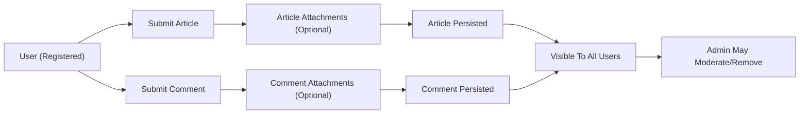
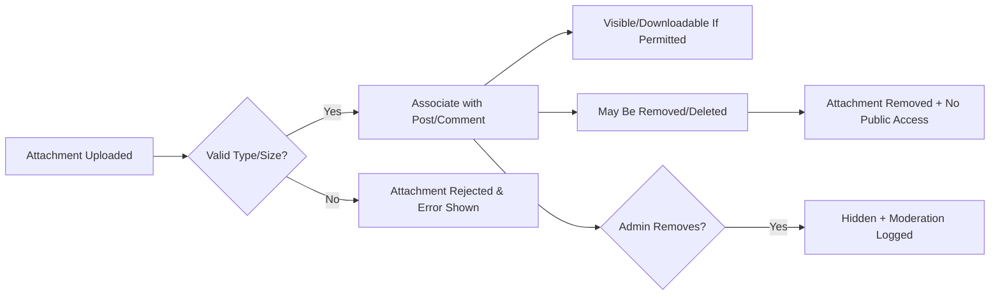

# Requirements Analysis: Simple Economic/Political Discussion Board

## 1. Introduction
This document outlines the minimal business and functional requirements for a simple economic/political discussion board. The purpose is to provide backend developers with a clear, actionable specification to implement a production-ready discussion board where users can post articles and comments, both supporting optional file and image attachments. Emphasis is on simplicity: no nonessential features, hierarchical threads, advanced moderation workflows, or complicated permission systems. All requirements are written in actual business scenarios and EARS format, free of technical detail, database schema, or API specifications.

## 2. User Roles
- **User (Registered):** May post new articles, comment, and upload attachments to their posts. Can view, edit, or delete their own content within permitted rules.
- **Admin:** Can moderate any content, remove attachments, and perform actions needed for compliance or policy enforcement.

## 3. Business Scenarios

### Article Creation
- WHEN a registered user wishes to start a new topic, THE system SHALL allow the user to submit a new article with a title, body content, and optional attachments (images, files).
- THE system SHALL ensure uploaded attachments are associated only with the article being posted and shall never permit attachment uploads without such association.
- THE system SHALL record article author, creation timestamp, and article status at submission.

### Commenting
- WHEN a registered user wishes to comment on an article, THE system SHALL allow the user to submit a text comment, optionally with one or more attachments (images, files).
- THE system SHALL ensure comment attachments are tied only to the target comment.
- Every comment SHALL track its parent article, author, creation timestamp, and include only valid attachments.

### Attachment Upload
- WHEN submitting an article or comment, THE user SHALL have the option to select and upload one or more attachments (image or file) in the same action.
- THE system SHALL scan uploaded attachments on receipt to validate file type and size according to configured rules.
- IF validation fails, THEN THE system SHALL reject the attachment, discard any non-compliant file, and display a clear error message specifying the reason.
- THE system SHALL require every attachment to be referenced only by its associated article or comment, never as a standalone item.

### Editing and Deletion
- WHEN a user edits their own article or comment (within allowed rules), THE system SHALL allow updates to text and attachments. Editing attachments means only adding or removing files, not modifying the file contents.
- WHEN a user or admin deletes an article or comment, THE system SHALL mark associated attachments as deleted, restrict access to them, and delete or hide the actual files.

### Moderation
- WHEN an admin removes an attachment for a rules violation, THE system SHALL instantly make that attachment unavailable and log the moderation action.
- Admins SHALL be able to review lists of recently-moderated attachments or posts for auditing.
- Any admin edit, deletion, or moderation SHALL be logged with a reason and be visible in the system UI as a moderation action (business rule awareness, not implementation detail).

### Display and Access Control
- THE system SHALL display uploaded images inline within the article or comment view. Other files SHALL be downloadable by users with permission to see the parent post.
- Users SHALL not view attachments unless they have permission to see the article or comment to which the file is attached.
- Attachment download links SHALL show the user-friendly original file name (with internal references hidden).

### Performance and Simplicity
- All user actions (posting, commenting, uploading attachments, moderation) SHALL be processed with a system response time of under 2 seconds under typical load.
- The board SHALL always favor the simplest, most transparent flows and rules, prioritizing reliability and ease-of-use over feature depth.

## 4. Data and Attachment Lifecycle Flows

### Mermaid Diagram: Main User and Data Flows

### Attachment Processing Lifecycle

## 5. EARS-Format Business Requirements Summary
- WHEN posting or commenting, THE system SHALL require and persist minimal metadata (author, timestamp, parent id, attachments).
- WHEN attachments are uploaded, THE system SHALL validate type/size before accepting and provide user-friendly error responses on failure.
- WHEN articles or comments are deleted/moderated, THE system SHALL update status and revoke all public access to related attachments.
- WHEN admins moderate content, THE system SHALL log every action for accountability and provide summary/audit capabilities.
- WHILE an article is visible, THE system SHALL allow comment creation with attachments.
- THE system SHALL not allow any attachment upload unless associated with an article or comment.

## 6. Simplicity and Minimalism
All requirements above follow the explicit instruction for a straightforward board, intentionally avoiding complex features, permission schemas, or over-engineered process. No moderation queue, hierarchical threading, or unneeded administrative features are present. All attachment flows are linked to exactly one article or comment, with rules focused on clarity, transparency, and developer ease.

## 7. Performance and Compliance
- All backend processing SHALL return results within 2 seconds under normal conditions.
- THE system SHALL comply with content moderation, user privacy, and evidence retention requirements as per relevant policies (see business documentation for compliance, not covered technically here).

## 8. Summary Table of Core Business Flows

| Phase              | Actor         | Action                        | Data Involved            | Result                 |
|--------------------|--------------|-------------------------------|--------------------------|------------------------|
| Create Article     | User         | Submit article, attach files  | Article (text), Attach.  | New thread created     |
| Comment            | User         | Submit comment, attach files  | Comment (text), Attach.  | New comment added      |
| Edit/Delete        | User/Admin   | Edit/delete article/comment   | Article, comment, attach.| Update/Removal         |
| Moderate Content   | Admin        | Remove content/attachments    | Any                      | Item hidden/removed    |
| View/Download      | User/Admin   | View or download attachments  | Attachment metadata/ref. | File or image rendered |

