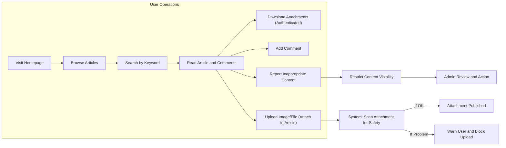

# Non-Functional Requirements for the Economic/Political Discussion Board

## Introduction
This document specifies the essential non-functional business requirements for the economic/political discussion board service. The focus is on performance, reliability, usability, and security from an end-user perspective, establishing clear criteria to guide development and ensure a smooth user experience. All requirements are expressed in user-centric language, using the EARS format where applicable and strictly avoiding technical implementation details.

## Performance Requirements

- WHEN users access the discussion board homepage or browse article listings, THE system SHALL display content within 2 seconds for 95% of interactions.

- WHEN a user submits a new article or comment, THE system SHALL create and display the new content within 3 seconds, including the association of any attachments.

- WHEN a user uploads one or more images or files as attachments to an article, THE system SHALL accept and process each upload within 10 seconds, provided individual file sizes do not exceed prescribed limits (see business rules).

- THE system SHALL provide paginated views for large lists of articles or comments, limiting each loaded page to a predefined number of items (e.g., 20 articles or 50 comments per page) to maintain consistent responsiveness.

- WHILE simultaneous users (up to 500 concurrent connections) are browsing and contributing content, THE system SHALL maintain the above response time guidelines for all standard operations.

- WHEN a user searches for articles or discussions by keyword or topic, THE system SHALL return results within 2 seconds for standard queries, and within 5 seconds for complex, multi-parameter queries.

- IF an operation (excluding uploads) cannot be completed within the specified timeframes due to unforeseen server load or other system constraints, THEN THE system SHALL inform the user of the delay and provide a clear message encouraging retry if necessary.

## Reliability Targets

- THE system SHALL maintain a service uptime of at least 99.5% on a monthly basis, excluding announced maintenance periods.

- THE system SHALL preserve data integrity such that all submitted articles, comments, and attachments are accurately stored and retrievable at any time.

- WHEN a user creates, edits, or deletes their own article or comment, THE system SHALL immediately reflect the change or provide a clear message if the action cannot be completed due to a server error.

- WHEN an admin performs moderation (edit, delete, block), THE system SHALL apply the action to affected articles, comments, users, or files within 3 seconds and log the moderation event for audit purposes.

- THE system SHALL regularly back up user-generated content (articles, comments, attachments, user profiles) to ensure recovery is possible in case of data loss or corruption. Backups SHALL be performed at intervals sufficient to guarantee that no more than 24 hours of user content can be lost in the event of major system failure.

- IF a process fails due to system outage, THEN THE system SHALL provide users with an informative message indicating the temporary unavailability and display estimated resolution time if known.

## Usability Expectations

- THE system SHALL provide clear, consistent navigation to all key features, including accessing, posting, commenting, and moderating articles.

- WHEN users encounter errors or invalid operations (such as exceeding file size limits or entering disallowed content), THE system SHALL display user-friendly messages in plain language, explicitly describing the issue and suggesting corrective actions.

- THE system SHALL minimize the steps and required fields for posting articles, commenting, and attaching files or images, in order to streamline discussion and maximize engagement.

- WHERE an operation involves waiting (such as file or image uploads), THE system SHALL provide visible progress indicators or feedback to inform users of ongoing activity.

- THE system SHALL adhere to accessibility principles (such as clear text contrast, keyboard navigation, and orderly tabbing) to the extent reasonable for a minimal discussion board.

- THE system SHALL present content in a readable, organized manner, prioritizing clarity and separation of article text, attachments, and comments for effortless reading and participation.

## Security Overview

- THE system SHALL require user authentication for all article and comment submissions, and for uploading or downloading any attachment.

- WHEN a user attempts any action associated with user identity (posting, editing, deleting, uploading, downloading), THE system SHALL verify user permissions and restrict actions accordingly, denying unauthorized requests with clear error messages.

- WHEN content is submitted to the platform, THE system SHALL scan for and detect potentially malicious files or attachments (viruses, executables, etc.) and SHALL prevent upload or notify the user to correct the issue.

- WHEN inappropriate or harmful content (spam, harassment, hate speech, illegal material) is reported or detected, THE system SHALL promptly restrict access to the relevant article, comment, or file, pending admin review. This restriction SHALL occur within 1 minute of report or detection.

- IF any user account demonstrates suspicious activity, THEN THE system SHALL allow admin users to immediately block or remove the account and provide an informative record of the action.

- THE system SHALL store user data and attachments securely, protecting sensitive information from unauthorized access, and SHALL comply with privacy expectations as documented in the [Compliance and Privacy Requirements](./10-compliance-and-privacy.md).

- THE system SHALL limit file download links for attachments to authenticated users; files SHALL not be available to the public or unauthenticated visitors.

## Summary Table: Non-Functional Requirements

| Requirement Area | Key Requirements |
|------------------|-------------------------------------------------------------------|
| Performance      | Home/load <2s, post/upload <10s, 500 concurrent users supported   |
| Reliability      | 99.5% uptime, daily backup, data integrity, clear outage messages  |
| Usability        | Clear navigation, plain error messages, minimal steps, accessibility|
| Security         | Authenticated actions, malicious file checks, strict permissions, private downloads |

## Visual Overview: User Experience and Process Flows

## Success Criteria

- THE discussion board SHALL operate within the documented performance, reliability, usability, and security requirements.
- WHEN requirements here conflict with technical limitations, THE system SHALL document deviations and propose remedies to minimize negative user impact.
- THE backend implementation SHALL reference these requirements as acceptance criteria during testing and quality assurance.