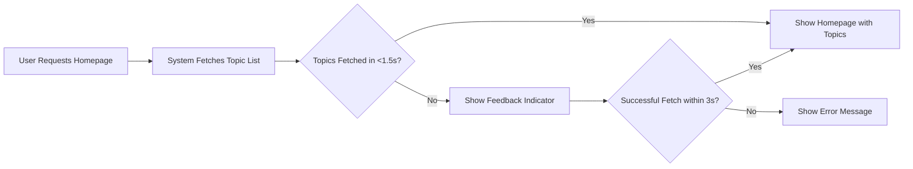

# Performance Expectations Report for Economic/Political Discussion Board

## 1. Introduction

This document defines the performance requirements and standards for the economic/political discussion board ("discussionBoard") platform. The aim is to ensure that all users, regardless of their technical familiarity, experience a fast, reliable, and accessible platform when browsing and engaging with discussions related to economics and politics. Performance requirements are specified in a clear, testable manner and use the EARS (Easy Approach to Requirements Syntax) format wherever relevant. These standards are binding and must be met to deliver a consistent and satisfactory user and administrator experience.

For foundational service context, see the [Service Vision and Overview](./01-service-overview.md) and [User Interaction Overview](./04-service-operation-overview.md).

## 2. Response Time Targets

### General Principles
- THE "discussionBoard" SHALL deliver fast and consistent performance for all users, regardless of device type (desktop, mobile, tablet), location, or network speed.

### Page Load and Data Retrieval
- WHEN a guest or member accesses the homepage, THE system SHALL return the full initial page content (including the topic list) within 1.5 seconds for 95% of requests, as measured on a stable broadband connection.
- WHEN a user views a topic and its associated replies, THE system SHALL display all relevant post content within 1.5 seconds for 95% of requests.
- WHEN a user performs a search for topics or replies using the standard search feature, THE system SHALL return accurate search results within 2 seconds for 95% of queries.
- WHEN a user navigates between paginated views (e.g., moving to the next topic page), THE system SHALL present the new page within 1 second for 95% of cases.

### Posting and Replying
- WHEN a member creates a new topic or posts a reply, THE system SHALL confirm submission and display the new content (or an appropriate pending/confirmation message) within 1.5 seconds.
- IF any delay is expected beyond the requirements above, THEN THE system SHALL show an immediate feedback indicator (e.g., spinner or progress bar) to inform the user of ongoing processing.

### Admin Actions
- WHEN an admin performs user or content moderation actions (such as hiding or deleting a topic), THE system SHALL process and confirm the action within 1.5 seconds for standard operations, for 95% of cases.

## 3. Scalability Needs

### Expected Load
- THE system SHALL support a baseline of 10,000 registered users with 100 concurrent active sessions without any degradation of performance below the targets specified above.
- WHERE user traffic increases (such as during trending economic or political events), THE system SHALL gracefully serve up to 2x the baseline concurrent user sessions (200 concurrent) for a minimum of 4 hours without failure or critical performance drop.

### Data Volume
- THE system SHALL maintain performance targets as active post volume grows to 100,000 topics and 1,000,000 replies.
- IF usage volume exceeds these thresholds, THEN THE system SHALL present a plan for scaling infrastructure to maintain specified response times.

### Resilience
- WHEN backend services experience transient failures, THE system SHALL retry automatically and, IF operation cannot succeed, THEN display a clear, user-understandable error within 3 seconds.

## 4. User Experience Standards

### Consistency
- THE system SHALL deliver consistent response times throughout the day, regardless of maintenance schedules, expected platform usage peaks, or geographic distribution of users.
- THE system SHALL ensure all roles (guest, member, admin) experience equal levels of performance for all features available to their role.

### Feedback and Progress Indicators
- WHEN an operation (such as submitting a post or loading search results) exceeds 1 second delay, THE system SHALL provide a visual feedback indicator (such as a spinner or progress bar) during the waiting period.
- WHERE errors or slowdowns occur, THE system SHALL inform users with clear, descriptive messages in user's language, avoiding technical jargon.

### Accessibility
- THE platform SHALL maintain full performance standards for users relying on assistive technologies (such as screen readers), ensuring compatibility does not impact speed or experience.
- WHERE accessibility features are enabled, THE system SHALL serve accessible UI elements within the same response targets.

## 5. Error Handling and Performance Degradation Scenarios

- IF the system cannot serve content or process user actions within the targeted times due to maintenance, high load, or backend failures, THEN THE system SHALL immediately notify users of the delay with a clear status message and an estimated time to recovery, where feasible.
- WHEN errors are persistent and prevent posting or replying, THE system SHALL ensure user-generated content is not lost and provide a way for users to retry the operation.
- THE system SHALL log all critical errors and slow operations (those exceeding SLAs) with sufficient context for diagnostics and future performance tuning.

## 6. Performance Measurement and Monitoring

- THE development team SHALL establish automated, continuous monitoring of response times, throughput, and error rates for all major API endpoints, in production and staging.
- THE system SHALL include regular load testing records (monthly at a minimum, and after major feature changes) to validate ongoing compliance with these expectations.
- THE system SHALL provide administrators with summary reports of performance compliance and any significant events (e.g., outages, scaling operations, SLA breaches).

## 7. References to Related Documents

For broader service context and business rules, refer to:
- [Service Vision and Overview](./01-service-overview.md)
- [User Interaction Overview](./04-service-operation-overview.md)
- [User Roles and Permissions](./05-user-roles-and-permissions.md)
- [Business Rules and Constraints](./10-business-rules-and-constraints.md)

## 8. Example Performance Workflow Diagram

Below is a sample Mermaid diagram visualizing the key user journey for loading and interacting with the platform:

---

All requirements in this document describe **business expectations only**. It is the full responsibility of the development team to select technical approaches, architectures, frameworks, APIs, and infrastructure to implement these requirements and maintain performance compliance. This document does not prescribe any technical solutions.