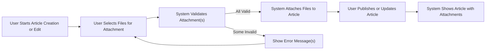
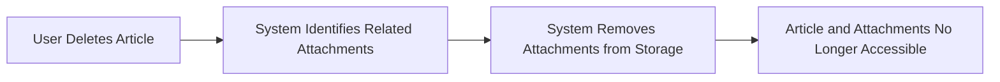

# Attachment Process Requirements for Discussion Board

## Attachment Workflow (Business Side)

### Overview
Attachments enable users to add relevant images or files to articles to enrich discussions on economic and political topics. The process must be simple, efficient, and secure, always protecting users from technical complexity.

**EARS Requirements for Workflow**
- WHEN a user creates or edits an article, THE system SHALL present an option to upload image or file attachments.
- WHEN a user uploads an attachment, THE system SHALL validate the file according to business rules before accepting it.
- WHEN an article is displayed, THE system SHALL show all successfully attached images and files in association with that article.
- WHEN a user deletes an article, THE system SHALL also remove any attachments associated with that article.

**Business Steps in the Attachment Workflow**
1. User initiates creating or editing an article.
2. System allows the selection or drag-and-drop of images and/or files for attachment.
3. System displays a preview (for images) or file name/type information before submission.
4. Upon submission, system validates and processes each attachment.
5. Successfully attached items are linked to the article and can be accessed or downloaded later.

### Attachment Lifecycle Flow (Mermaid Diagram)

---

## Validation and Restrictions (Business Logic)

### General Business Constraints
- THE system SHALL limit the number of attachments per article to ensure fairness and prevent abuse.
- THE system SHALL restrict file types to common safe formats appropriate for economic/political discussions (see below).
- THE system SHALL enforce a maximum individual file size and a total size limit per article.
- THE system SHALL reject files that are corrupted or contain executable code.
- THE system SHALL allow users to delete attachments from their own articles before or during editing.
- IF an attachment fails validation, THEN THE system SHALL notify the user with clear, actionable error messages.

### EARS Requirements for Validation
- WHEN a user attempts to attach a file, THE system SHALL accept only the following file types: JPEG, PNG, GIF (images); PDF, DOCX, XLSX, TXT (documents); ZIP (archives for supplementary material).
- WHEN a user attaches a file, THE system SHALL require each file to be no larger than 10 MB (configurable per deployment), and the total combined size of all attachments per article SHALL not exceed 50 MB (configurable).
- WHEN attachment file validation fails (wrong type, too large, or corrupted), THE system SHALL reject the file and inform the user about the specific reason for rejection.
- WHEN viruses or malware are detected in an uploaded file, THE system SHALL prevent its upload and display a security warning to the user.
- WHERE an article has reached its maximum number of attachments (10 per article by default), THE system SHALL not allow uploading additional files until some are deleted.

### Attachment Business Rule Table
| Rule | Enforcement |
|------|-------------|
| Allowed file types | JPEG, PNG, GIF, PDF, DOCX, XLSX, TXT, ZIP |
| Max file size | 10 MB per file |
| Max total size per article | 50 MB |
| Max attachments per article | 10 |
| Virus/malware scan | All files |
| Images previewed before upload | Yes |
| Only authors/admins can delete attachments | Yes |
| Attachments deleted if article is deleted | Yes |

---

## User Scenarios Involving Attachments

### Typical Scenario: Adding Images to an Article
1. User starts to write a new article about a recent policy.
2. User clicks the "Attach Image/File" option and selects a PNG image and a PDF file.
3. System previews the PNG image and shows the PDF filename.
4. User submits the article, system validates the files (type, size, virus scan).
5. Article is published, and attachments are displayed below article content.

### Edge Case: Attempting to Attach Too Many Files
1. User with 10 attachments tries to add an 11th file.
2. System immediately blocks the action and shows an error "Maximum of 10 attachments allowed per article."

### Edge Case: Invalid File Type
1. User attempts to attach an unsupported file (e.g., EXE or MP4 video).
2. System rejects the file and displays an error: "Unsupported file type. Allowed types: JPEG, PNG, GIF, PDF, DOCX, XLSX, TXT, ZIP."

### Edge Case: File Too Large
1. User selects a 20 MB DOCX file.
2. System rejects the file and informs the user: "Each file must be 10 MB or smaller."

### Edge Case: Attachment Removal Before Publication
1. User adds several attachments but then changes their mind about one.
2. User removes the unwanted attachment from the upload list before submission.
3. System updates the preview and file list accordingly.

### Article and Attachment Deletion Flow (Mermaid Diagram)

---

## Additional Security and Abuse Considerations
- THE system SHALL scan all uploaded files for malware and block any infected files.
- THE system SHALL not allow executable files or scripts under any circumstances.
- THE system SHALL log all attachment upload and removal events for administrative review.
- WHERE attachments or files are reported as abusive or unsafe, THE system SHALL allow admins to access, review, and remove such files promptly.

---

## Success Criteria
- All requirements must be fulfilled as stated above.
- Attachments must enhance article value, never undermine user privacy or safety.
- Admins must always retain full control to moderate content, including files and images.
- File operations must be seamless for end users while strictly following business logic boundaries.
