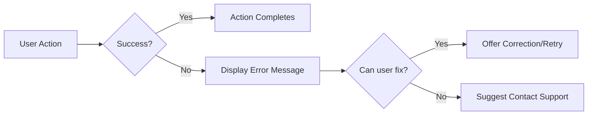
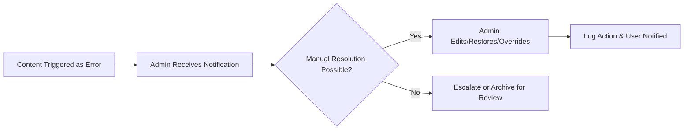

# Error Handling and Recovery Requirements for Economic/Political Discussion Board

## Introduction

Business rules, normal flows, and moderation cannot prevent every error scenario. This section details all required user and admin-facing behaviors and business logic for handling submission errors, authentication issues, attachment/file problems, moderation conflicts, and account-related exceptions. All requirements use the EARS format where appropriate and prioritize clarity, self-explanatory messaging, and durable recovery for both end-users and administrators.

## Common Error Scenarios

### Article and Comment Submission Errors
- WHEN a user attempts to submit an article or comment with missing required content, THE system SHALL inform the user of the missing fields and prevent submission.
- WHEN a user tries to submit an article or comment that exceeds length limits, THE system SHALL display the exact allowed limits and prohibit acceptance.
- WHEN the content of an article or comment contains prohibited or off-topic material by business rule, THE system SHALL show a precise natural-language error with clear reasons.
- WHEN a file or image attachment exceeds the maximum allowed size or is of a blocked type, THE system SHALL block submission and detail the required file criteria in the user message.
- IF a network or system failure interrupts submission, THEN THE system SHALL display a warning, preserve the user’s draft locally, and offer retry or manual save of content.

### Authentication and Access Errors
- WHEN a user’s authentication session has expired, THE system SHALL require login and display a message before allowing submission or editing.
- WHEN an unauthorized user attempts to access restricted features (such as editing another user's post or admin tools), THE system SHALL reject the action and display an access denied message referencing business role requirements.
- WHEN login credentials are incorrect, THE system SHALL inform the user of failed authentication and provide a clear route for password recovery.

### Attachment Handling Errors
- WHEN an uploaded file fails virus or content safety checks, THE system SHALL reject it, display the reason, and allow the user to choose a safe file.
- WHEN an attachment is missing or cannot be downloaded, THE system SHALL notify the user and encourage re-upload or request for admin support.
- IF file storage service is unreachable, THEN THE system SHALL temporarily block uploads and indicate the outage to the user, including a suggestion to retry later.

### Moderation and Admin Action Errors
- WHEN an admin attempts to moderate or delete already-removed or non-existent content, THE system SHALL show an error, update the visible list, and refresh moderation view.
- WHEN admin action requires additional privileges, THE system SHALL inform the admin of insufficient permission and suggest requesting escalation.
- IF conflicting admin actions occur (simultaneous edits or removals), THEN THE system SHALL allow only the first completed action and notify all involved admins of the final status.

### User Account and Profile Errors
- WHEN a user tries to update account details (such as password) with invalid formats, THE system SHALL validate and provide specific error messages for correction.
- WHEN an operation requires verified email but account is unverified, THE system SHALL prompt for verification process before continuing.
- WHEN a user is suspended or blocked, THE system SHALL explain the status, the reason, and offer a way to appeal or address the issue before further login or submissions are possible.

## User-Facing Error Handling

### General User Experience Principles
- THE system SHALL always use plain language and clear explanations in error dialogs with no technical jargon.
- THE system SHALL present grouped validation errors together for correction instead of piecemeal error notification.
- WHERE user actions fail due to correctable input or session, THE system SHALL provide clear next steps or recovery actions, such as retry, draft saving, or resubmission.
- THE system SHALL never discard user drafts upon recoverable error, always offering a way to restore data entered before failure.

### User Notification and Recovery Flow Diagram

- WHEN errors relate to file uploads, THE system SHALL display the type and reason for each failed file individually.
- WHEN validation fails, THE system SHALL present all field-specific errors at once to speed correction.
- WHEN an attachment or action is blocked, THE system SHALL visually mark the failed step so users can retry without confusion.

## Moderator/Admin Recovery Options

- WHEN business errors affect content or user actions, THE system SHALL enable admins to override, undo, or resolve the state through admin tools.
- THE system SHALL log each admin/user error recovery with timestamps and responsible account for audit.
- WHEN user content is incorrectly restricted, THE system SHALL allow admins to restore it, noting the reason and notifying the affected user.
- WHEN conflicting admin actions occur (e.g., two admins edit), THE system SHALL resolve using a business-defined Policy (e.g., first action wins) and notify all involved.
- ADMIN messages SHALL provide actionable recommendations for admin remediation while never exposing technical system details.

### Admin Recovery Flow Diagram

## User Self-Recovery Flows

- WHEN user-correctable errors occur (validation, authentication), THE system SHALL always display options for correction, retry, or draft save, without requiring user to repeat all prior steps.
- WHEN user action fails due to lost authentication, THE system SHALL allow immediate login and resume from previous context once authenticated.
- WHEN upload restrictions or failures prevent submission, THE system SHALL offer clear next steps to adjust file type/size or retry after delay.
- WHEN a blocked or suspended user wishes to appeal, THE system SHALL present appeal procedure and allow submission of appeal directly within the interface.
- WHEN persistent system or outage errors prevent ongoing work, THE system SHALL save drafts and encourage retry when the service is restored, or offer help contacts.

## Summary Table: Error Recovery Business Logic

| Error Scenario                   | Required User Recovery         | Admin Recovery         | Required Notification   |
|----------------------------------|-------------------------------|-----------------------|------------------------|
| Submission validation failed     | List all errors, retry/edit   | No                    | Immediate error dialog  |
| Unauthorized access attempted    | Block, explain permissions    | No                    | Denied with reason     |
| File upload fails                | Show precise reason, retry    | No                    | Error per file         |
| Session expired                  | Prompt re-login, resume flow  | No                    | Authentication prompt  |
| Content moderation conflict      | Retry, possibly escalate      | Audit and resolve     | Notify user/admin      |
| Account blocked/suspended        | Explain, allow appeal         | Restore or uphold     | Status and reason      |
| Storage or backend outage        | Save draft, try again later   | No                    | Outage notification    |

---

All requirements above are strictly business-driven and actionable. All user and administrator experiences must strictly follow business rules. This ensures the economic/political discussion board is resilient, transparent, user-friendly, and fully recoverable from every foreseeable error or exception, with no developer notes or technical terms ever exposed to the user.