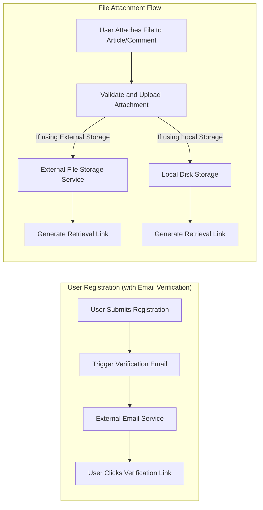

# External Integrations for Minimal Economic/Political Discussion Board

## Introduction to External Service Integration Scope

This economic/political discussion board is architected to minimize dependency on external services while providing only the most basic features required for usability and basic operational security. The project intentionally excludes non-essential integrations to achieve simplicity, maintainability, and ease of deployment for non-technical administrators. Integrations with third-party services are limited to fundamental requirements for user authentication (via email) and support for file/image attachments. Avoiding superfluous integrations ensures the backend and user experience remain straightforward and robust to configuration errors and external outages.

## Identified External Service Needs

System requirements analysis determined that only the following external integrations serve the board's operational and business needs. All others are out of scope and must not be implemented:

- **Email Services**: Used exclusively for account verification, password resets, and essential operational notifications (e.g., required by authentication or security workflows).
- **File Storage Services**: Utilized only for storing user-uploaded attachments (images, documents) associated with articles/comments, especially where local storage is not viable or is restricted by operational policy.

No analytics, social login, large-scale messaging, payment, or other integrations are permitted unless explicitly justified by legal, security, or ultra-minimal operational needs.

## Potential Integration Points

### 1. Email/SMTP Service
- **Registration:** WHEN a user submits the registration form and email verification is enabled, THE system SHALL send a verification email using a configured SMTP or transactional email provider. IF no provider is configured, THEN THE system SHALL inform the user that their account is provisionally created but pending verification until email functionality is restored.
- **Password Reset:** WHEN a user requests a password reset, THE system SHALL deliver a password reset link by email using the configured provider. IF email cannot be sent due to configuration or service errors, THEN THE system SHALL show an error and suggest alternative recovery methods if available.
- **Operational Notification:** WHERE legally required (e.g., for privacy requests or account changes), THE system SHALL send only the minimal required notification via email.

### 2. Cloud or Local File Storage for Attachments
- **File Handling:** WHEN a user attaches an image or file (within business-defined limits) to an article or comment, THE system SHALL upload that file to the pre-configured storage method: either an external object store (e.g., S3) or local disk. IF no external storage is configured and local storage is not permitted, THEN THE system SHALL block the upload and return an informative error to the user.
- **Retrieval:** WHEN a file is attached, THE system SHALL generate a secure, expiring link for file access, ensuring attachment URLs are not public or guessable. Unauthorized/unauthenticated users SHALL NOT be able to access these links.
- **Validation:** WHILE handling uploads, THE system SHALL enforce maximum file size and permitted MIME type restrictions, returning user-friendly error messages if validations fail.

## Explicit Scope and Limitations

- THE system SHALL NOT include integrations beyond email for authentication flows or storage for attachments; analytics, social login, push notification, or unrelated third-party integrations are out of scope.
- IF external file storage or email is not configured or fails, THEN administrators SHALL be clearly notified via logs or configuration dashboards, and users SHALL receive clear operational error messages.
- THE system SHALL never expose internal credentials or connection details through API responses, logs accessible to users, or in documentation.
- WHERE policy dictates restrictions (e.g., on attachment size, file type), THE system SHALL strictly enforce such rules at upload time, before storing any file.
- THE system SHALL be designed so that disabling integrations (via configuration) does not cause backend errors but enables a fallback minimal operation mode (i.e., registration with no verification, file uploads disabled, etc.).

## Mermaid Diagram: High-Level Integration Flows

## Minimal Integration Requirements Summary (EARS Format)

- WHEN a user registers and email verification is enabled, THE system SHALL send a verification email via the configured SMTP or transactional provider.
- WHEN a user requests a password reset, THE system SHALL send a reset link by email and SHALL handle errors by informing the user of failure and providing alternatives if available.
- WHEN attachments are enabled and a file is uploaded, THE system SHALL store uploaded images and documents either externally or locally, as defined by configuration.
- IF no email or file storage provider is configured, THEN THE system SHALL provide fallback minimal operation (unverified accounts, file attachments disabled) and clearly notify users of such operational limits.
- THE system SHALL NOT permit integration with any other third-party services beyond email (for authentication flows) and storage (for attachments).
- IF an integration point (email or storage) is unavailable, THEN THE system SHALL present user-facing operational errors and SHALL log detailed failures for admin review.
- WHILE uploading or retrieving attachments, THE system SHALL check user authentication and permissions before issuing or allowing access to download links, denying access for unauthorized requests.
- WHERE policy restricts attachment size, MIME type, or quantity, THE system SHALL enforce these at upload time and return validation feedback on violation.

## Closing Note

Design choices for this project restrict external service integrations to only minimal, operationally required email (authentication workflows) and file/image storage support for article/comment attachments. No analytics, marketing, or superfluous connections are permitted; all requirements are documented for backend clarity and ease of future maintenance. For details of validation rules and operational policy, reference the business rules documentation.