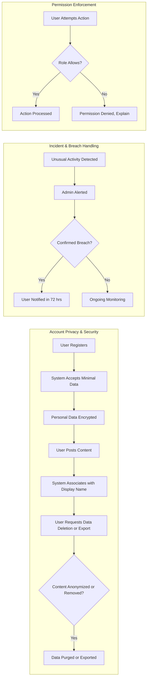

# Security and Compliance Requirements for Economic/Political Discussion Board

## Data Privacy Commitments
### General Principles
- THE system SHALL collect only the data required for user registration, authentication, and participation in business processes described in [User Role and Permissions Requirements](./05-user-roles-and-permissions.md).
- WHEN a user registers, THE system SHALL present an explicit privacy statement outlining data collection, retention, sharing, and user rights.
- THE system SHALL treat all posted discussion content (topics and replies) as public data, associating it only with display name or anonymized user identifier, never revealing private data such as email or IP except as required by law or explicit user consent.
- WHEN a user requests deletion of their account, THE system SHALL remove all personal information (email, name, authentication data) within 30 days and SHALL pseudonymize any authored content not legally required to delete.
- WHEN a user requests export of account data and posts, THE system SHALL provide a readable, portable file (CSV/JSON) within 7 days.
- THE system SHALL allow users to view all personal and posted data associated with their account via settings interfaces.
- WHEN a user submits topics, replies, or other content, THE system SHALL always display a notice that submissions are public, visible, and search-engine indexable.
- THE system SHALL not retain access logs or metadata longer than 90 days, except if required for a legal, regulatory, or security investigation.

### Data Storage and Handling
- THE system SHALL store all sensitive authentication data using strong salted/hashed/encrypted methods in line with industry standards (e.g., bcrypt, but stated in business terms only).
- THE system SHALL isolate public post data from personal data, such that accidental leaks do not expose higher-sensitivity information.
- WHEN a user requests deletion or anonymization, THE system SHALL process such requests within prescribed legal limits (e.g., 30 days under GDPR) and log the completion of each request.
- WHEN a data export or deletion process is initiated, THE system SHALL maintain open communication with users including clear status, estimated timelines, and a confirmation message upon completion.
- THE system SHALL not collect or store any information about user political views, opinions, or economic status except as voluntarily expressed through public forum posts.

## Security Expectations
### Role-Based Access and Authentication
- THE system SHALL enforce strict role-based access according to definitions in [User Role and Permissions Requirements](./05-user-roles-and-permissions.md): only admins may access management/moderation features, only members and admins may post, all users may browse/read.
- WHEN a user requests a resource or action outside their allowed permissions, THE system SHALL block the action and display a business-appropriate message explaining denied access.
- WHEN a user attempts to authenticate, THE system SHALL check credentials and log each attempt, alerting an admin if brute-force patterns are detected (e.g., more than 5 failures in 10 minutes).
- IF more than 5 failed login attempts occur for the same account in 10 minutes, THEN THE system SHALL lock the account for 15 minutes and display a lockout notification to the user; admins SHALL be able to unlock accounts upon identity verification.
- THE system SHALL inform users of all account security events: failed logins, lockouts, password changes, and suspicious activity.
- WHEN registering or setting a new password, THE system SHALL require: minimum 8 characters, at least one letter and one number, and SHALL validate strength in real-time.
- WHEN a user requests a password reset, THE system SHALL verify email and information before allowing reset; no detail about account nonexistence SHALL be leaked by response content or timing.
- THE system SHALL issue JWT-based authentication tokens valid for 30 minutes per session, refreshing for up to 30 days since last login action; logout SHALL invalidate all active tokens.
- WHEN a session expires, THE system SHALL prompt re-authentication and SHALL preserve unsaved posts and replies in draft for up to 24 hours.

### Input Validation and Content Security
- THE system SHALL validate and sanitize all user input—topics, replies, registration, usernames—to prevent code injection, XSS, or similar attacks using business-aligned, non-technical terms.
- WHEN unsafe input is detected, THE system SHALL reject and explain the sanitization policy.
- THE system SHALL block all submissions that include banned/prohibited content as defined in [Business Rules and Constraints](./10-business-rules-and-constraints.md).

### Endpoint Rate Limiting
- THE system SHALL rate-limit requests per user, IP, or token as follows: no more than 50 unauthenticated actions/hour per IP, no more than 300 posting actions/day per account.
- IF a user or IP exceeds limits, THEN THE system SHALL refuse further actions with a clear explanation and an indicator showing when actions can resume.

### Monitoring, Incident Response, and Logging
- THE system SHALL log all: authentication attempts, password changes, failed permissions, account deletions/exports, and all admin actions, retaining logs for at least 30 days but not more than 90 days unless under investigation.
- WHEN suspicious patterns (e.g., mass failed logins, rapid posting) are detected, THE system SHALL alert an admin within 15 minutes.
- IF a potential data breach is identified, THEN THE system SHALL halt further processing, log the event, restrict account access, notify affected users within 72 hours, and guide on recovery procedures.
- THE system SHALL provide users an action history (successful and failed logins, password changes, major actions) via account settings.

## Compliance & Moderation Oversight
### Legal and Regulatory Compliance
- THE system SHALL comply with privacy/data protection law applicable to its user base (e.g., GDPR for EU members), ensuring: clear consent, data access/export, deletion, correction, and notification of breach rights.
- WHEN served with a legally valid data access or removal request, THE system SHALL respond within the timeframes mandated by law (30 days for GDPR/DSRs), disclosing only the minimal data required and logging all requests and responses.
- Users SHALL be able to contact site admins for compliance or privacy issues, receiving acknowledgment within 3 business days and full resolution or next steps within 7 business days.
- THE platform SHALL publish a privacy and compliance statement visible before registration and in the user settings area.

### Moderation and Admin Oversight (Future-Ready)
- IF moderation is enabled, THE system SHALL track all admin actions (flagging, deleting, suspending content/users) with timestamps and responsible party.
- Admin moderation events (content removal, bans) SHALL trigger an immediate notification to affected users explaining reason and available channels for challenge or appeal.
- FOR content removed due to legal or policy infractions, THE system SHALL retain a non-public record (for up to 90 days) for audit, review, or appeal handling.

## Example Process Diagram: Security & Compliance

## Summary
All requirements above use precise, measurable, and testable natural language. Requirements employ EARS format where appropriate. Every major workflow, error scenario, and compliance incident has actionable developer guidance. Authentic business context references are preserved, linking to primary user role and business rules documentation for clarity and traceability. No implementation or technical prescription is present: these requirements are strictly business-facing and ready for backend developer use.