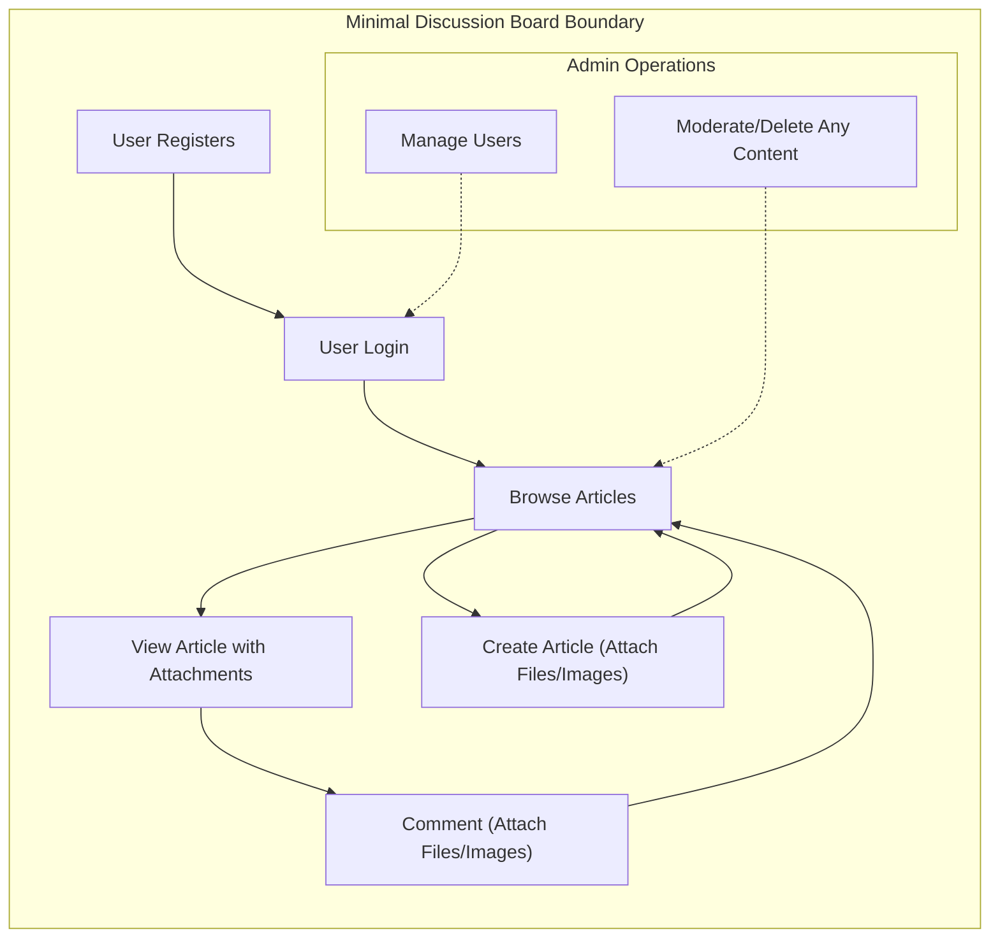

# Business Constraints and Summary for Economic/Political Discussion Board

## Key Business Constraints

1. **Minimal Feature Design**
   - WHEN developing the discussion board, THE system SHALL only include features absolutely required for posting articles, commenting, and file/image attachments. No extra modules such as likes, gamification, badges, messaging, advanced analytics, or post-ranking are allowed.
   - IF new requirements or feature requests emerge that are not included in the initial business requirements, THEN development and deployment SHALL not include them.

2. **Posting and Article Functionality**
   - WHEN a registered user creates an article, THE system SHALL
a) Enable attaching up to 5 files/images, each maximum size 10MB, to the post
b) Enforce a content length of up to 10,000 characters per article
c) On violation, SHALL clearly reject the submission and state which rule was broken.
   - WHEN a user views an article, THE system SHALL display all attachments labeled by content type and ensure they are downloadable only by authenticated users.

3. **Attachment Constraints**
   - WHEN a user uploads a file or image, THE system SHALL check for allowed type, permitted size, and enforce a per-article/comment limit of max 5 files/images, 10MB each file/image.
   - IF an unsupported file type or oversize upload is detected, THEN THE system SHALL block the upload and show a specific error explaining the constraint.
   - THE system SHALL store all user-uploaded files securely, making them accessible only to authenticated users, and never expose attachment download links to the public or unauthenticated users.

4. **Comments**
   - WHEN a registered user comments on an article, THE system SHALL support up to 2,000 characters and 5 file/image attachments (same rules as articles).
   - IF comment exceeds content or attachment limits, THEN system SHALL reject and clearly explain the failure.
   - THE system SHALL not allow anonymous commenting or posting; only logged-in users can create, edit, or delete comments and posts.

5. **Authentication and Authorization**
   - WHEN a user attempts to post, comment, or upload attachments, THE system SHALL require login using email and a password.
   - WHEN a user is not logged in, THE system SHALL block any posting, commenting, or attachment upload attempts.
   - WHEN a user is an admin, THE system SHALL grant rights to delete or edit any post or comment, and access user management features. Regular users can only edit or delete their own posts/comments.
   - THE system SHALL always distinguish between regular 'user' and 'admin' roles; no other roles exist.
   - All permissions SHALL be strictly enforced at every access point and API.

6. **Moderation and Content Control**
   - WHEN an admin reviews posts or comments, THE system SHALL offer simple moderation controls to delete or edit any content, without advanced reporting, warning, or flagging systems.
   - THE system SHALL NOT implement or support features for content flags, user warnings, or complicated audit/history logs – only basic moderation.
   - WHEN a user attempts to edit or delete their own content, or an admin moderates, IF ownership or role is not permitted, THEN the operation SHALL strictly fail and a clear explanation is shown.

7. **Performance and User Experience**
   - THE system SHALL deliver all article, comment, and attachment listings and content within 2 seconds under normal use.
   - WHEN uploading or downloading attachments, THE system SHALL show clear progress indication and message upon success or failure, especially for errors related to file type, size, or quota.
   - IF the service is interrupted or a request fails, THE system SHALL immediately inform the user of the reason for error and, where possible, how to recover.

8. **Data Handling and Privacy**
   - WHEN files/images are uploaded, THE system SHALL save them in a non-public, secure location so that unauthenticated users cannot guess or access raw file links.
   - WHEN a user or admin deletes content, THE system SHALL remove associated files/images from storage after a minimal technical retention window.
   - THE system SHALL store only: user email, hashed password, display name/username, and file metadata. No other user profile or content data is collected.

9. **Scope and Feature Creep Prevention**
   - WHEN designing, developing, or reviewing the board, THE system SHALL consistently block any attempt to add extendibility features such as plugin support, API integrations, advanced search, import/export, content structuring/formatting, or custom roles. Only standard browser downloads of attachments are allowed, no export functionality.
   - WHEN uncertain feature requests arise, THEN THE system SHALL refer to this summary as authority to exclude them.

10. **Compliance and Security**
    - THE system SHALL encrypt all password data and SHALL use industry-standard JWT authentication tokens for all sessions and login protocols.
    - THE system SHALL apply a strict, minimal privacy and compliance posture, only meeting base legal thresholds for an online discussion board. See privacy and compliance requirements for further details.

## Operational Rules
- THE system SHALL restrict all admin controls to the 'admin' role; regular users can never access admin/moderator features.
- WHEN users interact with articles/comments for edit or delete, THE system SHALL verify content ownership, except for admins who can always override.
- THE user flow SHALL remain linear and flat: view list, create, comment, attach files, admin moderate. No nested/threaded comments, post categories, or topic partitions.
- THE system SHALL offer only plain text input (no markdown, HTML, or rich formatting for articles/comments).

## Minimal Service Philosophy
- The project is locked at minimum functional scope as described: simply enable online economic/political discourse with secure attachment handling, strict admin/user role separation, and easy operation for all parties.
- Any attempt at scope expansion or inclusion of non-specified features SHALL be vetoed by this document.
- Developers SHALL reference this page when designing, reviewing, or deploying any board features to maintain absolute clarity and minimal reliable operation.

---

---

All operational and business boundaries for this economic/political board are thus frozen. Developers, product managers, and admins SHALL defer to this requirements document whenever any question of scope, permission, security, or user flow arises.