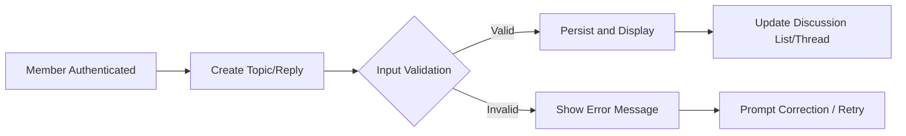

# Business Rules and Constraints for Economic/Political Discussion Board

## Core Business Rules

### Topic and Reply Creation
- WHEN a member is authenticated, THE system SHALL allow the member to create a new discussion topic with a title and initial post content.
- WHEN a member is authenticated, THE system SHALL allow the member to submit a reply to any existing public topic that is open.
- IF a guest (unauthenticated user) attempts to create a topic or reply, THEN THE system SHALL deny the action and provide a clear message that only registered members can post.

### Topic and Reply Visibility
- THE system SHALL make all discussion topics and their replies publicly browsable by both guests and members, except where restricted by future business rules.
- WHEN a topic is successfully created, THE system SHALL display it immediately in the topic list ordered by newest first.
- WHEN a reply is successfully posted, THE system SHALL display it immediately in the thread, listed by post timestamp ascending within that topic.

### Search and Browsing
- THE system SHALL provide a way for users (guests and members) to search for topics by keyword, topic title, or author username.
- WHEN a search is performed, THE system SHALL return all matching topics and display topic excerpts in order of relevance or recency.
- IF a search query does not match any existing topics or replies, THEN THE system SHALL clearly indicate that no results were found.

### User Registration and Login
- WHEN a guest provides a valid email and password, THE system SHALL allow them to register as a member.
- WHEN a member provides correct credentials, THE system SHALL allow them to log in and access all member features.
- IF a login or registration form is incomplete or contains invalid data, THEN THE system SHALL display a clear error message indicating what information is required or incorrect.
- WHEN a member logs out, THE system SHALL end the current session and revert the user to guest privileges.

### Admin Actions (Optional/Future-Ready)
- WHERE a user is an admin, THE system SHALL allow them to delete topics, replies, or member accounts and view activity logs.
- IF a non-admin attempts any admin-restricted operation, THEN THE system SHALL deny access and inform the user.

## Validation Logic

### Topic Constraints
- THE system SHALL require every topic to have a non-empty title (minimum 5 characters, maximum 120 characters) and initial post body (minimum 10 characters, maximum 4000 characters).
- THE system SHALL prevent creation of topics with substantial duplication: WHEN a member attempts to post a topic with a title or content highly similar to a topic created by the same member within the last 10 minutes, THEN THE system SHALL deny the action and provide a corresponding message.
- IF a post contains prohibited language or violates community guidelines (to be enumerated in a separate policy), THEN THE system SHALL reject the post and inform the user of the violation.

### Reply Constraints
- THE system SHALL require every reply to have non-empty body content (minimum 3 characters, maximum 2000 characters).
- IF a reply attempts to exceed the defined maximum length, THEN THE system SHALL deny the submission and instruct the user to shorten their reply.
- THE system SHALL allow members to post replies only to topics that remain open to discussion.

### Duplicate and Flood Prevention
- WHEN a member attempts to submit multiple replies to the same topic within a 60-second period, THE system SHALL deny subsequent replies and show an anti-flood notification.
- WHEN a member attempts to create more than 5 new topics within any 1-hour window, THE system SHALL deny further topic creation until the window resets, displaying the reason for the block.

### Input Formatting
- THE system SHALL automatically trim leading and trailing whitespace from all topic titles, topic bodies, and reply content before validation or storage.
- THE system SHALL prohibit submission of posts or replies that contain only whitespace or special characters.

## Operational Constraints

### Core Posting Rate Limits
- THE system SHALL enforce the following per-user limits to mitigate spam and encourage thoughtful participation:
  - Maximum 5 new topics per user per hour
  - Maximum 30 replies per user per hour
- IF a user exceeds these limits, THEN THE system SHALL present a clear rate limit message describing the restriction and when posting will be available again.

### System Availability Guarantees
- THE system SHALL be available for browsing and posting 24/7 except for scheduled maintenance, which must be announced at least 24 hours prior to the event.
- IF the system must go offline unexpectedly, THEN THE system SHALL display a universal maintenance page to all users indicating the cause and expected duration.

### Data Integrity and Persistence
- WHEN a member successfully creates a topic or reply, THE system SHALL guarantee that the content is immediately persisted and made available to other users within 2 seconds.
- IF a system error occurs during topic or reply creation, THEN THE system SHALL not display the content and issue an explicit error message to the submitting user. No partial or lost posts shall be visible.

### Accessibility and Usability
- THE system SHALL ensure that all business flows (registration, login, posting, searching) are completed in three steps or fewer per user action wherever possible.
- THE system SHALL use language and labeling that is understandable for users without a technical background.

## Mermaid Diagram: Core Posting Workflow

## Notes
- All requirements are stated in EARS format where applicable.
- These business rules and constraints supersede any technical implementation details. Technical teams have full autonomy in how requirements are realized.
- For further operational detail, refer to [Service Overview](./01-service-overview.md), [User Roles and Permissions](./05-user-roles-and-permissions.md), and [Primary User Scenarios](./06-primary-user-scenarios.md).