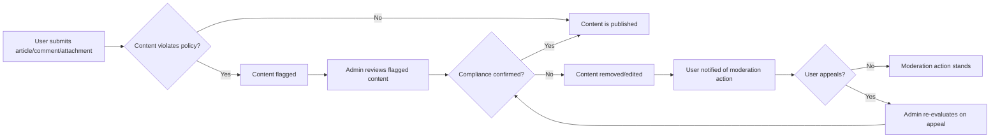

# Compliance and Privacy Requirements for the Economic/Political Discussion Board

## Content Moderation Ethics

### Moderation Philosophy
THE "discussionBoard" service SHALL uphold the principles of open, respectful, and civil economic and political dialogue. The platform SHALL balance free expression with the duty to prevent harm, abuse, misinformation, and illegal content. All community members, regardless of viewpoint, SHALL be treated impartially in moderation processes.

### Ethical Guidelines for Moderators (EARS)
- THE admin SHALL actively monitor and moderate content for adherence to platform rules.
- WHEN content (articles, comments, or attachments) is reported or flagged by users, THE admin SHALL promptly assess the content for ethical or legal violations.
- IF content is determined to include hate speech, personal attacks, threats, defamation, targeted harassment, illegal material, or deliberate misinformation, THEN THE admin SHALL take corrective action (removal or editing) following recognized ethical standards and applicable law.
- WHILE reviewing content, THE admin SHALL evaluate the context, intent, and broader societal impact before deciding on moderation outcomes.
- THE admin SHALL document and log all moderation actions for transparency and accountability.

### Prohibited Content (Business Rules)
- THE "discussionBoard" service SHALL prohibit the posting or sharing of:
  - Hate speech, violence incitement, and discrimination
  - Doxing or sharing of sensitive personal information
  - Threats (including self-harm or harm to others)
  - False or fabricated news intended to mislead
  - Child exploitation or explicitly illegal material
  - Unlicensed copyrighted content

### User Moderation Experience (EARS)
- WHEN a user's content is removed, edited, or flagged, THE platform SHALL notify the user clearly, stating the reason and offering recourse if available.
- IF a user feels a moderation action was unjustified, THEN THE platform SHALL enable an appeal or review process via formal request.

### Moderator Conduct (EARS)
- THE admin SHALL always act without political or economic bias and SHALL maintain the confidentiality of users and internal moderation deliberations. All moderation decisions SHALL be made transparently, following documented guidelines.

## User Privacy Expectations

### Data Collection Principles
- THE "discussionBoard" service SHALL collect only the data necessary for operating, improving, and moderating the platform effectively.
- THE platform SHALL disclose all categories of collected data and intended uses in an understandable privacy policy, accessible at all times to users.

### User Consent and Transparency (EARS)
- WHEN a user creates an account or posts content, THE platform SHALL request explicit agreement to its data collection and usage policy.
- THE platform SHALL allow users to review the active privacy policy at any time from their account area.

### Data Usage and Sharing (EARS)
- THE platform SHALL not use or sell personal user data for marketing, profiling, or any secondary purpose not required for core system functionality.
- WHEN disclosure to authorities is legally mandated, THE platform SHALL comply and SHALL notify the affected user unless legally prohibited.

### Anonymity Options (EARS)
- WHERE legally and operationally feasible, THE platform SHALL allow users to select display names or pseudonyms and SHALL not require excessive personal information beyond essential authentication needs.

## Data Retention

### Retention Policies (EARS)
- THE platform SHALL store user submissions (articles, comments, attachments) as long as the account is active and necessary for community value, unless removal is requested or required by policy/law.
- THE platform SHALL retain user profile and authentication data for only as long as necessary, and SHALL provide a published retention schedule or grace period.
- IF a user requests account deletion, THEN THE platform SHALL erase all personally identifiable information and shall anonymize authored content within 30 days, except information required for legal obligations.
- THE platform SHALL review and delete outdated, irrelevant, or unneeded data regularly.

## User Data Rights

### Access and Portability (EARS)
- THE user SHALL be able to view all account data they have provided plus their articles, comments, and attachments.
- WHERE possible, THE user SHALL export a copy of their account and contributions in a common machine-readable format upon request.

### Update and Deletion (EARS)
- WHEN a user requests amendment of inaccurate personal information, THE platform SHALL provide a means to update such data in a reasonable timeframe.
- WHEN a user requests deletion of their account, THE platform SHALL erase all collected personal data, anonymize posted content, and confirm completion to the user, except for traces required by law.

### Restriction and Objection (EARS)
- IF a user objects to a nominated processing of their data (e.g., analytics, usage tracking) or requests restriction, THEN THE platform SHALL accommodate such request where not incompatible with essential operation or compliance obligations.

### Notifications
- THE platform SHALL keep users informed of substantive changes to privacy or data management practice in a timely manner.

## Mermaid Diagram: Moderation and Privacy Flow

## Compliance Summary
THE "discussionBoard" service SHALL always protect user privacy, data integrity, and uphold user rights, following relevant laws and ethical guidelines regarding content, moderation, and information rights. All business requirements outlined herein must be implemented before deploying the discussion board platform.