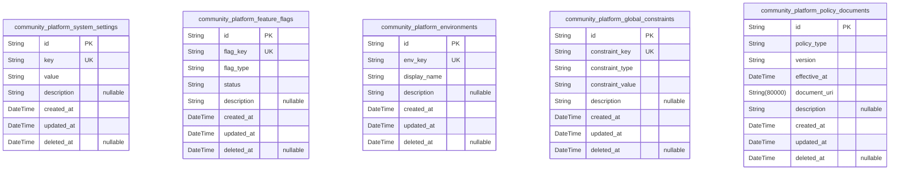
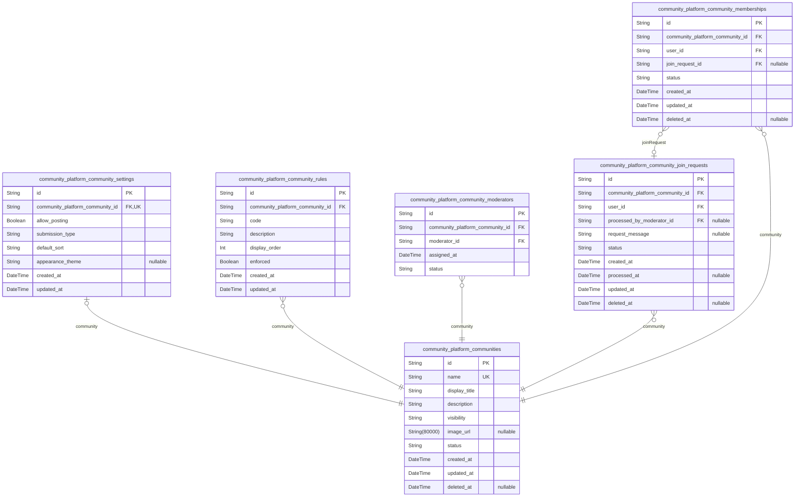
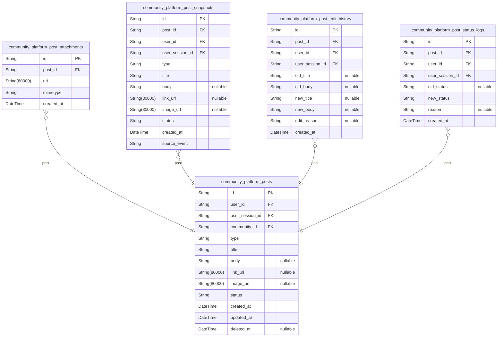
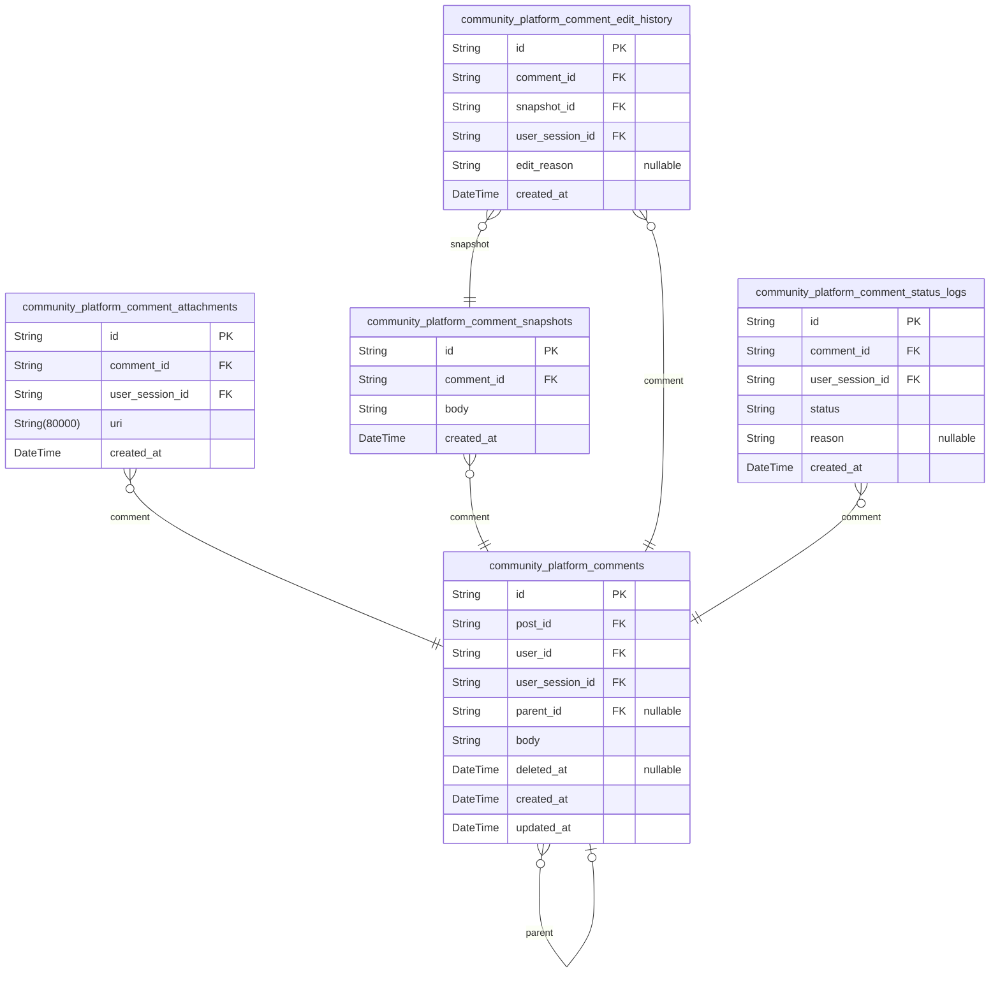
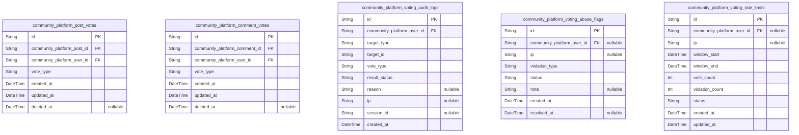
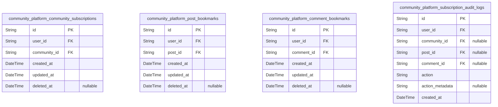
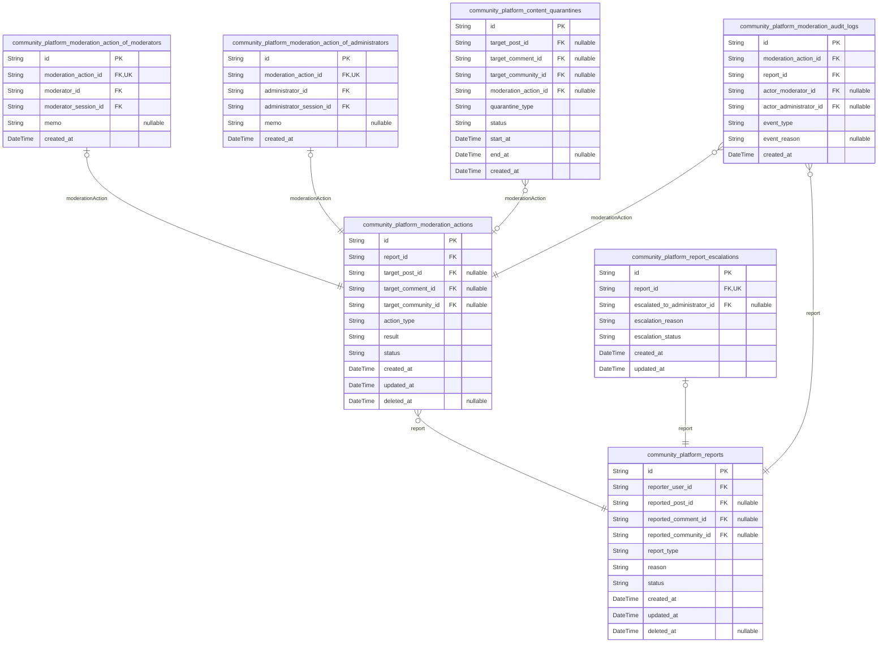
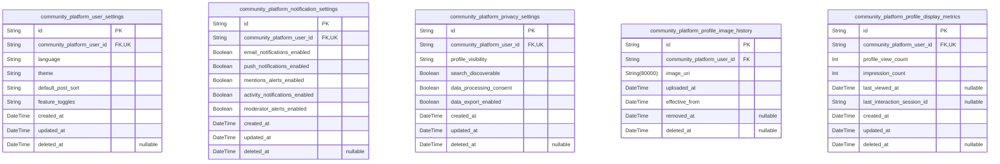
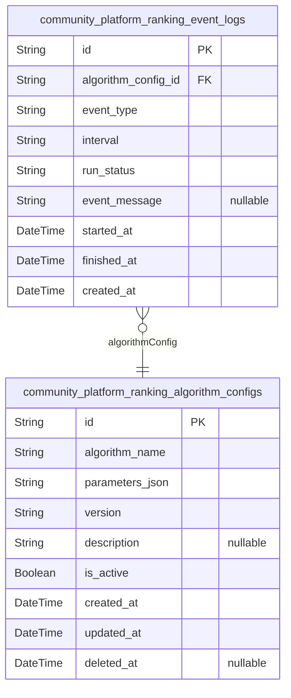
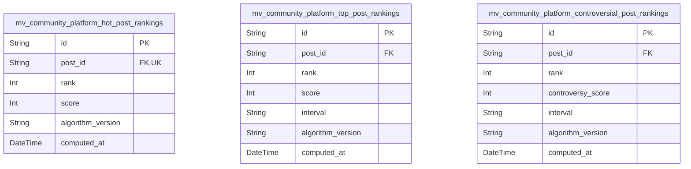

# Prisma Markdown

> Generated by [`prisma-markdown`](https://github.com/samchon/prisma-markdown)

- [Systematic](#systematic)
- [Actors](#actors)
- [Communities](#communities)
- [Posts](#posts)
- [Comments](#comments)
- [Voting](#voting)
- [Subscriptions](#subscriptions)
- [Moderation](#moderation)
- [Profile](#profile)
- [SortingRanking](#sortingranking)
- [default](#default)

## Systematic

```mermaid
erDiagram
"community_platform_system_settings" {
  String id PK
  String key UK
  String value
  String description "nullable"
  DateTime created_at
  DateTime updated_at
  DateTime deleted_at "nullable"
}
"community_platform_feature_flags" {
  String id PK
  String flag_key UK
  String flag_type
  String status
  String description "nullable"
  DateTime created_at
  DateTime updated_at
  DateTime deleted_at "nullable"
}
"community_platform_environments" {
  String id PK
  String env_key UK
  String display_name
  String description "nullable"
  DateTime created_at
  DateTime updated_at
  DateTime deleted_at "nullable"
}
"community_platform_global_constraints" {
  String id PK
  String constraint_key UK
  String constraint_type
  String constraint_value
  String description "nullable"
  DateTime created_at
  DateTime updated_at
  DateTime deleted_at "nullable"
}
"community_platform_policy_documents" {
  String id PK
  String policy_type
  String version
  DateTime effective_at
  String(80000) document_uri
  String description "nullable"
  DateTime created_at
  DateTime updated_at
  DateTime deleted_at "nullable"
}
```

### `community_platform_system_settings`

Platform-wide global system settings and primary configuration primitives.

Stores name/value pairs and various system-wide toggles required for
bootstrapping and runtime configuration. Enables both static and dynamic
system parameters such as default language, site title, registration
requirements, or operational thresholds. All system settings can be
modified through privileged admin interfaces, with modification
timestamps for audit trails. Soft deletion ensures reversibility and
audit compliance.

Properties as follows:

- `id`: Primary Key.
- `key`
  > Unique key identifying the system setting (e.g., 'site_title',
  > 'default_language', 'registration_open').
- `value`
  > Value of the setting, stored as string. Format/semantics vary by key;
  > callers must adhere to documented patterns.
- `description`
  > Optional explanatory description of the setting's business/technical
  > purpose.
- `created_at`: Timestamp when the setting was created.
- `updated_at`: Timestamp when the setting was last modified.
- `deleted_at`: Timestamp for soft deletion (if setting was removed or disabled).

### `community_platform_feature_flags`

Platform feature flag registry for progressive delivery, experimentation,
and conditional rollout.

Tracks the definition and state of each feature flag, supporting granular
on/off switching for system features. Enables staged rollouts,
experimentation (A/B testing), and quick disablement of risky
functionality. Flags are defined with type and current status, and can be
scheduled or manually toggled via system dashboards. Includes full audit
trail with soft deletion.

Properties as follows:

- `id`: Primary Key.
- `flag_key`
  > Globally unique key/name for the feature flag (e.g., 'registration_v2',
  > 'post_voting_experiment').
- `flag_type`
  > Type/category of feature flag ('boolean', 'percentage_rollout',
  > 'variant'); string-based for extensibility.
- `status`
  > Current feature flag status; typically 'enabled', 'disabled',
  > 'scheduled', or custom business states.
- `description`
  > Optional description of the flag's purpose, rollout plan, or intended
  > effect.
- `created_at`: Timestamp when the flag was registered.
- `updated_at`: Timestamp when the flag was last updated.
- `deleted_at`: Soft-deletion timestamp when flag is retired/removed.

### `community_platform_environments`

Enumerates system-level environments for deployment, configuration
scoping, and isolation.

Records each distinct operational environment supported by the platform
(e.g., 'production', 'staging', 'testing', custom business sandboxes).
Used for environment-aware configuration, deployment gating, and
audit/reporting purposes. Allows system settings and flag assignments to
be scoped for different environments. Tracks creation and update
timestamps, and is soft-deletable for environment retirement.

Properties as follows:

- `id`: Primary Key.
- `env_key`: Globally unique environment identifier (e.g., 'production', 'staging').
- `display_name`: Human-readable name of the environment (e.g., 'Production', 'QA Staging').
- `description`
  > Optional description outlining the environment's intended use,
  > boundaries, or special constraints.
- `created_at`: Timestamp for environment creation.
- `updated_at`: Timestamp for last modification.
- `deleted_at`: Timestamp for soft deletion or environment archival.

### `community_platform_global_constraints`

Global constraint definition and registry for policies, thresholds, and
allowed value enumerations applicable platform-wide.

Captures business or technical constraints applied at a global level,
such as maximum post size, minimum password length, legal value
enumerations, or regulatory limits. Each constraint is self-describing
and can be enforced at runtime by validation code or system middleware.
Constraints have types, values, and rationale, and are soft-deletable for
compliance auditing.

Properties as follows:

- `id`: Primary Key.
- `constraint_key`
  > Unique key/code for the global constraint (e.g., 'max_post_length',
  > 'min_pw_length').
- `constraint_type`: Type of constraint ('limit', 'enum', 'regex', etc.).
- `constraint_value`
  > String-encoded value or JSON for the constraint (e.g., 2000, ["A","B"],
  > regex).
- `description`: Detailed description of the constraint and enforcement logic.
- `created_at`: Creation timestamp.
- `updated_at`: Timestamp of last update.
- `deleted_at`: Soft delete timestamp.

### `community_platform_policy_documents`

Canonical record of platform legal, compliance, and policy documents
(e.g., Terms of Service, Privacy Policy).

Stores the authoritative versions and metadata of policy/legal documents
required for regulatory compliance and user governance. Each document is
tracked for type, effective date, and change/audit history. Past versions
are retained for legal traceability. Includes soft-deletion for document
retirement, with all revisions and update times recorded.

Properties as follows:

- `id`: Primary Key.
- `policy_type`
  > Document category/type (e.g., 'tos', 'privacy', 'cookie', custom legal
  > types).
- `version`: Version identifier string (e.g., 'v1.0', '2024-01').
- `effective_at`: Effective date/time for the policy version.
- `document_uri`: URI/location pointing to document contents (blob, CDN, or HTML page).
- `description`: Optional document summary or notes for users/moderators.
- `created_at`: Date policy document record was created.
- `updated_at`: Last update timestamp.
- `deleted_at`: Soft-deletion timestamp for old or retired policies.

## Actors

```mermaid
erDiagram
"community_platform_users" {
  String id PK
  String email UK
  String password_hash
  String status
  String business_status "nullable"
  DateTime created_at
  DateTime updated_at
  DateTime deleted_at "nullable"
}
"community_platform_user_sessions" {
  String id PK
  String community_platform_user_id FK
  String ip
  String href
  String referrer
  DateTime created_at
  DateTime expired_at "nullable"
}
"community_platform_user_profiles" {
  String id PK
  String community_platform_user_id FK,UK
  String display_username UK
  String(80000) avatar_uri "nullable"
  String bio "nullable"
  String status
  DateTime created_at
  DateTime updated_at
  DateTime deleted_at "nullable"
}
"community_platform_moderators" {
  String id PK
  String email UK
  String password_hash
  String status
  String business_status "nullable"
  DateTime created_at
  DateTime updated_at
  DateTime deleted_at "nullable"
}
"community_platform_moderator_sessions" {
  String id PK
  String community_platform_moderator_id FK
  String ip
  String href
  String referrer
  DateTime created_at
  DateTime expired_at "nullable"
}
"community_platform_moderator_profiles" {
  String id PK
  String community_platform_moderator_id FK,UK
  String display_username UK
  String(80000) avatar_uri "nullable"
  String bio "nullable"
  String status
  DateTime created_at
  DateTime updated_at
  DateTime deleted_at "nullable"
}
"community_platform_administrators" {
  String id PK
  String email UK
  String password_hash
  String status
  String business_status "nullable"
  DateTime created_at
  DateTime updated_at
  DateTime deleted_at "nullable"
}
"community_platform_administrator_sessions" {
  String id PK
  String community_platform_administrator_id FK
  String ip
  String href
  String referrer
  DateTime created_at
  DateTime expired_at "nullable"
}
"community_platform_administrator_profiles" {
  String id PK
  String community_platform_administrator_id FK,UK
  String display_username UK
  String(80000) avatar_uri "nullable"
  String bio "nullable"
  String status
  DateTime created_at
  DateTime updated_at
  DateTime deleted_at "nullable"
}
"community_platform_user_sessions" }o--|| "community_platform_users" : user
"community_platform_user_profiles" |o--|| "community_platform_users" : user
"community_platform_moderator_sessions" }o--|| "community_platform_moderators" : moderator
"community_platform_moderator_profiles" |o--|| "community_platform_moderators" : moderator
"community_platform_administrator_sessions" }o--|| "community_platform_administrators" : administrator
"community_platform_administrator_profiles" |o--|| "community_platform_administrators" : administrator
```

### `community_platform_users`

Registered platform users holding core identity and authentication
attributes.

Enforces unique email and manages login, lifecycle state, and access
through secure password hashes. Includes all fields necessary for
standard authentication and soft deletion, supporting user-driven
registration and account recovery. Users are primary actors for content
contribution, voting, and interaction across the platform.

Soft delete is supported to allow account deactivation and eventual
purging per privacy requirements.

Properties as follows:

- `id`: Primary key. Unique user identity.
- `email`
  > User's email address, uniquely identifying the user. Required for
  > registration and login.
- `password_hash`
  > Hashed representation of the user's password. Never stored in plaintext;
  > used for authentication.
- `status`: Current user status. Typical values: pending, active, deactivated, banned.
- `business_status`
  > Business workflow state for user (optional). May track onboarding stage
  > or policy review.
- `created_at`: Timestamp of account creation.
- `updated_at`: Timestamp of the last account update.
- `deleted_at`: Soft-deletion marker. Set if the user deactivates or requests deletion.

### `community_platform_user_sessions`

User session records for authentication audit tracking and active session
management.

Each session belongs to a user and records connection context including
IP, entry point, and referrer. Expiry is tracked for session
invalidation. Follows system session management standards for
traceability and compliance. No business fields beyond session metadata,
as per session table specification.

Properties as follows:

- `id`: Primary key for session entry.
- `community_platform_user_id`: Reference to the owning user. [community_platform_users.id](#community_platform_users).
- `ip`: IP address of session origin.
- `href`: Request URL at initiation of session.
- `referrer`: HTTP referrer URL at session start.
- `created_at`: Session creation timestamp.
- `expired_at`: Session expiration timestamp (if ended).

### `community_platform_user_profiles`

User profile entities storing public and customizable information for
each user.

Holds display username (unique within platform), avatar image URI, public
bio, and user-updatable metadata. Profile status and soft delete marker
allow privacy control and content personalization. Profiles support
search and lookup, facilitating engagement and discovery features.

Properties as follows:

- `id`: Primary key of the profile record.
- `community_platform_user_id`: User that owns this profile. [community_platform_users.id](#community_platform_users).
- `display_username`: Unique public display name for the user. Visible on profiles and search.
- `avatar_uri`: URL of the user's avatar image (optional).
- `bio`: Short biography or description entered by the user.
- `status`: Profile status: active, hidden, or suspended.
- `created_at`: Timestamp profile was created.
- `updated_at`: Timestamp of last profile update.
- `deleted_at`: Soft-delete marker for privacy removal or deactivation.

### `community_platform_moderators`

Platform community moderators with special local privileges.

Stores moderator credentials, authentication, lifecycle status, and
business-specific workflow fields for permission elevation and moderation
workflow tracking. Provides independent login separate from users and
supports global and scoped privileges. Soft delete allows safe
deactivation without losing moderation logs.

Properties as follows:

- `id`: Primary key for moderator entry.
- `email`: Moderator's platform account email. Unique for login and notification.
- `password_hash`: Moderator's authentication credential (hashed).
- `status`: Moderator account status—active, pending, suspended, or banned.
- `business_status`
  > Moderator role, workflow or assignment state (optional, for business
  > support).
- `created_at`: Date and time moderator account was created.
- `updated_at`: Date and time of last update.
- `deleted_at`: Soft-deleted status, set if deactivated.

### `community_platform_moderator_sessions`

Session table for community moderators tracking all authentication and
session metadata.

Each record logs session for a moderator including IP, access URLs, and
stateful expiry. Used for audit trails and active session checks in
moderation context. No auxiliary fields beyond session standard.

Properties as follows:

- `id`: Primary key for the session record.
- `community_platform_moderator_id`
  > Owning moderator for the session. {@link
  > community_platform_moderators.id}.
- `ip`: Origin IP address of moderator's login.
- `href`: URL at login/session initiation.
- `referrer`: Referring URL at start of session.
- `created_at`: When the session was opened.
- `expired_at`: Session closure timestamp (nullable until expired or forcibly closed).

### `community_platform_moderator_profiles`

Moderator profile records with public, display, and system-managed
moderator information.

Contains moderator-specific display username, optional avatar, and
extended public bio. Profile records support status tracking and
soft-deletion. Enables community discovery, moderator lookup, and
personalization for moderation actors with full audit history of profile
changes.

Properties as follows:

- `id`: Moderator profile unique key.
- `community_platform_moderator_id`
  > FK for moderator this profile describes. {@link
  > community_platform_moderators.id}.
- `display_username`
  > Unique username for moderator profile, shown in admin tools and community
  > listings.
- `avatar_uri`: Moderator profile image URL if set.
- `bio`: Description or extra info published by moderator.
- `status`: Moderator profile status: visible, hidden, or flagged.
- `created_at`: When this moderator profile was created.
- `updated_at`: When last profile update occurred.
- `deleted_at`: Profile is deleted, if true.

### `community_platform_administrators`

Platform administrators who possess system-wide authority and perform
global site operations.

Contains authentication credentials, access status, workflow support for
distinguishing roles or levels of system access, and lifecycle state
tracking. Administrators are discrete actors with explicit account
management. Soft deletion supports reversible deactivation and legal
retention.

Properties as follows:

- `id`: System administrator account key.
- `email`: Email address for account and notification. Must remain unique per admin.
- `password_hash`: Authentication credential (hash, never store raw passwords).
- `status`: Administrator status: active, suspended, or terminated.
- `business_status`: Optional system workflow field for admin roles, onboarding, or discipline.
- `created_at`: When account was created.
- `updated_at`: Last administrator update timestamp.
- `deleted_at`: Soft deletion for reversible admin removal.

### `community_platform_administrator_sessions`

Session records for platform administrators, supporting full system
activity audit and session management.

Logs session start, context, request route, and expiry for admins.
Attachments are always to administrator accounts. Used for compliance and
audit requirements with session management policies. Adheres strictly to
system session design specification.

Properties as follows:

- `id`: Administrator session primary key.
- `community_platform_administrator_id`
  > Administrator controlling this session. {@link
  > community_platform_administrators.id}.
- `ip`: IP address of session origin.
- `href`: Initial URL at session creation.
- `referrer`: Referrer on session init.
- `created_at`: Session creation timestamp.
- `expired_at`: Session end timestamp (nullable if still valid).

### `community_platform_administrator_profiles`

Administrator profile table storing display and system-managed identity
fields for admin accounts.

Profile includes public display name (globally unique), optional profile
(avatar) image, extended biography, and visibility state. Allows safe
soft-deletion and status tracking. Supports admin discovery, global admin
contact, and personalized interactions for administrators.

Properties as follows:

- `id`: Primary key for administrator profile.
- `community_platform_administrator_id`
  > Administrator for whom this profile belongs. {@link
  > community_platform_administrators.id}.
- `display_username`
  > Unique display name for administrator, visible in compliance and admin
  > directories.
- `avatar_uri`: Profile image URI (optional, for display purposes).
- `bio`: Public or professional biography for the administrator.
- `status`: Admin profile status: public, hidden, or retired.
- `created_at`: Time the profile was created.
- `updated_at`: When the profile was last modified.
- `deleted_at`: Soft delete for admin profile removal.

## Communities

```mermaid
erDiagram
"community_platform_communities" {
  String id PK
  String name UK
  String display_title
  String description
  String visibility
  String(80000) image_url "nullable"
  String status
  DateTime created_at
  DateTime updated_at
  DateTime deleted_at "nullable"
}
"community_platform_community_settings" {
  String id PK
  String community_platform_community_id FK,UK
  Boolean allow_posting
  String submission_type
  String default_sort
  String appearance_theme "nullable"
  DateTime created_at
  DateTime updated_at
}
"community_platform_community_rules" {
  String id PK
  String community_platform_community_id FK
  String code
  String description
  Int display_order
  Boolean enforced
  DateTime created_at
  DateTime updated_at
}
"community_platform_community_moderators" {
  String id PK
  String community_platform_community_id FK
  String moderator_id FK
  DateTime assigned_at
  String status
}
"community_platform_community_join_requests" {
  String id PK
  String community_platform_community_id FK
  String user_id FK
  String processed_by_moderator_id FK "nullable"
  String request_message "nullable"
  String status
  DateTime created_at
  DateTime processed_at "nullable"
  DateTime updated_at
  DateTime deleted_at "nullable"
}
"community_platform_community_memberships" {
  String id PK
  String community_platform_community_id FK
  String user_id FK
  String join_request_id FK "nullable"
  String status
  DateTime created_at
  DateTime updated_at
  DateTime deleted_at "nullable"
}
"community_platform_community_settings" |o--|| "community_platform_communities" : community
"community_platform_community_rules" }o--|| "community_platform_communities" : community
"community_platform_community_moderators" }o--|| "community_platform_communities" : community
"community_platform_community_join_requests" }o--|| "community_platform_communities" : community
"community_platform_community_memberships" }o--|| "community_platform_communities" : community
"community_platform_community_memberships" }o--o| "community_platform_community_join_requests" : joinRequest
```

### `community_platform_communities`

Represents a distinct user-created community (subreddit) on the platform.

Contains business identity fields such as name, display title,
description, creation date, visibility settings, and status. Reference
point for all community management, posts, and moderator assignment.

Links to settings, rules, moderators, join requests, and memberships.
Soft deletes supported for audit and recovery.

Properties as follows:

- `id`: Primary key.
- `name`
  > Unique community URL slug (case-insensitive, 3-30 chars, enforced
  > business validation).
- `display_title`: Display name/title shown to users (e.g., 'Photography Enthusiasts').
- `description`: Longform community description and purpose, displayed on community page.
- `visibility`
  > Type of community: public, private, or invite-only. Used to control
  > discoverability/membership flows.
- `image_url`: Optional community logo or image URI.
- `status`: Operational status: active, archived, banned, or pending approval.
- `created_at`: Time community was created.
- `updated_at`: Time of last metadata update.
- `deleted_at`: Soft delete timestamp (set if community removed or pending removal).

### `community_platform_community_settings`

Holds configuration details and non-behavioral settings for each community.

Settings may include join policies, submission restrictions, default
sort, and appearance flags, managed independently from core metadata for
normalization. Linked 1:1 to the community with matching lifecycle;
updated only by moderators/owners via community APIs. Not independently
managed by users.

Properties as follows:

- `id`: Primary key.
- `community_platform_community_id`
  > Reference to the base community. {@link
  > community_platform_communities.id}.
- `allow_posting`: Whether member posting is allowed (true), or moderators-only (false).
- `submission_type`
  > Allowed post types: text, link, image, or mixed (configured per
  > community).
- `default_sort`: Preferred default sort order (e.g., 'hot', 'new', 'top').
- `appearance_theme`: Visual theme or color preference (if set by community).
- `created_at`: Time settings record was created.
- `updated_at`: Time settings were last updated.

### `community_platform_community_rules`

Defines individual moderation or content rules for a given community.

Each rule describes permitted/prohibited behavior (e.g., no spam,
topic-only posts) and may be ordered for display. Linked to a community
and only manageable by assigned moderators. Provides a normalized ruleset
for structured enforcement at runtime.

Properties as follows:

- `id`: Primary key.
- `community_platform_community_id`
  > Reference to the rule's parent community. {@link
  > community_platform_communities.id}.
- `code`: Short machine-friendly rule code/identifier (e.g., 'NO_SPAM').
- `description`
  > Full business rule, user-facing prose. (Displayed in community
  > sidebar/settings).
- `display_order`: Display order (starting at 1). Controls human-readable sorting in UI.
- `enforced`: Whether this rule is currently enforced (runtime toggle).
- `created_at`: Time the rule record was created.
- `updated_at`: Time of last update.

### `community_platform_community_moderators`

Junction table assigning moderators (users with moderation authority) to
communities.

Implements a normalized many-to-many relationship between communities and
users (moderator role logic implemented in another component.) Each
record links one user moderator to one community, with assignment time
and optional status fields. Not independently created by end
users—managed via community/administration flows. Supports audit and
recovery.

Properties as follows:

- `id`: Primary key.
- `community_platform_community_id`
  > Community to which the moderator is assigned. {@link
  > community_platform_communities.id}.
- `moderator_id`
  > User who is a moderator (see community_platform_moderators, already in
  > Actors component).
- `assigned_at`: When this user was assigned moderation authority for this community.
- `status`: Current status: active, suspended, pending, or removed.

### `community_platform_community_join_requests`

Represents a user's application/request to join an invite-only or private
community.

Created when a user attempts to join a restricted community.
Workflow-driven: pending, approved, rejected, or expired. Allows explicit
business audit for private/invite-only access control. Linked to the
requesting user and relevant community. Trackable for rate limits and
community moderation logs. Core part of membership access in non-public
communities.

Properties as follows:

- `id`: Primary key.
- `community_platform_community_id`: Target community being joined. [community_platform_communities.id](#community_platform_communities).
- `user_id`: User requesting to join. (References base users table)
- `processed_by_moderator_id`
  > Moderator who processed this join request (nullable: only set if
  > moderator handled the request; reference in Actors schema).
- `request_message`: Optional message supplied by the user when requesting to join.
- `status`: Current status of join request: pending, approved, rejected, or expired.
- `created_at`: Time when join request was created.
- `processed_at`: Timestamp when moderator action taken (null if pending).
- `updated_at`: Last status update timestamp.
- `deleted_at`: Soft delete timestamp (if rescinded or moderation undo).

### `community_platform_community_memberships`

Tracks membership (subscription or joining) of users to communities.

Records when a user becomes a member—either via open join, invite, or
approved join request. Contains status and audit info. Central for
permission checks (posting/commenting) and feed personalization. Linked
to the community, user, and, if relevant, the join request that resulted
in the membership. Soft delete allows audit and recovery. Managed by user
action or moderators/admins.

Properties as follows:

- `id`: Primary key.
- `community_platform_community_id`
  > Community to which the user is a member. {@link
  > community_platform_communities.id}.
- `user_id`: Member user (references already-existing users table).
- `join_request_id`
  > (Nullable) Join request record that, if approved, led to this membership
  > (only for invite/private communities).
- `status`
  > Status of the membership: active, left, banned, suspended, pending, or
  > archived.
- `created_at`: Time when membership was created.
- `updated_at`: Last time membership was updated.
- `deleted_at`
  > Soft delete timestamp (when membership is removed or bypassed business
  > logic).

## Posts

```mermaid
erDiagram
"community_platform_posts" {
  String id PK
  String user_id FK
  String user_session_id FK
  String community_id FK
  String type
  String title
  String body "nullable"
  String(80000) link_url "nullable"
  String(80000) image_url "nullable"
  String status
  DateTime created_at
  DateTime updated_at
  DateTime deleted_at "nullable"
}
"community_platform_post_attachments" {
  String id PK
  String post_id FK
  String(80000) uri
  String mimetype
  DateTime created_at
}
"community_platform_post_snapshots" {
  String id PK
  String post_id FK
  String user_id FK
  String user_session_id FK
  String type
  String title
  String body "nullable"
  String(80000) link_url "nullable"
  String(80000) image_url "nullable"
  String status
  DateTime created_at
  String source_event
}
"community_platform_post_edit_history" {
  String id PK
  String post_id FK
  String user_id FK
  String user_session_id FK
  String old_title "nullable"
  String old_body "nullable"
  String new_title "nullable"
  String new_body "nullable"
  String edit_reason "nullable"
  DateTime created_at
}
"community_platform_post_status_logs" {
  String id PK
  String post_id FK
  String user_id FK
  String user_session_id FK
  String old_status "nullable"
  String new_status
  String reason "nullable"
  DateTime created_at
}
"community_platform_post_attachments" }o--|| "community_platform_posts" : post
"community_platform_post_snapshots" }o--|| "community_platform_posts" : post
"community_platform_post_edit_history" }o--|| "community_platform_posts" : post
"community_platform_post_status_logs" }o--|| "community_platform_posts" : post
```

### `community_platform_posts`

Primary business entity for all community platform posts, regardless of
type (text, link, image).

Tracks user-generated content across communities, storing all metadata
required for post display, sorting, voting, and moderation. Each post
belongs to a single community and is created by one authenticated user
via their session. The table supports multiple post types, status flags
for workflow and moderation (published, pending, removed), title, body,
and image/link URI as applicable. Updated_at and deleted_at enable audit,
edit, and soft delete scenarios. All attachment references and versioning
are normalized in dedicated support tables.

Properties as follows:

- `id`: Primary Key.
- `user_id`: Creator of the post. References [community_platform_users.id](#community_platform_users).
- `user_session_id`
  > Authoring user session for audit. References {@link
  > community_platform_user_sessions.id}.
- `community_id`
  > Community where the post is published. References {@link
  > community_platform_communities.id}.
- `type`
  > Type of post: text, link, or image. Used for UI rendering and content
  > moderation.
- `title`: Title of the post. Required for display, searching, and sorting.
- `body`: Body content of the post (text posts required, optional for link/image).
- `link_url`: External link URI. Only set for link-type posts.
- `image_url`: Image URL when post type is image. Always null otherwise.
- `status`
  > Current workflow or moderation status. Values: published, pending,
  > removed, etc.
- `created_at`: Timestamp when post was created.
- `updated_at`: Timestamp of last update for audit and edit tracking.
- `deleted_at`
  > Soft delete timestamp. If set, the post is hidden/archived but not
  > physically deleted.

### `community_platform_post_attachments`

Attachments associated with posts, such as images or files. Normalized
for 1:N post-to-file relation.

Each record links an uploaded file or image to a single post for
extensibility (supporting multiple images/files per post in the future).
Attachment entries reference the parent post and store relevant metadata,
including the URI for access and mimetype for media handling. Attachments
cannot exist without a post and are managed only as part of post
lifecycle or moderation.

Properties as follows:

- `id`: Primary Key.
- `post_id`
  > Parent post for this attachment. References {@link
  > community_platform_posts.id}.
- `uri`: Public URI to access the attachment (file/image/media).
- `mimetype`
  > Mime type of the attachment content (e.g., image/jpeg, image/png,
  > application/pdf, etc.).
- `created_at`: Timestamp when the attachment was uploaded.

### `community_platform_post_snapshots`

Immutable, append-only historical snapshots of posts for audit and
compliance.

Records a point-in-time state of a post whenever a significant change
occurs (edit, status update, moderation event). Includes all post fields
and key relations, preserving the complete state for audit, rollback, or
legal review. Snapshots cannot be modified or deleted and support
regulatory traceability. Each snapshot references the source post and the
user/session that triggered the event.

Properties as follows:

- `id`: Primary Key.
- `post_id`: Source post. References [community_platform_posts.id](#community_platform_posts).
- `user_id`
  > User who triggered the snapshot event. References {@link
  > community_platform_users.id}.
- `user_session_id`
  > Session in which the snapshot event occurred. References {@link
  > community_platform_user_sessions.id}.
- `type`: Current post type at snapshot: text, link, image.
- `title`: Post title at snapshot time.
- `body`: Body content at snapshot time.
- `link_url`: Link URI at snapshot time, if applicable.
- `image_url`: Image URI at snapshot time, if applicable.
- `status`: Status of the post at snapshot time.
- `created_at`: When the snapshot was created (event time).
- `source_event`
  > Label for the event that triggered the snapshot (created, edited,
  > moderated, etc.).

### `community_platform_post_edit_history`

Edit history records for posts, supporting undo UI, audit, and moderation
workflows.

Each record documents a discrete user-initiated or moderator-initiated
edit, capturing the before/after context for post content. Enables full
traceability of changes, including gradual title, body, or attachment
updates. For each edit, stores relevant user, session, and time
information. Used for UI editing flows and compliance reporting.

Properties as follows:

- `id`: Primary Key.
- `post_id`: Edited post. References [community_platform_posts.id](#community_platform_posts).
- `user_id`
  > User who performed the edit. References {@link
  > community_platform_users.id}.
- `user_session_id`
  > Session in which the edit occurred. References {@link
  > community_platform_user_sessions.id}.
- `old_title`: Previous post title before edit, if changed.
- `old_body`: Previous post body before edit, if changed.
- `new_title`: New post title after edit, if changed.
- `new_body`: New post body after edit, if changed.
- `edit_reason`: Optional reason for the edit entered by user or moderator.
- `created_at`: Timestamp when the edit event was recorded.

### `community_platform_post_status_logs`

Logs of all post status change and moderation actions for workflow auditing.

Each record represents an atomic event in the post lifecycle, such as
published, flagged, pending, removed, or restored. Status changes track
which moderator, user, or automated process caused the event, supporting
audit trails and UI history display. All status changes are
chronologically ordered and refer to user/session for actor attribution.

Properties as follows:

- `id`: Primary Key.
- `post_id`: Target post. References [community_platform_posts.id](#community_platform_posts).
- `user_id`
  > Actor (user or moderator) triggering the status change. References {@link
  > community_platform_users.id}.
- `user_session_id`
  > Session in which the status event occurred. References {@link
  > community_platform_user_sessions.id}.
- `old_status`: Status prior to this change event.
- `new_status`: Status after this change event.
- `reason`: Business or moderation reason for status change.
- `created_at`: Timestamp when the status event was recorded.

## Comments

```mermaid
erDiagram
"community_platform_comments" {
  String id PK
  String post_id FK
  String user_id FK
  String user_session_id FK
  String parent_id FK "nullable"
  String body
  DateTime deleted_at "nullable"
  DateTime created_at
  DateTime updated_at
}
"community_platform_comment_attachments" {
  String id PK
  String comment_id FK
  String user_session_id FK
  String(80000) uri
  DateTime created_at
}
"community_platform_comment_snapshots" {
  String id PK
  String comment_id FK
  String body
  DateTime created_at
}
"community_platform_comment_edit_history" {
  String id PK
  String comment_id FK
  String snapshot_id FK
  String user_session_id FK
  String edit_reason "nullable"
  DateTime created_at
}
"community_platform_comment_status_logs" {
  String id PK
  String comment_id FK
  String user_session_id FK
  String status
  String reason "nullable"
  DateTime created_at
}
"community_platform_comments" }o--o| "community_platform_comments" : parent
"community_platform_comment_attachments" }o--|| "community_platform_comments" : comment
"community_platform_comment_snapshots" }o--|| "community_platform_comments" : comment
"community_platform_comment_edit_history" }o--|| "community_platform_comments" : comment
"community_platform_comment_edit_history" }o--|| "community_platform_comment_snapshots" : snapshot
"community_platform_comment_status_logs" }o--|| "community_platform_comments" : comment
```

### `community_platform_comments`

Top-level and nested comment entities for all user-created discussions
below posts or within communities.

Supports hierarchical, tree-structured threaded replies via a
self-referencing parent_id foreign key. Each comment is uniquely
associated with a specific post and owned by a platform user and session
for strong attribution and auditability. Comments may be attached to
either a post or, via parent_id, to another comment, allowing for
unlimited depth of nesting within permitted business-configurable limits.
Soft deletion is implemented to preserve conversation flow while hiding
deleted content from non-moderator views. All comment creation, updates,
and deletions are recorded by linking to comment snapshots and status
logs. Comments support full-text search over their body content.
Attachments, edit history, and moderation events are managed by
subsidiary tables.

This table forms the core of threaded discussions for the community
platform and is the primary reference for all comment-related subsidiary
and snapshot data.

Properties as follows:

- `id`: Primary Key.
- `post_id`
  > Reference to the parent post this comment belongs to. {@link
  > community_platform_posts.id}.
- `user_id`
  > The platform user who authored this comment. {@link
  > community_platform_users.id}.
- `user_session_id`
  > Session context in which the user created the comment. {@link
  > community_platform_user_sessions.id}.
- `parent_id`
  > Self-referential to support nesting/threading of comment replies; null
  > for top-level comments. [community_platform_comments.id](#community_platform_comments).
- `body`
  > Main comment body text. Supports full Markdown formatting. 1–2000
  > characters per business rules.
- `deleted_at`
  > Timestamp indicating soft deletion of this comment; null if comment is
  > active.
- `created_at`: Timestamp of initial comment creation in UTC.
- `updated_at`: Timestamp of most recent comment edit in UTC.

### `community_platform_comment_attachments`

Attachment records linked directly to comments, supporting images, files,
or links embedded within user replies.

Each attachment is associated with a single comment, and all attachments
for a comment are managed as a child collection. Attachment files are
stored externally (e.g., object storage) with only the metadata and URI
references saved in this table. Maintains referential integrity with both
the comment and the uploading user session for audit. No direct user CRUD
endpoints; all operations are managed through the parent comment entity.

This model enables seamless expansion of content formats in threaded
discussions and preserves a normalized, scalable approach to media
linking within comments.

Properties as follows:

- `id`: Primary Key.
- `comment_id`
  > Foreign key referencing the parent comment for this attachment. {@link
  > community_platform_comments.id}.
- `user_session_id`
  > Session through which the attachment was uploaded. {@link
  > community_platform_user_sessions.id}.
- `uri`
  > The external URI of the linked file, image, or resource for the
  > attachment.
- `created_at`: Timestamp when the attachment was created and linked to the comment.

### `community_platform_comment_snapshots`

Snapshot records preserving point-in-time, historical states of comments
for audit, moderation, and rollback.

Each snapshot stores a complete immutable image of a comment's body and
all critical fields at the time of creation, allowing administrators,
moderators, and the system to reconstruct any past comment version.
Snapshots are created on every initial creation and whenever a comment
undergoes an edit or deletion with content change. Snapshots are
append-only and never updated or deleted. This model supports compliance,
transparency, and user appeal/audit workflows.

Snapshots are typically referenced by the core comment or by edit/status
log models who link to the corresponding snapshot for display and audit
operations.

Properties as follows:

- `id`: Primary Key.
- `comment_id`
  > Foreign key to the comment this snapshot captures. {@link
  > community_platform_comments.id}.
- `body`: The full comment body text as of the snapshot creation time.
- `created_at`: UTC timestamp recording when this snapshot was saved.

### `community_platform_comment_edit_history`

Edit history records, logging all user-driven or moderation-initiated
modifications to comments.

Each record references the affected comment, the snapshot (capturing the
edited version), and the actor session performing the modification. The
table tracks the chronological sequence of edits with timestamps,
supporting end-to-end audit, rollback, and user transparency. All history
entries are subordinate to their respective comments.

No direct user endpoints; history is included in moderation tools, user
revision lists, and appeals processes for restoration or audit review.

Properties as follows:

- `id`: Primary Key.
- `comment_id`
  > Foreign key for the comment whose edit is being tracked. {@link
  > community_platform_comments.id}.
- `snapshot_id`
  > Managed link to the snapshot capturing the new version. {@link
  > community_platform_comment_snapshots.id}.
- `user_session_id`
  > Session context of the user or moderator performing the edit. {@link
  > community_platform_user_sessions.id}.
- `edit_reason`
  > Reason for the edit, e.g., typo correction, content update, required by
  > moderator. Nullable if no reason specified.
- `created_at`: Timestamp when this edit was recorded.

### `community_platform_comment_status_logs`

Status log entries tracking moderation actions (removal, restoration,
quarantine, etc.) and soft-deletion-related state transitions for
comments.

Chronologically records all user, moderator, or system-driven status
changes with timestamps, linking each event to a comment, the acting user
session, and optionally the moderator or administrator session for
auditability. Reason and status fields provide context for each action,
supporting user appeal, moderation transparency, and compliance audits.
Retained as a permanent, immutable record for every status transition.

This table supports complete recovery of comment lifecycle, including
deletion/restore and system moderation interventions.

Properties as follows:

- `id`: Primary Key.
- `comment_id`
  > Foreign key for the comment whose status or moderation event is being
  > logged. [community_platform_comments.id](#community_platform_comments).
- `user_session_id`
  > Session that performed the action (user or moderator/administrator).
  > [community_platform_user_sessions.id](#community_platform_user_sessions).
- `status`
  > The new lifecycle state after this event. E.g., 'active', 'soft_deleted',
  > 'restored', 'quarantined', 'removed', per business rules.
- `reason`
  > Optional freeform reason for this action, such as moderation note or
  > user-provided explanation.
- `created_at`: Timestamp when this log entry was added.

## Voting

```mermaid
erDiagram
"community_platform_post_votes" {
  String id PK
  String community_platform_post_id FK
  String community_platform_user_id FK
  String vote_type
  DateTime created_at
  DateTime updated_at
  DateTime deleted_at "nullable"
}
"community_platform_comment_votes" {
  String id PK
  String community_platform_comment_id FK
  String community_platform_user_id FK
  String vote_type
  DateTime created_at
  DateTime updated_at
  DateTime deleted_at "nullable"
}
"community_platform_voting_audit_logs" {
  String id PK
  String community_platform_user_id FK
  String target_type
  String target_id
  String vote_type
  String result_status
  String reason "nullable"
  String ip "nullable"
  String session_id "nullable"
  DateTime created_at
}
"community_platform_voting_abuse_flags" {
  String id PK
  String community_platform_user_id FK "nullable"
  String ip "nullable"
  String violation_type
  String status
  String note "nullable"
  DateTime created_at
  DateTime resolved_at "nullable"
}
"community_platform_voting_rate_limits" {
  String id PK
  String community_platform_user_id FK "nullable"
  String ip "nullable"
  DateTime window_start
  DateTime window_end
  Int vote_count
  Int violation_count
  String status
  DateTime created_at
  DateTime updated_at
}
```

### `community_platform_post_votes`

Represents individual user votes on posts, supporting upvotes, downvotes,
and vote removals.

Each record tracks a user's voting action on a post, enforces one active
vote per (user, post) combination, and establishes referential integrity
to both user and post entities. Supports voting history, anti-abuse
validation, and fast post score calculation. All changes are append-only
for auditability.

Properties as follows:

- `id`: Primary Key.
- `community_platform_post_id`: Post being voted on. [community_platform_posts.id](#community_platform_posts).
- `community_platform_user_id`: User casting the vote. [community_platform_users.id](#community_platform_users).
- `vote_type`
  > Type of vote: 'up' for upvote, 'down' for downvote. Removal of vote
  > reflected by deleted_at.
- `created_at`: Time when the vote was cast.
- `updated_at`: Time when the vote was last updated (for vote change or audit).
- `deleted_at`: Soft deletion timestamp (indicates vote removed or invalidated).

### `community_platform_comment_votes`

Stores votes by users on comments, capturing both upvotes and downvotes
for each comment.

Designed to enforce business rules of one vote per (user, comment),
supporting reversals and full audit trails. Provides basis for comment
ranking, controversial sorting, and karma calculation. Enforces
referential integrity with user and comment entities.

Properties as follows:

- `id`: Primary Key.
- `community_platform_comment_id`: Comment being voted on. [community_platform_comments.id](#community_platform_comments).
- `community_platform_user_id`: User casting the vote. [community_platform_users.id](#community_platform_users).
- `vote_type`
  > Type of vote: 'up' for upvote, 'down' for downvote. Removal of vote is
  > tracked via deleted_at.
- `created_at`: Timestamp when the vote was created.
- `updated_at`: Timestamp when the vote was last modified (for reversals/audit).
- `deleted_at`: Soft deletion timestamp (if the vote is removed/retracted).

### `community_platform_voting_audit_logs`

Voting audit trail for all voting actions across posts and comments.

Records every voting attempt (whether accepted, rejected, or reversed),
linked to user, target entity (post or comment), vote type, timestamp,
outcome, and originating IP/session context. Used for regulatory
reporting, abuse investigation, and vote restoration. Not directly
editable by users or moderators except by system policy.

Properties as follows:

- `id`: Primary Key.
- `community_platform_user_id`: User triggering the vote event. [community_platform_users.id](#community_platform_users).
- `target_type`: Type of target: 'post' or 'comment'.
- `target_id`
  > ID of the post or comment being voted on (references external, not
  > locally FK-ed).
- `vote_type`: The attempted vote type: 'up', 'down', 'remove'.
- `result_status`: Outcome status: 'accepted', 'rejected', 'reversed', 'rate_limited', etc.
- `reason`
  > Detailed reason if rejected/abandoned (e.g., duplicate, rate limit,
  > permission denied).
- `ip`: IP address the vote originated from.
- `session_id`: Session associated with the voting event if available.
- `created_at`: Timestamp when the audit log was created.

### `community_platform_voting_abuse_flags`

Tracks users or IPs flagged for possible or confirmed voting abuse,
including vote brigading, excessive rate, or other policy violations.

Supports moderation and algorithmic mitigation by listing offending
users, IPs, violation types, and resolution status. Used to suppress
malicious influence and enforce platform fairness. Updated automatically
by abuse detection subsystems, optionally by moderation action.

Properties as follows:

- `id`: Primary Key.
- `community_platform_user_id`: User ID flagged for abuse. May be null if flag is IP-only.
- `ip`: IP address flagged for abuse, if known.
- `violation_type`
  > Type of voting abuse detected, e.g., 'brigading', 'automation',
  > 'rate_limit', etc.
- `status`: Flag/status: 'open', 'resolved', 'pending_review', etc.
- `note`: Human/machine-generated notes about the violation context.
- `created_at`: When the flag was recorded.
- `resolved_at`: Timestamp when resolved (if applicable).

### `community_platform_voting_rate_limits`

Tracks voting rate limits, cooldowns, and enforcement for each user or IP.

Establishes current and historical voting activity to prevent abuse,
record violation windows, and enforce business rate limits. Data is
linked to user and/or tracked by IP. Used automatically by backend during
validation, not user-visible.

Properties as follows:

- `id`: Primary Key.
- `community_platform_user_id`: The user under rate monitoring (may be null for anonymous/IP limit).
- `ip`: IP address under rate limiting.
- `window_start`: Start of the rate limit window.
- `window_end`: End of the rate limit window.
- `vote_count`: Number of votes attempted (in window).
- `violation_count`: Times rate limit exceeded (for escalation).
- `status`: Current status (e.g., 'active', 'blocked', 'cooldown').
- `created_at`: Timestamp of record creation.
- `updated_at`: Timestamp of last update.

## Subscriptions

```mermaid
erDiagram
"community_platform_community_subscriptions" {
  String id PK
  String user_id FK
  String community_id FK
  DateTime created_at
  DateTime updated_at
  DateTime deleted_at "nullable"
}
"community_platform_post_bookmarks" {
  String id PK
  String user_id FK
  String post_id FK
  DateTime created_at
  DateTime updated_at
  DateTime deleted_at "nullable"
}
"community_platform_comment_bookmarks" {
  String id PK
  String user_id FK
  String comment_id FK
  DateTime created_at
  DateTime updated_at
  DateTime deleted_at "nullable"
}
"community_platform_subscription_audit_logs" {
  String id PK
  String user_id FK
  String community_id FK "nullable"
  String post_id FK "nullable"
  String comment_id FK "nullable"
  String action
  String action_metadata "nullable"
  DateTime created_at
}
```

### `community_platform_community_subscriptions`

Represents associations between users and communities that they follow or
subscribe to for personalized content feeds.

This table records each user's active subscription to a community,
supporting fast lookups for personalized feeds and notification delivery.
Each user can subscribe to multiple communities, and vice versa,
enforcing one active subscription per (user, community) pair at a time.

Soft deletions are permitted to provide undo/redo capabilities and audit
trails, without fully removing the subscription entry for legal or
transparency purposes.
Subscriptions are distinct from community memberships, representing only
follower/read-only relationships rather than participation or moderation
rights.

Properties as follows:

- `id`: Primary key. Unique identifier for this community subscription record.
- `user_id`
  > User who has subscribed to the community. References {@link
  > community_platform_users.id}.
- `community_id`
  > Target community to which the user is subscribed. References {@link
  > community_platform_communities.id}.
- `created_at`: Subscription creation timestamp for auditing and ordering.
- `updated_at`: Timestamp of the most recent update to the subscription record.
- `deleted_at`
  > Soft delete marker for undo/redo and audit trail; null if active, set
  > only if unsubscribed.

### `community_platform_post_bookmarks`

Bookmarks created by users for posts they wish to easily find or revisit
later.

Each record represents a user's explicit bookmark on a post. This is
entirely distinct from votes or comments and purely enables personal
content organization features. The composite unique constraint prevents
duplicate bookmarks for a given (user, post) pair.

Soft delete supports undo/redo workflows, allowing users to temporarily
remove and later restore bookmarks. Bookmarks do not create nullable or
denormalized fields in the posts table.

Properties as follows:

- `id`: Primary key. Unique identifier for this bookmark record.
- `user_id`
  > User who created the bookmark. References {@link
  > community_platform_users.id}.
- `post_id`
  > Post which is bookmarked by the user. References {@link
  > community_platform_posts.id}.
- `created_at`: Bookmark creation timestamp for ordering and audit.
- `updated_at`: Timestamp of the most recent modification to the bookmark record.
- `deleted_at`
  > Soft delete field for undo/redo and audit trail; null if bookmark is
  > active.

### `community_platform_comment_bookmarks`

User bookmarks for comments, enabling personal quick access and
organization of specific discussions.

This table allows users to bookmark comments for easy retrieval,
navigation, and later review. Each bookmark is an independent entity,
with a composite uniqueness constraint preventing duplicate comment
bookmarks by the same user.

Soft delete is included to allow undo/redo features and transparent
action logs. No data is stored in the comments table, keeping the main
entity fully normalized.

Properties as follows:

- `id`: Primary key. Unique identifier for this comment bookmark.
- `user_id`
  > User who created the comment bookmark. References {@link
  > community_platform_users.id}.
- `comment_id`
  > The comment that is bookmarked by this user. References {@link
  > community_platform_comments.id}.
- `created_at`: Bookmark creation timestamp.
- `updated_at`: Last time this comment bookmark was updated.
- `deleted_at`: Soft deletion marker for undo, redo, or audit log visibility.

### `community_platform_subscription_audit_logs`

Historical audit log for all subscription, bookmark, and related actions
performed by users.

This table permanently records every subscription or bookmark event
(create, delete, undo, redo, etc.) for traceability, transparency, and
potential rollback operations. Each log entry links to the user, the
entity affected (community, post, or comment via nullable foreign keys),
the performed action, relevant metadata, and timestamps to fully capture
the user action history.

The audit log table is append-only (no updates/deletes), ensuring durable
historical records. Stance is subsidiary, as these records support but do
not require direct API exposure.

Properties as follows:

- `id`: Primary key. Unique identifier for this subscription audit event.
- `user_id`
  > User who performed the subscription or bookmark action. References {@link
  > community_platform_users.id}.
- `community_id`
  > Target community, if the action relates to a community subscription.
  > Nullable for post/comment bookmarks.
- `post_id`
  > Target post, if the action relates to a post bookmark or subscription.
  > Nullable if action does not apply to a post.
- `comment_id`
  > Target comment, if the action relates to a comment bookmark or
  > subscription. Nullable if action does not apply to a comment.
- `action`
  > Type of operation (e.g., 'subscribe', 'unsubscribe', 'bookmark',
  > 'remove_bookmark', 'undo', 'redo').
- `action_metadata`
  > Extended metadata for the action in JSON or text, such as client context
  > or undo reason. Nullable if not provided.
- `created_at`: Timestamp that the historical audit event occurred.

## Moderation

```mermaid
erDiagram
"community_platform_reports" {
  String id PK
  String reporter_user_id FK
  String reported_post_id FK "nullable"
  String reported_comment_id FK "nullable"
  String reported_community_id FK "nullable"
  String report_type
  String reason
  String status
  DateTime created_at
  DateTime updated_at
  DateTime deleted_at "nullable"
}
"community_platform_moderation_actions" {
  String id PK
  String report_id FK
  String target_post_id FK "nullable"
  String target_comment_id FK "nullable"
  String target_community_id FK "nullable"
  String action_type
  String result
  String status
  DateTime created_at
  DateTime updated_at
  DateTime deleted_at "nullable"
}
"community_platform_moderation_action_of_moderators" {
  String id PK
  String moderation_action_id FK,UK
  String moderator_id FK
  String moderator_session_id FK
  String memo "nullable"
  DateTime created_at
}
"community_platform_moderation_action_of_administrators" {
  String id PK
  String moderation_action_id FK,UK
  String administrator_id FK
  String administrator_session_id FK
  String memo "nullable"
  DateTime created_at
}
"community_platform_report_escalations" {
  String id PK
  String report_id FK,UK
  String escalated_to_administrator_id FK "nullable"
  String escalation_reason
  String escalation_status
  DateTime created_at
  DateTime updated_at
}
"community_platform_content_quarantines" {
  String id PK
  String target_post_id FK "nullable"
  String target_comment_id FK "nullable"
  String target_community_id FK "nullable"
  String moderation_action_id FK "nullable"
  String quarantine_type
  String status
  DateTime start_at
  DateTime end_at "nullable"
  DateTime created_at
}
"community_platform_moderation_audit_logs" {
  String id PK
  String moderation_action_id FK
  String report_id FK
  String actor_moderator_id FK "nullable"
  String actor_administrator_id FK "nullable"
  String event_type
  String event_reason "nullable"
  DateTime created_at
}
"community_platform_moderation_actions" }o--|| "community_platform_reports" : report
"community_platform_moderation_action_of_moderators" |o--|| "community_platform_moderation_actions" : moderationAction
"community_platform_moderation_action_of_administrators" |o--|| "community_platform_moderation_actions" : moderationAction
"community_platform_report_escalations" |o--|| "community_platform_reports" : report
"community_platform_content_quarantines" }o--o| "community_platform_moderation_actions" : moderationAction
"community_platform_moderation_audit_logs" }o--|| "community_platform_moderation_actions" : moderationAction
"community_platform_moderation_audit_logs" }o--|| "community_platform_reports" : report
```

### `community_platform_reports`

User-generated reports capturing cases of policy violations or
problematic content.

Each report records a unique submission by a user against a post,
comment, or community, with reference to the reporter, reported entity,
type, and reason. Reports may target different resource types but are
always bound to at most one actor-reported case. Supports soft delete for
compliance and provides timestamps for audit trails. Linked to escalation
and moderation workflow entities as necessary.

Properties as follows:

- `id`: Primary Key.
- `reporter_user_id`: Reporter user reference. [community_platform_users.id](#community_platform_users).
- `reported_post_id`: Optional post being reported. [community_platform_posts.id](#community_platform_posts).
- `reported_comment_id`: Optional comment being reported. [community_platform_comments.id](#community_platform_comments).
- `reported_community_id`
  > Optional community being reported. {@link
  > community_platform_communities.id}.
- `report_type`: Type of report, e.g., spam, abuse, harassment, rule_violation.
- `reason`: Reporter-supplied reason for submitting the report.
- `status`: Current status (e.g., open, under_review, resolved, escalated, closed).
- `created_at`: Report creation timestamp.
- `updated_at`: Timestamp for last report update.
- `deleted_at`: Soft delete timestamp; null if active.

### `community_platform_moderation_actions`

Central entity for all moderation actions taken in response to reports or
violations.

Represents the main normalization point for actions performed during
moderation workflows. Each action is linked to a report, includes
references to the resource under action, and stores action type, status,
and result metadata. Distinct subtype tables store moderator-specific and
administrator-specific details, enforcing polymorphic normalization.

Properties as follows:

- `id`: Primary Key.
- `report_id`: Source report reference. [community_platform_reports.id](#community_platform_reports).
- `target_post_id`: Target post (if applicable). [community_platform_posts.id](#community_platform_posts).
- `target_comment_id`: Target comment (if applicable). [community_platform_comments.id](#community_platform_comments).
- `target_community_id`
  > Target community (if applicable). {@link
  > community_platform_communities.id}.
- `action_type`
  > Type of action (e.g., remove_post, warn_user, mute_user, escalate,
  > ban_user, restore_content).
- `result`
  > Outcome or result memo (e.g., content_removed, user_muted,
  > report_cleared).
- `status`
  > Current status of this moderation action (e.g., in_progress, completed,
  > reversed).
- `created_at`: Moderation action creation time.
- `updated_at`: Last update timestamp.
- `deleted_at`: Soft delete timestamp for moderation action.

### `community_platform_moderation_action_of_moderators`

Moderator-specific subtype for moderation actions performed by community
moderators.

Each record references a top-level moderation action and stores the
moderator, their session, and any moderator-specific memo or rationale.
Provides 1:1 normalization with main action for polymorphic actor
enforcement. Enforces referential integrity and supports auditing of
moderator decision making.

Properties as follows:

- `id`: Primary Key.
- `moderation_action_id`
  > Parent moderation action. {@link
  > community_platform_moderation_actions.id}.
- `moderator_id`: Moderator acting. [community_platform_moderators.id](#community_platform_moderators).
- `moderator_session_id`
  > Moderator session reference. {@link
  > community_platform_moderator_sessions.id}.
- `memo`: Optional explanatory memo entered by the moderator.
- `created_at`: Creation timestamp for moderator subtype action.

### `community_platform_moderation_action_of_administrators`

Administrator-specific subtype table for moderation actions enacted by
administrators.

References the main moderation action, the acting administrator, and
their session. Stores optional rationale and enforces 1:1 relationship
for normalization and audit trail. Supports platform-level interventions
and reversal or escalation of prior moderation actions.

Properties as follows:

- `id`: Primary Key.
- `moderation_action_id`
  > Parent moderation action. {@link
  > community_platform_moderation_actions.id}.
- `administrator_id`: Acting administrator. [community_platform_administrators.id](#community_platform_administrators).
- `administrator_session_id`
  > Administrator session. {@link
  > community_platform_administrator_sessions.id}.
- `memo`: Optional rationale or administrator's explanatory note.
- `created_at`: Creation timestamp for administrator action record.

### `community_platform_report_escalations`

Business entity tracking escalation of unresolved or severe reports to
administrators.

Each escalation references the original report, escalation reason, and
current escalation status, together with the actor handling the
escalation when in progress or resolved. Supports full audit trail of
escalation workflow for compliance and business oversight.

Properties as follows:

- `id`: Primary Key.
- `report_id`: Report being escalated. [community_platform_reports.id](#community_platform_reports).
- `escalated_to_administrator_id`
  > Administrator handling escalation. {@link
  > community_platform_administrators.id}.
- `escalation_reason`: Reason for this escalation, as provided by moderator or system.
- `escalation_status`: Work status: in_progress, resolved, rejected, or other admissible values.
- `created_at`: Escalation record creation timestamp.
- `updated_at`: Last escalation update time.

### `community_platform_content_quarantines`

Tracks business-mandated quarantine actions on posts, comments, or
communities due to moderation or legal workflow.

Each record indicates quarantine initiation, type, start and end times,
status, and references the quarantined resource. Useful for business
compliance, auditing, and unblocking workflow analysis. Linked to
moderation actions or escalations as appropriate.

Properties as follows:

- `id`: Primary Key.
- `target_post_id`: Quarantined post ID, optional. [community_platform_posts.id](#community_platform_posts).
- `target_comment_id`: Quarantined comment ID, optional. [community_platform_comments.id](#community_platform_comments).
- `target_community_id`
  > Quarantined community ID, optional. {@link
  > community_platform_communities.id}.
- `moderation_action_id`
  > Related moderation action for this quarantine. {@link
  > community_platform_moderation_actions.id}.
- `quarantine_type`: Type of quarantine (e.g., spam, abuse, investigation, legal_hold).
- `status`: Quarantine status: active, lifted, expired, revoked.
- `start_at`: Quarantine start date/time.
- `end_at`: Nullable end date/time for quarantine (if expired or lifted).
- `created_at`: Quarantine record creation time.

### `community_platform_moderation_audit_logs`

Comprehensive audit trail of all moderation-related business actions,
escalations, and administrative interventions.

Captures all changes and workflow updates relevant to moderation activity
for long-term accountability and compliance, with references to key
moderation tables and actors. Supports regulatory and business audits
through rich metadata, event reasoning, and timestamps.

Properties as follows:

- `id`: Primary Key.
- `moderation_action_id`
  > Related moderation action. {@link
  > community_platform_moderation_actions.id}.
- `report_id`: Related report, if any. [community_platform_reports.id](#community_platform_reports).
- `actor_moderator_id`
  > Moderator responsible for this log record. {@link
  > community_platform_moderators.id}.
- `actor_administrator_id`
  > Administrator responsible for this log record. {@link
  > community_platform_administrators.id}.
- `event_type`
  > Type of audit event (e.g., creation, update, escalation, reversal,
  > compliance, unban).
- `event_reason`: Optional rationale or business reason for this event.
- `created_at`: Record creation time (audit event timestamp).

## Profile

```mermaid
erDiagram
"community_platform_user_settings" {
  String id PK
  String community_platform_user_id FK,UK
  String language
  String theme
  String default_post_sort
  String feature_toggles
  DateTime created_at
  DateTime updated_at
  DateTime deleted_at "nullable"
}
"community_platform_notification_settings" {
  String id PK
  String community_platform_user_id FK,UK
  Boolean email_notifications_enabled
  Boolean push_notifications_enabled
  Boolean mentions_alerts_enabled
  Boolean activity_notifications_enabled
  Boolean moderator_alerts_enabled
  DateTime created_at
  DateTime updated_at
  DateTime deleted_at "nullable"
}
"community_platform_privacy_settings" {
  String id PK
  String community_platform_user_id FK,UK
  String profile_visibility
  Boolean search_discoverable
  Boolean data_processing_consent
  Boolean data_export_enabled
  DateTime created_at
  DateTime updated_at
  DateTime deleted_at "nullable"
}
"community_platform_profile_image_history" {
  String id PK
  String community_platform_user_id FK
  String(80000) image_uri
  DateTime uploaded_at
  DateTime effective_from
  DateTime removed_at "nullable"
  DateTime deleted_at "nullable"
}
"community_platform_profile_display_metrics" {
  String id PK
  String community_platform_user_id FK,UK
  Int profile_view_count
  Int impression_count
  DateTime last_viewed_at "nullable"
  String last_interaction_session_id "nullable"
  DateTime created_at
  DateTime updated_at
  DateTime deleted_at "nullable"
}
```

### `community_platform_user_settings`

Per-user editable settings governing user experience preferences and key
interaction toggles.

Stores global and UI-specific user preferences, such as language, theme,
default post sort, and feature switches. Each user has a unique settings
record linked by FK to the dedicated user table, enabling direct
configuration management from the user's perspective. Audit fields enable
reversible changes and support GDPR compliance for preference history and
recovery.

Properties as follows:

- `id`: Primary Key.
- `community_platform_user_id`
  > Reference to the core user entity associated with these settings.
  > Required for one-to-one mapping. [community_platform_users.id](#community_platform_users).
- `language`
  > User's preferred language/locale code for UI display. Example: 'en-US',
  > 'ko-KR'.
- `theme`
  > Preferred UI theme for the user; possible values include 'light', 'dark',
  > or system default.
- `default_post_sort`: User’s default post sorting mode: 'hot', 'new', 'top', or 'controversial'.
- `feature_toggles`
  > Serialized settings or JSON string for UI/feature opt-ins (e.g., beta
  > features, accessibility options).
- `created_at`: Timestamp when the settings were created.
- `updated_at`: Timestamp for the most recent update to these settings.
- `deleted_at`
  > Soft deletion timestamp for the settings record, for compliance and
  > recovery.

### `community_platform_notification_settings`

User-specific notification configuration controlling all notification
channels and rules.

Defines which notifications a user will receive by channel (email, mobile
push, web) and alert type (mentions, votes, replies, moderation notices,
platform news, etc.). Enables fine-grained control for notification
delivery, supporting regulatory requirements for consent and
user-directed muting or pausing. Each user can have only one active
notification settings record.

Properties as follows:

- `id`: Primary Key.
- `community_platform_user_id`
  > Reference to the user whose notifications these settings manage. Enforces
  > 1:1 per user. [community_platform_users.id](#community_platform_users).
- `email_notifications_enabled`: Flag indicating whether email notifications are enabled for the user.
- `push_notifications_enabled`: Flag for enabling/disabling mobile and browser push notifications.
- `mentions_alerts_enabled`: Flag for enabling or disabling mentions or reply alerts.
- `activity_notifications_enabled`
  > Controls notification delivery for general platform activity (votes,
  > reports, news, etc.).
- `moderator_alerts_enabled`: Determines if the user receives direct moderator or admin notices.
- `created_at`: Creation timestamp for this notification settings record.
- `updated_at`: Last modification time for this record.
- `deleted_at`: Soft deletion timestamp to support GDPR traceability and recovery.

### `community_platform_privacy_settings`

End-user administrative privacy settings for profile visibility, data
sharing, and search exposure.

Manages user-level controls for personal information visibility, search
discoverability, data download/export consent, and other
privacy-sensitive toggles. Supports audit logging and regulatory data
management requirements. Each user has a single, unique privacy settings
record as part of compliance and transparency guarantees.

Properties as follows:

- `id`: Primary Key.
- `community_platform_user_id`
  > Reference to the user for whom these privacy settings apply. 1:1 mapping.
  > [community_platform_users.id](#community_platform_users).
- `profile_visibility`
  > Profile visibility mode: 'public', 'private', or 'follower_only'.
  > Controls who can view user profile information.
- `search_discoverable`: Determines whether this user appears in platform/global search results.
- `data_processing_consent`
  > User opt-in for data processing or analytics, as per privacy law
  > requirements.
- `data_export_enabled`
  > Controls the user's ability to export or download their data per
  > regulatory compliance.
- `created_at`: Creation time for this privacy settings record.
- `updated_at`: Most recent update time.
- `deleted_at`: Soft deletion time for historical audit and recovery.

### `community_platform_profile_image_history`

History and audit log of profile images ever uploaded by each user.

Stores all previously used profile image URIs along with upload,
effective, and removal timestamps to support audit trails, profile image
recovery, and regulatory data retention needs. Enables management,
rollback, and compliance scenarios without retaining actual image blobs
in the DB. Images are linked 1:N to users; latest image is referenced in
the user profile, but history is preserved here for all uploads/changes.

Properties as follows:

- `id`: Primary Key.
- `community_platform_user_id`
  > Reference to the owning user. Enables N images per user. {@link
  > community_platform_users.id}.
- `image_uri`: URI or path to the profile image (relative or absolute, not stored blob).
- `uploaded_at`: Timestamp when this profile image was uploaded.
- `effective_from`: Timestamp when this image became the active user profile image.
- `removed_at`: Timestamp when this image was replaced or removed.
- `deleted_at`: Soft deletion timestamp for historical integrity.

### `community_platform_profile_display_metrics`

Current display, analytics, and engagement-related metric snapshot for
each user profile.

Captures analytics on profile views, impressions, last display time, and
session interaction count. Designed for performance auditing, detecting
suspicious/excessive activity, and enabling user-driven privacy insight
on who may have accessed their profile. Updated automatically by backend,
not directly by end users. Only one active record per user; historical
metrics can be snapshotted elsewhere if needed.

Properties as follows:

- `id`: Primary Key.
- `community_platform_user_id`
  > Reference to the user whose profile metrics are tracked. Enforces 1:1 per
  > user. [community_platform_users.id](#community_platform_users).
- `profile_view_count`: Total number of times this user's profile has been viewed.
- `impression_count`
  > Total number of profile impressions, including non-authenticated views or
  > search previews.
- `last_viewed_at`: Timestamp for latest profile view (nullable if never viewed).
- `last_interaction_session_id`
  > FK referencing the last user session that viewed this profile (nullable
  > for anonymized or guest views).
- `created_at`: Timestamp for record creation.
- `updated_at`: Most recent update time for this record.
- `deleted_at`: Soft deletion timestamp.

## SortingRanking

```mermaid
erDiagram
"community_platform_ranking_algorithm_configs" {
  String id PK
  String algorithm_name
  String parameters_json
  String version
  String description "nullable"
  Boolean is_active
  DateTime created_at
  DateTime updated_at
  DateTime deleted_at "nullable"
}
"community_platform_ranking_event_logs" {
  String id PK
  String algorithm_config_id FK
  String event_type
  String interval
  String run_status
  String event_message "nullable"
  DateTime started_at
  DateTime finished_at
  DateTime created_at
}
"community_platform_ranking_event_logs" }o--|| "community_platform_ranking_algorithm_configs" : algorithmConfig
```

### `community_platform_ranking_algorithm_configs`

Stores configuration parameters, metadata, and versioning for platform
content ranking algorithms.

Supports dynamic adjustment and experimentation with ranking logic, such
as hot/top/controversial formulas. Used by backend jobs and
administrators to tune feed performance, adjust weights, or enable A/B
testing. Includes audit fields for history and traceability.

Properties as follows:

- `id`: Primary Key.
- `algorithm_name`: Identifier for the ranking algorithm (e.g., hot, top, controversial).
- `parameters_json`
  > Serialized JSON string containing adjustable parameter values for the
  > algorithm.
- `version`
  > Version string for algorithm configuration; updated on significant
  > parameter change.
- `description`: Optional human-friendly description of this configuration record.
- `is_active`: Whether this config is currently used in production ranking pipelines.
- `created_at`: Configuration record creation timestamp.
- `updated_at`: Last update time for this config.
- `deleted_at`: Soft delete marker for audit and recovery.

### `community_platform_ranking_event_logs`

Tracks calculation runs, events, or anomalies for platform content
ranking algorithms.

Used for monitoring, debugging, and auditing ranking- or feed-related
jobs and workflows. Records event type, relevant algorithm, affected
interval/timeframe, and success/error details. Enables transparency into
ranking logic execution and supports forensics for feed or score
discrepancies.

Properties as follows:

- `id`: Primary Key.
- `algorithm_config_id`
  > Reference to the configuration used for this event. {@link
  > community_platform_ranking_algorithm_configs.id}.
- `event_type`
  > Type of event or job performed (e.g., calculation, recalculation,
  > anomaly, rollback).
- `interval`: Interval or period affected by this event (e.g., day, week, month).
- `run_status`: Outcome or status (e.g., success, error, warning).
- `event_message`: Optional log message or error detail for this event.
- `started_at`: Start time of the event or job.
- `finished_at`: End time or completion timestamp.
- `created_at`: Time this event record was inserted.

## default

```mermaid
erDiagram
"mv_community_platform_hot_post_rankings" {
  String id PK
  String post_id FK,UK
  Int rank
  Int score
  String algorithm_version
  DateTime computed_at
}
"mv_community_platform_top_post_rankings" {
  String id PK
  String post_id FK
  Int rank
  Int score
  String interval
  String algorithm_version
  DateTime computed_at
}
"mv_community_platform_controversial_post_rankings" {
  String id PK
  String post_id FK
  Int rank
  Int controversy_score
  String interval
  String algorithm_version
  DateTime computed_at
}
```

### `mv_community_platform_hot_post_rankings`

Materialized view for storing the currently trending (hot) post rankings
platform-wide.

Caches the calculated ranking order of posts based on the hot algorithm,
optimized for high-performance feed generation. Updated in real time as
new votes, posts, or events occur. Joins post data with calculated score,
rank, and recency. Used by the frontend to drive 'Hot' content displays.
This view is non-authoritative and recalculated periodically.

Properties as follows:

- `id`: Primary Key.
- `post_id`: Reference to the ranked post. [community_platform_posts.id](#community_platform_posts).
- `rank`: Computed rank position of the post in the hot list (1 = hottest).
- `score`: Calculated hot score for the post by the most recent algorithm run.
- `algorithm_version`: Version string of the ranking algorithm used for this ranking snapshot.
- `computed_at`: Timestamp when this hot ranking data was last recalculated.

### `mv_community_platform_top_post_rankings`

Materialized view for storing the top-ranked posts across user-selectable
time intervals (e.g., daily, weekly, monthly, all-time).

Caches the results of the 'Top' algorithm, providing rapid sorting for
high-frequency feed requests and search queries. Data is segmented by
interval and recalculated as needed. Not authoritative for business
state; intended for query performance.

Properties as follows:

- `id`: Primary Key.
- `post_id`: Reference to the ranked post. [community_platform_posts.id](#community_platform_posts).
- `rank`: Computed rank position for the post in the top list.
- `score`: Score assigned by the top algorithm for this post.
- `interval`
  > Time interval for which this rank applies (e.g., day, week, month,
  > all-time).
- `algorithm_version`: Version of the ranking algorithm used for this computation.
- `computed_at`: Timestamp of last recalculation for this ranking interval.

### `mv_community_platform_controversial_post_rankings`

Materialized view capturing posts with highest controversy scores within
defined intervals.

Supports sorting and surfacing of contentious, high-debate posts across
the platform. Data is recomputed by the controversial ranking algorithm
and stored for frontend queries. Derived denormalization only; changes as
source events update.

Properties as follows:

- `id`: Primary Key.
- `post_id`: Reference to the controversial post. [community_platform_posts.id](#community_platform_posts).
- `rank`: Numerical rank for this post in the controversial list.
- `controversy_score`: Controversy score assigned by platform controversy algorithm.
- `interval`: Interval bucket for this score (e.g., day, week, month).
- `algorithm_version`: Version string for the controversy algorithm used.
- `computed_at`: When this score was last computed.
