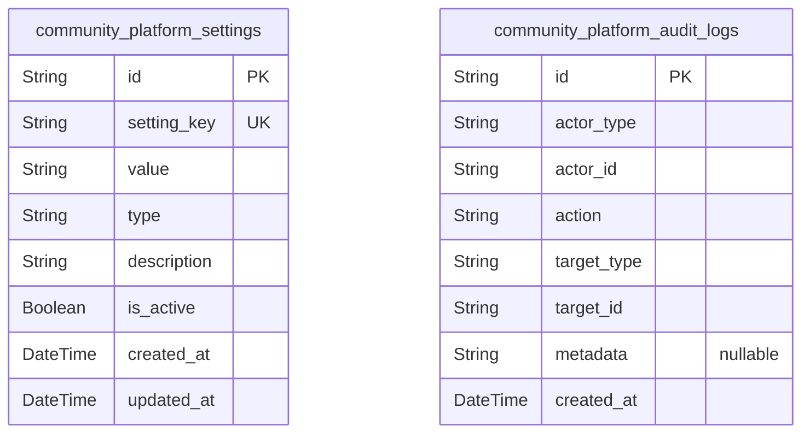
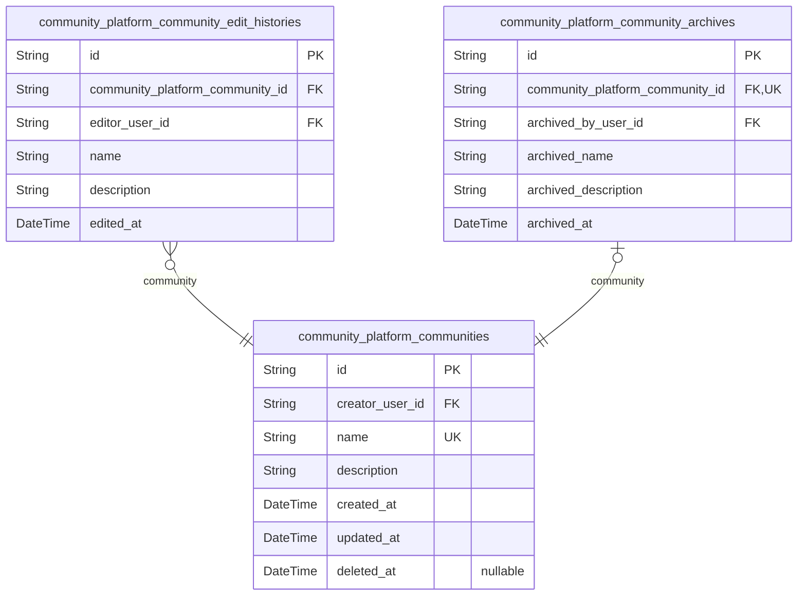
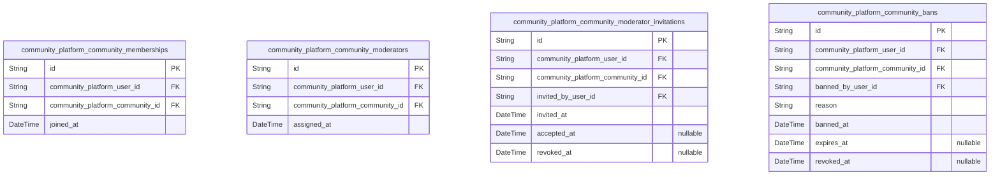
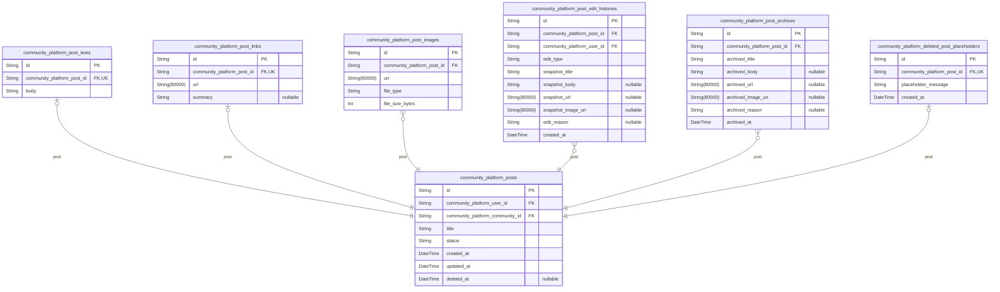
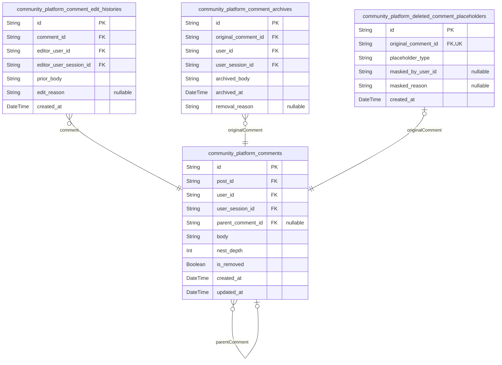
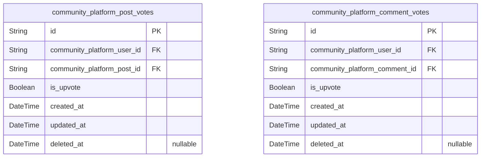
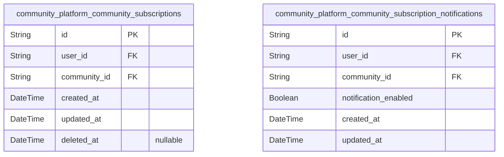
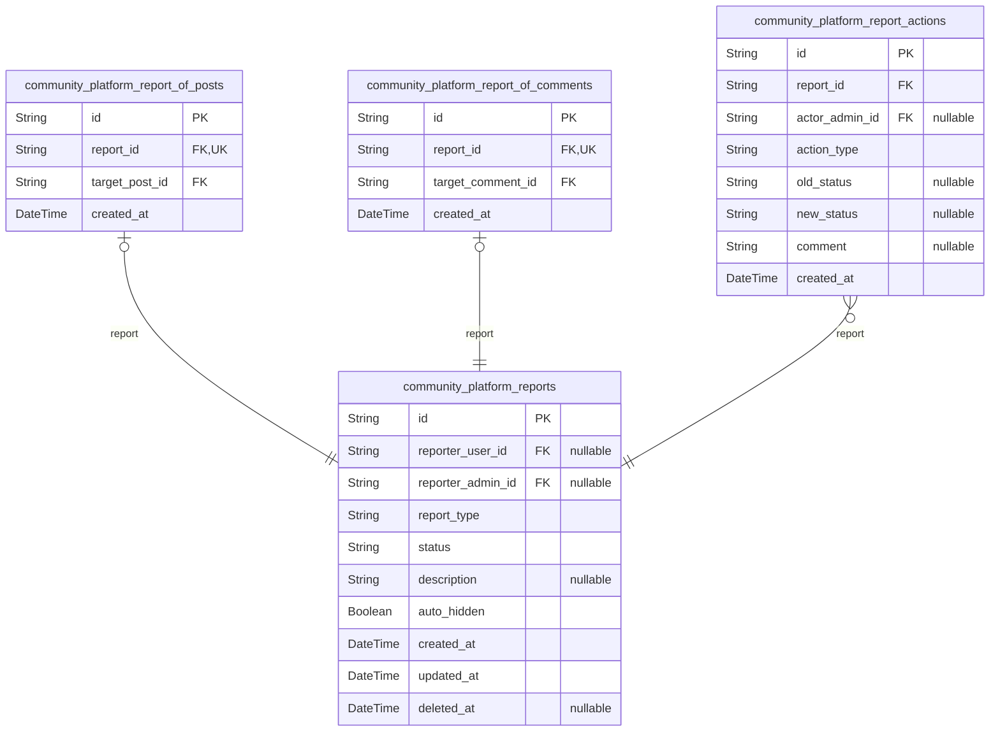
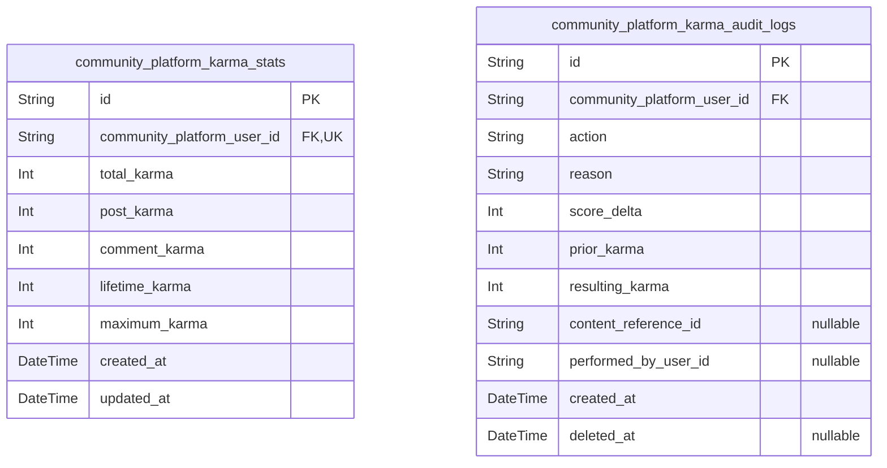

# Prisma Markdown

> Generated by [`prisma-markdown`](https://github.com/samchon/prisma-markdown)

- [Systematic](#systematic)
- [Actors](#actors)
- [Community](#community)
- [Memberships](#memberships)
- [Posts](#posts)
- [Comments](#comments)
- [Votes](#votes)
- [Subscriptions](#subscriptions)
- [Reporting](#reporting)
- [Karma](#karma)

## Systematic

```mermaid
erDiagram
"community_platform_settings" {
  String id PK
  String setting_key UK
  String value
  String type
  String description
  Boolean is_active
  DateTime created_at
  DateTime updated_at
}
"community_platform_audit_logs" {
  String id PK
  String actor_type
  String actor_id
  String action
  String target_type
  String target_id
  String metadata "nullable"
  DateTime created_at
}
```

### `community_platform_settings`

System-wide configuration key-value store for platform-wide rules,
constraints, toggles, or operational limits. Managed by platform admins
and referenced across all business domains. Each setting includes a
unique key, human-readable description, effective value, and tracking
fields for type and status. Designed for easy expansion and cross-domain
reference.

Properties as follows:

- `id`: Primary Key.
- `setting_key`
  > Unique configuration key for the setting (e.g., 'max_post_length',
  > 'enable_new_communities').
- `value`
  > Effective value for the given setting. Serialized as string, interpret
  > according to 'type' field.
- `type`
  > Type indicator for value interpretation (e.g., 'int', 'boolean', 'text',
  > 'enum').
- `description`
  > Human-readable description explaining the rule, constraint, or toggle
  > implemented by this setting.
- `is_active`
  > Whether this setting is currently active and enforced. Allows staged
  > rollout and deactivation without record deletion.
- `created_at`: Timestamp of setting creation.
- `updated_at`: Timestamp of last modification to the setting.

### `community_platform_audit_logs`

Immutable audit log for all critical actions, changes, or security events
platform-wide. Records who (actor), what (action), when, and
target/anomaly details. Used for compliance, troubleshooting, forensic
review, and detecting suspicious activity. Maintains resilience by
storing references to actors/targets as text fields, never hard FKs,
allowing audit trail even on deletion of associated entities.

Properties as follows:

- `id`: Primary Key.
- `actor_type`: Who performed the action ('user', 'admin', 'system').
- `actor_id`
  > ID of the acting entity (user/admin/session as applicable). Foreign key
  > NOT enforced for audit continuity.
- `action`: Action performed (e.g., 'login', 'post_created', 'community_deleted').
- `target_type`
  > Type of entity targeted by the action (e.g., 'post', 'comment',
  > 'community', 'user').
- `target_id`
  > ID of entity targeted. Foreign key NOT enforced; referential resilience
  > required for audits involving deleted entities.
- `metadata`
  > Optional, serialized JSON string for additional action/context details.
  > E.g., IP, device, value changes, errors.
- `created_at`
  > Timestamp of when the audit log entry was created (action occurrence
  > time).

## Actors

```mermaid
erDiagram
"community_platform_users" {
  String id PK
  String email UK
  String password_hash
  String display_name
  DateTime created_at
  DateTime updated_at
  DateTime deleted_at "nullable"
}
"community_platform_user_sessions" {
  String id PK
  String community_platform_user_id FK
  String ip
  String href
  String referrer
  DateTime created_at
  DateTime expired_at "nullable"
}
"community_platform_user_verification_tokens" {
  String id PK
  String community_platform_user_id FK
  String token UK
  DateTime expires_at
  Boolean consumed
  DateTime created_at
  DateTime consumed_at "nullable"
}
"community_platform_user_password_reset_tokens" {
  String id PK
  String community_platform_user_id FK
  String token UK
  DateTime expires_at
  Boolean consumed
  DateTime created_at
  DateTime consumed_at "nullable"
}
"community_platform_user_login_attempts" {
  String id PK
  String community_platform_user_id FK
  DateTime attempted_at
  String ip
  Boolean success
}
"community_platform_admins" {
  String id PK
  String email UK
  String password_hash
  String display_name
  DateTime created_at
  DateTime updated_at
  DateTime deleted_at "nullable"
}
"community_platform_admin_sessions" {
  String id PK
  String community_platform_admin_id FK
  String ip
  String href
  String referrer
  DateTime created_at
  DateTime expired_at "nullable"
}
"community_platform_admin_verification_tokens" {
  String id PK
  String community_platform_admin_id FK
  String token UK
  DateTime expires_at
  Boolean consumed
  DateTime created_at
  DateTime consumed_at "nullable"
}
"community_platform_admin_password_reset_tokens" {
  String id PK
  String community_platform_admin_id FK
  String token UK
  DateTime expires_at
  Boolean consumed
  DateTime created_at
  DateTime consumed_at "nullable"
}
"community_platform_admin_login_attempts" {
  String id PK
  String community_platform_admin_id FK
  DateTime attempted_at
  String ip
  Boolean success
}
"community_platform_user_sessions" }o--|| "community_platform_users" : user
"community_platform_user_verification_tokens" }o--|| "community_platform_users" : user
"community_platform_user_password_reset_tokens" }o--|| "community_platform_users" : user
"community_platform_user_login_attempts" }o--|| "community_platform_users" : user
"community_platform_admin_sessions" }o--|| "community_platform_admins" : admin
"community_platform_admin_verification_tokens" }o--|| "community_platform_admins" : admin
"community_platform_admin_password_reset_tokens" }o--|| "community_platform_admins" : admin
"community_platform_admin_login_attempts" }o--|| "community_platform_admins" : admin
```

### `community_platform_users`

Registered user accounts for the community platform. Stores unique,
authenticatable users, their essential identity, and audit fields.
Related to user_sessions, verification tokens, password reset tokens, and
login attempts. [community_platform_user_sessions.id](#community_platform_user_sessions) {@link
community_platform_user_verification_tokens.id} {@link
community_platform_user_password_reset_tokens.id} {@link
community_platform_user_login_attempts.id}

Properties as follows:

- `id`: Primary Key.
- `email`: Unique email address of the user.
- `password_hash`: BCrypt hash of user password for authentication.
- `display_name`: User display name for public identity.
- `created_at`: Account creation timestamp.
- `updated_at`: Last account update timestamp.
- `deleted_at`: Account soft deletion timestamp.

### `community_platform_user_sessions`

Login session records for users. Records session context for each
authenticated action. References the owning community_platform_users
account. Managed for audit, session expiration, and concurrent session
limits. [community_platform_users.id](#community_platform_users)

Properties as follows:

- `id`: Primary Key.
- `community_platform_user_id`: Belonged user's [community_platform_users.id](#community_platform_users)
- `ip`: User's IP address at session creation.
- `href`: URL where the session was established.
- `referrer`: Referrer URL at session start.
- `created_at`: Session creation timestamp.
- `expired_at`: Session expiration timestamp (end of session, null if active).

### `community_platform_user_verification_tokens`

Email verification tokens for newly registered users. Allows for one-time
activation by referenced user, with token expiry, code value, and audit
trail. Related to community_platform_users. {@link
community_platform_users.id}

Properties as follows:

- `id`: Primary Key.
- `community_platform_user_id`: Belonged user's [community_platform_users.id](#community_platform_users)
- `token`: Secure verification code for email activation.
- `expires_at`: Verification token expiry timestamp.
- `consumed`: Whether this token has been successfully used.
- `created_at`: Token generation timestamp.
- `consumed_at`: Timestamp when token was consumed, null if unused.

### `community_platform_user_password_reset_tokens`

Password reset tokens for users. Enables password change if not
expired/consumed. Related to a specific user with code value, expiry, and
audit fields. [community_platform_users.id](#community_platform_users)

Properties as follows:

- `id`: Primary Key.
- `community_platform_user_id`: Belonged user's [community_platform_users.id](#community_platform_users)
- `token`: Password reset secure token value.
- `expires_at`: Expiration of reset token.
- `consumed`: Whether token has been used to reset password.
- `created_at`: Creation audit timestamp.
- `consumed_at`: Timestamp when token was consumed, null if unused.

### `community_platform_user_login_attempts`

Tracks every authentication attempt made with user credentials. Used for
risk management, lockouts, and audit purposes. Foreign key to user.
Records timestamp, IP address, and success/failure.

Properties as follows:

- `id`: Primary Key.
- `community_platform_user_id`: Belonged user's [community_platform_users.id](#community_platform_users)
- `attempted_at`: Timestamp of login attempt.
- `ip`: Originating IP address.
- `success`: Whether login attempt succeeded.

### `community_platform_admins`

Administrator accounts with platform-wide privileges. Distinct from users
(no inheritance). Stores separate credential, display, and audit fields.
Tied to admin_sessions, tokens, and login logs.

Properties as follows:

- `id`: Primary Key.
- `email`: Unique admin email address.
- `password_hash`: Hashed admin password used for authentication.
- `display_name`: Admin display name in admin UIs/audit logs.
- `created_at`: Admin account creation time.
- `updated_at`: Admin account last update timestamp.
- `deleted_at`: Admin account soft deleted timestamp.

### `community_platform_admin_sessions`

Per-admin session records for tracking authenticated access and actions.
Similar to user_sessions but strictly for admins. Related to admin for
session audit and revocation. [community_platform_admins.id](#community_platform_admins)

Properties as follows:

- `id`: Primary Key.
- `community_platform_admin_id`: Belonged admin's [community_platform_admins.id](#community_platform_admins)
- `ip`: IP address at admin session start.
- `href`: Session context URL.
- `referrer`: Referrer string.
- `created_at`: Session start timestamp.
- `expired_at`: When session ended or was revoked (null for active).

### `community_platform_admin_verification_tokens`

Verification tokens for administrator account activation and email
confirmation. Linked directly to admin, each token with code, expiry,
consumed state, and audit references.

Properties as follows:

- `id`: Primary Key.
- `community_platform_admin_id`: Belonged admin's [community_platform_admins.id](#community_platform_admins)
- `token`: Verification code sent to admin's email.
- `expires_at`: Token expiration timestamp.
- `consumed`: Flag if token is already redeemed.
- `created_at`: Generated at timestamp.
- `consumed_at`: When token was consumed (null if never used).

### `community_platform_admin_password_reset_tokens`

Tokens for admin password reset flows. Each token is unique and expires
after defined interval. Linked to specific admin for audit/compliance.

Properties as follows:

- `id`: Primary Key.
- `community_platform_admin_id`: Admin belonging's [community_platform_admins.id](#community_platform_admins)
- `token`: Password reset code for admin.
- `expires_at`: Reset token expiry.
- `consumed`: Has token been used.
- `created_at`: Time token was created.
- `consumed_at`: Time token consumed, null if never used.

### `community_platform_admin_login_attempts`

Tracks authentication attempts specifically, including failed and
successful logins, to admin accounts. Used for lockout, compliance, and
investigation.

Properties as follows:

- `id`: Primary Key.
- `community_platform_admin_id`: Reference to admin's [community_platform_admins.id](#community_platform_admins)
- `attempted_at`: Time admin attempted login.
- `ip`: IP address at login attempt.
- `success`: Flag for successful authentication.

## Community

```mermaid
erDiagram
"community_platform_communities" {
  String id PK
  String creator_user_id FK
  String name UK
  String description
  DateTime created_at
  DateTime updated_at
  DateTime deleted_at "nullable"
}
"community_platform_community_edit_histories" {
  String id PK
  String community_platform_community_id FK
  String editor_user_id FK
  String name
  String description
  DateTime edited_at
}
"community_platform_community_archives" {
  String id PK
  String community_platform_community_id FK,UK
  String archived_by_user_id FK
  String archived_name
  String archived_description
  DateTime archived_at
}
"community_platform_community_edit_histories" }o--|| "community_platform_communities" : community
"community_platform_community_archives" |o--|| "community_platform_communities" : community
```

### `community_platform_communities`

Core business entity for managing communities (analogous to subreddits).
Stores metadata including unique moderated name, description, creation,
update, and deletion timestamps. Enforces unique name (case-insensitive,
stored in lower-case for uniqueness checks). Links to creator ({@link
community_platform_users.id}). All community status, moderation,
creation, and meta rules derive from this entity.

Properties as follows:

- `id`: Primary Key.
- `creator_user_id`
  > Creator user's [community_platform_users.id](#community_platform_users). Set at community
  > creation; never null.
- `name`
  > Unique community name (case-insensitive, stored in canonical/lower-case
  > form; 3-50 alphanumeric/underscore, enforced unique).
- `description`
  > Community description, up to 250 characters. Required and validated on
  > creation and edit.
- `created_at`: Community creation timestamp.
- `updated_at`: Timestamp for last edit (name or description); always present.
- `deleted_at`
  > Soft delete timestamp (for 30-day archival window before permanent
  > deletion); null unless scheduled for deletion.

### `community_platform_community_edit_histories`

Audit history of all edits made to a community's name or description.
Each row is an append-only, immutable historical record capturing
pre-edited values and the editor reference ({@link
community_platform_users.id}). Enables rollback and traceability for
community meta-data changes. Not independently managed (read-only
snapshot).

Properties as follows:

- `id`: Primary Key.
- `community_platform_community_id`: Target community's [community_platform_communities.id](#community_platform_communities) being edited.
- `editor_user_id`
  > User reference for who performed the edit ({@link
  > community_platform_users.id}).
- `name`: Previous community name value before edit.
- `description`: Previous description value before edit.
- `edited_at`: Edit timestamp (when this historical snapshot record was captured).

### `community_platform_community_archives`

Historical record for archived (soft-deleted) communities. Preserves all
essential meta-data and relationships as a point-in-time snapshot.
Created before permanent deletion for audit/recovery purposes (30 days
minimum retention). Not independently updatable once created.

Properties as follows:

- `id`: Primary Key.
- `community_platform_community_id`: Target now-archived community's [community_platform_communities.id](#community_platform_communities).
- `archived_by_user_id`
  > User reference of the actor who archived the community ({@link
  > community_platform_users.id}).
- `archived_name`: Community name as it was at the time of archival.
- `archived_description`: Community description at time of archival.
- `archived_at`: Timestamp when archiving occurred.

## Memberships

```mermaid
erDiagram
"community_platform_community_memberships" {
  String id PK
  String community_platform_user_id FK
  String community_platform_community_id FK
  DateTime joined_at
}
"community_platform_community_moderators" {
  String id PK
  String community_platform_user_id FK
  String community_platform_community_id FK
  DateTime assigned_at
}
"community_platform_community_moderator_invitations" {
  String id PK
  String community_platform_user_id FK
  String community_platform_community_id FK
  String invited_by_user_id FK
  DateTime invited_at
  DateTime accepted_at "nullable"
  DateTime revoked_at "nullable"
}
"community_platform_community_bans" {
  String id PK
  String community_platform_user_id FK
  String community_platform_community_id FK
  String banned_by_user_id FK
  String reason
  DateTime banned_at
  DateTime expires_at "nullable"
  DateTime revoked_at "nullable"
}
```

### `community_platform_community_memberships`

Represents the membership relationship between users and communities.
Each record links a single user to a single community, indicating active
participation. Prevents multiple memberships for the same user-community
pair and enables management of join events. Supports searching all
members of a community or all communities a user has joined. {@link
community_platform_users.id}, [community_platform_communities.id](#community_platform_communities)

Properties as follows:

- `id`: Primary Key.
- `community_platform_user_id`: Associated user's [community_platform_users.id](#community_platform_users).
- `community_platform_community_id`: Associated community's [community_platform_communities.id](#community_platform_communities).
- `joined_at`: Timestamp when the user joined the community.

### `community_platform_community_moderators`

Links users to communities in their role as moderators. Each record
indicates a user is an active moderator for a given community. Ensures no
user is a moderator twice and enforces last moderator restriction via
business logic. Prevents orphaned moderation. {@link
community_platform_users.id}, [community_platform_communities.id](#community_platform_communities)

Properties as follows:

- `id`: Primary Key.
- `community_platform_user_id`: Moderator's [community_platform_users.id](#community_platform_users).
- `community_platform_community_id`: Target community's [community_platform_communities.id](#community_platform_communities).
- `assigned_at`: Timestamp of moderator role assignment.

### `community_platform_community_moderator_invitations`

Represents pending or historical invitations for users to become
moderators in a community. Records the inviter, invitee, target
community, and acceptance state. Invitation can be accepted or revoked;
auditing timestamps and actor references included for moderator
workflows. [community_platform_users.id](#community_platform_users), {@link
community_platform_communities.id}

Properties as follows:

- `id`: Primary Key.
- `community_platform_user_id`
  > User receiving the moderator invitation: {@link
  > community_platform_users.id}.
- `community_platform_community_id`
  > Community for moderator invitation: {@link
  > community_platform_communities.id}.
- `invited_by_user_id`: User who sent the invitation: [community_platform_users.id](#community_platform_users).
- `invited_at`: Invitation sent timestamp.
- `accepted_at`: Timestamp when invitation was accepted (null if not accepted yet).
- `revoked_at`: Timestamp when invitation was revoked (null if still active or completed).

### `community_platform_community_bans`

Tracks bans that prevent specific users from participating in specific
communities. Stores reason for ban, banning moderator, and timestamps for
issued, expiry, or revocation. Direct relation ensures fast lookup of
banned status and supports enforcement of join restriction and
subscription removal. [community_platform_users.id](#community_platform_users), {@link
community_platform_communities.id}

Properties as follows:

- `id`: Primary Key.
- `community_platform_user_id`: Banned user's [community_platform_users.id](#community_platform_users).
- `community_platform_community_id`: Community where user is banned: [community_platform_communities.id](#community_platform_communities).
- `banned_by_user_id`: Moderator who enacted the ban: [community_platform_users.id](#community_platform_users).
- `reason`: Moderator-provided reason for the ban.
- `banned_at`: Timestamp when ban was applied.
- `expires_at`: Timestamp when the ban expires (nullable if permanent).
- `revoked_at`: Timestamp when ban was revoked, if at all.

## Posts

```mermaid
erDiagram
"community_platform_posts" {
  String id PK
  String community_platform_user_id FK
  String community_platform_community_id FK
  String title
  String status
  DateTime created_at
  DateTime updated_at
  DateTime deleted_at "nullable"
}
"community_platform_post_texts" {
  String id PK
  String community_platform_post_id FK,UK
  String body
}
"community_platform_post_links" {
  String id PK
  String community_platform_post_id FK,UK
  String(80000) url
  String summary "nullable"
}
"community_platform_post_images" {
  String id PK
  String community_platform_post_id FK
  String(80000) uri
  String file_type
  Int file_size_bytes
}
"community_platform_post_edit_histories" {
  String id PK
  String community_platform_post_id FK
  String community_platform_user_id FK
  String edit_type
  String snapshot_title
  String snapshot_body "nullable"
  String(80000) snapshot_url "nullable"
  String(80000) snapshot_image_uri "nullable"
  String edit_reason "nullable"
  DateTime created_at
}
"community_platform_post_archives" {
  String id PK
  String community_platform_post_id FK
  String archived_title
  String archived_body "nullable"
  String(80000) archived_url "nullable"
  String(80000) archived_image_uri "nullable"
  String archived_reason "nullable"
  DateTime archived_at
}
"community_platform_deleted_post_placeholders" {
  String id PK
  String community_platform_post_id FK,UK
  String placeholder_message
  DateTime created_at
}
"community_platform_post_texts" |o--|| "community_platform_posts" : post
"community_platform_post_links" |o--|| "community_platform_posts" : post
"community_platform_post_images" }o--|| "community_platform_posts" : post
"community_platform_post_edit_histories" }o--|| "community_platform_posts" : post
"community_platform_post_archives" }o--|| "community_platform_posts" : post
"community_platform_deleted_post_placeholders" |o--|| "community_platform_posts" : post
```

### `community_platform_posts`

Primary entity representing a user-generated post within a community.
Supports text, link, and image content types via subsidiary tables.
Tracks creator, associated community, status, and timestamps. Related to
votes, comments, edit histories, and snapshot archives. Serves as the
main business object for all post interactions, moderation, and sorting.

Properties as follows:

- `id`: Primary Key.
- `community_platform_user_id`: Post author's [community_platform_users.id](#community_platform_users).
- `community_platform_community_id`: Target community [community_platform_communities.id](#community_platform_communities).
- `title`: Post title (up to 300 chars, required for all posts).
- `status`: Status of the post: published, deleted, archived, or moderated.
- `created_at`: Timestamp of post creation.
- `updated_at`: Timestamp of latest post update.
- `deleted_at`: Soft-delete timestamp (null if active).

### `community_platform_post_texts`

Subsidiary table for storing text content of posts. One per post (for
text-type posts). Enforces separation of text body from main post entity
for normalization and supports future extensibility.

Properties as follows:

- `id`: Primary Key.
- `community_platform_post_id`: Owning post's [community_platform_posts.id](#community_platform_posts).
- `body`: Text content of the post (up to 10000 chars, markdown supported).

### `community_platform_post_links`

Subsidiary table containing metadata for link-type posts. Stores
validated URL and optional summary. One per post (for link-type posts).

Properties as follows:

- `id`: Primary Key.
- `community_platform_post_id`: Owning post's [community_platform_posts.id](#community_platform_posts).
- `url`: Validated target URL for link post.
- `summary`: Optional summary string (up to 300 chars) describing link target.

### `community_platform_post_images`

Subsidiary table that holds image file metadata for image-type posts.
Each record references one uploaded image, supporting multi-image posts
by allowing several entries per post. Validates file type, size, and
links to storage URI.

Properties as follows:

- `id`: Primary Key.
- `community_platform_post_id`: Owning post's [community_platform_posts.id](#community_platform_posts).
- `uri`: Storage URI (link to stored image file, e.g., S3).
- `file_type`: Image file type (jpeg, png, gif).
- `file_size_bytes`: File size in bytes (must enforce platform limit, e.g., 10485760 for 10MB).

### `community_platform_post_edit_histories`

Snapshot table recording edit history of posts. Stores full copy of post
state for undo, audit, and moderation review. Each record indicates
editor identity, timestamps, and reason for edit if provided.

Properties as follows:

- `id`: Primary Key.
- `community_platform_post_id`: Target post's [community_platform_posts.id](#community_platform_posts).
- `community_platform_user_id`: Editor user (may differ from creator) [community_platform_users.id](#community_platform_users).
- `edit_type`: Type of edit (content, title, metadata, etc.).
- `snapshot_title`: Snapshot of post title at time of edit.
- `snapshot_body`: Snapshot of text body, if post is of text type. Null for others.
- `snapshot_url`: Snapshot of post URL, if post is of link type. Null for others.
- `snapshot_image_uri`: Snapshot of image URI, if post is of image type. Null otherwise.
- `edit_reason`: Editor-supplied reason for this change (optional, for audit).
- `created_at`: Timestamp when this edit was made.

### `community_platform_post_archives`

Snapshot (archive) table storing complete historical record of posts that
have been deleted, moderated, or removed for any reason. Captures a full
denormalized copy of the post and relevant metadata for compliance and
audit.

Properties as follows:

- `id`: Primary Key.
- `community_platform_post_id`: Original post (now archived) [community_platform_posts.id](#community_platform_posts).
- `archived_title`: Title at time of archival.
- `archived_body`: Body/content at time of archival (may be null for non-text posts).
- `archived_url`: URL at time of archival (may be null for non-link posts).
- `archived_image_uri`: Image URI at time of archival (may be null for non-image posts).
- `archived_reason`
  > Reason for archiving, for audit trail (e.g., deleted by user/mod, policy
  > violation).
- `archived_at`: When this archive snapshot was created.

### `community_platform_deleted_post_placeholders`

Subsidiary table for soft-deleted posts used to preserve thread/comment
integrity (for orphaned posts). Each record links to a deleted post and
indicates replacement placeholder. Ensures comment parent FKs remain
valid.

Properties as follows:

- `id`: Primary Key.
- `community_platform_post_id`: Deleted post [community_platform_posts.id](#community_platform_posts).
- `placeholder_message`: Text content explaining post was deleted (e.g., '[deleted]').
- `created_at`: Timestamp when placeholder created.

## Comments

```mermaid
erDiagram
"community_platform_comments" {
  String id PK
  String post_id FK
  String user_id FK
  String user_session_id FK
  String parent_comment_id FK "nullable"
  String body
  Int nest_depth
  Boolean is_removed
  DateTime created_at
  DateTime updated_at
}
"community_platform_comment_edit_histories" {
  String id PK
  String comment_id FK
  String editor_user_id FK
  String editor_user_session_id FK
  String prior_body
  String edit_reason "nullable"
  DateTime created_at
}
"community_platform_comment_archives" {
  String id PK
  String original_comment_id FK
  String user_id FK
  String user_session_id FK
  String archived_body
  DateTime archived_at
  String removal_reason "nullable"
}
"community_platform_deleted_comment_placeholders" {
  String id PK
  String original_comment_id FK,UK
  String placeholder_type
  String masked_by_user_id "nullable"
  String masked_reason "nullable"
  DateTime created_at
}
"community_platform_comments" }o--o| "community_platform_comments" : parentComment
"community_platform_comment_edit_histories" }o--|| "community_platform_comments" : comment
"community_platform_comment_archives" }o--|| "community_platform_comments" : originalComment
"community_platform_deleted_comment_placeholders" |o--|| "community_platform_comments" : originalComment
```

### `community_platform_comments`

Top-level and child comments posted by users under posts, supporting
nested replies (via parent_comment_id if not null). Core entity for all
commenting, with max-nesting enforced in application logic. Supports
per-comment soft deletion. Related to users, posts, and (optionally)
parent comments. Children are retained and point to placeholders if
parent deleted. Never stores calculated fields such as score or karma;
all denormalization avoided.

Properties as follows:

- `id`: Primary Key.
- `post_id`: Target post's id. [community_platform_posts.id](#community_platform_posts)
- `user_id`: Authoring user's id. [community_platform_users.id](#community_platform_users)
- `user_session_id`
  > Authenticated session of the commenting user. {@link
  > community_platform_user_sessions.id}
- `parent_comment_id`
  > Parent comment id for nested/child comment, null for top-level comments.
  > [community_platform_comments.id](#community_platform_comments)
- `body`
  > Comment text content, up to 2,000 characters. Required; does not allow
  > empty comments. Format and max-length validated in application layer.
- `nest_depth`
  > Nest depth from post root (0 for direct post replies). Enforced to max 5
  > at application level. Used for limiting nesting and sorting display.
- `is_removed`
  > Indicates if the comment has been soft deleted/removed from display, but
  > stays for thread integrity. If true, reference the placeholder table for
  > display.
- `created_at`: Timestamp of comment creation.
- `updated_at`
  > Last updated/edit time for the comment (changes on each body update or
  > removal).

### `community_platform_comment_edit_histories`

Records each edit made to a comment for audit and moderator review. Each
record tracks the prior state of comment's body, who made the edit
(user/session), precise timestamp, and references the original comment.
Supports full per-comment version review. Used for accountability and
rollback by moderators or when showing comment edit history.

Properties as follows:

- `id`: Primary Key.
- `comment_id`
  > Target comment whose history is being recorded. {@link
  > community_platform_comments.id}
- `editor_user_id`: User performing the edit. [community_platform_users.id](#community_platform_users)
- `editor_user_session_id`: Session of editing user. [community_platform_user_sessions.id](#community_platform_user_sessions)
- `prior_body`
  > The previous body/text of the comment before this edit. Saved for
  > auditing, up to 2,000 characters.
- `edit_reason`
  > Optional moderator/user-supplied reason for the edit, e.g. correction,
  > rule compliance. Null if none supplied.
- `created_at`: Timestamp when the edit was made.

### `community_platform_comment_archives`

Archive of removed or historical versions of comments for compliance,
auditing, and potential restoration. Each entry is a snapshot at the time
of removal/archive. Tracks comment body, user, session, and archival
detail, preserving full lineage. Used for GDPR compliance, moderation
review, or restoring deleted comments.

Properties as follows:

- `id`: Primary Key.
- `original_comment_id`
  > The comment whose prior/deleted state is being archived. {@link
  > community_platform_comments.id}
- `user_id`: Comment's author at time of archiving. [community_platform_users.id](#community_platform_users)
- `user_session_id`
  > Session context of author when originally created. {@link
  > community_platform_user_sessions.id}
- `archived_body`
  > The comment body preserved at the time of removal/archive. Up to 2,000
  > characters. Full content required for compliance.
- `archived_at`
  > Timestamp when this archive record was created (i.e., when the comment
  > was removed/archived).
- `removal_reason`
  > Explanation or moderator log for why this comment was archived, e.g. user
  > request, moderation, GDPR removal. Null if not provided.

### `community_platform_deleted_comment_placeholders`

Placeholder references used to indicate a deleted comment, especially
when it has children that still need to be displayed in the thread. Only
applies to comments fully deleted by user or moderator. Stores time,
original comment reference, and removal/masking details.

Properties as follows:

- `id`: Primary Key.
- `original_comment_id`
  > The comment which is now represented as placeholder. {@link
  > community_platform_comments.id}
- `placeholder_type`
  > Type of placeholder logic (e.g. 'deleted_by_user',
  > 'deleted_by_moderator', 'removed_spam', etc.). Used for thread display
  > customization.
- `masked_by_user_id`: User who actioned the masking/removal. Null if system-driven.
- `masked_reason`
  > Human-readable reason or system code for why comment became placeholder.
  > E.g. GDPR removal, moderator flag.
- `created_at`
  > Timestamp of placeholder record creation (i.e., when original comment was
  > masked).

## Votes

```mermaid
erDiagram
"community_platform_post_votes" {
  String id PK
  String community_platform_user_id FK
  String community_platform_post_id FK
  Boolean is_upvote
  DateTime created_at
  DateTime updated_at
  DateTime deleted_at "nullable"
}
"community_platform_comment_votes" {
  String id PK
  String community_platform_user_id FK
  String community_platform_comment_id FK
  Boolean is_upvote
  DateTime created_at
  DateTime updated_at
  DateTime deleted_at "nullable"
}
```

### `community_platform_post_votes`

Tracks upvotes and downvotes made by users on posts. Enforces
one-user-one-vote policy with unique constraint on (user_id, post_id).
Each vote can be toggled or undone (soft-deleted). Used for
audit/logging, independent vote reversal, and moderation. Relates to
[community_platform_posts.id](#community_platform_posts) and {@link
community_platform_users.id}. No aggregated metrics stored here.

Properties as follows:

- `id`: Primary Key.
- `community_platform_user_id`: Voter's [community_platform_users.id](#community_platform_users). Each vote belongs to a user.
- `community_platform_post_id`
  > Target post's [community_platform_posts.id](#community_platform_posts). Each vote relates to a
  > post.
- `is_upvote`: Whether the vote is an upvote (true) or downvote (false).
- `created_at`: Timestamp when the vote was first cast (for auditing).
- `updated_at`
  > Timestamp when the vote was last changed (e.g., toggled, switched
  > direction).
- `deleted_at`: Timestamp for vote undo/soft-deletion. Null if vote is active.

### `community_platform_comment_votes`

Tracks upvotes and downvotes made by users on comments. Enforces
one-user-one-vote policy by unique constraint on (user_id, comment_id).
Each row can be toggled or undone (soft-deleted). Used for audit/logging,
moderation, and reversal. Relates to {@link
community_platform_comments.id} and [community_platform_users.id](#community_platform_users).
No aggregated metrics stored here.

Properties as follows:

- `id`: Primary Key.
- `community_platform_user_id`: Voter's [community_platform_users.id](#community_platform_users). Each vote belongs to a user.
- `community_platform_comment_id`
  > Target comment's [community_platform_comments.id](#community_platform_comments). Each vote
  > relates to a comment.
- `is_upvote`: Whether the vote is an upvote (true) or downvote (false).
- `created_at`: Timestamp when the vote was first cast (for auditing).
- `updated_at`
  > Timestamp when the vote was last changed (e.g., toggled, switched
  > direction).
- `deleted_at`: Timestamp for vote undo/soft-deletion. Null if vote is active.

## Subscriptions

```mermaid
erDiagram
"community_platform_community_subscriptions" {
  String id PK
  String user_id FK
  String community_id FK
  DateTime created_at
  DateTime updated_at
  DateTime deleted_at "nullable"
}
"community_platform_community_subscription_notifications" {
  String id PK
  String user_id FK
  String community_id FK
  Boolean notification_enabled
  DateTime created_at
  DateTime updated_at
}
```

### `community_platform_community_subscriptions`

Tracks user subscriptions (follows) to each community. Defines the active
set of communities a user has opted in to receive content and
notifications from. Serves as the canonical linkage for feed
construction, notification dispatching, and personalized recommendations.
Foreign keys link to [community_platform_users.id](#community_platform_users) and {@link
community_platform_communities.id}. Enforces uniqueness for each
user/community pair (one subscription per user per community). Removing a
row signifies user has unsubscribed. Soft delete and timestamped for
retention/audit. Used as a 'primary' stance table as business operations
include direct CRUD and business rule enforcement for subscription-based
actions.

Properties as follows:

- `id`: Primary Key.
- `user_id`: The subscribing user's [community_platform_users.id](#community_platform_users).
- `community_id`: Target community's [community_platform_communities.id](#community_platform_communities).
- `created_at`: Subscription creation timestamp.
- `updated_at`: Last update timestamp for subscription or notification settings.
- `deleted_at`
  > Soft delete timestamp; set when user unsubscribes or subscription is
  > system-removed.

### `community_platform_community_subscription_notifications`

User-specific per-community notification delivery settings. Allows each
user to customize notification preferences for each community they
follow, supporting default, enabled, or disabled state with potential for
granular notification-type extension. Linked by user_id and community_id,
supports future expansion for feature toggles or notification methods.
Used for personalized notification dispatch, opt-out logic, and audit.
Managed as a subsidiary to primary subscriptions: updated when user
subscribes/unsubscribes or changes notification preferences.

Properties as follows:

- `id`: Primary Key.
- `user_id`: The subscribing user's [community_platform_users.id](#community_platform_users).
- `community_id`: The community's [community_platform_communities.id](#community_platform_communities).
- `notification_enabled`
  > Whether notifications are enabled for this user/community subscription
  > (true=enabled, false=disabled).
- `created_at`: Preference creation timestamp.
- `updated_at`: Last update to notification preferences.

## Reporting

```mermaid
erDiagram
"community_platform_reports" {
  String id PK
  String reporter_user_id FK "nullable"
  String reporter_admin_id FK "nullable"
  String report_type
  String status
  String description "nullable"
  Boolean auto_hidden
  DateTime created_at
  DateTime updated_at
  DateTime deleted_at "nullable"
}
"community_platform_report_of_posts" {
  String id PK
  String report_id FK,UK
  String target_post_id FK
  DateTime created_at
}
"community_platform_report_of_comments" {
  String id PK
  String report_id FK,UK
  String target_comment_id FK
  DateTime created_at
}
"community_platform_report_actions" {
  String id PK
  String report_id FK
  String actor_admin_id FK "nullable"
  String action_type
  String old_status "nullable"
  String new_status "nullable"
  String comment "nullable"
  DateTime created_at
}
"community_platform_report_of_posts" |o--|| "community_platform_reports" : report
"community_platform_report_of_comments" |o--|| "community_platform_reports" : report
"community_platform_report_actions" }o--|| "community_platform_reports" : report
```

### `community_platform_reports`

Primary entity for all user or admin-initiated reports on content.
Represents a single report instance with information on reporter, type,
descriptive reason, textual description, reporting time, and status. Each
report has at most one association to a post or comment report subtable;
additional associations can be introduced for other content types. Key
audit trail for moderation workflows, with status progression managed via
related action logs. Links to reporter via foreign key to either users or
admins, depending on actor type.

Properties as follows:

- `id`: Primary Key.
- `reporter_user_id`
  > Reporter user's [community_platform_users.id](#community_platform_users). Nullable if reporter
  > is an admin.
- `reporter_admin_id`
  > Reporter admin's [community_platform_admins.id](#community_platform_admins). Nullable if
  > reporter is a standard user.
- `report_type`
  > Category of report (e.g., spam, abuse, off_topic, harassment,
  > explicit_content, other).
- `status`
  > Workflow status of report (e.g., open, under_review, auto_hidden,
  > resolved, dismissed).
- `description`: Reporter-supplied freeform description (optional).
- `auto_hidden`
  > Whether the content was auto-hidden due to report thresholds or
  > moderation rules.
- `created_at`: Timestamp of report creation.
- `updated_at`: Timestamp of last report update.
- `deleted_at`: Soft delete marker for archival and retention policy.

### `community_platform_report_of_posts`

Associates a report record to a specific post. Used for normalization and
to avoid polymorphic nullable targets. 1:1 relationship with
community_platform_reports; each association references a reported post
and guarantees referential integrity. Used to audit all post-level
content reporting and batch moderation.

Properties as follows:

- `id`: Primary Key.
- `report_id`: Parent report's [community_platform_reports.id](#community_platform_reports).
- `target_post_id`: Target post's [community_platform_posts.id](#community_platform_posts).
- `created_at`: Timestamp of post report association creation.

### `community_platform_report_of_comments`

Associates a report record to a specific comment. Used for normalization
to avoid polymorphic nullable targets. 1:1 relationship with
community_platform_reports; each association references a reported
comment and guarantees referential integrity. Used for all comment-level
content reporting and moderation audit.

Properties as follows:

- `id`: Primary Key.
- `report_id`: Parent report's [community_platform_reports.id](#community_platform_reports).
- `target_comment_id`: Target comment's [community_platform_comments.id](#community_platform_comments).
- `created_at`: Timestamp of comment report association creation.

### `community_platform_report_actions`

Audit/action trail for each report, tracking moderation and admin
workflow events (e.g., status changes, comments, auto-hide actions,
resolution/dismissal). Each record is linked to a report and the actor
(admin or moderator) taking the action, supporting chronological review
and compliance monitoring. Non-destructive, append-only. Used for both
business compliance and internal quality processes.

Properties as follows:

- `id`: Primary Key.
- `report_id`: Related report's [community_platform_reports.id](#community_platform_reports).
- `actor_admin_id`
  > Acting admin's [community_platform_admins.id](#community_platform_admins). Nullable if action
  > was taken by a different role (future extensibility).
- `action_type`
  > Type of action (e.g., status_update, auto_hide, assign, comment, resolve,
  > dismiss).
- `old_status`: Previous status value before action (for status updates).
- `new_status`: New status value after action (for status updates).
- `comment`: Optional moderator/admin comment or action rationale.
- `created_at`: Timestamp of action record creation.

## Karma

```mermaid
erDiagram
"community_platform_karma_stats" {
  String id PK
  String community_platform_user_id FK,UK
  Int total_karma
  Int post_karma
  Int comment_karma
  Int lifetime_karma
  Int maximum_karma
  DateTime created_at
  DateTime updated_at
}
"community_platform_karma_audit_logs" {
  String id PK
  String community_platform_user_id FK
  String action
  String reason
  Int score_delta
  Int prior_karma
  Int resulting_karma
  String content_reference_id "nullable"
  String performed_by_user_id "nullable"
  DateTime created_at
  DateTime deleted_at "nullable"
}
```

### `community_platform_karma_stats`

Aggregated, up-to-date karma statistics for each user, tracking totals
and separate breakdowns for post and comment activity. Maintains current
karma, lifetime earned karma, and historical maximums for user management
and privilege enforcement. Used for fast profile display and business
logic (e.g., eligibility to create communities or penalties for low
karma).

Properties as follows:

- `id`: Primary Key.
- `community_platform_user_id`
  > Referenced user's [community_platform_users.id](#community_platform_users). Owner of these
  > karma stats.
- `total_karma`
  > Current sum of all awarded karma points, posts plus comments. Used for
  > privilege and reputation enforcement.
- `post_karma`
  > Current karma earned from posts only. Used to break down user's
  > contribution reputation by content type.
- `comment_karma`
  > Current karma earned from comments only. Enables per-type karma
  > enforcement/presentation.
- `lifetime_karma`
  > All-time sum of ever-awarded karma, before any penalties/removals. Used
  > for historical maximum tracking.
- `maximum_karma`
  > Historical high watermark of user's total karma. Used for achievement
  > tracking and advanced privilege eligibility.
- `created_at`: Timestamp when this karma summary record was created.
- `updated_at`: Timestamp for the most recent update to this record.

### `community_platform_karma_audit_logs`

Immutable, append-only audit logs capturing each karma-affecting event
for a user, such as new votes, penalties, moderation reversals, or
restoration. Provides full traceability for analytical, forensic, and
recovery purposes. Records previous and resulting karma state, reason,
actor, operation type, content references (as uuid), and timestamps.

Properties as follows:

- `id`: Primary Key.
- `community_platform_user_id`
  > Referenced user's [community_platform_users.id](#community_platform_users) whose karma was
  > affected.
- `action`
  > Event type (e.g., vote_add, vote_remove, penalty, reversal, restore,
  > moderation_adjust) that caused the karma change.
- `reason`
  > Human readable reason or category for the karma modification (e.g.,
  > 'upvote on comment', 'manual penalty: abuse', 'restore by moderator').
- `score_delta`: Signed amount of karma gained or lost by this event.
- `prior_karma`
  > Total karma immediately before this event occurred. Snapshot for
  > audit/history purposes.
- `resulting_karma`
  > Total karma immediately after this event completed. Enables
  > repair/reconstruction.
- `content_reference_id`
  > UUID of related content (post/comment) affected by this event. Not a
  > foreign key, to allow reference to deleted content.
- `performed_by_user_id`
  > UUID of the user (could be moderator/admin) who performed this action, if
  > system-initiated or by another actor. Not a foreign key, for historical
  > independence.
- `created_at`: Timestamp the audit log entry was created (event time).
- `deleted_at`
  > If audit record is redacted (rare), timestamp of redaction. Ensures full
  > auditability and compliance.
