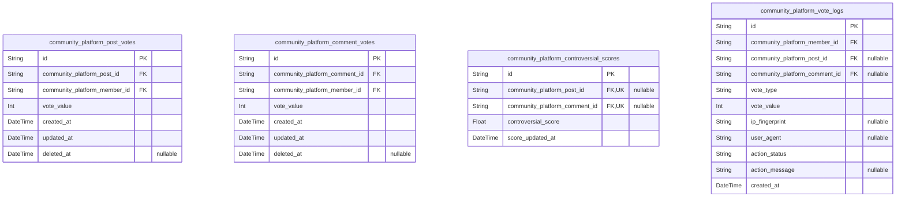

# Prisma Markdown

> Generated by [`prisma-markdown`](https://github.com/samchon/prisma-markdown)

- [Systematic](#systematic)
- [Actors](#actors)
- [Communities](#communities)
- [Content](#content)
- [Subscriptions](#subscriptions)
- [Voting](#voting)
- [Profiles](#profiles)
- [Moderation](#moderation)
- [Karma](#karma)

## Systematic

### `community_platform_system_configs`

System-level configuration key-value pairs. Stores feature flags,
threshold values, system-wide toggles, or settings for the platform.
Critical for runtime configuration without code deployment. Used by
platform services for feature switches or limits. Managed by admins only.
No direct user data or relationships.

Properties as follows:

- `id`: Primary Key.
- `key`
  > Unique identifier for the configuration setting (e.g., 'max_post_length',
  > 'enable_new_feature').
- `value`
  > Configurable value for the setting (string-encoded; can represent JSON,
  > int, bool, etc.).
- `description`: Explanation of the configuration key's purpose.
- `created_at`: Timestamp when this config was created.
- `updated_at`: Timestamp when this config was last updated.

### `community_platform_audit_logs`

System audit trail capturing all significant platform events and actions.
Stores who did what, when, and what data was involved. Records admin
actions, config changes, moderation events, user privilege escalations,
and other critical events for compliance and forensic review.

Properties as follows:

- `id`: Primary Key.
- `actor_type`
  > The type of actor involved (e.g., 'member', 'moderator', 'admin',
  > 'system_job').
- `actor_id`
  > UUID of the actor who performed the action (matches member, moderator,
  > admin, or '00000000-0000-0000-0000-000000000000' for system jobs).
- `action_type`
  > High-level action performed (e.g., 'create', 'update', 'delete',
  > 'config_change', 'user_ban', 'login', 'moderation_action').
- `target_table`: Name of the table affected by the action.
- `target_id`: UUID of the affected entity (row) in the target table.
- `details`: Structured (JSON/text) details about the event for audit/replay.
- `created_at`: Timestamp when this audit log was written.

### `community_platform_banned_words`

List of banned (forbidden) words or phrases. Used by moderation and
filtering to prevent prohibited content submissions. Managed by admins
via moderation flows. May include system-wide and per-community words
(future extension).

Properties as follows:

- `id`: Primary Key.
- `word`: Word or phrase that is prohibited platform-wide.
- `reason`: Explanation for why this word/phrase is banned.
- `active`: Whether this banned word is currently enforced.
- `created_at`: Timestamp when this word was added to the ban list.
- `updated_at`: Timestamp when this word entry was last updated.
- `deleted_at`: Timestamp marking a soft deletion from the ban list (null if active).

### `community_platform_file_uploads`

Platform-wide reference for all files uploaded via the platform. Tracks
uploaded images, documents, or other assets used by posts, profiles,
communities, or moderation. Links to the uploaded_by_member via foreign
key. Records original filename, storage path/URL, mime type, file size,
and status. Does NOT store file blobs directly.

Properties as follows:

- `id`: Primary Key.
- `uploaded_by_member_id`
  > Uploader's [community_platform_members.id](#community_platform_members). The member who uploaded
  > this file.
- `original_filename`: Original filename as submitted by user.
- `storage_key`: Unique storage reference (e.g., S3 key, GCS path, etc.) for this file.
- `mime_type`: File's MIME type (e.g., 'image/png').
- `file_size_bytes`: Size of the file in bytes.
- `url`: Public or signed URL for retrieving this file.
- `status`: Current status: 'active', 'deleted', 'archived', etc.
- `created_at`: Timestamp when the file was uploaded.
- `updated_at`: Timestamp when file metadata was last updated.
- `deleted_at`: Soft delete timestamp, null if file is active.

## Actors

### `community_platform_guests`

Ephemeral user entities representing site visitors in anonymous or
no-login flows. Used for logging, tracking, or casual participation
attribution. No authentication is possible. No identity persists beyond
session unless upgraded to member. Not used for core operations or
permissions. Minimal fields. Can link to cookies, IP logs, or anonymous
session attributions for trace or moderation referencing. May reference
profile for future upgrade paths. Not for direct API access. Stance:
subsidiary.

Properties as follows:

- `id`: Primary Key.
- `session_key`
  > Anonymous session or tracking key, for attribution or moderation
  > referencing. Opaque, session-tied. Not globally unique. Possibly device-
  > or IP-bound. Used for ephemeral tracking only.
- `created_at`
  > Timestamp when guest record/session first established. For audit and
  > abuse tracking.
- `deleted_at`
  > Optional soft-deletion timestamp. Used for cleaning logs or honoring
  > privacy/erasure requests.

### `community_platform_members`

Registered and verified users of the platform. Core actor for all primary
business flows: content creation, voting, commenting, subscribing, and
reporting. Subject to authentication, rate limits, karma effects,
ban/restriction logic, and auditing. Email must be unique. Stores
password hash for authentication. Records verification state and basic
lifecycle data. Stance: primary.

Properties as follows:

- `id`: Primary Key.
- `email`
  > Unique user email for authentication, required to be unique per member.
  > Used for login and contact.
- `password_hash`
  > BCrypt or comparable hash of user's auth credential. NEVER store plain
  > text passwords.
- `email_verified`
  > Whether email has been confirmed via platform verification flow. Cannot
  > post/comment/vote unless true.
- `status`
  > Current member status: 'active', 'blocked', 'suspended', etc. Used for
  > permission enforcement and ban handling.
- `created_at`: Timestamp when user account was registered.
- `updated_at`: Last time account metadata was updated (profile or auth details).
- `deleted_at`: Optional soft-deletion timestamp for ban/erasure or self-removal.

### `community_platform_moderators`

Users assigned elevated moderation privileges within specific
communities. May overlap with member but tracked distinctly for
escalation, audit, and policy enforcement. Table tracks
assignment/authentication context, scope, and status. Moderators can
approve/reject content, manage bans, escalate reports. Each moderator is
linked 1:1 with a member account. Email must be unique. Authentication
required. Stance: primary.

Properties as follows:

- `id`: Primary Key.
- `member_id`
  > Related member entity acting as basis for authentication and core
  > participation. [community_platform_members.id](#community_platform_members).
- `community_id`
  > Moderation privileges apply to this specific community. Links to target
  > community for scope restriction. {@link
  > community_platform_communities.id}.
- `email`
  > Moderator account email (for authentication/notification). Must match
  > related member's email. Unique per moderator assignment.
- `password_hash`
  > BCrypt or comparable hash of moderator's login credential. Required for
  > separate authentication context. Never store plaintext passwords.
- `status`
  > Moderator account status: 'active', 'suspended', 'resigned', etc. Used
  > for permission enforcement and incident response.
- `created_at`: Account creation/assignment time, for audit and incident tracking.
- `updated_at`: Last update to assignment or moderator record.
- `deleted_at`
  > Optional soft deletion time for end of assignment, resignation, or role
  > removal.

### `community_platform_admins`

Top-level platform administrators with ultimate permissions for system
management, disaster recovery, and policy enforcement. Restricted access,
highly audited. Distinct from regular members and moderators.
Authentication required via email/password, with multi-factor support
recommended. Account may be created via backoffice/admin tools. Stance:
primary.

Properties as follows:

- `id`: Primary Key.
- `email`
  > Platform admin email (for authentication). Must be unique among all
  > administrators and not reused across other actor tables.
- `password_hash`
  > Password hash for admin authentication (bcrypt or better). MFA or step-up
  > auth is recommended. Never store plaintext passwords.
- `superuser`
  > Indicates if this admin has unrestricted emergency/superuser permissions.
  > Used for separation of duty within administrators.
- `status`
  > Account status ('active', 'suspended', etc.) for admin. Affects access
  > and actionability.
- `created_at`: Time admin account was created.
- `updated_at`: Last metadata update to admin account.
- `deleted_at`: Soft-deletion or account revocation time, if any.

## Communities

### `community_platform_communities`

Represents a top-level community/hub on the platform. Core entity holding
community metadata (name, description, status, images) and organizational
settings; foundation for posts, subscriptions, moderation, and content
workflows. Linked to members (creator) and supports soft deletion and
configuration changes. Subject to moderator and admin workflows.

Properties as follows:

- `id`: Primary Key.
- `creator_member_id`
  > The creator's [community_platform_members.id](#community_platform_members). Community founder
  > and initial moderator.
- `name`
  > Unique community identifier (display and URL). Case-insensitive. 3-100
  > characters.
- `title`: Community's display title. 3-100 characters, shown in listings/headers.
- `description`: Detailed community description. 10-10000 characters. Markdown allowed.
- `slug`: URL-safe slug, unique. Used for pretty URLs and direct linking.
- `status`
  > Current status (e.g., active, private, banned, archived). Drives
  > accessibility and moderation.
- `created_at`: Community creation timestamp.
- `updated_at`: Last updated timestamp (settings/title/images/status changes, etc.).
- `deleted_at`: Time of soft deletion (archival); null if active.

### `community_platform_community_rules`

Community-specific rules document. Defines posting, commenting,
moderation, and content policies per community. Supports versioning
(updated on edit) and enforces customized community governance (e.g.,
prohibited topics, formatting, moderation logic). Managed by
moderators/admins. Each rule set belongs to one community.

Properties as follows:

- `id`: Primary Key.
- `community_id`: Associated community's [community_platform_communities.id](#community_platform_communities).
- `body`
  > The full text/rich content of community rules (Markdown supported), up to
  > 50000 characters.
- `version`: Incrementing version number (used for audits; increments on rule update).
- `published_at`: Time of official rule publication; for versioning/audit.
- `created_at`: Time when rules entry was created.
- `updated_at`: Most recent time of rules update/edit.

### `community_platform_community_banners`

Represents header/banner images or hero graphics for communities. Used
for visual branding/identity. Each image is associated with one community
and references a platform-wide file upload entry (in another table).
Supports versioning and soft delete for branding changes/audit.

Properties as follows:

- `id`: Primary Key.
- `community_id`
  > Community this banner belongs to {@link
  > community_platform_communities.id}.
- `file_upload_id`
  > Pointer to the actual file record {@link
  > community_platform_file_uploads.id}.
- `order`
  > Order/index for banners used in rotation/multiple banners ordering; small
  > integer.
- `alt_text`: Alternative text for accessibility. 0-250 chars.
- `active`
  > Indicates if this banner is currently displayed. Allows disabling instead
  > of deleting.
- `created_at`: Time when banner was created/uploaded.
- `updated_at`: Most recent update to banner details.
- `deleted_at`
  > Soft-deleted time (allowing image rotation without data loss). Null if
  > active.

### `community_platform_community_images`

Contains general community images for branding, context, and other
non-banner visuals: e.g., icon, background images. Linked to file uploads
(for storage management) and to their respective community. Soft delete
supported for image cleanup/rotation. Managed per-community by
moderators/admins.

Properties as follows:

- `id`: Primary Key.
- `community_id`
  > Community to which this image belongs {@link
  > community_platform_communities.id}.
- `file_upload_id`: Pointer to uploaded file [community_platform_file_uploads.id](#community_platform_file_uploads).
- `image_type`: Type of image (icon, background, etc.). For easy filtering.
- `order`: Order/priority for multiple community images of same type (if needed).
- `alt_text`: Accessibility alt text. 0-250 chars.
- `active`: Whether this image is currently displayed for the community.
- `created_at`: Time of image upload/record creation.
- `updated_at`: Last update to image or metadata.
- `deleted_at`: Archive/soft delete time. Null if active.

### `community_platform_community_status_changes`

Snapshot/audit log of every status change (e.g., active, suspended,
banned, private, archived) for each community. Each row records a
transition event, who performed the change, the reason (admin/moderator
action, rule violation, etc.), and timestamps. Enables time-travel
visibility and business process audits; critical for compliance.

Properties as follows:

- `id`: Primary Key.
- `community_id`: Affected community [community_platform_communities.id](#community_platform_communities).
- `performed_by_id`
  > The responsible moderator/admin who took action {@link
  > community_platform_admins.id} or {@link
  > community_platform_moderators.id}.
- `previous_status`: Prior status before event (e.g., active, suspended, private, etc.).
- `new_status`: Resulting status after the change.
- `change_reason`
  > Freeform or coded reason for change (policy, moderation event, violation,
  > etc.).
- `notes`: Additional info/comments for moderation/audit.
- `created_at`: Timestamp when status change was recorded.

### `community_platform_community_moderator_assignments`

Assignment of platform members as moderators to specific communities.
Each record represents the assignment relation, including start/end
times, roles (e.g., owner/founder, full moderator, prose-only) and reason
(in case of removals, resignations, etc.). Enables tracking of current
and past moderator staff per community, key for compliance and
permissions logic. Not a user table: reference is to
community_platform_members.

Properties as follows:

- `id`: Primary Key.
- `community_id`
  > Community for which moderation is assigned {@link
  > community_platform_communities.id}.
- `member_id`: Assigned member [community_platform_members.id](#community_platform_members).
- `role`
  > Moderator role (owner, moderator, trial_mod, etc.). Defines permissions
  > and hierarchy.
- `assigned_by_id`
  > Admin/moderator who assigned this moderator. For audit (+permission
  > review).
- `start_at`: Assignment start time.
- `end_at`: If assignment ends (removal, resignation), time here. Null if active.
- `note`: Reason or note for assignment/removal. Short text.
- `created_at`: Record creation time.
- `updated_at`: When assignment record was last updated.

## Content

### `community_platform_posts`

Primary post entity representing user-generated content within a specific
community. Posts may contain text, links, or images, and are subject to
both user and moderator actions (creation, editing, removal, reporting).
Posts are associated with a creator, target community, timestamps,
status, and soft deletion fields. Voting and karma are linked through
related tables (not present here). Attachments and links are referenced
via subsidiary tables. Supports moderation status for workflow
visibility. Key relationships: [community_platform_members](#community_platform_members), {@link
community_platform_communities}, [community_platform_comments](#community_platform_comments).

Properties as follows:

- `id`: Primary Key.
- `community_platform_member_id`: Creator member's [community_platform_members.id](#community_platform_members).
- `community_platform_community_id`: Target community's [community_platform_communities.id](#community_platform_communities).
- `title`: Post title (text, max 300 characters, used for indexing and search).
- `content_body`: Optional text content body for text posts (up to 40,000 characters).
- `content_type`
  > Indicates the type of post (text, link, or image). Must match one of
  > allowed enum values in business logic.
- `status`
  > Moderation or publication status for workflow (e.g., pending, published,
  > removed, hidden, mod_queued).
- `created_at`: Timestamp of post creation.
- `updated_at`: Timestamp of last substantive update.
- `deleted_at`: Soft delete timestamp (null if active, else deleted).

### `community_platform_post_images`

Subsidiary table storing post image attachments. References uploaded
files, each image linked to one parent post. Enforces image ordering,
file type/size controlled elsewhere. All images referenced are stored in
[community_platform_file_uploads](#community_platform_file_uploads). Attachments are managed through
the parent post UI. Deletion cascades from posts. Used for rendering
image posts and galleries.

Properties as follows:

- `id`: Primary Key.
- `community_platform_post_id`: Parent post's [community_platform_posts.id](#community_platform_posts).
- `community_platform_file_upload_id`: Image file reference from [community_platform_file_uploads.id](#community_platform_file_uploads).
- `ordering`: Image order for post (1..N, per post constraint).

### `community_platform_post_links`

Subsidiary table mapping external hyperlink information for link posts.
Links are 1:N related to parent post; additional link metadata (e.g.,
preview, favicon) can be referenced here. All link validation and safety
is handled at ingestion layer or application logic. Only used where post
type is 'link'.

Properties as follows:

- `id`: Primary Key.
- `community_platform_post_id`: Parent post's [community_platform_posts.id](#community_platform_posts).
- `url`
  > Validated external link URL (must be well-formed, non-empty, and subject
  > to platform policy).
- `preview_title`: Optional preview title extracted from target URL.
- `preview_description`: Optional preview description extracted from target URL.
- `preview_image_uri`: Optional preview image/favico URI from target URL.

### `community_platform_comments`

Primary table for user comments, supporting nested/threaded replies.
Comments are associated with a post, an authoring member, and optionally
a parent comment (self-referencing). Contains body text, timestamp,
moderation status, and soft deletion. Each comment's nesting level and
reply relationships are maintained. Voting and reporting are handled in
separate tables. Key relationships: [community_platform_posts](#community_platform_posts),
[community_platform_members](#community_platform_members), self-relation for nesting.

Properties as follows:

- `id`: Primary Key.
- `community_platform_post_id`: Associated post's [community_platform_posts.id](#community_platform_posts).
- `community_platform_member_id`: Authoring member's [community_platform_members.id](#community_platform_members).
- `parent_id`
  > Optional parent comment reference for threading (self-relation to {@link
  > community_platform_comments.id}).
- `body`: Comment body text (max 10,000 characters, validates text format).
- `nesting_level`: Current depth in comment thread (root=1, limited per system config).
- `status`
  > Moderation/publication status (e.g., published, deleted, hidden,
  > mod_queued, removed).
- `created_at`: Time of comment creation.
- `updated_at`: Time of last edit or update.
- `deleted_at`: Soft delete timestamp (null when active).

### `community_platform_comment_edits`

Snapshot table recording the full edit/overwrite history of comment text.
Used for auditing, moderation review, rollback, and transparency to
end-users. Each entry references the original comment and includes prior
content body, who edited, and timestamps. This is an append-only table.
Key relationships: [community_platform_comments](#community_platform_comments), {@link
community_platform_members} (for editor).

Properties as follows:

- `id`: Primary Key.
- `community_platform_comment_id`: Original comment's [community_platform_comments.id](#community_platform_comments).
- `edited_by_member_id`: Member who performed the edit, from [community_platform_members.id](#community_platform_members).
- `old_body`
  > Previous body content before this edit (max 10,000 characters, immutable
  > once written in snapshot).
- `edited_at`: Timestamp when the edit was made (append-only).

## Subscriptions

### `community_platform_subscriptions`

Represents a single user (member) subscription to a specific community.
Each row links a member to a community and supports subscription
management, quota enforcement, and personalized feeds. Soft deletion
supports unsubscribing and historical tracking. Referential integrity is
enforced to members and communities. Used for per-user feed generation
and community analytics.

Properties as follows:

- `id`: Primary Key.
- `member_id`: Subscribed member's [community_platform_members.id](#community_platform_members).
- `community_id`: Targeted community's [community_platform_communities.id](#community_platform_communities).
- `created_at`: Subscription creation timestamp.
- `deleted_at`: Time of unsubscribe (soft delete). Null when subscription is active.

### `community_platform_subscription_logs`

Logs all subscription and unsubscription events for audit, quota
enforcement, and analytics. Each record indicates the event type
(subscribe/unsubscribe), timestamp, and references to the member and
community involved. Supports analytics and troubleshooting; not managed
by users directly.

Properties as follows:

- `id`: Primary Key.
- `member_id`: Actor member's [community_platform_members.id](#community_platform_members).
- `community_id`: Impacted community's [community_platform_communities.id](#community_platform_communities).
- `event_type`: Describes event type: 'subscribe', 'unsubscribe', or future event types.
- `event_at`: Event timestamp for when the action occurred.
- `metadata`
  > Optional JSON-structured metadata for analytic/audit use. Should be null
  > unless required for event context.

## Voting

### `community_platform_post_votes`

Captures every upvote or downvote made by a member on a post. Each record
represents a single vote action (up or down) by a member on a post.
Enforces one vote per member per post. Used for calculating post rankings
and user karma. Includes audit fields for vote time, status
(active/revoked archival), and supports historical analysis. References
[community_platform_posts.id](#community_platform_posts) and {@link
community_platform_members.id}.

Properties as follows:

- `id`: Primary Key.
- `community_platform_post_id`: Voted post's [community_platform_posts.id](#community_platform_posts).
- `community_platform_member_id`: Voter member's [community_platform_members.id](#community_platform_members).
- `vote_value`: Vote value indicating upvote (1) or downvote (-1).
- `created_at`: Timestamp when the vote action was created.
- `updated_at`: Timestamp of the last update to the vote action.
- `deleted_at`: Soft delete field. Vote is considered revoked or obsolete if set.

### `community_platform_comment_votes`

Stores upvote or downvote events by members on individual comments.
Ensures members can only vote once per comment, with audit and reversal
supported. Used in comment ranking, controversial scoring, and karma
calculation. References [community_platform_comments.id](#community_platform_comments) and {@link
community_platform_members.id}.

Properties as follows:

- `id`: Primary Key.
- `community_platform_comment_id`: Voted comment's [community_platform_comments.id](#community_platform_comments).
- `community_platform_member_id`: Member who voted on the comment's [community_platform_members.id](#community_platform_members).
- `vote_value`: Vote value, upvote (1) or downvote (-1).
- `created_at`: Timestamp when the comment vote was added.
- `updated_at`: Time of the last status update for this vote.
- `deleted_at`: Soft delete field if vote is revoked or reversed.

### `community_platform_controversial_scores`

Materialized/performance-oriented table to track and cache controversial
scores for posts and comments, including their last computed value and
supporting real-time sorting. Not independently managed by users, but
updated and referenced by content and ranking algorithms. Denormalized
for hot/controversial listing purposes.

Properties as follows:

- `id`: Primary Key.
- `community_platform_post_id`
  > Associated post's [community_platform_posts.id](#community_platform_posts) (nullable if
  > representing a comment).
- `community_platform_comment_id`
  > Associated comment's [community_platform_comments.id](#community_platform_comments) (nullable if
  > representing a post).
- `controversial_score`
  > Cached controversial score value for the item (calculated via algorithm;
  > used for sorted listing).
- `score_updated_at`: Timestamp for last time the controversial score was computed or updated.

### `community_platform_vote_logs`

Audit log for all voting-related actions (post and comment), capturing
user intent, system responses, IP or device fingerprint, and additional
metadata for anti-abuse, forensics, and historical query. Used for
investigations and reports, not directly manipulated by users.

Properties as follows:

- `id`: Primary Key.
- `community_platform_member_id`
  > Member whose action this vote log entry refers to. {@link
  > community_platform_members.id}.
- `community_platform_post_id`
  > Post being voted on (if relevant). Nullable for comment votes. {@link
  > community_platform_posts.id}.
- `community_platform_comment_id`
  > Comment being voted on (if relevant). Nullable for post votes. {@link
  > community_platform_comments.id}.
- `vote_type`: "post" or "comment" — type of the vote action logged.
- `vote_value`: Action performed: upvote (1), downvote (-1), or zero (0) for revocation.
- `ip_fingerprint`
  > Optional anonymized IP address or device fingerprint for abuse or
  > anti-bot analysis.
- `user_agent`: Optional user agent string for device/user analysis.
- `action_status`
  > Result of attempted voting action (e.g., "success", "duplicate",
  > "revoked", "error").
- `action_message`
  > Human-readable message for the audit log, describing action outcome or
  > error.
- `created_at`: Time this action was logged.

## Profiles

### `community_platform_profiles`

Stores user profile information visible to the community, aggregating
references to posts, comments, karma, badges, and displaying preferences.
Each profile is uniquely associated with a platform member, moderator, or
admin. Includes user display settings, privacy, and status information.
Links to badges (community_platform_profile_badges), history
(community_platform_profile_histories), and preferences
(community_platform_profile_preferences).

Properties as follows:

- `id`: Primary Key.
- `community_platform_member_id`
  > Linked member's [community_platform_members.id](#community_platform_members). Determines the
  > owner of the profile.
- `username`: User's display name or handle, visible publicly. Must be unique.
- `bio`: Custom profile biography/about text shown on the profile page.
- `avatar_uri`: Public URL to profile picture/avatar. Optional.
- `display_email`
  > Public display email for profile, if user opts in. Used for public
  > contact/discovery.
- `status_message`: Short user-curated status, e.g., 'On vacation', visible on profile.
- `is_public`
  > Whether this profile is publicly visible or restricted by privacy
  > settings.
- `created_at`: Timestamp when profile was created.
- `updated_at`: Timestamp when profile was last updated.
- `deleted_at`: Timestamp for soft deletion/recovery tracking.

### `community_platform_profile_badges`

Represents badges assigned to user profiles, reflecting rewards,
achievements, or status earned by the user. Each badge is linked to a
profile and includes badge type/name, granted timestamp, revocation info,
and optional reason or issuer. Managed as part of profile functionality,
not independently. Used to display user achievements on their profile.

Properties as follows:

- `id`: Primary Key.
- `community_platform_profile_id`: Belonged profile's [community_platform_profiles.id](#community_platform_profiles).
- `community_platform_karma_award_id`
  > Linked karma/badge definition from {@link
  > community_platform_karma_awards.id}, if badge is tied to karma system.
- `badge_type`
  > Type or category of badge (e.g., 'gold', 'anniversary',
  > 'community-contributor').
- `badge_name`: Display name of badge assigned.
- `issued_at`: Time when badge was granted to the profile.
- `issuer`: Actor or system who issued the badge (username/admin name/system).
- `revoked_at`: When badge was revoked (if ever). Null otherwise.
- `revoke_reason`: Optional reason for badge revocation.
- `created_at`: Timestamp of badge assignment record creation.
- `updated_at`: Timestamp of last badge assignment record update.
- `deleted_at`: Timestamp for soft deletion/recovery tracking.

### `community_platform_profile_histories`

Snapshot table storing historical changes to each user profile, capturing
prior field values and changes for audit, policy compliance, and
rollback. Enables a full versioned history of profile updates, privacy
setting changes, and status modifications. Critical for legal/regulatory
data retention and user history display.

Properties as follows:

- `id`: Primary Key.
- `community_platform_profile_id`: Snapshot target profile [community_platform_profiles.id](#community_platform_profiles).
- `username`: Snapshot of display name/handle at the time of change.
- `bio`: Snapshot of biography text at the time of change.
- `avatar_uri`: Snapshot of avatar/profile image URL at the time of change.
- `display_email`: Snapshot of public profile email at the time of change.
- `status_message`: Snapshot of profile status at the time of change.
- `is_public`: Snapshot of privacy/visibility setting.
- `changed_by_actor`
  > Indicates what user/admin/system changed the profile (may be system,
  > username, or admin name).
- `change_reason`: Reason for profile change (e.g., user request, moderation, system update).
- `changed_at`: When this change was recorded.
- `created_at`: Audit field for when this snapshot record was created.
- `deleted_at`: Soft delete timestamp for history record, if ever removed.

### `community_platform_profile_preferences`

Holds user-configurable preferences related to profile appearance and
privacy, such as notification settings, preferred language, dark mode,
and profile/public info visibility. Each record is tied to a profile,
one-to-one, and always managed through the profile's own settings.
Critical for supporting opt-in/out flows, accessibility, and user
configuration via web/mobile.

Properties as follows:

- `id`: Primary Key.
- `community_platform_profile_id`
  > Reference to associated user profile {@link
  > community_platform_profiles.id}.
- `language`: User’s preferred language setting for the platform or profile display.
- `theme`: Preferred visual theme (e.g., 'light', 'dark').
- `show_email`: Whether to show display email (see profile) on public profile page.
- `show_badges`: Whether to show earned badges to the public.
- `allow_messages_from_nonfollowers`
  > Whether the user permits incoming messages from people they don’t
  > follow/subscriptions.
- `notification_settings`
  > Serialized (JSON or similar) notification settings—a flexible preferences
  > blob for alerts, messaging, and platform info.
- `created_at`: Timestamp for preference record creation.
- `updated_at`: Timestamp for last preference modification.
- `deleted_at`: Timestamp for soft deletion or recovery of preferences.

## Moderation

### `community_platform_reports`

Stores individual content reports filed by members against posts or
comments, including the category, reason, reporting member, status,
moderation review, and timestamps. Connects members, content, categories,
and moderation workflow. Tracks status from submission to moderation
resolution. Core of community safety and abuse workflow.

Properties as follows:

- `id`: Primary Key.
- `reporting_member_id`
  > Reporting user's [community_platform_members.id](#community_platform_members). Links report to
  > the member who filed it.
- `post_id`
  > Target post's [community_platform_posts.id](#community_platform_posts). Set if the reported
  > content is a post.
- `comment_id`
  > Target comment's [community_platform_comments.id](#community_platform_comments). Set if the
  > reported content is a comment.
- `report_category_id`: Report category [community_platform_report_categories.id](#community_platform_report_categories).
- `reason_text`
  > Optional free-form explanation provided by the reporting user (required
  > if category is 'other').
- `status`
  > Current workflow status (pending, under_review, resolved, escalated,
  > dismissed).
- `moderation_result`
  > Result or action taken by moderator upon resolving the report (e.g.,
  > removed, warning, no_action, banned, escalated).
- `moderated_by_id`
  > Moderator/admin who handled the report. References admin or moderator
  > tables as appropriate.
- `created_at`: Timestamp when report was filed.
- `updated_at`: Timestamp when report was last updated.

### `community_platform_report_categories`

Defines available reporting categories (e.g., spam, abuse, hate,
off-topic, NSFW, harassment), as referenced by content reports. Maintains
canonical mapping of categories and whether they allow free-text
descriptions. Useful for reporting UI and policy enforcement.

Properties as follows:

- `id`: Primary Key.
- `name`
  > Unique, human-readable name of the report category (e.g., 'spam',
  > 'harassment').
- `allow_free_text`: Whether reporters can/must specify details in free text for this category.
- `created_at`: Category creation timestamp.
- `updated_at`: Category last modification timestamp.

### `community_platform_moderation_queues`

Moderation work queue, holding triaged and open reports pending
moderator/admin review per community. Connects communities, referenced
report, and assigns to an (optional) moderator/admin acting. Allows
monitoring pending, in-progress, and resolved moderation workload.

Properties as follows:

- `id`: Primary Key.
- `community_id`: Target community's [community_platform_communities.id](#community_platform_communities).
- `report_id`: Associated report's [community_platform_reports.id](#community_platform_reports).
- `assigned_moderator_id`
  > Moderator/admin currently reviewing this queue entry. Nullable if
  > unassigned.
- `status`: Workflow status (pending, in_progress, resolved, escalated).
- `priority`: Priority of moderation queue entry (low, normal, high, urgent).
- `created_at`: Queue entry creation timestamp.
- `updated_at`: Queue entry last update timestamp.

### `community_platform_ban_histories`

Tracks member bans at the community or platform level, including the
moderator/admin who issued the ban, banned member, duration, and reason.
Provides a historical record for appeals, escalation, and audit purposes.
Each ban is linked to its report (if triggered by one).

Properties as follows:

- `id`: Primary Key.
- `banned_member_id`: The ID of the banned member [community_platform_members.id](#community_platform_members).
- `issued_by_id`
  > Moderator/admin who issued the ban. References admin or moderator tables
  > as appropriate.
- `community_id`
  > Community affected by the ban. Nullable if platform-wide ban. {@link
  > community_platform_communities.id}.
- `triggering_report_id`
  > Report that triggered the ban. Nullable if manual ban. {@link
  > community_platform_reports.id}.
- `reason`: Text description of the ban reason as entered by moderator/admin.
- `ban_type`: Type of ban (temporary, permanent).
- `ban_start_at`: Ban start time.
- `ban_end_at`: Ban end time, nullable for permanent bans.
- `is_active`: If the ban is currently active.
- `created_at`: Ban record creation timestamp.
- `updated_at`: Ban record last update timestamp.

### `community_platform_moderation_actions`

Logs all moderation actions performed on reports, posts, or comments,
including moderator/admin actor, action type, content target,
description, and timestamps. Enables full audit trail of safety
interventions, for compliance, analytics, and review.

Properties as follows:

- `id`: Primary Key.
- `actor_id`
  > ID of moderator/admin who performed this action. References respective
  > actor table.
- `target_post_id`
  > Post affected by moderation action. Nullable if comment or member ban
  > affected. [community_platform_posts.id](#community_platform_posts).
- `target_comment_id`
  > Comment affected by moderation action. Nullable if post or member ban
  > affected. [community_platform_comments.id](#community_platform_comments).
- `report_id`
  > Related report, if any. Nullable for manual actions. {@link
  > community_platform_reports.id}.
- `action_type`
  > Type of moderation action (remove_post, remove_comment, pin, warn_user,
  > ban_user, escalate, dismiss, edit_content, other).
- `description`: Free-form text describing the action taken.
- `created_at`: Timestamp when the moderation action was performed.

### `community_platform_escalation_logs`

Captures audit of all escalations in the moderation workflow, e.g.,
unresolved reports or moderator conflicts sent to admin review. Tracks
escalation initiator, destination (role/admin), original report or action
affected, reason, status, and resolution timestamps. Essential for
transparency and compliance in difficult moderation cases.

Properties as follows:

- `id`: Primary Key.
- `initiator_id`
  > Member or moderator/admin who initiated escalation. References
  > appropriate role table.
- `destination_admin_id`
  > Admin to whom this escalation is assigned. {@link
  > community_platform_admins.id}.
- `report_id`
  > Report at the root of this escalation. {@link
  > community_platform_reports.id}.
- `escalation_reason`: Free-form escalation reason/summary entered by initiator.
- `status`: Escalation workflow status (pending, in_review, resolved, closed).
- `resolution_summary`: Summary of how the escalation was resolved (if applicable).
- `created_at`: Timestamp when the escalation log was created.
- `updated_at`: Timestamp when the escalation log was last updated.

## Karma

### `community_platform_karma_ledgers`

Holds the current karma state for each member, aggregated across the
platform and per community. Supports enforcement of permission checks and
karma-based feature gating. Links to [community_platform_members](#community_platform_members)
and optionally to [community_platform_communities](#community_platform_communities).

Properties as follows:

- `id`: Primary Key.
- `community_platform_member_id`: Belonged member's [community_platform_members.id](#community_platform_members).
- `community_platform_community_id`
  > Referenced community's [community_platform_communities.id](#community_platform_communities).
  > Nullable for system-wide karma.
- `current_karma`: The current karma value for the member (can be negative).
- `feature_lock_reason`
  > Business reason for feature lockout (if karma gating applies). Nullable
  > when no lock.
- `updated_at`: Last time the ledger was updated.
- `created_at`: Ledger creation timestamp.
- `deleted_at`: Soft delete timestamp.

### `community_platform_karma_penalties`

Tracks penalties (reductions, suspensions) assigned to members for rule
violations or moderation actions. Supports moderation/business workflows
for temporary or permanent penalty assignment. Connects to {@link
community_platform_members}, [community_platform_communities](#community_platform_communities), with
reason and penalty period.

Properties as follows:

- `id`: Primary Key.
- `community_platform_member_id`: Penalized member's [community_platform_members.id](#community_platform_members).
- `community_platform_community_id`
  > Targeted community's [community_platform_communities.id](#community_platform_communities). Nullable
  > for global penalty.
- `penalty_type`: Type of penalty (e.g. 'deduction', 'suspension').
- `penalty_value`
  > Numeric value for penalty (negative for deduction, duration if
  > suspension).
- `penalty_reason`: Detailed human-readable reason for penalty.
- `penalty_status`: Current penalty status (active, expired, revoked).
- `applied_at`: The time penalty was applied.
- `expires_at`: Nullable. Penalty expiration timestamp.
- `created_at`: Record creation timestamp.
- `deleted_at`: Soft delete timestamp.

### `community_platform_karma_history`

Transactional append-only history of karma changes (positive or negative)
for audit, traceability, and point-attribution. Records every
karma-affecting event, such as post votes, commentary, moderation
actions. Links to relevant member, community, post or comment, and event
type.

Properties as follows:

- `id`: Primary Key.
- `community_platform_member_id`: Member affected by the karma event. [community_platform_members.id](#community_platform_members).
- `community_platform_community_id`
  > Nullable. Scoping to community if relevant. {@link
  > community_platform_communities.id}.
- `community_platform_post_id`
  > Nullable. Related post if karma event comes from a post. {@link
  > community_platform_posts.id}.
- `community_platform_comment_id`
  > Nullable. Related comment if karma event comes from a comment. {@link
  > community_platform_comments.id}.
- `event_type`
  > Type of karma event (e.g. 'upvote', 'downvote', 'moderation_penalty',
  > 'admin_adjustment').
- `change_amount`: Signed integer delta of karma (positive or negative).
- `event_context`
  > Short context or source for the event (e.g. 'voting', 'system',
  > 'moderation').
- `event_time`: Timestamp for when the karma change was registered.
- `created_at`: Record creation timestamp (usually same as event_time).
- `deleted_at`: Soft delete timestamp.

### `community_platform_karma_thresholds`

Holds platform or community-specific karma thresholds with business
meaning, such as points needed to unlock features, or penalties to lock
features. Links to communities (nullable for platform-wide threshold).

Properties as follows:

- `id`: Primary Key.
- `community_platform_community_id`
  > Nullable. Community to which threshold applies. {@link
  > community_platform_communities.id}.
- `threshold_type`
  > Business type/key for the threshold (e.g. 'post_creation',
  > 'comment_voting', 'subscription_unlock').
- `threshold_value`: Required karma value for this threshold.
- `feature_lock_reason`
  > Reason for gating associated with this threshold (human-readable,
  > optional).
- `created_at`: Row creation timestamp.
- `deleted_at`: Soft delete timestamp.

### `community_platform_karma_awards`

Tracks historical awards or badges given to members as a result of their
karma-accrued achievements. Each row is a single award event, not the
display badge (which is managed in a profile component). Links to member,
community (optional), award type, and event time for full traceability.

Properties as follows:

- `id`: Primary Key.
- `community_platform_member_id`: Member who received the award. [community_platform_members.id](#community_platform_members).
- `community_platform_community_id`
  > Nullable. Community in which the award was accrued (for
  > community-specific badges). [community_platform_communities.id](#community_platform_communities).
- `award_type`: Type or key of the award (e.g. 'gold', 'founder', 'legendary').
- `award_reason`: Short human-readable description of why the award was granted.
- `event_time`: Time when the award was granted.
- `created_at`: Creation timestamp.
- `deleted_at`: Soft delete timestamp.
