# Community Platform Requirements Analysis

## 1. Introduction and Scope
The goal of this platform is to enable users to form topic-centered communities with robust content sharing and participation workflows. Key features include registration, authentication, community creation, content posting (text, links, images), a comprehensive voting and karma system, hierarchical commenting, personalized user profiles, advanced sorting, subscription to communities, and detailed moderation/reporting features aimed at ensuring a safe, engaging environment.

---

## 2. User Registration & Authentication
- WHEN a visitor wishes to interact beyond browsing (e.g., post, comment, vote, subscribe, report), THE platform SHALL require registration and authentication with a unique email and password.
- WHEN a new user registers, THE platform SHALL validate email uniqueness, send a verification request, and lock all participation features until verification is complete.
- WHEN login credentials are correct, THE platform SHALL permit account access; WHEN credentials are incorrect, THE platform SHALL display a clear error and lock account after repeated (e.g., 5) failed attempts within a short duration.
- WHEN a user requests to reset their password, THE platform SHALL provide a secure reset process via email, never revealing unregistered emails to protect privacy.
- WHEN a session is inactive for a predetermined period (e.g., 30 min), THE platform SHALL require re-authentication.
- IF an unauthenticated user attempts member-only actions, THEN THE platform SHALL block those actions and prompt login/registration.

---

## 3. Community Creation & Management
- WHEN an authenticated user attempts to create a community, THE platform SHALL require a unique community name, valid description, and an optional image/banner.
- IF the community name is not unique, banned, or outside allowed format/length, THEN THE platform SHALL block creation and prompt a reason.
- WHEN community creation succeeds, THE creator SHALL become initial moderator/owner with power to set rules, description, imagery, and delegate moderation.
- WHEN a user exceeds their community creation quota (as defined by policy), THE platform SHALL reject further attempts and state the limit.
- WHEN a community is deleted, THE platform SHALL archive related content and relationships per the retention policy.
- WHEN community settings are changed (rules/appearance), THE platform SHALL audit, log, and notify relevant users.

---

## 4. Content Posting (Text, Link, Image)
- WHEN an authenticated member enters a community, THE platform SHALL enable creation of posts choosing type: text, link, or image.
- WHEN a post is submitted, THE platform SHALL validate required fields (e.g., title, content, formatting, file type/size, link validity) and enforce posting limits per user/quota.
- IF posting limits or content guidelines are violated, THEN THE platform SHALL reject and display specific guidance.
- WHEN a post is created, THE system SHALL associate it with the community, creator, and timestamp, making it available per community moderation status (e.g., immediate or on moderation queue).
- WHEN a user deletes or edits their post (within allowed window), THE platform SHALL update or remove accordingly, logging all changes for audit.

---

## 5. Voting (Upvote/Downvote Logic)
- WHEN a registered member views a post/comment, THE platform SHALL provide upvote and downvote options, allowing a single, reversible vote per user per item.
- WHEN voting occurs, THE platform SHALL update content score and user karma instantly, recalculating lists as per current sorting.
- IF a member attempts to vote on the same item again, THEN THE platform SHALL override or revoke their previous vote, not increment/decrement again.
- IF a guest or unauthorized role tries to vote, THEN THE platform SHALL block and prompt registration/login.
- WHEN abuse is detected (e.g., bots/rapid-voting/multiple accounts), THE system SHALL temporarily restrict voting, log the attempt, and inform the user.

---

## 6. Commenting (Nested Replies)
- WHEN a member views a post, THE platform SHALL display comments in a nested, threaded format, supporting replies up to a defined nesting level (e.g., 10 levels deep).
- WHEN a user submits a comment/reply, THE platform SHALL validate input (length, non-empty, not-prohibited) and link it to parent post or comment.
- WHEN a comment is deleted by its author or moderator, THE platform SHALL mark as deleted but retain a visible placeholder if policy demands.
- IF comment depth exceeds allowed maximum, THEN THE platform SHALL reassign further replies to the nearest permitted level.

---

## 7. Karma System (Impact and Restrictions)
- WHEN a user's post or comment receives upvotes, THE platform SHALL increment that user’s karma by a fixed amount (e.g., +1 per upvote); downvotes decrement by a fixed amount (e.g., -1 per downvote).
- WHEN content is deleted, THE accumulated karma from that item SHALL be subtracted from the author's total.
- WHEN a user’s karma drops below zero, THE system SHALL restrict access to certain features (e.g., community creation, posting), as defined in policy.
- IF karma manipulation is suspected (patterns of artificial up/downvoting), THEN THE platform SHALL flag, audit, and potentially penalize the associated accounts.

---

## 8. Sorting Mechanisms
- WHEN a user views a community or personal feed, THE platform SHALL enable sorting posts by: hot (recent + high votes), new (latest first), top (highest overall votes), and controversial (balance of up/downvotes with high engagement).
- EACH sorting mode SHALL be openly defined and consistently applied to all content lists.
- THE "hot" algorithm SHALL combine recency, votes, and engagement for time-sensitive content ranking.
- THE "controversial" sort SHALL prioritize posts/comments with a near-equal split of upvotes and downvotes and high activity.

---

## 9. Community Subscription Workflow
- WHEN an authenticated member subscribes to a community, THE platform SHALL immediately add it to their feed and preferences.
- WHEN unsubscribing, THE platform SHALL remove the community and update the feed dynamically.
- IF the community is banned/deleted/non-permitted, THEN THE platform SHALL prevent subscriptions and display the status.
- MEMBERS are limited to a maximum number of subscriptions per policy.

---

## 10. User Profiles (Posts, Comments, Karma)
- WHEN a member views their profile, THE platform SHALL display their posts, comments, karma (overall and by community), and subscribed communities.
- WHEN viewing other members' profiles, THE platform SHALL apply role-based privacy filters, hiding sensitive info when required.
- WHEN a member changes allowed info (bio, display name), THE platform SHALL validate changes, audit updates, and apply them instantly.

---

## 11. Content Reporting & Moderation Flow
- WHEN a member reports a post or comment as inappropriate, THE platform SHALL require a reason (predefined or custom, with a text limit), log the report, and flag it for moderator review.
- WHEN a report is submitted, THE assigned community moderators SHALL be notified (admins if the mod is unavailable or in edge cases).
- WHEN a moderator reviews a report, THEY SHALL be able to dismiss, remove content, temporarily ban, or escalate to admins (e.g., repeat violations, conflict of interest).
- ALL moderator actions SHALL be logged, with actors, timestamps, action type, and notification to affected users where allowed.
- IF a report remains unresolved beyond a set time (e.g., 48h), THEN THE system SHALL auto-escalate to admins.
- IF a user repeatedly abuses reporting (false reporting), THEN THE platform SHALL rate-limit or temporarily restrict reporting privileges.

---

## 12. General Permission & Edge Case Scenarios
- EVERY interaction SHALL enforce role-based permissions: guests can browse/discover; members can contribute in permitted ways; moderators can manage only their communities; admins can manage everything.
- WHEN any restriction is encountered (community ban, posting/commenting quotas, voting rate limit, profile privacy block), THE platform SHALL communicate the restriction and reason.
- IN all business paths, THE platform SHALL never reveal sensitive details (about bans, moderation, internal errors) to unauthorized users.
- Edge cases such as simultaneous moderation actions, conflicting edits, or multiple escalations SHALL be resolved by the highest-role, last-action-wins principle, and be logged for review.

---

## 13. Core Business Flows Diagram (Mermaid)

```mermaid
graph LR
  subgraph "User Actions"
    A["Registration and Verification"] --> B["Login/Session Establishment"]
    B --> C["Community Creation"]
    C --> D["Content Posting"]
    D --> E["Commenting/Nested Replies"]
    E --> F["Upvote/Downvote Content"]
    F --> G["Subscribe to Communities"]
    G --> H["Profile Management"]
    H --> I["Report Inappropriate Content"]
  end
  subgraph "Moderator/Admin Actions"
    I --> J["Moderation Review"]
    J --> K["Action: Dismiss/Remove/Ban/Escalate"]
    K --> L["Audit and Notification"]
  end
```

---

# End of Requirements Analysis