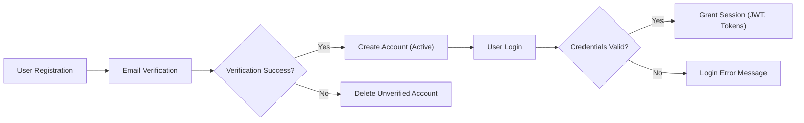
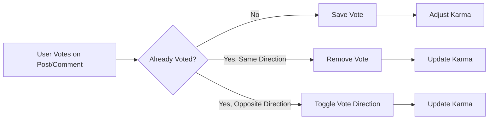
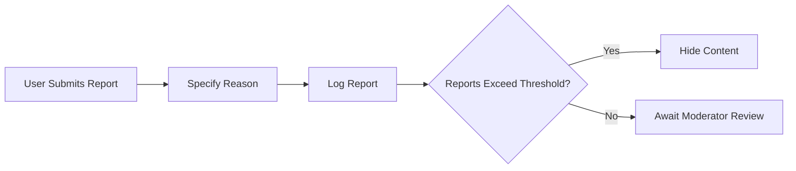

# Functional Requirements Specification for Community Platform

## 1. Introduction
The community platform enables registered users to create, join, and participate in topic-driven communities (akin to subreddits on Reddit). Users interact by posting content, voting, commenting, and reporting, all underpinned by a karma and reputation system. These requirements are structured to eliminate ambiguity and are written to be immediately actionable by backend engineers.

---

## 2. User Registration and Login

### Registration
- WHEN a new user wants to participate, THE communityPlatform SHALL allow registration using a valid, unique email and password combination.
- THE communityPlatform SHALL verify that email addresses are unique across all accounts.
- WHEN a user submits registration, THE communityPlatform SHALL send a verification email with a unique token.
- IF the user fails to provide a valid token within 24 hours, THEN THE communityPlatform SHALL invalidate the registration attempt and delete the unverified account.

### Login
- WHEN a user enters their email and password, THE communityPlatform SHALL validate credentials and establish a new authenticated session upon correctness.
- IF authentication fails, THEN THE communityPlatform SHALL present a clear error indicating invalid credentials, allowing retry.
- THE communityPlatform SHALL lock an account after 5 consecutive failed login attempts within 10 minutes, displaying a message and requiring password reset or a waiting period.

### Password and Session Management
- THE communityPlatform SHALL allow users to initiate password reset via email at any time.
- WHEN a user changes their password, THE communityPlatform SHALL immediately revoke all existing sessions but the current.
- THE communityPlatform SHALL issue JWT tokens upon successful login, with access tokens expiring in 30 minutes and refresh tokens valid for 14 days.
- THE communityPlatform SHALL store authentication tokens securely according to industry best practices.

## 3. Community (Subreddit) Management

### Creation
- WHEN an authenticated user submits a valid community name and description, THE communityPlatform SHALL create a new community unless an existing one matches case-insensitively.
- IF the name is less than 3 or more than 50 characters, THEN THE communityPlatform SHALL reject creation with an error message.
- IF the description is empty or exceeds 250 characters, THEN THE communityPlatform SHALL reject creation.
- WHERE a community already exists with a similar name (ignoring case and symbols), THE communityPlatform SHALL prevent duplication.

### Membership and Moderation
- WHEN a user creates a community, THE communityPlatform SHALL automatically assign them as the initial moderator.
- THE communityPlatform SHALL allow the addition of other moderators by invitation.
- WHEN a user is removed as a moderator, IF they are the last moderator, THEN THE communityPlatform SHALL prevent their removal.

### Editing & Deletion
- WHEN a moderator edits the community, THE communityPlatform SHALL validate changes and record timestamps and editor identity.
- WHEN a community is deleted by a moderator, THE communityPlatform SHALL archive the community and all its posts/comments for at least 30 days before permanent deletion.

## 4. Posting (Text, Link, Image)

### Submission
- WHEN an authenticated user submits a post to a community, THE communityPlatform SHALL accept the following content types: text (up to 10,000 characters), link (validated URL), or image (JPEG/PNG <= 10MB).
- IF a post is submitted without any content or with both link and image, THEN THE communityPlatform SHALL reject the post and show an error message.
- WHERE an image is uploaded, THE communityPlatform SHALL store it in a secure location and verify its integrity and format.
- WHEN a post contains a link, THE communityPlatform SHALL validate that it is a well-formed, non-malicious URL.

### Editing & Deletion
- WHEN a user edits their own post, THE communityPlatform SHALL retain the original content for audit history.
- WHERE a post is deleted, THE communityPlatform SHALL remove it from public view and archive it for 30 days.
- IF a post is deleted, THEN all comments remain but are attached to a placeholder post indicating removal.

### Display & Pagination
- THE communityPlatform SHALL display posts in pages, with a default of 20 posts per page.
- Posts SHALL be sortable by hot, new, top, and controversial algorithms (see "Voting System").
- WHERE there are no posts in a community, THE communityPlatform SHALL show an appropriate message.

## 5. Voting System (Upvote/Downvote)

### Post Voting
- WHEN an authenticated user upvotes or downvotes a post, THE communityPlatform SHALL record the vote and adjust the post’s score and author’s karma accordingly.
- IF a user votes a second time in the same direction, THEN THE communityPlatform SHALL remove their vote, toggling their score impact.
- Users SHALL only be allowed to vote once per post or comment; duplicate votes SHALL be disregarded.
- THE communityPlatform SHALL prevent users from voting on their own posts or comments.

### Algorithm
- THE communityPlatform SHALL calculate a post's "hot" score using upvotes, downvotes, and time since posting.
- THE communityPlatform SHALL calculate "top" by total upvotes minus downvotes.
- "Controversial" SHALL favor posts/comments with near-equal high upvotes and downvotes.

### Error Handling
- IF the voting action fails (e.g., session expired), THEN THE communityPlatform SHALL notify the user and require re-authentication.

## 6. Nested Commenting

### Structure
- WHEN viewing a post, THE communityPlatform SHALL display comments in a nested fashion up to 5 levels deep.
- Each comment SHALL support text content up to 2,000 characters.
- WHEN a user submits a comment, THE communityPlatform SHALL validate input and immediately render the comment or return an actionable error message.
- WHEN a comment is deleted, THE communityPlatform SHALL flag it as removed but maintain child comments.

### Replies
- Users SHALL reply to comments, creating a hierarchy linked by parent/child relationships to a maximum of 5 levels.

### Editing
- Users SHALL be allowed to edit their own comments for up to 30 minutes after creation; edits beyond this period SHALL be prohibited.
- Edit history SHALL be maintained and visible to moderators and admins.

## 7. Karma Calculations

### User Karma
- WHEN a user's post or comment receives an upvote, THE communityPlatform SHALL increase their karma by +1; each downvote SHALL decrease karma by -1.
- Karma SHALL not change for votes on the user's own content or by self-votes (prohibited).
- THE communityPlatform SHALL update visible karma scores within 5 seconds of a vote being registered.
- IF a vote is retracted, THEN the corresponding karma point SHALL be reversed.

### Karma Impact
- WHERE a user's karma falls below 0, THE communityPlatform SHALL restrict the ability to create new communities and may throttle posting.

## 8. Subscription Mechanics

### Subscribing
- WHEN a logged-in user subscribes to a community, THE communityPlatform SHALL add that community to their subscription list.
- THE communityPlatform SHALL allow unsubscribing at any time.
- THE communityPlatform SHALL notify users of new posts/events in their subscribed communities by default (user-configurable).
- IF a user is banned from a community, THEN THE communityPlatform SHALL automatically remove the subscription and prevent re-subscription until the ban is lifted.

## 9. Profile Display

### User Content
- WHEN viewing a user profile, THE communityPlatform SHALL show all non-deleted posts and comments made by the user, sorted by newest first.
- THE communityPlatform SHALL paginate profile content, showing 20 items per page.
- WHERE a user views their own profile, THE communityPlatform SHALL include community subscriptions and current karma.
- WHERE another user views the profile, THE communityPlatform SHALL show only public posts, comments, join date, and total karma.

## 10. Content Reporting

### Reporting Mechanism
- WHEN a user views a post or comment, THE communityPlatform SHALL offer a "Report" action.
- WHEN a report is submitted, THE communityPlatform SHALL require a category (spam, abuse, etc.) and optional description.
- THE communityPlatform SHALL log reports with timestamp, reporter identity, and target content reference.
- WHERE the number of valid reports on a post or comment exceeds a system-configurable threshold, THE communityPlatform SHALL automatically hide the content from public view pending moderator review.
- WHERE a user files more than 5 reports in an hour, THE communityPlatform SHALL flag their account for potential abuse of the reporting function.

---

## 11. Cross-Functional Considerations (Performance, Measurability)
- THE communityPlatform SHALL process all user-visible actions (login, posting, voting, commenting, reporting) within 2 seconds in normal conditions and 5 seconds under peak loads.
- All user actions SHALL be logged for audit purposes, with sensitive data protected in accordance with published privacy requirements.

---

## 12. Mermaid Diagrams of Key Flows

### User Registration and Login Flow

```mermaid
graph LR
    A["User Registration"] --> B["Email Verification"]
    B --> C{"Verification Success?"}
    C -->|"Yes"| D["Create Account (Active)"]
    C -->|"No"| E["Delete Unverified Account"]
    D --> F["User Login"]
    F --> G{"Credentials Valid?"}
    G -->|"Yes"| H["Grant Session (JWT, Tokens)"]
    G -->|"No"| I["Login Error Message"]
```

### Vote and Karma Update Flow

```mermaid
graph LR
    A["User Votes on Post/Comment"] --> B{"Already Voted?"}
    B -->|"No"| C["Save Vote"]
    C --> D["Adjust Karma"]
    B -->|"Yes, Same Direction"| E["Remove Vote"]
    E --> F["Update Karma"]
    B -->|"Yes, Opposite Direction"| G["Toggle Vote Direction"]
    G --> H["Update Karma"]
```

### Content Reporting Flow

```mermaid
graph LR
    A["User Submits Report"] --> B["Specify Reason"]
    B --> C["Log Report"]
    C --> D{"Reports Exceed Threshold?"}
    D -->|"Yes"| E["Hide Content"]
    D -->|"No"| F["Await Moderator Review"]
```
