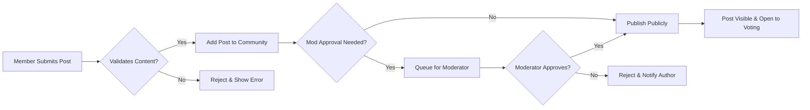

# Functional Requirements Specification for Reddit-like Community Platform

## Introduction
This document captures the complete set of business requirements for a Reddit-like community platform, written in EARS format where applicable, without reference to technical or implementation details. It covers all mandatory system, user, and administrative functions, aligning with business objectives and explicit role-based permissions.

## Core Platform Features
- THE platform SHALL allow guests to browse public communities, view posts and comments, and search for communities and content.
- THE platform SHALL require a registered member account to create posts, comments, vote, subscribe, or report content.
- THE platform SHALL provide secure user registration, login, logout, email verification, password reset, and session/token management as defined in [User Roles & Authentication](./02-user-roles-and-authentication.md).
- THE platform SHALL support English language throughout the user experience.
- THE platform SHALL restrict access to create, edit, or delete actions for unauthorized roles according to the permission matrix.
- THE platform SHALL maintain responsiveness for all primary actions, targeting a response time of under 2 seconds for content loads, posting, voting, and reporting.

## Community Management
### Creation
- WHEN a member submits a valid request, THE platform SHALL enable the member to create a new community with a unique name, title, and description.
- IF a community name or URL slug already exists, THEN THE platform SHALL reject the creation request and provide a descriptive error message.
- WHERE the member is the founder of the community, THE platform SHALL assign them as an initial moderator.
- THE platform SHALL enforce a minimum and maximum allowed length for community names and descriptions as set in [Business Rules & Validation](./06-business-rules-and-validation.md).
- IF a member exceeds allowed community creation limits (per [Business Rules & Validation](./06-business-rules-and-validation.md)), THEN THE platform SHALL reject new community creation for that member.

### Configuration & Management
- WHILE a user is a community moderator, THE platform SHALL allow them to update the community's description, rules, header image, and banner.
- THE platform SHALL allow moderators to define, update, and publish community-specific posting and commenting rules.
- WHEN an admin changes community status to 'banned', 'private', or similar, THE platform SHALL restrict access and display explanatory messages accordingly.
- WHEN a community is deleted, THE platform SHALL archive all posts, comments, and user relationships, following the retention policy in [Policies & Compliance](./10-policies-and-compliance.md).

### Membership
- WHEN a member requests to subscribe to a community, THE platform SHALL add that community to the member’s subscription list and enable personalized feeds.
- WHEN a member leaves or unsubscribes from a community, THE platform SHALL remove the community from their subscription list and adjust feed content accordingly.
- IF a member is banned from a community, THEN THE platform SHALL block their posting, commenting, voting, and viewing of non-public content in that community.

## Posting & Commenting
### Posts
- WHEN a member submits a post (text, link, or image), THE platform SHALL validate content type, length, formatting, and potential prohibited media.
- THE platform SHALL support post types: text-only, link, or image, as restricted by community configuration and system content policy.
- IF a post contains prohibited content or violates platform/community rules, THEN THE platform SHALL reject the submission and provide an explanatory error.
- WHERE community rules require moderation approval, THE platform SHALL queue new posts for moderator review before public visibility.
- WHEN a post is published, THE platform SHALL associate it with the author, community, timestamp, and initialize its vote and comment counts.

### Editing & Deletion
- WHERE a member is the original author of a post, THE platform SHALL allow editing or deletion within the allowed time window (as per [Business Rules & Validation](./06-business-rules-and-validation.md)).
- WHERE a moderator or admin identifies content that violates rules, THE platform SHALL permit them to remove or edit posts with traceable audit logs.

### Comments
- WHEN a member submits a comment, THE platform SHALL validate text format and disallow prohibited content.
- THE platform SHALL support infinite nesting of comments (threaded replies), subject to system-imposed maximum depth (see [Business Rules & Validation](./06-business-rules-and-validation.md)).
- WHEN a comment is posted, THE platform SHALL associate it with the parent post or comment, author, timestamp, and initialize its vote count.
- WHERE a member is the author, THE platform SHALL allow editing or deletion of their comment within the policy-based time window.
- WHERE a moderator identifies rule-violating comments, THE platform SHALL allow removal with trace/audit information recorded.

## Voting System
- WHEN a member upvotes or downvotes a post or comment, THE platform SHALL record the vote and update the total score immediately (within 2 seconds for user experience).
- THE platform SHALL restrict each member to a single (latest) vote per post/comment.
- IF a guest user attempts to vote, THEN THE platform SHALL reject the action and prompt login/register.
- THE platform SHALL display vote scores for all visible content and provide sorting based on total score, recency, or controversy.
- WHEN a vote is cast or revoked, THE platform SHALL recalculate affected karma values and apply sorting as per algorithm rules.
- WHERE posts/comments are controversial (as defined in [Business Rules & Validation](./06-business-rules-and-validation.md)), THE platform SHALL support sorting by 'controversial' algorithm.

## Subscription & Profiles
### Subscriptions
- WHEN a member subscribes or unsubscribes from a community, THE platform SHALL update their personalized feed immediately.
- THE platform SHALL support members browsing, searching, and discovering new communities based on popularity, relevance, and recent activity.

### Profiles
- THE platform SHALL provide a public profile page for each member, showing their post and comment history (subject to privacy and moderation controls).
- WHEN a member views their own profile, THE platform SHALL display their subscription list and full karma breakdown.
- THE platform SHALL show accumulated karma, badges/rewards (if any), and membership status (member, moderator, admin) in the profile view.
- IF a member is banned or has content removed due to violations, THEN THE platform SHALL provide clear information on restrictions within the user’s own profile.

### Karma System
- WHEN a member receives upvotes/downvotes, THE platform SHALL adjust their karma according to explicit, published rules (see [Business Rules & Validation](./06-business-rules-and-validation.md)).
- THE platform SHALL update karma scores in real time after each vote and display changes on user profiles and content.
- THE platform SHALL prevent artificial inflation or abuse of karma by detecting and negating manipulation patterns (as detailed in [Business Rules & Validation](./06-business-rules-and-validation.md)).

## Moderation
- WHERE a member is assigned as a moderator to a community, THE platform SHALL grant permission to remove/pin posts and comments, set community rules, and ban users from that community.
- WHEN a report is submitted, THE platform SHALL notify relevant moderators and provide actionable queues per community.
- WHEN a moderator reviews reported content, THE platform SHALL permit resolve (remove, warn, ban, ignore) actions and record all outcomes for audit.
- WHERE an action is taken on content, THE platform SHALL notify the content author with the reason, except in cases where this would conflict with policy (see [Policies & Compliance](./10-policies-and-compliance.md)).
- WHEN an admin assigns or removes moderators, THE platform SHALL update permissions and provide logs for traceability.
- THE platform SHALL allow admins to perform all moderator actions across any community, as well as system-wide bans and escalated report resolutions.

## Reporting
- WHEN a member reports a post or comment, THE platform SHALL require a category selection (spam, abuse, off-topic, etc.) and a brief explanation.
- THE platform SHALL limit the number of reports per member per day to prevent abuse (as set in [Business Rules & Validation](./06-business-rules-and-validation.md)).
- WHEN the number or severity of reports on content crosses a defined threshold, THE platform SHALL flag the content for immediate moderator review and optionally auto-hide it until reviewed.
- THE platform SHALL provide a transparent log of all reporting actions for moderator/admin review and appeals.
- IF a report is found to be invalid or abusive, THEN THE platform SHALL warn or restrict the abusing member’s reporting privileges as specified in [Business Rules & Validation](./06-business-rules-and-validation.md)).

---

Mermaid Diagram – Core Posting & Moderation Flow:

---

This document defines business requirements only. All technical implementation details, such as API design, data models, and system infrastructure, are at the discretion of the development team. For all validation logic, error handling, or business constraints not covered herein, please refer to the related documents (as titled in the Table of Contents) for comprehensive guidance.