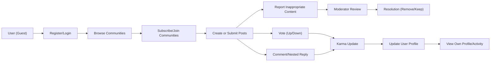

# Service Overview for Reddit-like Community Platform

## Service Mission Statement

THE mission of the community platform SHALL be to empower individuals and communities to connect, share, and discover meaningful content around their interests through transparent, democratic, and engaging online forums. By providing tools for creating, curating, discussing, and moderating community-driven content, THE platform SHALL foster a safe and inclusive environment for open, respectful discourse.

## Target Market and Audience

THE platform SHALL target a broad spectrum of users, including—but not limited to—enthusiasts, hobbyists, learners, professionals, and special interest groups seeking a flexible, topic-oriented community experience. Target users INCLUDE:
- Individuals looking for discussion and information on specific subjects
- Creators and leaders wanting to grow their own communities
- Users dissatisfied with existing platforms due to moderation, relevance, or privacy concerns
- Professionals seeking reliable, crowdsourced advice or collaboration
- Moderators/owners wishing for customizable tools to manage engagements

## Key Goals and Objectives

### Platform-wide Objectives
- Build a robust, scalable online platform where anyone can create, join, and manage topic-focused communities (similar to subreddits)
- Encourage high-quality content sharing (text, links, images), participation, and healthy engagement
- Support democratic voting and discussion (upvotes, downvotes, nested comments) to highlight relevant and popular content
- Create transparent, fair karma and reputation systems for users
- Provide seamless user journeys from onboarding, joining, and participating through to advanced moderation capabilities

### EARS Requirements for Goals
- THE platform SHALL allow users to register, log in, manage accounts, and participate within defined communities.
- WHEN users wish to create communities, THE platform SHALL offer capabilities for flexible, interest-driven community creation and management.
- WHEN a user wants to submit content, THE system SHALL support posting text, web links, and images, provided they comply with community and platform guidelines.
- WHEN a user or moderator encounters inappropriate content, THE platform SHALL offer a reporting workflow for swift moderation and remediation.
- THE system SHALL support threaded (nested) replies to foster rich, in-depth conversations.
- THE platform SHALL compute and maintain user karma based on community-recognized contributions and actions.
- THE system SHALL allow users to subscribe to, leave, and discover communities efficiently.
- THE platform SHALL, at all times, sort and surface content using algorithms for hot, new, top, and controversial ranking paradigms.
- THE platform SHALL provide clear, accessible profiles detailing user contribution history, participation, and reputation.
- THE system SHALL handle error conditions gracefully, including robust feedback on failed authentication, content violations, or moderation outcomes.

## Unique Differentiators

- Full Transparency: All voting, karma, and moderation actions are transparent to users, supporting open governance within communities.
- Customizability: Community creators and moderators have powerful, flexible tools for configuration, rules, and moderation policies.
- Privacy-Focused Onboarding: THE platform SHALL adopt privacy-first practices, requiring the minimum necessary user data and supporting pseudonymous interaction.
- Inclusive & Safe: Enhanced reporting and anti-abuse tools empower users and moderators to maintain safe, respectful discussion spaces.
- Discovery and Engagement: Personalized community recommendation and advanced search features ensure users consistently find relevant, interesting content.

### Comparison to Competitors
- Unlike closed or opaque platforms, the platform emphasizes auditability and user empowerment (e.g., visible karma formulas)
- Community self-management (via robust moderator tools) fosters local autonomy within a transparent global framework
- Modern, scalable architecture (though not defined here), underpinning rapid feature evolution and high availability

## Strategic Success Metrics

THE strategic success of the platform SHALL be measured using business-centric KPIs, including:
- Monthly Active Users (MAU) and Daily Active Users (DAU)
- Number of unique communities created and actively moderated
- User retention rate and new user acquisition velocity
- Distribution of upvotes/downvotes per post and per user
- Volume and resolution time of reported content and moderation actions
- Median response time for core user flows (registration, login, posting, voting)
- Community growth rate and engagement depth (posts, comments, subscriptions per user)
- User-generated content quality metrics as self-reported or rated by the community
- Platform stability and uptime (measured in nines)

## Mermaid Diagram: Strategic Platform Flow

```mermaid
graph LR
    A["User (Guest)"] --> B["Register/Login"]
    B --> C["Browse Communities"]
    C --> D["Subscribe/Join Communities"]
    D --> E["Create or Submit Posts"]
    E --> F["Vote (Up/Down)"]
    E --> G["Comment/Nested Reply"]
    F --> H["Karma Update"]
    G --> H
    E --> I["Report Inappropriate Content"]
    I --> J["Moderator Review"]
    J --> K["Resolution (Remove/Keep)"]
    H --> L["Update User Profile"]
    L --> M["View Own Profile/Activity"]
```

## Business Model

### Why This Service Exists
- THE platform addresses the demand for open, customizable, and topic-centric online communities where user democracy, transparency, and engagement are primary values.
- Existing major platforms may lack sufficient community autonomy, clear moderation processes, robust privacy options, or fair reputation systems.
- The service fills a gap for users who want meaningful, safe interactions and moderators who seek autonomy and advanced management tools.

### Revenue Strategy
- Revenue MAY be generated from non-intrusive advertising, premium memberships granting advanced features, or affiliate partnerships integrated into relevant communities.
- THE platform SHALL ensure all monetization aligns with user privacy, choice, and clarity (no invasive tracking or dark patterns).
- Donation-based and community fundraising models will also be explored for sustaining operations and rewarding top contributors.

### Growth Plan
- THE platform SHALL invest in organic growth, seeding high-interest communities, and incentivizing early moderators/creators.
- Growth strategies INCLUDE referral rewards, spotlighting trending discussions, educational content, and open APIs for third-party discovery.
- THE platform SHALL proactively collaborate with niche groups and community leaders for healthy, inclusive community seeding.

### Success Metrics
- Key metrics INCLUDE: user engagement/retention, community creation and activity rates, moderation and report efficacy, site reliability, and monetization performance against cost-of-service.

## Closing Statement

THE community platform aims to redefine social discussion by centering user empowerment, transparency, and meaningful participation. By building a scalable, fair ecosystem for content, conversation, and community moderation, THE platform is poised for significant, sustainable market impact.