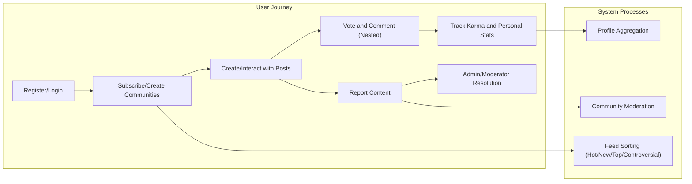

# Service Overview: Reddit-like Community Platform

## Service Vision and Purpose
The Reddit-like community platform aims to empower people to create, join, and participate in diverse online communities. The core vision is to provide a safe, engaging, and flexible space where users can freely share content, discuss topics, and contribute to various interest-based forums while enabling healthy community regulation and encouraging constructive participation.

This platform is designed for users seeking meaningful interactions across different communities, whether by sharing knowledge, seeking support, or exploring interests. Administrators oversee user safety and platform integrity. The purpose of this document is to provide a strategic, business-oriented overview of the platform and establish a high-level foundation for all subsequent requirements and technical specifications.

## Business Model

### Why This Service Exists
Current online communities either target too general an audience or lack modern tools for managing content, moderation, and personalization. While platforms like Reddit have established the paradigm, gaps remain in local content policies, privacy expectations, moderation flexibility, and community ownership models.

The platform is positioned to:
- Address deficiencies in user empowerment, content safety, and flexible customization.
- Fill the need for a moderated yet open and diverse environment for both niche and broad interests.
- Enable users to shape their own experiences and foster civil, self-sustaining communities.

### Revenue Strategy
The service will implement a phased monetization approach:
- **Advertising:** Contextual ads and sponsorship placements that respect user privacy.
- **Premium Membership:** Optional paid features such as ad-free experience, enhanced profile visibility, and exclusive communities.
- **Featured Communities:** Paid promotional placements for communities and posts, with strict content quality review.
- **Potential Additional Streams:** Digital goods, badges, and API/data partnership licenses.

The focus for launch is establishing a robust, engaged user base before integrating premium monetization. The monetization model is designed to be transparent, non-intrusive, and additive to community experience, not disruptive.

### Growth Plan
Growth will initially target digital natives and online community enthusiasts. Acquisition strategies include:
- Community onboarding campaigns with guided creation and content seeding.
- Influencer and key opinion leader partnerships for initial traction.
- Viral sharing and referral bonuses to promote organic expansion.
- Continuous product improvement using user analytics and feedback.

Retention will focus on:
- Personalized discovery of new communities based on user activity.
- Gamified engagement: karma system, badges, leaderboards.
- Timely moderation and quality community management support.

### Success Metrics
- Monthly Active Users (MAU) and Daily Active Users (DAU)
- User retention rates (7-day & 30-day retention)
- Community creation and activity rates
- Average number of posts/comments per user
- Revenue per active user (once monetization is active)
- Number and quality of reported content resolutions

## Core Value Proposition
THE platform SHALL empower any registered user to create, join, and actively participate in interest-based communities, facilitating high-quality content exchange, conversation, and engagement, supported by transparent moderation and robust personalization features.

Key benefits:
- Democratic content governance, allowing users to curate and moderate their own forums
- A reputation (karma) system that encourages valuable contributions and penalizes unwanted behavior
- Frictionless sharing of different content types: text, links, images
- Personalized discovery and engagement, driven by subscriptions and user actions
- Scalable to support both high-traffic public communities and small, niche groups

## Key Features
1. **User Registration and Authentication**
    - THE system SHALL allow users to register and securely log in using unique credentials.
    - THE platform SHALL support user authentication for all actions requiring identification, with JWT-based sessions for security.

2. **Community (Subreddit) Management**
    - WHEN a user creates a new community, THE platform SHALL enforce unique community names and allow initial configuration of rules and moderators.
    - THE system SHALL allow users to search for, join (subscribe to), or leave any public community.

3. **Posting Content**
    - THE user SHALL be able to submit text, links, or images to communities they are subscribed to, subject to content validation and rules.
    - THE system SHALL associate all posts with a specific community and user.
    - WHEN a post is submitted, THE system SHALL process and store it for display in the relevant community.

4. **Upvote/Downvote System**
    - WHEN a user votes on a post or comment, THE system SHALL update vote tallies in real time, restricting each user to one active vote per item.
    - Votes contribute directly to user and content karma.

5. **Nested Commenting**
    - THE system SHALL enable users to comment on posts and reply in a nested (threaded) manner, with each reply assigned to a parent post or comment.

6. **Karma and Reputation**
    - THE platform SHALL calculate user karma based on aggregated upvotes/downvotes on their posts and comments, reflecting their reputation across the platform and within each community.

7. **Content Sorting**
    - WHEN users view community content, THE platform SHALL provide sort options: hot, new, top, and controversial, with sorting logic defined in business rules.

8. **Subscriptions**
    - THE system SHALL allow users to subscribe to or unsubscribe from communities, and use their subscriptions to personalize home and feed views.

9. **User Profiles**
    - WHEN a profile is viewed, THE platform SHALL display the user’s posts and comments, as well as cumulative karma and community memberships.

10. **Content Reporting**
    - WHEN inappropriate content is reported by a user, THE system SHALL record the report, notify administrators or community moderators as appropriate, and track resolution status.

## Market Differentiation
Many platforms provide only light-touch moderation or lack real local autonomy for individual communities. This platform differentiates itself by combining:
- Flexible, multi-tiered moderation (community and platform-wide)
- Full support for anonymous and pseudonymous participation (while supporting traceability for abuse prevention)
- Powerful reputation systems that are visible and actionable
- Modern performance standards (fast loading, real-time updates)
- Open APIs for extensibility (when/if released)
- User-centric privacy and content visibility controls

## Growth and Monetization Strategy
The approach is “community-first, monetization later”. All growth initiatives initially focus on building authentic, engaged user bases. Monetization will begin after achieving a critical threshold of active communities and users.

Expected monetization phases:
1. **Initial Community Growth**: Seed key communities, build engagement, monitor quality
2. **Monetization Rollout**: Introduce unobtrusive ads, then premium features, then brand partnerships
3. **Sustained Expansion**: Scale successful programs, add digital goods, explore internationalization

THE platform SHALL prioritize user trust and transparent opt-in over aggressive monetization. All paid features and ads will be clearly labeled and non-invasive, with strict opt-out options in compliance with privacy regulations.

## Success Metrics
To ensure ongoing alignment with business goals, the following metrics will be tracked:
- Number of active communities and growth rate
- User adoption and engagement (DAU, MAU)
- User retention and churn rates
- Engagement depth (posts/user, votes/user, comments/user)
- Revenue streams diversified across ads, premium, and digital goods
- Quality and speed of content moderation and report handling
- Community satisfaction (measured via surveys and NPS)

---

### Mermaid Diagram: Core Feature Overview

```mermaid
graph LR
  subgraph "User Journey"
    A["Register/Login"] --> B["Subscribe/Create Communities"]
    B --> C["Create/Interact with Posts"]
    C --> D["Vote and Comment (Nested)"]
    D --> E["Track Karma and Personal Stats"]
    C --> F["Report Content"]
    F --> G["Admin/Moderator Resolution"]
  end

  subgraph "System Processes"
    H["Feed Sorting (Hot/New/Top/Controversial)"]
    I["Profile Aggregation"]
    J["Community Moderation"]
  end

  E --> I
  B --> H
  F --> J
```

This overview document supplies foundational business and strategic context for all further requirement, journey, and technical documentation concerning the Reddit-like community platform.