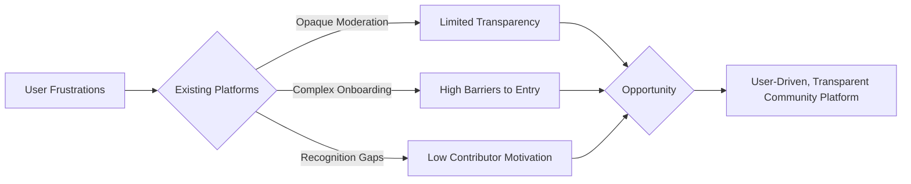

# Problem and Opportunity Analysis

## Market Needs and Gaps

The rapid growth of online communities has revealed persistent challenges and unmet needs for users seeking discussion, collaboration, and content sharing in topic-focused spaces. While established platforms exist, such as Reddit and niche community sites, many users experience a lack of customization, transparency, and trusted moderation.

- THE community platform SHALL provide an easily accessible solution for users seeking to participate in or build interest-based communities, reducing technical barriers to entry and enabling inclusive participation.
- Users and community creators regularly face opaque rules, unpredictable content moderation, and limited mechanisms to manage the growth and ethos of their own communities.
- Market research indicates a high demand for platforms where users can directly influence community culture, moderation standards, and content discovery, while feeling a sense of ownership and belonging.
- Many platforms restrict user initiative through complex onboarding, rigid community structures, or paywalled features, leaving a gap for an intuitive, transparent, and free-to-join alternative.

## User Pain Points

The following user pain points have been observed with current community platforms:

- Frustration over limited control or influence on moderation and content curation processes
- Difficult or confusing onboarding and registration, deterring potential contributors
- Lack of powerful yet simple-to-use mechanisms to report, upvote, downvote, or engage with content and comments
- Inability to track personal reputation or karma, leaving active contributors feeling unrecognized for their efforts
- Controversial, spammy, or abusive content often remains visible too long due to slow or inconsistent reporting and review workflows
- Insufficient discovery and recommendation tools for uncovering relevant communities and content based on user preferences
- Inadequate tools and feedback systems for users who wish to shape the rules and atmosphere of their communities

Concrete requirements identified from these pain points include:
- THE platform SHALL support intuitive user registration, login, and onboarding to reduce abandonment rate.
- WHEN a user interacts with posts or comments, THE platform SHALL provide immediate feedback on voting, reporting, and replies.
- WHEN a user is active in a community, THE system SHALL track and visibly present user karma to incentivize participation.
- WHEN inappropriate content is reported, THE platform SHALL process and surface reports to moderators quickly and transparently.

## Competitive Landscape

The market is currently dominated by platforms like Reddit, Discord, Facebook Groups, specialized forums, and other community-driven sites. These competitors exhibit the following strengths and weaknesses:

| Platform           | Strengths                                             | Weaknesses                                          |
|-------------------|------------------------------------------------------|-----------------------------------------------------|
| Reddit            | Large user base, voting system, wide topic coverage   | Opaque moderation, low transparency, toxic subcultures |
| Discord           | Real-time chat, role management                       | Poor content discoverability, lacks voting           |
| Facebook Groups   | Familiar, network effect                              | Privacy issues, weak moderation tools                |
| Niche forums      | Focused, dedicated members                            | Difficult onboarding, scattered userbase             |

- Many users express a desire for more transparent, fair, and accountable moderation, reflecting a gap in competitor performance.
- Existing sites often fail to recognize or reward valuable user contributions sufficiently, undermining long-term engagement.
- Product complexity and friction create high barriers for new users or those seeking to build and moderate new communities.

## Opportunities for Improvement

Based on the market needs assessment, user pain point analysis, and competitive review, the following opportunities arise:

- THE community platform SHALL empower users to create, moderate, and grow communities with minimal friction and clear privilege delegation.
- THE platform SHALL distinguish itself by providing transparent processes for reporting, moderation, and content ranking.
- WHEN users upvote/downvote or comment, THE system SHALL instantly reflect changes and accurately recalculate karma to promote active engagement.
- THE platform SHALL implement advanced, user-driven content discovery and community recommendation tools to surface the most relevant topics and posts.
- WHEN users browse or search communities, THE system SHALL allow sorting by "hot," "new," "top," and "controversial" to support diverse discovery strategies.
- THE karma system SHALL not only incentivize participation but also reinforce positive behavior, surfacing the most helpful contributors and content.
- Moderators and administrators SHALL have advanced tools to handle inappropriate content efficiently, reducing exposure to abusive or spammy material.

### Visualizing Problem and Opportunity

## Conclusion

Unmet needs for community governance, moderated collaboration, and reputation-tracking create a robust business case for a new, multifaceted Reddit-like platform. By addressing the above pain points and market gaps, and providing actionable improvements over incumbent services, the proposed system can achieve rapid user adoption and sustainable engagement.
