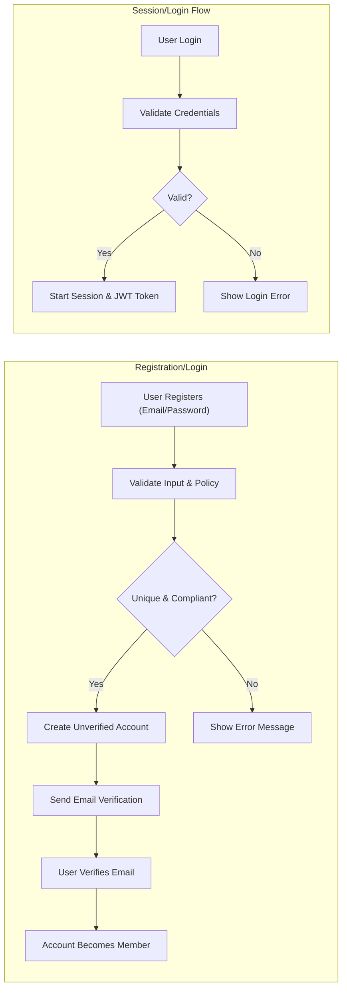

# User Roles and Authentication Requirements for communityPlatform

## 1. User Personas

### Guest
- An unauthenticated visitor who browses public communities and posts. 
- Cannot interact with or create content, or perform voting or reporting actions.
- Persona: "A potential new community member exploring the platform and considering registration."

### Member
- A registered, authenticated user of the platform.
- Can create and participate in communities, submit posts and comments, vote, report inappropriate content, subscribe to and manage profile settings.
- Persona: "A community enthusiast who contributes content, votes, discusses, and actively engages."

### Moderator
- An advanced member granted moderation powers for specific communities.
- Can take action on posts/comments (pin, remove), manage user bans in their assigned communities, and resolve content reports at the community level.
- Persona: "A trusted user responsible for quality and safety in their community."

### Admin
- Platform-wide administrator with the highest level of access.
- Can assign moderators, enforce global bans, configure platform-wide settings, and resolve escalated content or user disputes across all communities.
- Persona: "A staff member ensuring the stability, safety, and legal compliance of the entire platform."

---

## 2. Role Hierarchy and Descriptions

| Role      | Description                                                                 | Scope                            |
|-----------|-----------------------------------------------------------------------------|----------------------------------|
| Guest     | Unauthenticated who can only browse and search                              | Whole platform (read-only)       |
| Member    | Registered user who can create, post, comment, vote, report, subscribe      | Whole platform (as participant)  |
| Moderator | A member assigned moderation in specific communities                        | Assigned communities only        |
| Admin     | Platform administrator (assigns mods, configures platform, handles escalations) | Whole platform (all access)      |

- THE role hierarchy SHALL be as follows: Guest < Member < Moderator < Admin.  
- WHERE a role is higher, THE system SHALL grant all permissions of lower roles, plus role-specific powers, EXCEPT those specifically restricted for business or legal reasons.
- THE platform SHALL allow role upgrades/downgrades only as per admin or moderation process.

### Role Escalation & Delegation
- Moderators are appointed by Admin or by policies outlined in [Policies and Compliance Document](./10-policies-and-compliance.md).
- Admins are established by platform operators and have system-wide control.

---

## 3. Permission Matrix

| Action                                            | Guest | Member | Moderator | Admin |
|---------------------------------------------------|:-----:|:------:|:---------:|:-----:|
| Browse/view posts & communities                   |  ✅   |   ✅   |    ✅     |  ✅   |
| Search for communities, posts, or users           |  ✅   |   ✅   |    ✅     |  ✅   |
| Register account                                  |  ✅   |   ❌   |    ❌     |  ❌   |
| Log in/out, manage session                        |  ❌   |   ✅   |    ✅     |  ✅   |
| Create communities                                |  ❌   |   ✅   |    ✅     |  ✅   |
| Subscribe/unsubscribe to communities              |  ❌   |   ✅   |    ✅     |  ✅   |
| Post text/link/image in communities               |  ❌   |   ✅   |    ✅     |  ✅   |
| Comment (threaded/nested replies)                 |  ❌   |   ✅   |    ✅     |  ✅   |
| Upvote/downvote posts/comments                    |  ❌   |   ✅   |    ✅     |  ✅   |
| Edit/delete own posts or comments                 |  ❌   |   ✅   |    ✅     |  ✅   |
| View user profiles                                |  ✅   |   ✅   |    ✅     |  ✅   |
| View own karma and activity                       |  ❌   |   ✅   |    ✅     |  ✅   |
| Report inappropriate content                      |  ❌   |   ✅   |    ✅     |  ✅   |
| Moderate reported content (remove/approve/ban)    |  ❌   |   ❌   |    ✅     |  ✅   |
| Pin/unpin posts in managed community              |  ❌   |   ❌   |    ✅     |  ✅   |
| Ban/unban users from managed community            |  ❌   |   ❌   |    ✅     |  ✅   |
| Assign/revoke moderator roles                     |  ❌   |   ❌   |    ❌     |  ✅   |
| Platform-wide user/community management           |  ❌   |   ❌   |    ❌     |  ✅   |

---

## 4. Authentication Requirements

### Core Authentication Functions
- THE system SHALL allow users to register with a unique email and password combination following platform-defined policies.
- WHEN a user attempts registration, THE system SHALL verify uniqueness of username/email, validate password policy compliance, and send an email verification link.
- WHEN an unauthenticated user logs in, THE system SHALL validate credentials and establish a session on success.
- WHEN a user completes email verification, THE system SHALL allow full platform functionality tied to the member role.
- THE system SHALL provide password reset functionality via email with secure one-time links valid for a limited duration.
- WHEN a user requests a password reset, THE system SHALL send a reset email only if the email is registered, but shall not reveal the existence of the email for privacy.
- THE system SHALL allow users to change their passwords via authenticated session actions.
- THE system SHALL support user logout, revoking all current session tokens.
- WHERE a user desires, THE system SHALL support revoking all sessions from all devices (e.g., after a security breach).
- WHILE an account is unverified, THE system SHALL limit all posting, voting, community creation, and commenting actions until verification is completed.
- All authentication-related errors SHALL inform the user only of insufficient permissions or failed verification, never leaking sensitive information about accounts or other users.

### Authentication Flows

---

## 5. Session & Token Rules

- THE authentication system SHALL use JWT (JSON Web Token)-based access tokens for all authenticated session management.
- THE access token SHALL have an expiration time between 15 to 30 minutes to balance usability and security.
- THE refresh token SHALL have an expiration of between 7 to 30 days, suitable for persistent logins.
- THE JWT payload for access tokens SHALL include: userId, current role, an array of explicit permissions (derived from the Permission Matrix), and session-specific metadata.
- THE access token SHALL be delivered in a secure, stateless manner (suitable for web and mobile clients).
- THE refresh token SHALL only be issued after successful authentication and provided via secure pathways (httpOnly cookies preferred for increased security).
- WHEN an access token expires, THE system SHALL issue a new access token after validating the refresh token.
- IF a refresh token is expired or revoked (e.g., user logs out), THEN THE system SHALL deny issuance of new access tokens and require re-authentication.
- THE system SHALL allow users to view and revoke all previously issued refresh tokens for their account for transparency and self-service security.
- THE JWT signing secret or key SHALL be stored with the highest security measures in backend infrastructure.
- WHILE a session is active, THE system SHALL revoke or update user permissions in real-time if roles, bans, or system policies change.

---

# Appendix: EARS-Style Requirements Examples

- WHEN a user registers, THE system SHALL require a unique email and compliant password.
- WHEN a user verifies their email, THE system SHALL upgrade their account to member role and unlock all participation features.
- IF login credentials are invalid, THEN THE system SHALL prevent session authentication and show an error with no further account info.
- WHILE a moderator is assigned to a community, THE system SHALL allow moderation actions only within that assigned community.
- WHEN the admin assigns a role, THE system SHALL update the JWT payload and permission matrix for that user immediately.
- WHERE a user is banned in a community, THE system SHALL prevent participation only within that community, but allow use elsewhere (unless globally banned).

All requirements above are testable, role-based, and strictly avoid leaking implementation details while providing all business and technical logic needed for backend implementation.
