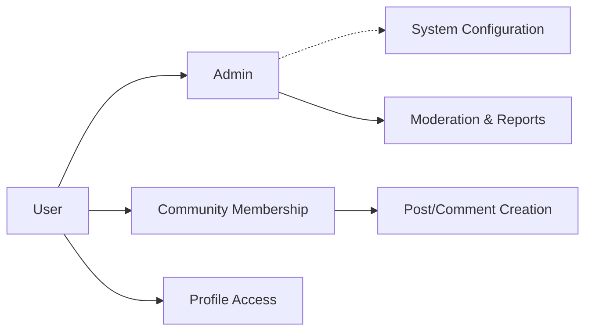
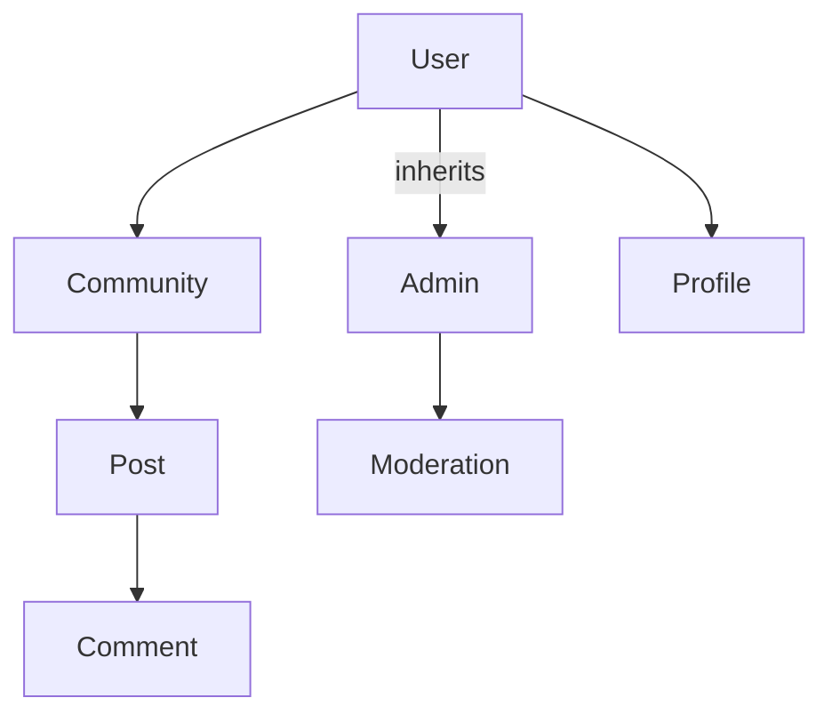
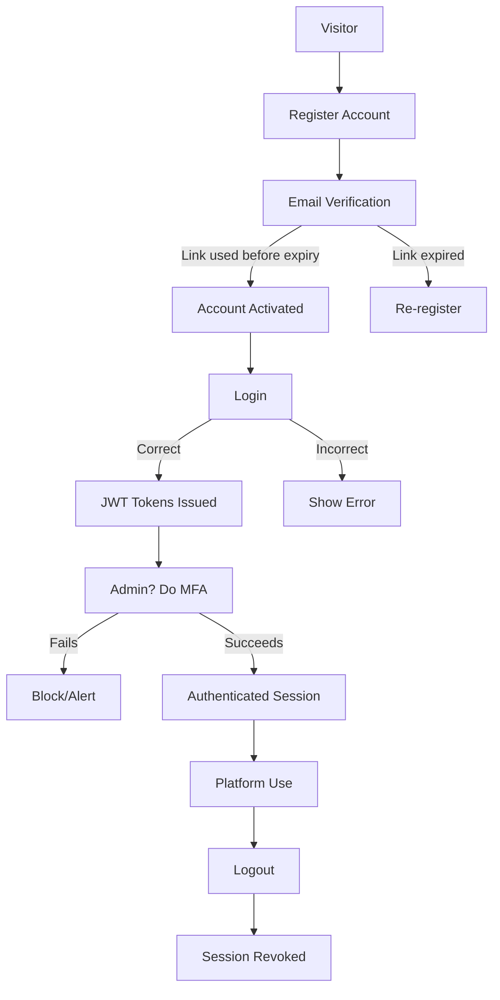

# User Actors and Authentication Requirements for "communityPlatform"

## Introduction
The authentication and authorization system for "communityPlatform" establishes strict, auditable, and actor-specific business processes to secure all user and administrative actions. This document details every authenticatable actor, their roles and permissions, session flows, and behavioral requirements using precise business logic. All rules are written in EARS format for clarity and complete traceability.

---

## 1. Actor Definitions and Access Hierarchy

### 1.1. Defined Actors

| Actor  | Description |
|--------|-------------|
| User   | Registered member authorized to join, create, and participate in communities; post content (text, link, image); upvote/downvote; comment (nested); subscribe to communities; report content; manage personal profile and authentication settings. |
| Admin  | Platform administrator inheriting all user abilities, empowered to moderate any community, enforce platform-wide policies, access all reports, manage users, handle escalation, and configure system-wide security or operational settings. |

### 1.2. Privilege and Inheritance Structure
- Admin is a privileged superset of User (can do everything a User can, plus platform-level moderation and configuration).
- All permission checks are actor-based and enforced on every protected action.
- No regular User can elevate to Admin without explicit platform assignment or promotion.

### 1.3. Actor Relationships Diagram

---

## 2. Permission Matrix

| Action                                      | User | Admin |
|---------------------------------------------|:----:|:-----:|
| Register (create account)                   | ✅   | ✅    |
| Login/Logout                               | ✅   | ✅    |
| Create Communities                          | ✅   | ✅    |
| Subscribe to Communities                    | ✅   | ✅    |
| Submit Posts (Text, Link, Image)            | ✅   | ✅    |
| Upvote/Downvote Posts/Comments              | ✅   | ✅    |
| Comment (Nested)                            | ✅   | ✅    |
| View Own Profile                            | ✅   | ✅    |
| Report Inappropriate Content                | ✅   | ✅    |
| Moderate Reports/Platform Content           | ❌   | ✅    |
| Manage Users/System Settings                | ❌   | ✅    |

- Any action attempted by a User for which permission is not granted SHALL result in clear business error: e.g., "Insufficient privileges. Contact admin if you believe this is an error." (EARS)
- WHERE an Admin attempts prohibited system configurations outside their designated scope, THE action SHALL be denied and logged for review.

---

## 3. Authentication and Authorization Flows

### 3.1. Registration and Verification
- WHEN a non-registered actor submits a valid unique email, password (adhering to strength rules), and display name, THE system SHALL:
  - Register the User account (pending verification)
  - Send a verification email (containing one-time link valid for 24 hours)
  - Restrict voting, posting, and reporting until account is verified
- WHEN a User clicks the verification link on time, THE system SHALL activate the account and grant full User access.
- WHEN verification is attempted after expiry, THE system SHALL invalidate the pending User and require re-registration.

### 3.2. Login and Session Handling
- WHEN a verified User submits correct credentials, THE system SHALL issue both access (JWT, valid ≤30 minutes) and refresh tokens (valid ≤14 days), establishing an authenticated session.
- WHEN login is attempted with invalid credentials, THE system SHALL display "Invalid email or password."
- WHEN an account is locked or suspended (e.g., for excessive failed logins, suspicious activity), THE system SHALL provide a business error and direct support channels for remediation.
- WHEN login activity is detected from a new device or location, THE system SHALL notify the account owner via email, log the event, and require additional verification if risk is high.
- WHEN a User logs out, THE system SHALL revoke the current session tokens immediately.

### 3.3. Password Reset and Change
- WHEN a User initiates password reset, THE system SHALL send a one-time link (valid ≤60 minutes), accessible only via the registered email.
- WHEN the password is changed successfully, THE system SHALL revoke all active tokens for the User except the one in use, requiring re-authentication elsewhere.
- WHEN failed attempts at password changes surpass 5 in an hour, THE system SHALL lock the operation and notify the account holder.

### 3.4. Admin Authentication
- WHEN an Admin logs in, THE system SHALL require MFA (email OTP or mobile authenticator) at every new device or browser session.
- WHEN MFA attempts fail 3 consecutive times, THE system SHALL block further login for 10 minutes and notify platform security.

### 3.5. Session Revocation and Compromise Recovery
- WHEN suspicious login or session activity is detected (impossible travel, multiple IPs), THE system SHALL:
  - Immediately suspend all active user sessions
  - Notify user and admin for account recovery
  - Require password reset and successful verification to restore access

---

## 4. Business Requirements (EARS)

- WHEN an authenticated User requests a protected action, THE system SHALL verify both authentication token and permission for that action based on current actor role.
- WHEN a User attempts an Admin-only action, THE system SHALL deny and log the attempt (including time/user/device), displaying an error: "Administrative privileges required."
- WHEN a session token expires or is revoked, THE system SHALL require re-authentication and notify the user to log in again.
- WHEN a User/Actor is suspected of privilege escalation abuse, THE system SHALL block the account and alert platform security.
- WHEN MFA is enforced for Admins, THE system SHALL not allow access without successful 2nd-factor validation.
- WHEN accounts are deleted (by user or admin), THE system SHALL irreversibly revoke all tokens and anonymize personal identifiers within regulatory compliance windows.
- WHEN a user is banned or suspended, THE system SHALL revoke all tokens, prevent new logins, and display a business reason at next login attempt.

---

## 5. JWT/Session Policies & Business Flows

- WHEN authenticating, THE system SHALL issue short-lived access tokens (JWT, ≤30m) and long-lived refresh tokens (≤14d), both signed and scoped to the actor role.
- Access and refresh tokens SHALL be stored securely (e.g., HttpOnly cookies/client storage per security guidelines) and only transmitted over TLS.
- WHEN a refresh token is reused after rotation or already invalidated (possible theft), THE system SHALL block access, alert the user, and require reauthentication.
- WHEN the session expires or User logs out, THE system SHALL destroy associated tokens and invalidate session server-side.
- WHEN a privileged session lasts more than 1 hour, THE system SHALL require Admins to re-validate with MFA for continued access.
- WHEN a session is manually revoked (by self or admin), THE system SHALL immediately block all current and future use of the token(s).
- WHEN any authentication error occurs, THE system SHALL return actionable business messages, never exposing sensitive details (e.g., never specify whether email exists on login failure).

---

## 6. Edge Cases, Denied Access, & Security

### 6.1. Suspicious Activity and Compromised Accounts
- WHEN user account compromise is detected (reported/phishing/suspicious logins), THE system SHALL enforce full session revocation, require password change, and alert support.
- WHEN a session is terminated for security, THE user SHALL be shown a message: "Your session was terminated for security reasons. Please reset your password and check your email notifications."

### 6.2. Denial Scenarios
- All attempted privilege escalations, forbidden operations, or excessive failed actions SHALL be logged for audit and security reporting.
- The business error for denied actions is role-specific and avoids technical details, e.g.:
  - User attempting admin actions: "You do not have permission to perform this action."
  - Banned users: "Your account is currently suspended. Contact support."

---

## 7. Mermaid Diagrams: Access & Auth Flows

### 7.1. Actor Role and Permission Structure

### 7.2. Registration and Authentication Flow

---

## 8. Related Documents and Compliance
- Functional and operational behavior described here is supported and referenced by: [Functional Requirements](./05-functional-requirements.md), [Non-Functional Requirements](./07-non-functional-requirements.md), and [Business Rules/Validation](./06-business-rules-and-validation.md).
- All requirements are written in clear business language and are immediately actionable for backend development and acceptance testing.

---

This enhanced document provides a complete, in-depth reference for authenticatable actors, permission enforcement, and robust authentication/authorization flows, ensuring their correct implementation and compliance across "communityPlatform" backend services.