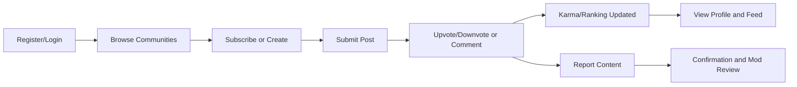
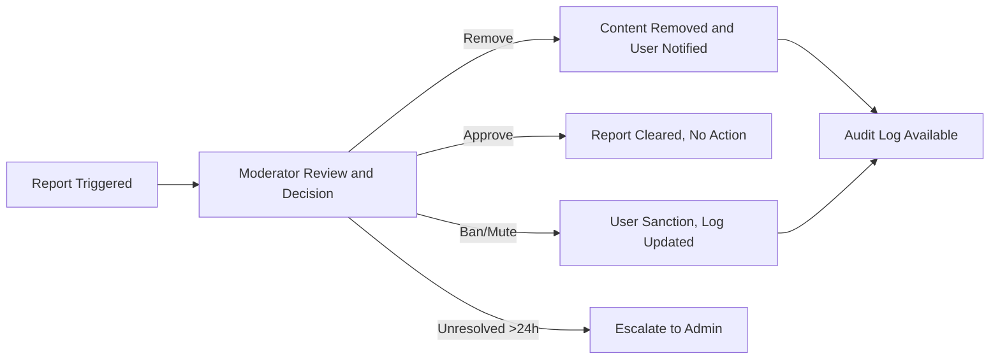
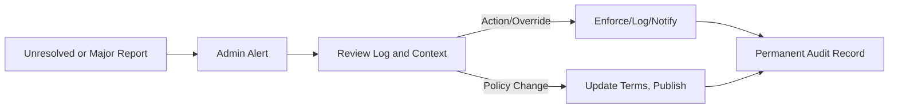

# Reddit-like Community Platform: Value Proposition Analysis

## Introduction

World-class online communities require a platform that delivers tangible value to core actors: users, moderators, and administrators. This document analyzes specific, differentiated business value for each actor, describes measurable requirements in EARS format, and provides actionable scenarios and flows to guide robust backend implementation. Competitive context and gap analysis ensure each business rule addresses a clear market need.

## For Users

### Value Delivered
- Empowerment to create, join, and shape communities centered on shared interests, with no centralized gatekeeping
- Publication of diverse content: text, links, images—enabling richer participation
- Equal voting influence (upvote/downvote) on both posts and comments, supporting democratic curation
- Unlimited nested commenting for in-depth conversations and self-organizing topic threads
- Continuous, visible recognition via karma scores and transparent ranking
- Personalized experience through community subscriptions, custom feeds, and advanced sorting tools (hot, new, top, controversial)
- Comprehensive public profiles showing each user’s posts, comments, and reputation across communities
- Easy paths to report and mitigate inappropriate or harmful content, directly improving community quality

### Market Gaps Addressed
- Fragmented niche forums and groups lack unified discovery and real-time engagement
- Competing platforms obscure moderation and voting, leading to perceptions of unfairness or manipulation
- Reward mechanisms are rare or obfuscated elsewhere, reducing user motivation
- Contributions of newcomers and minority voices often get buried in traditional or ad-driven feeds

### EARS-Based Requirements for Users
- THE system SHALL allow any authenticated user to create a community with a unique, valid name, visible site-wide within 5 seconds of creation.
- WHEN a user pens a post (text/link/image), THE system SHALL validate all content, associate it with a target community, and display the post on community and profile feeds instantly.
- WHEN a user casts a vote on any post or comment (except their own), THE system SHALL update visible vote tallies and adjust author karma within 2 seconds for immediate feedback.
- THE system SHALL support threaded comments with a minimum nesting depth of 3 and preserve reply structures on all device types.
- WHEN a user subscribes or unsubscribes to a community, THE system SHALL update the user feed and profile in real time, always exposing the most relevant content first.
- IF a user views a profile, THE system SHALL present a reverse-chronological timeline of posts and comments, total karma, and a list of subscribed communities, respecting privacy settings.
- WHEN a user taps "report" on content, THE system SHALL capture a reason, prevent duplicate reporting, and confirm the action visibly—initiating the moderation workflow within 60 seconds.

### Business Scenario
A new user registers, subscribes to three communities about technology and photography, posts an image to one, and comments on trending content. As other users upvote and reply, her karma rises; she receives a notification when her post is highly ranked. Upon encountering spam, she reports it—receiving confirmation and seeing the offending item removed after moderator review.

### User Value Flow (Mermaid):

## For Moderators

### Unique Moderator Value
- Local authority to enforce rules, ensure civil discourse, and grow healthy communities
- Direct tools for timely removal, approval, or pinning of posts/comments—minimizing harmful or off-topic content
- Quorum-based review for reported items; avoids unilateral judgments or stagnation
- Ability to ban, mute, or escalate recurring abusers and maintain real-time audit logs
- Auto-escalation of severe reports or inactive cases to administrators
- Transparent moderation log, listing all mod actions for accountability and dispute resolution
- Communication utilities (notices, onboarding messages) to shape community onboarding

### Gaps Addressed
- Most platforms limit moderator tools, require admin intervention, or lack transparency in report handling
- High-volume communities on competitors become unmanageable due to absence of triage and bulk action flows
- Users often distrust mods due to hidden or deleted action logs elsewhere—this platform exposes the moderation process and history, increasing legitimacy

### EARS-Based Moderator Requirements
- THE system SHALL empower moderators (assigned per community) to remove, approve, pin, or mark posts/comments pending review, with immediate system feedback.
- WHEN a reported item reaches a threshold (e.g., 5 unique reports in 1 hour), THE system SHALL highlight the content for moderator review and optionally auto-hide until resolved.
- WHEN a moderator mutes or bans a user, THE system SHALL instantly update that actor’s permissions within the community, block content creation, and log the sanction with expiry and reason.
- WHEN a moderator takes any action, THE system SHALL record the operation (timestamp, moderator, action type, affected account/content, explanation) and make a visible audit trail available to authorized moderators and admins.
- IF a report goes unaddressed for more than 24 hours, THE system SHALL escalate the case for administrator action and notify all affected parties.

### Moderator Workflow Scenario
A moderator receives a notification when a post passes the spam-report threshold. She reviews the case, sees user-submitted reasons and content history, removes the post, and the action—with her provided reason—is logged. The user is notified, and if they appeal, the system tracks resolution within an auditable interface. A banned user’s permissions are changed in real time, with the ban listed prominently for all other mods.

### Moderator Action Flow (Mermaid):

## For Administrators

### Platform Oversight and Enforcement Value
- Global powers to review and intervene across all communities for compliance, legal integrity, or emergency shutdowns
- System-wide dashboards for health metrics (growth, abuse, moderation backlog, sanctioned accounts, performance)
- Immediate override of moderator actions, including reversal, escalation, and broad-based sanctions
- Direct management of platform policy, TOS updates, and legal requests (e.g., DMCA, GDPR)
- Transparent and durable audit logs for all critical actions, accessible for compliance or investigation

### Market Gaps Closed
- Legacy platforms lack unified oversight, resulting in policy loopholes or blind spots
- Slow or inconsistent administrative response elsewhere results in unresolved abuse or legal noncompliance
- Auditability is rare; this platform’s administrator logs and dashboards enable real-time, historic, and retrospective analysis

### EARS-Based Admin Requirements
- THE system SHALL grant administrators unrestricted read/write access to all users, posts, comments, reports, and moderation logs platform-wide
- WHEN a report exceeds moderator SLA or is escalated for legal/critical reasons, THE system SHALL send an alert to all administrators, who SHALL be able to resolve or override within 1 hour
- WHEN an administrator modifies platform-wide rules (TOS, community creation policy), THE system SHALL update these everywhere visible to users and track the change history
- WHEN legal takedowns or critical content actions are performed, THE system SHALL retain all related logs for 5 years and produce them on audit request

### Admin Oversight Scenario
An administrator sees reports unaddressed for over 24 hours, reviews moderation history, finds a community with repeated violations, and issues a site-wide ban for the offending account. All actions are logged, are instantly visible in platform dashboards, and notifications are sent to moderators and reporters. When the TOS is updated, administrators trigger a system-wide policy refresh.

### Administrator Flow (Mermaid):

## Comparison with Alternatives

| Value                                 | Platform | Traditional Forums | Social Networks | Niche Communities |
|----------------------------------------|:--------:|:-----------------:|:--------------:|:----------------:|
| Open Community Creation                |   ✅     |        ❌         |       ❌        |        ✅        |
| Multi-Format Content Posting           |   ✅     |        ✅         |      Partial    |        ✅        |
| Democratic Upvote/Downvote Ranking     |   ✅     |        ❌         |       ❌        |      Partial     |
| Unlimited Nested Comments              |   ✅     |     Partial       |     Partial     |        ✅        |
| Transparent Karma/Gamification         |   ✅     |        ❌         |     Partial     |      Partial     |
| Personalized Sorting/Subscriptions     |   ✅     |     Partial       |     Partial     |      Partial     |
| Full Moderator Autonomy & Transparency |   ✅     |     Partial       |       ❌        |        ❌        |
| User-Driven Reporting & Safety         |   ✅     |     Partial       |       ✅        |      Partial     |
| Escalation/Accountability              |   ✅     |        ❌         |       ❌        |        ❌        |
| End-to-End Audit Trail & Compliance    |   ✅     |        ❌         |       ❌        |        ❌        |

## Strategic Positioning and Differentiation
- Combines open/community-driven creation and participation with robust, transparent moderation and site-wide oversight
- Exposes all reputation and action metrics for trust—no hidden algorithms or shadow bans
- Ensures all actors are empowered with appropriate tools, accountability, and recourse, accelerating system-wide responsiveness and compliance
- Automatic, business-driven workflows make moderation and escalation efficient and fair for all actors

## Conclusion

The platform is defined by measurable, actor-driven business rules, closing critical market gaps in governance, recognition, discovery, and trust. Through fully accountable voting, karma, moderation, and transparent sanctions, the system delivers sustained value for every core participant—and is structured for safe, scalable growth in all business dimensions.