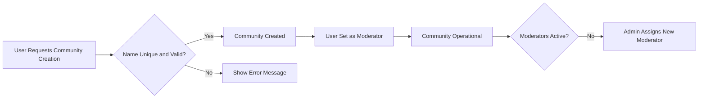
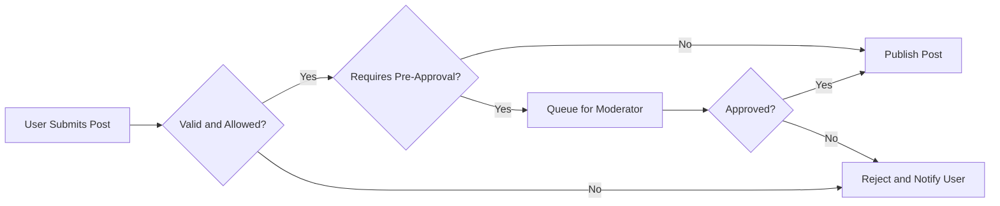
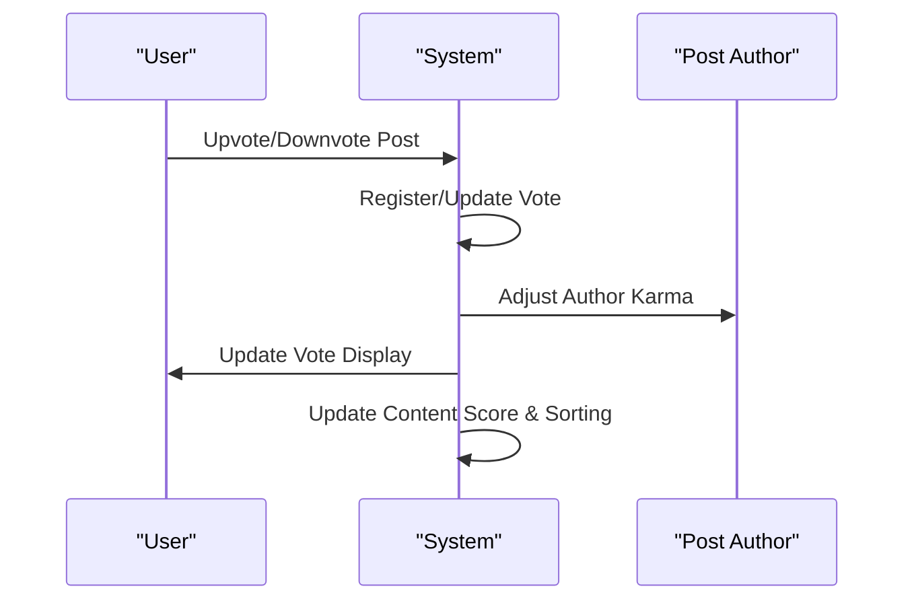
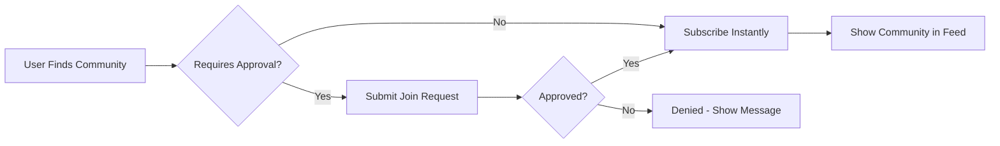
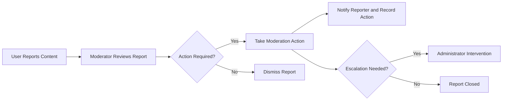

# Service Operation Requirements for Reddit-like Community Platform

## Community Creation and Management

### Overview
Communities (subreddits) are distinct user-driven spaces dedicated to specific topics of interest. Their growth, operation, and management are central to platform engagement. Business rules must ensure fairness, control abuse, and allow organic growth.

### Requirements
- THE platform SHALL allow authenticated users to create new communities, provided chosen names are unique and meet policy rules (length, allowed characters, no offensive language).
- WHEN a user creates a community, THE platform SHALL assign the user as the initial moderator for that community.
- THE platform SHALL ensure that each community has at least one active moderator at all times.
- WHILE a user is a moderator, THE system SHALL enable them to manage community settings (title, description, membership type, image/logo, rules).
- WHERE a community has no active moderators due to departure or ban, THE system SHALL escalate the status and enable administrator intervention to assign a replacement.
- IF a user attempts to create a community with a name similar to existing ones (case-insensitive, ignores special characters), THEN THE system SHALL reject the request and display an explicit error message.
- THE system SHALL prevent users from creating an excessive number of communities within a short timespan to mitigate spam (rate limiting).
- WHEN a community is deleted by eligible moderators or administrators, THE system SHALL archive all posts and comments, marking them as inaccessible for general viewing but retaining them for compliance, legal, or recovery purposes.

**Community Lifecycle Mermaid Diagram:**

## Post and Comment Lifecycle

### Overview
Posts (of type text, link, or image) are the core user-generated content, residing inside communities. Comments support discourse, allow nesting (threaded replies), and form the backbone of conversations.

### Requirements
- THE platform SHALL allow authenticated users to create posts in communities where they are subscribed or where posting is permitted by community rules.
- THE system SHALL support the following post types: text, external link, or image (standard, not proprietary, formats; size limits apply).
- WHEN a user submits a post, THE system SHALL validate required fields (title, type, contents, optional link/image, compliance with community rules).
- IF a post submission fails validation (e.g., missing required field, invalid content, size/format error, violation of policy), THEN THE system SHALL reject the post, providing a clear reason.
- WHERE communities have moderation policies requiring pre-approval, THE system SHALL queue new posts for moderator review before publishing.
- WHEN a post is successfully published, THE system SHALL display it in the community feed according to the selected sorting method (hot, new, top, controversial).
- THE system SHALL allow users to edit or delete their own posts within specific time windows (e.g., 15 minutes for edits, deletions allowed until first comment or upvote present).
- THE system SHALL permit comments on posts, including nested replies (threaded to a reasonable depth).
- WHEN a user replies to a comment, THE system SHALL associate the reply as a child of the original comment, preserving the hierarchical structure.
- IF a user attempts to delete a post or comment with existing replies, THEN THE system SHALL mark the item as deleted for all users but retain child content and display a placeholder indicating deletion.
- WHEN content is removed by a moderator for rule violations, THE system SHALL notify the original author with a reason.
- THE system SHALL record timestamps (created, edited, deleted) for all posts and comments.
  
**Post Lifecycle Mermaid Diagram:**

**Comment Threading Example:**
- WHEN a user writes a reply to any comment, THE system SHALL nest this as a direct descendant within the thread hierarchy.

## Voting and Karma System

### Overview
Upvotes and downvotes determine the visibility and perceived quality of posts/comments, while karma reflects a user’s community reputation. These interactions are core to content curation and user motivation.

### Requirements
- THE platform SHALL allow authenticated users to upvote or downvote any post or comment to which they have access, except their own content.
- WHEN a vote is submitted, THE system SHALL register one active vote per user, per target (post or comment), replacing any previous vote by the same user for the same target.
- THE system SHALL immediately update the visible score upon vote submission; real-time aggregation is required for fast feedback.
- WHEN a vote is cast, THE system SHALL adjust the karma of the target’s author according to configured business rules (e.g., +1 for upvote, -1 for downvote). Separate rules may exist for posts and comments.
- IF a user attempts to vote on their own post or comment, THEN THE system SHALL prohibit the action and display an appropriate message.
- WHERE votes are subject to anti-abuse rules (e.g., vote brigading, rapid repeat voting), THE system SHALL detect and invalidate abusive voting patterns, possibly suspending voting capabilities for abusive users.
- THE system SHALL display accurate upvote/downvote counts and overall scores (e.g., net score: upvotes minus downvotes, or as per configuration).
- THE karma system SHALL aggregate karma by user for profile and reputation display, and may drive privileges or rewards per business rules.
- WHEN displaying post or comment listings, THE system SHALL support sorting by the following methods: hot, new, top, controversial.

**Voting & Karma Sequence Diagram:**

## Subscription and Discovery

### Overview
Subscriptions (following/joining communities) personalize each user’s feed and drive community growth. Discovery enables users to find new communities aligned with their interests.

### Requirements
- THE platform SHALL allow users to subscribe (join) and unsubscribe (leave) any public community at will; restricted or private communities may require approval.
- WHEN a user subscribes to a community, THE system SHALL include posts from that community in the user’s personalized feed.
- THE system SHALL display a list of user-subscribed communities on the user profile and dashboard.
- THE system SHALL enable users to discover new communities via search, recommendations, trending lists, or invitations.
- WHERE a community is invite-only or private, THE system SHALL require join requests and moderator approval prior to granting access.
- THE platform SHALL enable users to unsubscribe without penalty; no content they created is removed by this action, although future participation permissions may be affected.
- THE system SHALL maintain accurate counts of subscribers per community, updating these as users join/leave.
- WHEN a user deletes their account, THE system SHALL automatically unsubscribe the user from all communities and update counts accordingly.

**Subscription Flow Mermaid Diagram:**

## Content Reporting and Moderation

### Overview
Reporting empowers users to flag inappropriate, abusive, or violating content. Moderation ensures community health, with escalation paths for severe or unresolved issues.

### Requirements
- THE platform SHALL allow authenticated users to report any post or comment for reasons including, but not limited to: spam, harassment, rule violation, offensive content.
- WHEN a report is submitted, THE system SHALL create an actionable case for the relevant moderators (or administrators for system-level reports).
- THE system SHALL prevent duplicate reporting by the same user on the same content within a defined time window.
- WHEN moderators review a report, THE system SHALL enable them to take action: remove content, issue user warnings, ban users, or dismiss the report.
- THE system SHALL notify reporting users when action is taken on their report where policy allows.
- WHERE reports are escalated or unresolved by moderators (e.g., inactivity, disagreement), THE system SHALL enable administrators to intervene.
- IF content is removed following a report, THEN THE system SHALL record the action and retain records for audit purposes, displaying placeholder notices in the feed.
- THE system SHALL allow users to appeal moderation actions via a dedicated process (to be detailed further in moderation documentation).
- THE moderation process SHALL maintain logs of all critical actions for compliance, audit, and transparency.

**Moderation Process Mermaid Diagram:**

# End of Document