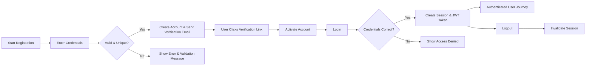
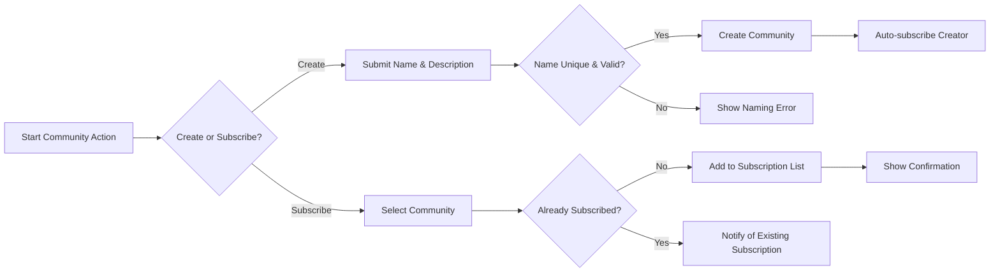
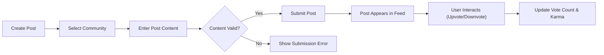
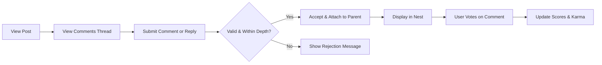
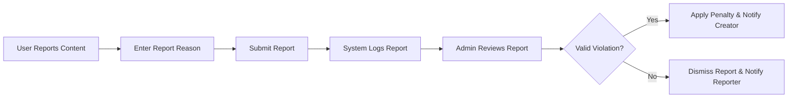

# User Journeys and Flows for "communityPlatform"

## Introduction
This report describes the detailed user journeys and main user flows for the "communityPlatform." The document establishes a clear, process-centric roadmap for system implementation, focusing on business logic and user intentions across all major features. All flows emphasize backend-centric requirements and actor-based perspectives. Requirements are written in natural language using the EARS (Easy Approach to Requirements Syntax) format wherever applicable.

## 1. Actor-based Journeys
### 1.1 User (Member)
- Can register, authenticate, create/join communities, submit and interact with posts, comment (including nested), vote, subscribe, report content, and view their own profile.
- Has access limited to their own posts and the communities to which they subscribe or belong.
- Subject to system-wide moderation rules and karma limits.

### 1.2 Admin
- Can perform all actions available to users.
- Additionally, can manage and moderate communities, handle all reported content, manage users, and oversee platform-wide settings and enforcement.

| Action                              | User         | Admin        |
|-------------------------------------|--------------|--------------|
| Register and Login                  | ✅           | ✅           |
| Create Communities                  | ✅           | ✅           |
| Subscribe to Communities            | ✅           | ✅           |
| Post Submission (Text/Link/Image)   | ✅           | ✅           |
| Upvote/Downvote Posts and Comments  | ✅           | ✅           |
| Comment (Nested)                    | ✅           | ✅           |
| View Own Profile                    | ✅           | ✅           |
| Report Inappropriate Content        | ✅           | ✅           |
| Moderate Reported Content           | ❌           | ✅           |
| Manage Platform Settings/Users      | ❌           | ✅           |

## 2. Registration & Login Flow
### 2.1 New User Registration
- WHEN a non-registered person provides valid email, username, and password, THE system SHALL create a unique user account with the supplied credentials, subject to validation rules (e.g., password strength, email uniqueness).
- WHEN registration succeeds, THE system SHALL send an email verification link.
- WHEN the user clicks the verification link, THE system SHALL activate the account for use.
- IF invalid, duplicate, or weak credentials are submitted, THEN THE system SHALL display an error message indicating required corrective action.

### 2.2 User Authentication (Login)
- WHEN a user provides correct credentials, THE system SHALL authenticate and initiate a session with JWT tokens.
- WHEN incorrect credentials are submitted, THE system SHALL display an error and deny access.
- WHILE the user session is valid, THE system SHALL keep the user logged in across all journeys.
- IF the session or token expires, THEN THE system SHALL require re-authentication, showing appropriate notification.

### 2.3 Logout and Session Management
- WHEN a user logs out, THE system SHALL invalidate the current session and clear authentication tokens.
- WHERE the user loses access by deleting their account, THE system SHALL permanently revoke the session and remove all associated tokens.

#### Registration & Login Flow Diagram

## 3. Community Creation and Subscription
### 3.1 Community Creation
- WHEN a user submits a unique, valid community name and description, THE system SHALL create a new community, assigning ownership to the creator.
- IF the community name is already taken or violates naming rules, THEN THE system SHALL reject creation and display an appropriate error.
- AFTER successful creation, THE system SHALL automatically subscribe the creator to the new community.

### 3.2 Community Subscription & Unsubscription
- WHEN a user selects a community to subscribe, THE system SHALL add the community to their subscription list and notify the user.
- WHEN a user wishes to unsubscribe, THE system SHALL remove the community from their subscription list.
- IF a user attempts to subscribe to a community they already follow, THEN THE system SHALL indicate as such and disallow duplicate action.

#### Community Management Flow Diagram

## 4. Post Creation and Interaction
### 4.1 Creating Posts
- WHEN a subscribed user submits a post with valid title/content, THE system SHALL allow posting text, links, or images within the chosen community.
- WHERE image upload is enabled, THE system SHALL verify file type and size before acceptance.
- IF a post violates content rules or fails validation, THEN THE system SHALL reject submission and display an error.

### 4.2 Interacting with Posts
- WHEN viewing the community feed, THE system SHALL display posts sorted according to user-selected method (hot, new, top, controversial).
- WHEN a user opens a post, THE system SHALL reveal its content, comments, and voting interface.
- WHEN a user upvotes or downvotes, THE system SHALL update the post's vote count and user karma accordingly.

#### Post Creation & Interaction Diagram

## 5. Commenting with Nested Replies
- WHEN a user views a post, THE system SHALL display all comments in a threaded (nested) structure.
- WHEN a user submits a comment or reply, THE system SHALL validate length and content, associate it with the correct parent post or comment, and display it in the correct nest.
- IF the comment or reply exceeds maximum depth or violates rules, THEN THE system SHALL reject and show an appropriate message.
- WHEN users upvote/downvote comments, THE system SHALL update scores and karma appropriately.

#### Nested Comment Flow Diagram

## 6. Karma Accumulation
- THE system SHALL maintain a karma score for each user calculated by aggregating upvotes and downvotes on their posts and comments.
- WHEN a user receives upvotes, THE system SHALL increment their karma by a defined algorithm.
- WHEN a user receives downvotes, THE system SHALL decrement karma by a defined algorithm.
- WHEN abusive or spam content is downvoted or reported and removed, THE system SHALL further penalize the user's karma subject to moderation rules.
- THE system SHALL display total and breakdown of user karma in the user profile.

### Karma Accumulation Logic (Descriptive)
- Upvotes add points, downvotes subtract points.
- Posts and comments contribute differently weighted points.
- Severe penalties applied for content removed due to valid reports.

## 7. Reporting Content
- WHEN a user clicks "Report" on any post or comment, THE system SHALL prompt for a report reason and optional description.
- WHEN the user submits the report, THE system SHALL log the report for review and immediate flagging if critical.
- WHERE an admin reviews a reported content item, THE system SHALL allow marking as valid, false, or unresolved, applying corresponding user penalties or dismissals.
- WHEN a post or comment is found violating community guidelines, THE system SHALL notify the content creator of the moderation action.

#### Content Reporting Flow Diagram

## 8. Common Success Paths
- Successful registration and login with verified account
- Creating or joining vibrant communities
- Posting content to engaged audiences
- Receiving and giving thoughtful comments
- Accumulating positive karma through active participation
- Reporting and resolving inappropriate content, keeping the platform safe

## 9. Error and Edge Case Handling
- Duplicate, invalid, or weak registration data
- Attempting to rejoin or resubscribe to the same community
- Posting or commenting with invalid or disallowed content
- Reaching maximum allowed nesting for replies
- Submitting duplicate votes or invalid voting actions
- Reporting the same content multiple times
- Session expiration and forced re-authentication
- Attempting unauthorized actions (e.g., non-admin user managing reports)

## 10. Performance and User Experience Expectations
- All authentication, posting, voting, and subscription flows SHALL complete within 2 seconds in normal operation.
- Nested comment threads SHALL display in under 1 second up to 50 replies deep.
- Karma score changes SHALL be reflected immediately upon voting.
- Content actions SHALL provide detailed error/success messages to guide the user.

## Conclusion
This document provides an exhaustive specification of all primary and secondary user journeys within "communityPlatform," using EARS requirements and detailed flow diagrams. These flows form the functional backbone for backend development, ensuring that all possible paths, edge cases, and user intentions are comprehensively addressed.