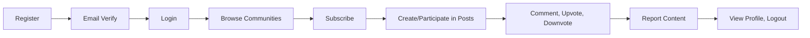
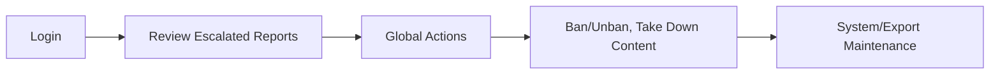

# User Actors, Authentication, and Permission Requirements

## Authentication System Overview
The authentication system for the community platform is designed to safeguard user privacy, enforce business-driven access boundaries, and provide seamless access for different actors. Authentication enables users to register, log in, and interact within the platform, while also supporting elevated permissions for moderation and administration. Authentication and authorization decisions are strictly based on the actor's role as defined by business needs.

### Authentication Philosophy and Flows
- THE platform SHALL use secure authentication methods (email/password, JWT sessions) to ensure only authorized actors access restricted features.
- WHEN a user completes registration, THE system SHALL require email verification prior to full access.
- WHEN a user logs in, THE system SHALL issue a JWT token with user role, permissions, and an expiration time.
- IF token verification fails or the session expires, THEN THE system SHALL prompt the actor to log in again.

## Detailed User Actor Definitions

### User (Registered Member)
- **Description**: A standard registered platform user; creates and participates in communities, submits text/link/image posts, comments (nested replies supported), votes, subscribes, maintains a public profile, and can report content.
- **Business Rules and Restrictions**:
  - THE user SHALL only edit or delete their own content unless otherwise elevated.
  - THE user SHALL only submit one vote per post or comment (vote change allowed unless business logic supersedes).
  - IF the user is banned/muted in a community, THEN THE system SHALL deny participation privileges within that community.
  - THE user SHALL not access moderation or admin interfaces or actions.
  - THE user SHALL report inappropriate content, specifying a reason for each report.

### Moderator
- **Description**: An experienced community member tasked with overseeing one or more communities. Responsible for enforcing rules, moderating content, and managing local user interactions.
- **Business Rules and Responsibilities**:
  - THE moderator SHALL have elevated permissions limited to designated communities.
  - THE moderator SHALL remove, approve, or restore posts/comments in their communities.
  - THE moderator SHALL review reports, take direct action, or escalate unresolved issues to an administrator.
  - THE moderator SHALL mute or ban users violating community guidelines.
  - IF the moderator is found to be abusing tools, THEN THE incident SHALL be flagged for administrative oversight.
  - THE moderator SHALL not perform site-wide administrative actions.

### Administrator
- **Description**: The overarching authority for the platform, with global permissions for community, user, and content management. Administrators enforce site-wide policies and oversee operational health.
- **Business Rules and Responsibilities**:
  - THE administrator SHALL manage all site content, users, and global settings, including platform-wide bans or data exports.
  - THE administrator SHALL resolve escalated reports, override moderator actions, and enforce compliance measures.
  - THE administrator SHALL execute corrective or enforcement actions (bans, removals) for legal, policy, or critical integrity reasons.
  - THE administrator SHALL operate transparently and maintain auditability of all actions.

## Permission Hierarchy Matrix

| Business Action                                                       | User | Moderator | Administrator |
|-----------------------------------------------------------------------|------|-----------|---------------|
| Register, log in                                                      | ✅   | ✅        | ✅            |
| Create communities                                                    | ✅   | ✅        | ✅            |
| Subscribe/unsubscribe to communities                                  | ✅   | ✅        | ✅            |
| Post text/link/image content into communities                         | ✅   | ✅        | ✅            |
| Upvote/downvote posts and comments                                    | ✅   | ✅        | ✅            |
| Nest comments and replies                                             | ✅   | ✅        | ✅            |
| Report inappropriate content                                          | ✅   | ✅        | ✅            |
| Edit/delete own posts/comments                                        | ✅   | ✅        | ✅            |
| Remove/approve posts/comments in community (assigned only)            | ❌   | ✅        | ✅            |
| Ban/mute user within a community                                      | ❌   | ✅        | ✅            |
| Review and resolve content reports in assigned communities             | ❌   | ✅        | ✅            |
| Escalate difficult or unresolved cases to administrators               | ❌   | ✅        | ✅            |
| Set/modify community parameters (sidebar, rules, settings, etc.)      | ❌   | ✅        | ✅            |
| Site-wide user and content management                                 | ❌   | ❌        | ✅            |
| Global bans, moderation overrides, and full data export/maintenance   | ❌   | ❌        | ✅            |

*Legend: ✅ Permitted, ❌ Not permitted*

## Actor-Specific Workflows

### User


### Moderator
```mermaid
graph LR
  A["Login"] --> B["Moderate Community"]
  B --> C["Review Reports"]
  C --> D{ "Resolution?" }
  D -->|"Resolved"| E["Take Moderation Action"]
  D -->|"Unresolved"| F["Escalate to Admin"]
  E --> G["Log Action"]
```

### Administrator


## Authentication and Session Management
- THE authentication system SHALL employ JWT tokens with actor role, permissions, and short-lived expiration for all authenticated sessions.
- WHEN the user logs in, THE system SHALL issue tokens: access token (15-30 min expiry) and refresh token (7-30 day expiry).
- WHEN a token expires, THE user SHALL authenticate again to obtain a new session.
- THE JWT payload SHALL always include actor ID, current role, and business permissions assigned for backend access enforcement.
- IF a user logs out or chooses to invalidate sessions, THEN THE system SHALL immediately revoke corresponding tokens from all relevant devices.
- IF a token is tampered with, expired, or does not match the user, THEN THE system SHALL return a clear authentication error and deny any access.
- WHEN suspicious session activity is detected, THE system SHALL prompt for further authentication (multi-factor, challenge, or notification).
- THE authentication manager SHALL securely store and rotate JWT secret keys.
- THE system SHALL ensure session concurrency restrictions per business requirements (e.g., single device or multi-device sessions).

## Enforcement of Permission Boundaries
- THE system SHALL prevent all privilege escalation attempts, so that users MAY ONLY perform actions allowed by their business role.
- WHEN permission violations are attempted (e.g., posting as banned, moderating without community rights), THE system SHALL log and deny each action, optionally raising alerts for repeat violations.
- THE backend SHALL audit all privileged administrative actions for compliance and future investigation.

## Error Handling and Edge Cases
- IF authentication fails, THEN THE user SHALL be informed clearly (invalid credentials, expired session, insufficient privileges), with actionable next steps (retry, reset password, contact admin).
- THE system SHALL offer user-initiated password resets and session recovery per business rules.
- IF abuse of moderator/administrator tools is detected, THEN THE system SHALL escalate to the highest actor role for review.
- WHEN a user is reset, banned, or deleted, THE system SHALL automatically expire or remove all related sessions and access tokens.