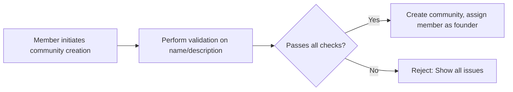
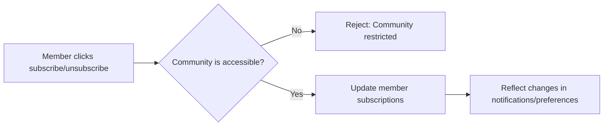

# Business Rules and Validation Constraints for Community Platform

## Introduction
This document defines all business rules and validation logic for posts, comments, voting, karma, subscriptions, and community creation in the Reddit-like community platform. It specifies requirements in EARS format where applicable and clarifies mandatory boundaries for user and system actions as experienced through backend APIs.

## Posting Rules
### Post Creation Constraints
- WHEN a user attempts to create a post, THE system SHALL require the user has 'member' status or higher.
- WHEN creating a post, THE system SHALL ensure the user is an active subscriber or member of the target community unless the community allows posts from non-members.
- THE system SHALL require all posts to specify a valid title, body, and content type (text/link/image).
- THE system SHALL reject posts with empty titles, titles exceeding 300 characters, or titles containing only whitespace.
- THE system SHALL reject post bodies exceeding 40,000 characters for text posts.
- WHEN the post is of type 'link', THE system SHALL validate the link format is a well-formed URL.
- THE system SHALL restrict image posts to specified image formats (e.g., JPEG, PNG, GIF), and a file size not exceeding 10MB per image.
- THE system SHALL limit the number of images per post to 10.
- WHEN posting images, THE system SHALL verify that uploaded files are images, using file type and signature.

### Posting Frequency & Rate Limits
- THE system SHALL enforce a rate limit of 1 post per minute per member per community.
- THE system SHALL limit each member to 100 posts per 24-hour period across all communities.
- IF a user exceeds the posting limit, THEN THE system SHALL reject the submission with an appropriate error message.
- THE system SHALL prohibit users with 'guest' status from posting content.

### Moderation Rules for Posting
- WHERE a community is configured as "moderator approval required," THE system SHALL place new posts by members into a moderation queue for review before publication.
- Moderators SHALL have the ability to approve, reject, or edit posts in the moderation queue for their community.
- IF a member is banned from the community, THEN THE system SHALL reject their post attempts with an error referencing the ban.

## Comment Rules
### Comment Composition
- THE system SHALL require a valid post ID and non-empty body for all comments.
- THE system SHALL reject comments with bodies exceeding 10,000 characters or containing only whitespace.
- THE system SHALL support nested replies to a depth of 10 levels.
- WHEN nested comments exceed the configured maximum depth, THE system SHALL attach replies at the nearest legal ancestor.

### Commenting Frequency & Rate Limits
- THE system SHALL allow a maximum of 60 comments per member per hour, platform-wide.
- THE system SHALL allow only one comment per member per post every 30 seconds.
- IF a user exceeds the limit, THEN THE system SHALL reject the comment and provide an error message.

### Moderation Rules for Commenting
- IF a user is banned from a community, THEN THE system SHALL block commenting in that community.
- Moderators SHALL have the ability to delete, edit, or pin comments in their communities.

## Voting/Downvoting Rules
### Voting Constraints
- THE system SHALL allow only members and above to vote on posts and comments.
- THE system SHALL allow one upvote or downvote per user, per item (post or comment), and permit users to change or revoke their vote at any time.
- THE system SHALL prohibit users from voting on their own content.

### Voting Abuse Prevention
- IF a user attempts to circumvent voting rules (e.g., by using multiple accounts/automation), THEN THE system SHALL detect and prevent abuse based on rate and pattern analysis.
- THE system SHALL rate limit voting to no more than 100 votes per hour per member for posts and 100 votes per hour for comments.
- THE system SHALL record all voting activity for auditing and anti-abuse review.

## Karma Rules
### Accumulation and Loss
- THE system SHALL calculate user karma based on upvotes, downvotes, and other positive/negative interactions on their posts and comments.
- WHEN a post or comment receives an upvote, THE system SHALL increment the author's karma by +1.
- WHEN a post or comment receives a downvote, THE system SHALL decrement the author's karma by -1.
- WHEN a post or comment is deleted, THE system SHALL subtract all accumulated karma from that item from the author's total.
- IF a user's content is removed by a moderator for rule violations, THEN THE system SHALL apply an additional penalty of -10 karma per item.
- THE system SHALL support community-specific display of karma as well as global karma.
- Karma SHALL not fall below zero at the system level.

### Karma Effects and Visibility
- WHERE a user's karma is negative, THE system SHALL restrict access to posting in new communities (configurable per platform policy).
- THE system SHALL display current karma on user profiles and in voting summaries.

## Subscription Rules
### Subscribing and Unsubscribing
- THE system SHALL allow only members and higher to subscribe to communities.
- THE system SHALL allow a member to subscribe to a maximum of 1,000 communities.
- THE system SHALL allow members to unsubscribe from any non-essential community at any time.
- THE system SHALL prohibit subscriptions to banned, deleted, or private communities unless explicitly permitted.
- IF a member is banned from a community, THEN THE system SHALL remove their subscription and prevent resubscription.
- THE system SHALL require all subscription changes to reflect in the user's preferences and notification settings within 5 seconds.

## Community Creation Limits
- THE system SHALL allow only members and above to create new communities.
- THE system SHALL limit each member to creating 5 communities per month.
- THE system SHALL reject community names that are empty, contain only whitespace, exceed 100 characters, or contain prohibited words.
- THE system SHALL enforce unique, case-insensitive community names platform-wide.
- THE system SHALL validate that community descriptions are between 10 and 10,000 characters.
- WHEN a member attempts to create a community in violation of these rules, THE system SHALL return an actionable error message.

## Error Handling and Edge Cases
- IF a user action fails due to rule violation or rate limit, THEN THE system SHALL return specific error codes and human-readable messages.
- THE system SHALL log all failed validation and business rule violations for later review by admins or moderators.
- IF a backend constraint is breached after frontend validation passes, THEN THE system SHALL enforce the rule and guide the user to resolution.
- Error details SHALL never expose sensitive internal logic or security-relevant information.

## Diagrams & Visualizations
### Mermaid Flow: Posting, Voting, Karma Logic

```mermaid
graph LR
  subgraph "Posting Logic"
    A1["Member submits post"] --> B1{"Community allows post?"}
    B1 -->|"Yes"| C1["Check rate limits & member status"]
    B1 -->|"No"| D1["Reject: Cannot post"]
    C1 --> E1{"All validations pass?"}
    E1 -->|"Yes"| F1["Accept/queue post"]
    E1 -->|"No"| G1["Reject: Show error"]
  end

  subgraph "Voting Logic"
    H1["Member clicks upvote/downvote"] --> I1{"Own content?"}
    I1 -->|"Yes"| J1["Reject: Cannot vote own content"]
    I1 -->|"No"| K1["Check rating limits"]
    K1 -->{"Eligible?"} L1["Register vote"]
    L1 --> M1["Trigger karma update"]
  end

  subgraph "Karma Logic"
    N1["Vote recorded"] --> O1{"Upvote or Downvote?"}
    O1 -->|"Upvote"| P1["+1 author karma"]
    O1 -->|"Downvote"| Q1["-1 author karma"]
  end
```

### Mermaid Flow: Community Creation



### Mermaid Flow: Subscription Management



