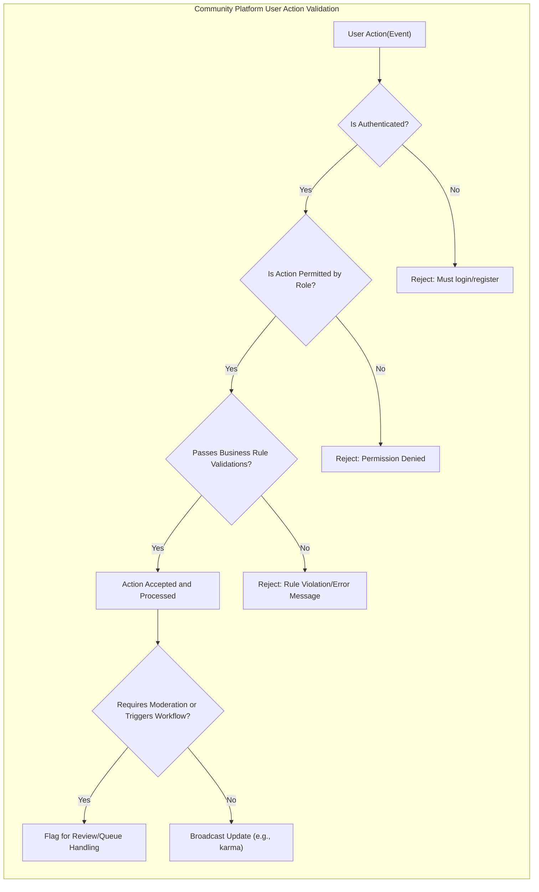

# Business Rules and Validation Logic for the Community Platform

## 1. Community and Post Naming Rules

- THE platform SHALL require unique community (subreddit) names (case-insensitive).
- WHEN a user attempts to create a community, THE system SHALL validate that the name:
  - consists of 3-21 alphanumeric characters (letters and numbers only; underscores allowed).
  - does not include spaces, special symbols (excluding underscores), or offensive language.
  - is not a reserved platform keyword (e.g., "all", "admin", "popular").
  - is not identical (case-insensitive) to an existing community name.
- IF a user submits a community name that violates any above rule, THEN THE system SHALL reject the attempt and display a descriptive error message.
- WHEN creating a post, THE system SHALL require a non-empty title with a maximum length of 300 characters.
- WHEN submitting a post, THE system SHALL enforce content-type-specific requirements:
  - Text posts: body may be empty but must not exceed 40,000 characters.
  - Link posts: must provide a valid URL (HTTP/HTTPS protocol) and a summary (optional, max 300 characters).
  - Image posts: must include at least one valid image upload; accepted formats are JPEG, PNG, or GIF, and the total image size must not exceed 10MB per post.
- THE system SHALL prohibit duplicate post titles within the same community by the same user within the past 24 hours.
- WHEN editing a post, THE system SHALL re-apply all original validation rules.

## 2. Content Moderation Rules

- WHEN any content (post, comment, community description) contains profanity, hate speech, explicit material, or spam indicators, THE system SHALL flag the content for moderation and restrict public visibility until reviewed by an admin.
- WHEN a post or comment is reported more than 3 times by different users, THE system SHALL auto-flag it for admin review.
- WHEN an admin removes or locks content, THE system SHALL immediately hide the content from the public feed, preserve it in the database for 90 days for audit purposes, and notify the content author with the reason for moderation.
- WHEN re-moderating previously moderated content, THE system SHALL maintain an audit log of actions (e.g., removed, restored, edited by admin), linked to responsible admin accounts.

## 3. Voting Constraints

- THE platform SHALL allow only authenticated users to upvote or downvote posts and comments.
- WHEN a user attempts to vote multiple times on the same item, THE system SHALL only allow one active vote per user per item (subsequent votes toggle or remove prior vote).
- WHEN a user votes, THE system SHALL update karma in real-time and recalculate post or comment score immediately.
- THE system SHALL prevent vote manipulation, e.g. vote spam (multiple votes from a single user/IP in a short timeframe).
- WHERE voting is disabled by moderators (e.g., locked threads or posts), THE system SHALL disallow voting actions and inform users appropriately.

## 4. Comment Structure Rules

- THE platform SHALL allow users to post comments and replies to comments (nested comment threads up to a maximum of 10 levels deep).
- WHEN a user submits a comment, THE system SHALL require non-empty text, maximum length 5,000 characters.
- WHEN editing a comment, THE system SHALL revalidate according to the original submission rules.
- WHEN a comment is deleted (by author or admin), THE system SHALL retain a placeholder indicating "[deleted]" and preserve nested replies.
- WHEN displaying nested comments, THE system SHALL visually and structurally maintain reply relationships for up to 10 levels.
- IF a user attempts to reply beyond the allowed nesting depth, THEN THE system SHALL reject the action with a descriptive error message.

## 5. Spam Prevention Measures

- WHEN a user posts more than 3 posts or 10 comments in a 10-minute window, THE system SHALL rate-limit further submissions from that user for 30 minutes.
- WHEN a non-whitelisted user includes a link in a post or comment, THE system SHALL check if the domain is in an approved list or mark the post/comment for moderation.
- WHEN identical or nearly identical content is submitted by the same user within 24 hours, THE system SHALL flag it for potential spam.
- IF multiple accounts from the same IP address are created within a short timeframe (e.g. 5 accounts in 10 minutes), THEN THE system SHALL flag the registrations for admin review.

## 6. Reporting Validation

- THE platform SHALL allow only authenticated users to report content.
- WHEN a user reports a post or comment, THE system SHALL require the user to select a report type from predefined categories (e.g., spam, abuse, off-topic, harassment, explicit content).
- WHEN a report is submitted, THE system SHALL record:
  - the reporting user’s ID
  - the type of report selected
  - the ID of the content being reported
  - timestamp of report
- THE system SHALL restrict users from reporting the same content multiple times.
- WHEN content is reported, THE system SHALL trigger auto-moderation if threshold (e.g., 3 unique reports) is met.
- IF a user abuses the reporting feature (e.g., submits >10 false reports in 24 hours), THEN THE system SHALL temporarily suspend reporting abilities and log the infraction for admin review.

## 7. Karma Logic

- WHEN a user’s post or comment receives an upvote, THE system SHALL increase that user’s karma by 1.
- WHEN a user’s post or comment receives a downvote, THE system SHALL decrease karma by 1, but user total karma cannot drop below 0.
- THE system SHALL display user karma publicly on the user’s profile and as part of their posts/comments.
- WHEN moderators/admins remove content for violating rules, THE system SHALL deduct the full value of upvotes gained on that content from the author’s karma.
- WHEN content previously removed is restored after successful appeal, THE system SHALL return the deducted karma.
- THE system SHALL not award karma to users for their own upvotes or downvotes on their content.

## 8. Mermaid Diagram: End-to-End User Action Validation Flow

```mermaid
graph LR
  subgraph "Community Platform User Action Validation"
    A["User Action(Event)"] --> B{"Is Authenticated?"}
    B -->|"Yes"| C{"Is Action Permitted by Role?"}
    B -->|"No"| X["Reject: Must login/register"]
    C -->|"Yes"| D{"Passes Business Rule Validations?"}
    C -->|"No"| Y["Reject: Permission Denied"]
    D -->|"Yes"| E["Action Accepted and Processed"]
    D -->|"No"| Z["Reject: Rule Violation/Error Message"]
    E --> F{"Requires Moderation or Triggers Workflow?"}
    F -->|"Yes"| G["Flag for Review/Queue Handling"]
    F -->|"No"| H["Broadcast Update (e.g., karma)"]
  end
```

---

This document provides detailed, actionable business rules and validation checkpoints that must be enforced throughout the community platform. All requirements in this document are written for backend enforceability and should be referenced for implementation and testing of all user-related actions, moderation flows, and automated system responses.