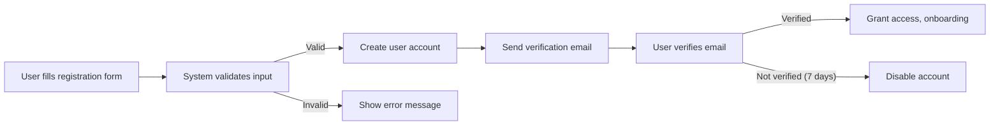
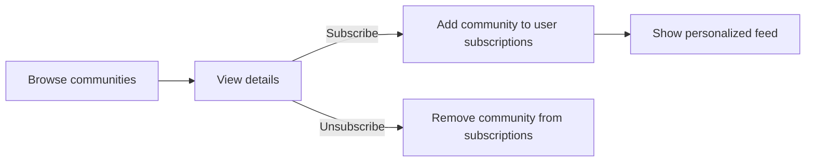
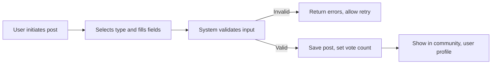
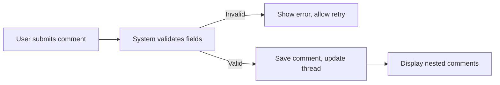
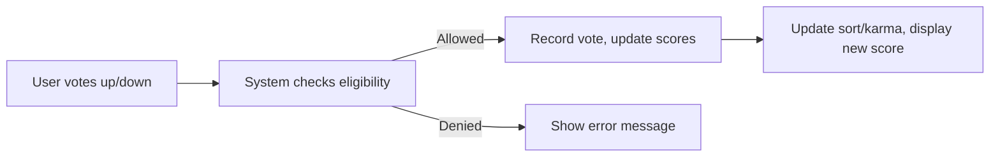

# Primary User Journeys for Community Platform

## Introduction
This document details the essential user journeys for a Reddit-style community platform, covering all major flows that backend systems must support. Each scenario is presented with actionable steps, business logic, validation requirements, and appropriate use of EARS (Easy Approach to Requirements Syntax) format. Actors include users, moderators, and administrators. This document is for backend developers tasked with implementing these features in a type-safe, production-grade environment.

---

## User Registration and Onboarding

### Overview
A new user joins the platform by registering an account and optionally completing onboarding flows. The platform supports self-registration and basic onboarding.

### Steps
1. User accesses the registration endpoint and provides required data (email, password, optional display name).
2. The system validates all inputs according to business rules.
3. The system creates the user and sends an email verification message.
4. User verifies the email and is granted full access.
5. Upon successful registration, user optionally proceeds with onboarding steps (select communities to follow, set up basic profile).

### Requirements (EARS)
- WHEN a new registration is submitted, THE system SHALL validate required fields (email format, password length, uniqueness).
- WHEN email validation fails, THE system SHALL respond with a verification error message.
- WHEN registration inputs meet validation, THE system SHALL create a new user with "user" actor role.
- WHEN a user completes registration, THE system SHALL send a verification email to the specified address.
- IF the email is not verified within 7 days, THEN THE system SHALL disable user login for that account.
- WHEN a user completes email verification, THE system SHALL upgrade the account to "active" state and grant access to all primary features.
- THE system SHALL require minimum password length of 8 characters and at least one alphanumeric character.

### Business Rules
- Email must be unique and not previously registered.
- Password cannot contain the email username.
- Usernames (display names) must be unique, 3-30 characters, alphanumeric plus underscores only.
- After registration, email verification is required for login.
- Unverified accounts will be periodically purged after 30 days.

### Onboarding
- User may select interests or subscribe to initial communities.
- User can skip or return to onboarding at any future login.

### Exception and Error Handling
- IF registration attempts exceed 5 per IP/hour, THEN THE system SHALL apply rate limiting and show an error.
- IF required fields are missing, THEN THE system SHALL reject registration and list missing fields.

### Flowchart

---

## Community Browsing and Subscription

### Overview
Users explore, search, and subscribe to interest communities. Subscription status determines feed personalization.

### Steps
1. User views list of available communities, applies search or filtering.
2. User selects a community to view details (name, description, rules, subscriber count).
3. User subscribes or unsubscribes.
4. Subscribed communities appear in the user’s default feed.

### Requirements (EARS)
- THE system SHALL allow all users (authenticated or not) to view public communities.
- WHEN a user subscribes to a community, THE system SHALL add that community to the user’s subscription list.
- WHEN a user unsubscribes, THE system SHALL remove the community from the list.
- THE system SHALL personalize user feed based on current subscriptions.
- IF a community is set as "private", THEN THE system SHALL restrict access to members only.
- THE system SHALL support searching and filtering communities by name and topic.

### Business Rules
- Community names are unique, 3-30 characters, can include letters, numbers, underscores.
- Users may subscribe to any public or invite-only community.
- Subscription is a reversible action, requires authentication.
- IF a user is banned from a community, THEN THE system SHALL block subscription and access.
- Community details include: display name, unique URL slug, description, rules, creation date, subscriber count, posting rules.

### Exception and Error Handling
- IF a user attempts to subscribe to a banned or private community, THEN THE system SHALL deny the action and show an error.
- IF the community does not exist, THEN THE system SHALL return a 404 error.

### Flowchart

---

## Submission of Posts

### Overview
Authenticated users can create text, link, or image posts within communities to which they have posting rights.

### Steps
1. User selects community and presses "Create Post".
2. User selects post type: text, link, or image.
3. User enters required fields (title required for all, content/link/image as applicable).
4. System validates inputs (field presence, content restrictions, link format, image type/size).
5. System records the post, associates it with the community and user.
6. Post appears in the community and user profile.

### Requirements (EARS)
- WHEN a new post is submitted, THE system SHALL check if the user is authenticated and subscribed (if required).
- WHEN required fields are missing, THE system SHALL return detailed input errors.
- WHERE the post type is "link", THE system SHALL validate URL format and block blacklisted domains.
- WHERE the post type is "image", THE system SHALL restrict image size to 5MB and types to jpg, png, gif.
- WHEN the post is valid, THE system SHALL save it, associate it with the author, and set initial vote count to 1 (upvote by author).
- WHERE a community requires moderator review for new posts, THE system SHALL set the post state to "pending" until approved.
- IF user is banned or muted, THEN THE system SHALL block post creation.

### Business Rules
- Post titles: 5-200 characters.
- Each user can post a maximum of 10 times per community per hour.
- Links must be HTTP(S), not on the explicit blocklist.
- Image posts must have valid file extensions and upload size limit (5MB).
- Moderators may specify additional content rules per community.

### Exception and Error Handling
- IF post input violates community rules, THEN THE system SHALL display all violations at once.
- IF image upload fails, THEN THE system SHALL allow reattempt without losing entered text fields.

### Flowchart

---

## Commenting and Nested Replies

### Overview
All authenticated users can comment on posts and reply to other comments, creating nested (threaded) conversations.

### Steps
1. User selects a post to view.
2. User enters comment in text field (parent = post or existing comment).
3. System validates text length and content.
4. System saves comment, links to post and parent comment (if applicable), timestamps and associates with user.
5. System allows comments to be displayed hierarchically.

### Requirements (EARS)
- WHEN a comment is submitted, THE system SHALL check if the user is authenticated and not banned/muted.
- WHEN required fields are missing (or content exceeds max length), THE system SHALL reject with details.
- THE system SHALL support nesting comments to minimum 3 levels (configurable at system level).
- WHEN a comment is saved, THE system SHALL return the updated comment thread in hierarchical order.
- IF the parent post or comment is deleted or locked, THEN THE system SHALL block further comments.
- THE system SHALL allow users to edit or delete their own comments within 15 minutes of posting (unless locked or removed).

### Business Rules
- Comments: 1-2,000 characters, plain text only (no HTML/script).
- Replies can nest to a system-defined maximum (default: 3 levels deep), then further replies lock at last level.
- Moderators may lock threads or remove comments.

### Exception and Error Handling
- IF the user is banned, muted, or rate limited, THEN THE system SHALL block commenting and give reason.
- IF required fields are missing, THEN THE system SHALL describe fields to complete.
- IF a comment edit window has expired, THEN THE system SHALL deny the change and show last editable timestamp.

### Flowchart

---

## Voting on Content

### Overview
Voting is core to content discovery and the karma system. Users can upvote or downvote posts and comments subject to business rules.

### Steps
1. User (authenticated) clicks upvote or downvote on post/comment.
2. System checks eligibility (login, permissions, self-vote rules).
3. System records user's vote and updates scores.
4. Content score is updated and can affect sort order and karma.

### Requirements (EARS)
- WHEN a user votes, THE system SHALL record the choice and update aggregate scores atomically.
- THE system SHALL only accept one vote per content per user (vote toggling allowed: up, down, remove).
- WHEN a vote is changed, THE system SHALL update post/comment score and user karma accordingly.
- IF a user tries to vote on their own content, THEN THE system SHALL prohibit the action.
- IF the user is restricted (banned, muted), THEN THE system SHALL block voting and display an error.
- THE system SHALL support sorting posts and comments by vote score (hot, new, top, controversial).

### Business Rules
- Only authenticated users may vote.
- Votes on locked/archived content are denied.
- All vote operations must be atomic to avoid double-counting.
- User karma is calculated per defined algorithm (see [Karma and Voting Rules](./08-karma-voting-rules.md)).

### Exception and Error Handling
- IF voting fails due to backend validation, THEN THE system SHALL display a relevant error.
- IF a user attempts to vote multiple times rapidly, THEN THE system SHALL throttle requests.

### Flowchart

---

## Cross-Journey Workflows

### Karma and Voting Impact
- THE system SHALL recalculate user karma and content ranking in real time when votes are cast.
- WHEN reporting, deletion, or moderation influences karma, THE system SHALL reprocess scores accordingly.
- Reference detailed algorithms in [Karma and Voting Rules](./08-karma-voting-rules.md).

### Content Reporting
- WHEN a user reports content, THE system SHALL record the report, associate it with content/user, and notify appropriate moderators.
- IF content receives multiple reports, THEN THE system SHALL prioritize review by moderators.
- THE system SHALL allow reporting reasons (spam, abuse, policy violation).

### Error Handling in Journeys
- WHEN a user encounters an error at any journey stage, THE system SHALL provide actionable feedback and guidance to recover or retry.

### Performance Requirements
- All core flows SHALL complete processing (user perspective) within 2 seconds for success or actionable error response.

---

## Summary
This document defines the universal and actor-specific business requirements for all primary user journeys in the community platform. By following the user flows, backend developers can build robust, consistent, and compliant user interactions that underpin community growth, engagement, and content quality.