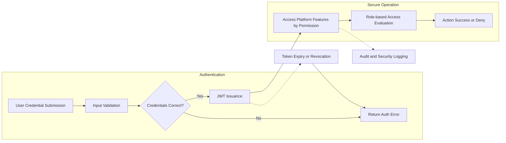
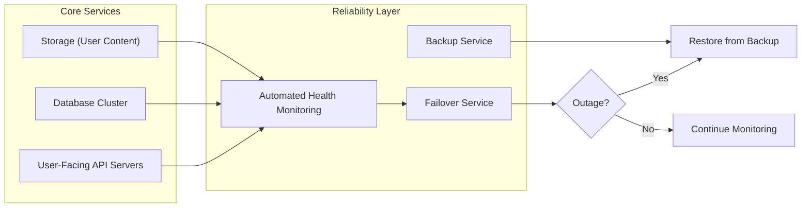

# Non-Functional Requirements for Reddit-like Community Platform

## Security and Data Protection

### Authentication and Authorization
- THE platform SHALL enforce authentication for access to all user-specific and administrative functions.
- WHEN a user presents credentials, THE communityPlatform SHALL securely validate the credentials using salted hashing algorithms.
- THE system SHALL issue JWT access and refresh tokens that expire within industry standard durations (access: ≤30 minutes, refresh: ≤30 days).
- IF a token is expired or malformed, THEN THE communityPlatform SHALL reject the request and provide an appropriate error response.
- WHERE a user is authenticated, THE communityPlatform SHALL authorize each action based on the user’s role and permission matrix.

### Data Protection
- THE communityPlatform SHALL store all user passwords using cryptographic hash functions (e.g., bcrypt, scrypt, or Argon2).
- THE communityPlatform SHALL use TLS (HTTPS) for all data-in-transit to and from the platform.
- WHEN a data breach is suspected, THE communityPlatform SHALL initiate its incident response process within 2 hours and notify relevant stakeholders in accordance with regulatory requirements.
- THE system SHALL restrict access to personally identifiable information (PII) to authorized actors only (e.g., admins for platform moderation).
- IF a user requests their data export, THEN THE system SHALL provide a portable, machine-readable export within 7 days.

### Privacy
- THE communityPlatform SHALL provide privacy controls in accordance with prevailing regulations.
- WHEN a user requests account deletion, THE system SHALL irreversibly delete all associated PII and anonymize remaining data within 30 days, except for legally required audit logs.

### Threat Protection
- THE system SHALL implement rate limiting to prevent brute force, spam, and DDoS attacks.
- THE system SHALL regularly update dependencies and monitor for published vulnerabilities in active components.
- THE system SHALL log all security-relevant events for audit and investigation.

## Performance Expectations
- THE system SHALL deliver authenticated user request responses in ≤1 second for 95th percentile of standard operations (post, vote, comment, or community-related operations).
- WHEN the platform experiences peak loads with up to 10x normal active users, THE system SHALL maintain functional service responsiveness in ≤2 seconds for core actions.
- THE system SHALL support a minimum of 10,000 concurrent authenticated users with no significant degradation in key user actions (registration, posting, voting, commenting).

### Caching and Optimization
- THE platform SHALL cache frequently accessed community, post, and comment data to minimize database queries and latency for read operations.
- THE system SHALL use optimized pagination and sorting algorithms for listing posts (hot, new, top, controversial) to maintain performance at scale.

## Scalability Requirements
- THE system architecture SHALL support horizontal scaling to meet increasing load demands, with no single points of failure for core user operations.
- WHEN user registrations or traffic increases sharply, THE system SHALL scale automatically or by operator action within 15 minutes to restore normal response times.
- THE platform SHALL use stateless service design for API endpoints to facilitate scaling and load balancing.

### Storage Growth
- THE system SHALL accommodate unbounded growth in user-generated content by using scalable storage solutions.
- WHEN storage usage approaches 80% of allocated capacity, THE system SHALL alert administrators and initiate provisioning for additional storage within 24 hours.

## Availability & Reliability
- THE communityPlatform SHALL target an annual uptime of 99.9% (≤8.77 hours downtime per year), excluding planned maintenance.
- THE system SHALL provide automated failover to secondary infrastructure for high-priority services.
- THE platform SHALL monitor all core service health endpoints and notify administrators of critical failures within 5 minutes.
- WHEN an unrecoverable infrastructure failure occurs, THE system SHALL initiate disaster recovery to restore service within 4 hours and restore from the most recent compliant backup.
- THE system SHALL perform full backups of all primary data (user, post, vote, and comment data) at least daily and maintain backup integrity for at least 30 days.

## Compliance (e.g., GDPR)
- THE system SHALL comply with applicable data protection laws and regulations, including GDPR and CCPA where users reside in regulated jurisdictions.
- THE platform SHALL log and track consent for all user data collected for legal compliance.
- WHEN a user exercises their right to rectification, THE system SHALL allow them to correct or update their personal data within 7 days.
- WHEN a law enforcement or regulatory authority requests data, AND the request is legal, THE system SHALL provide only the minimum necessary data required by law.
- THE system SHALL maintain and document a Data Processing Agreement (DPA) with all third-party service providers processing user data on behalf of the platform.

## Visual Overview

### Security and Flow Overview

### System Availability and DR Overview

## References
- See [User Actors and Authentication](./03-user-actors-and-authentication.md), [Exception Handling Strategy](./08-exception-handling-and-recovery.md), and [Functional Requirements Document](./05-functional-requirements.md) for related details on auth, error scenarios, and business-level requirements.
