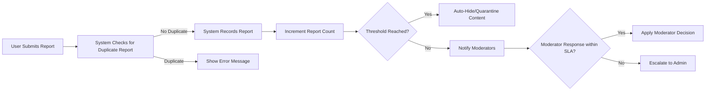
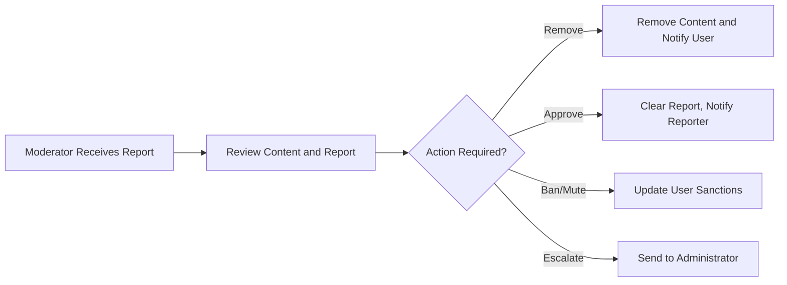

# Secondary and Exceptional Scenarios: Comprehensive Requirement Analysis for Community Platform

## Introduction

This document outlines detailed requirements and business rules for secondary, edge-case, and error-handling scenarios in the community platform. Its objective is to ensure that system behavior is robust, predictable, and fair under all circumstances, covering user reporting mechanisms, profile management, voting boundaries, moderator interventions, and lifecycle management for inactive or deleted accounts. All requirements are written using the EARS (Easy Approach to Requirements Syntax) format wherever possible.

## 1. Reporting Content and Escalation

### 1.1 Reporting Workflow
- WHEN a user submits a report on a post, comment, or community, THE system SHALL record the report with "reporter", "reported_entity", "reason", and "timestamp".
- WHEN a user submits multiple reports on the same entity, THE system SHALL prevent duplicate reports from a single user on the same entity.
- WHEN multiple users report an entity within a short time frame, THE system SHALL increment a report_count and trigger threshold-based attention for moderators.
- WHEN a report is submitted, THE system SHALL provide the reporting user with a confirmation and reference ID.

### 1.2 Edge Case Handling
- IF a user tries to report their own content, THEN THE system SHALL prevent submission and display an explanatory error.
- IF the same content receives excessive reports in a defined period (e.g., 10+ reports in 1 hour), THEN THE system SHALL automatically hide or quarantine the content pending moderation.
- IF reports are judged malicious or abusive (e.g., user abuses the report feature), THEN THE system SHALL log abuse and escalate for administrative review.

### 1.3 Escalation and Moderator Feedback
- WHEN a report is received, THE system SHALL route it to all community moderators for review.
- WHEN no moderator action is taken within a defined SLA (e.g., 24 hours), THE system SHALL escalate the report to site administrators.
- WHEN moderators resolve a report (approve/removal), THE system SHALL notify the reporting user of the outcome as per their notification preferences.

#### Mermaid Flow: Reporting and Escalation

## 2. Profile Editing and Viewing

### 2.1 Profile Editing
- WHEN a logged-in user updates their profile (bio, image, email), THE system SHALL validate all updates for correctness and allowed formats.
- IF a user attempts to upload an unsupported image type or size, THEN THE system SHALL reject the update and display an error with allowed limits.
- WHEN a user changes their username, THE system SHALL ensure global uniqueness and update all references system-wide within 1 minute.
- IF a user attempts to set a forbidden username (e.g., reserved or offensive), THEN THE system SHALL reject the change and provide a reason.
- WHEN a user deletes their profile image, THE system SHALL revert to a default image asset.
- IF a user tries to delete their only linked email, THEN THE system SHALL prevent the action and require at least one verified email.

### 2.2 Profile Viewing
- WHEN a profile is viewed by another user, THE system SHALL display only public information (username, karma, public posts/comments, joined communities).
- WHERE a user has set some fields to private, THE system SHALL hide those fields from non-owner viewers.
- WHEN a user views their own profile, THE system SHALL display both public and private fields, with edit options.

## 3. Boundary Voting Conditions

### 3.1 Duplicate/Invalid Vote Attempts
- IF a user attempts to upvote/downvote the same content more than once in the same direction, THEN THE system SHALL prevent additional votes and display a relevant error.
- WHEN a user reverses their own vote, THE system SHALL update vote counts and karma accordingly, ensuring count consistency.
- IF a user attempts to vote on their own content, THEN THE system SHALL prevent the action and show a user-facing error message.
- WHEN a vote is successfully submitted, THE system SHALL process karma updates within one second.

### 3.2 Voting Limits and Edge Cases
- WHERE a content item is locked or archived, THE system SHALL disable voting and display a notice explaining the reason (e.g., "Voting locked after 6 months").
- IF rapid repeated voting is detected from an account or IP (possible abuse), THEN THE system SHALL rate-limit or temporarily restrict voting capability, alerting the user with a warning.
- WHEN a user's account is suspended or banned, THE system SHALL revoke all ongoing voting ability for the duration of the sanction.

## 4. Moderator Actions on Reports

### 4.1 Moderation Process
- WHEN a moderator reviews an unresolved report, THE system SHALL allow them to perform actions (approve, remove, escalate, ban/mute user, clear report).
- WHEN a moderator bans or mutes a user, THE system SHALL record the event, restrict the user's actions per sanction, and notify the user of the reason and duration.
- IF a moderator attempts a prohibited action (e.g., editing another community's content), THEN THE system SHALL deny the action and log an audit event.

### 4.2 Escalation to Administration
- WHEN a community has no active moderators or a report remains unresolved beyond the SLA, THE system SHALL escalate the report to administrators for resolution.
- WHEN administrators handle an escalated case, THE system SHALL track resolution times and outcomes for compliance and future analysis.

#### Mermaid Flow: Moderator Report Handling

## 5. Handling Inactive or Deleted Accounts

### 5.1 Account Deactivation and Content Orphaning
- WHEN a user requests account deactivation, THE system SHALL mark the account inactive and restrict login and new contributions immediately.
- IF an account is deleted, THEN THE system SHALL remove all personally identifiable information, but preserve posts and comments under an "[deleted]" label.
- WHEN orphaned content is shown (from deleted or inactive accounts), THE system SHALL display ownership as "[deleted]" and ensure no profile link is exposed.
- WHERE an account is reactivated within a defined period (e.g., 30 days), THE system SHALL restore account access and relink content.
- IF a previously deleted account is reactivated after content has been anonymized, THEN THE system SHALL offer the user the option to re-personalize content if technically feasible.

### 5.2 Moderator/Admin Accounts
- IF a moderator or administrator account is deactivated, THEN THE system SHALL immediately reassign moderation responsibilities, notify affected communities, and ensure continuity in moderation.
- WHEN a moderator resumes activity after temporary inactivity, THE system SHALL restore their permissions and access automatically.

## 6. Summary Table: Exception and Boundary Case Coverage

| Scenario                                   | User Action                | System Response                                  |
|--------------------------------------------|----------------------------|--------------------------------------------------|
| Duplicate report on same entity            | Submit repeat report       | Prevent and show error                           |
| Reporting own content                      | Report own post/comment    | Prevent and present explanatory error            |
| Excessive mass reporting                   | Multiple user reports fast | Auto-hide/quarantine content                     |
| Upload unsupported profile image           | Upload large/bad image     | Reject, show allowed limits                      |
| Attempt to vote twice                      | Repeat up/downvote         | Prevent action, show error                       |
| Vote on own content                        | Try to vote up/down self   | Prevent action, show error                       |
| Vote on locked content                     | Vote on archived post      | Disable and explain lock                         |
| Rapid/abuse voting detected                | Fast repeat votes/IP abuse | Rate-limit or restrict voting, warn       |
| User under ban/mute tries action           | Try to post/vote/comment   | Block and show sanction notice                   |
| Deactivated user login                     | Try login after deactivate | Deny login, show status                          |
| Deleted account's post viewed              | View old post/comment      | Show as "[deleted]", hide profile                |
| Moderator leaves community                 | Resign or deactivate       | Reassign or escalate, notify affected community  |

## 7. Performance and SLA Requirements for Exceptions
- WHEN responding to secondary/exceptional scenarios (e.g., reports, account restoration, edge voting cases), THE system SHALL process user-facing transactions within 2 seconds for 95% of cases.
- WHEN running bulk or administrative exception processes (e.g., mass reassignments), THE system SHALL complete within 10 seconds for operations affecting under 1,000 items, providing real-time user feedback.

## 8. Error Handling Principles
- THE system SHALL always provide clear, actionable error messages for prevented user actions, following the pattern: "Action cannot be completed because <reason>."
- WHEN an error occurs in processing secondary/exceptional flows, THE system SHALL log the event with full context for audit and QA review, and escalate for administrative remediation as appropriate.

---

This document provides business requirements only. All technical implementation decisions are delegated to the backend development team. The specification describes WHAT behaviors and rules the system must support—that is, the complete set of secondary, exceptional, and edge-case scenarios. The development team maintains autonomy over the technical solution and implementation.