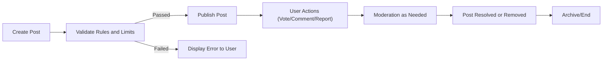
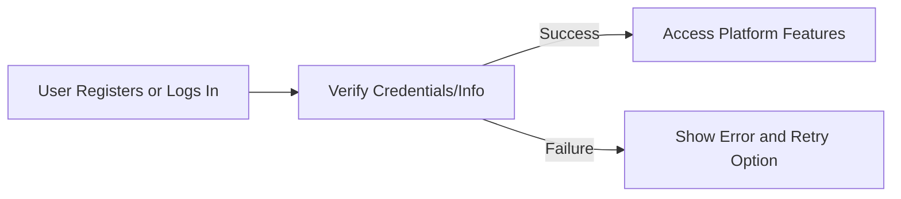
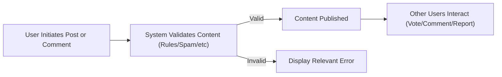
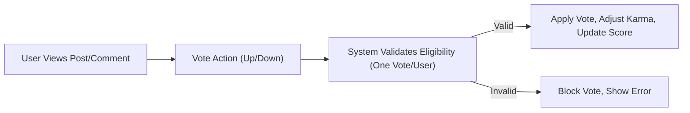
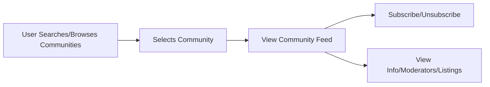
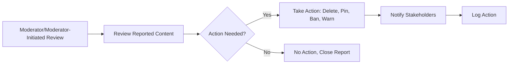
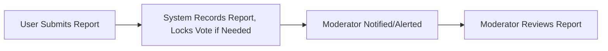

# Business Process Flows for a Reddit-like Community Platform

## Content Lifecycle

Content in the platform follows a structured journey from creation to eventual archival or removal. This section maps the lifecycle for posts and comments.

### Content Lifecycle Stages
- Creation (by authenticated users)
- Validation (system checks including rules and limits)
- Publication (availability to community/restricted visibility)
- User actions (voting, commenting, reporting)
- Moderation (review, escalation, resolution)
- Archival or Deletion

#### Mermaid Diagram: Post Lifecycle

### EARS Requirements (Content Lifecycle)
- WHEN a user attempts to create a post, THE system SHALL validate for compliance with community and platform rules before publication.
- IF a post fails validation, THEN THE system SHALL display the appropriate error message without publishing the post.
- WHEN a post is published, THE system SHALL make it visible in the relevant community.
- WHILE a post is published, THE system SHALL allow eligible users to upvote, downvote, comment, and report according to role permissions.
- WHEN a post is reported or flagged, THE system SHALL trigger the moderation process.
- IF a post is removed by moderation, THEN THE system SHALL prevent it from being displayed to the public and notify the post creator if required by policy.

---

## User Action Flows

This section details the main user-initiated business actions including registration/login, posting, voting, commenting, and community engagement.

### Registration & Login

- WHEN a guest submits registration information, THE system SHALL validate all required fields and create a new member account on success.
- IF login fails, THEN THE system SHALL prompt the user with a relevant error and allow retry.

### Posting & Commenting

- WHEN a member initiates creating a post or comment, THE system SHALL require authentication and verify action permissions.
- WHEN content is published, THE system SHALL allow eligible users to interact according to their permissions.
- IF the content violates rules, THEN THE system SHALL prevent publication and show an error.

### Voting System

- WHEN a member upvotes or downvotes, THE system SHALL confirm eligibility (one vote per item per user) before recording.
- WHEN a vote is recorded, THE system SHALL update the respective scores and adjust karma as per business logic.
- IF a user attempts an invalid/duplicate vote, THEN THE system SHALL block the action and display a suitable error.

### Community Engagement

- WHEN a member subscribes or unsubscribes to a community, THE system SHALL update membership and subscriptions immediately.
- WHEN a user visits a community, THE system SHALL display available posts arranged per requested sorting (hot, new, top, controversial).

---

## Moderation Flows

This section details moderator and admin involvement in the business workflow for keeping communities safe and orderly.

### Moderator-Driven Actions

- WHEN a moderator reviews reported content, THE system SHALL provide a summary of flagged reasons, post history, and user actions.
- WHERE moderator action is justified, THE system SHALL support actions per permissions (deletion, pin, ban, warn).
- AFTER moderator action, THE system SHALL log the action and notify affected users if platform policy requires.
- IF moderator takes no action, THEN THE system SHALL close the report transparently.

### Admin Escalation
- WHEN a report or case is escalated, THE system SHALL transfer review to admin with full audit trail.
- WHEN admin acts, THE system SHALL enforce the outcome system-wide and update logs accordingly.

---

## Reporting/Resolution Flows

Reporting enables users to flag inappropriate or problematic content for review.

### User Reporting Flow

- WHEN a member reports content, THE system SHALL log the report, identifying the reporter, reason, and item involved.
- WHEN a report is filed, THE system SHALL alert appropriate moderators owning the affected community.
- THE system SHALL ensure reported content remains visible pending review unless hidden for policy/urgency reasons.

### Moderator/Resolution Workflow
- WHEN moderation resolves a report, THE system SHALL inform the reporting user of the resolution (if policy allows) and log outcome.
- IF content is removed or user is banned, THEN THE system SHALL enforce consequences immediately, remove or restrict access as appropriate, and provide notification to relevant users.

---

## Process Integration and Role Boundaries

- Guest users can browse and search but cannot create, vote, comment, or report.
- Members can initiate, interact, and report per permissions except in communities where restricted by bans or rules.
- Moderators are empowered in the communities they manage for all local moderation actions.
- Admins can step into any flow for platform-wide management and escalation handling.

---

## Cross-Process Considerations
- All stages shall provide user feedback per outcome (success/failure) in line with platform usability standards.
- System WILL log all significant actions (post, vote, report, moderation) for auditing and review.
- Session and permission checks are to precede all state-changing actions.

---

For functional details, see the [Functional Requirements Document](./05-functional-requirements.md) and [Business Rules & Validation](./06-business-rules-and-validation.md).
