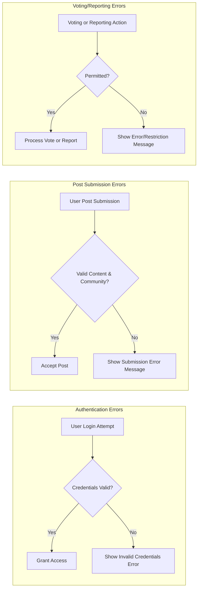

# Exception Handling and Recovery Strategies for Community Platform

## Authentication and Authorization Failures

### Registration Failures
WHEN a user provides an already-registered email during registration, THE system SHALL display a distinct error message: "This email is already registered. Try login or reset your password." WHEN a user submits a password not meeting defined validation rules, THE system SHALL display an error indicating password requirements. IF the user fails to complete mandatory email verification within the allowed timeframe, THEN THE system SHALL invalidate the registration attempt and require re-registration.

### Login Failures
WHEN a user enters incorrect credentials (email or password), THE system SHALL display a generic error: "Invalid email or password. Please try again." IF a user attempts to log in to a banned, deactivated, or suspended account, THEN THE system SHALL deny access and display a business-appropriate message conveying account status and recourse steps (e.g., "Account suspended. Contact support if you believe this is an error."). IF repeated failed login attempts exceed the security threshold (e.g., 5 attempts within 10 minutes), THEN THE system SHALL temporarily lock login for that account for a specified period (e.g., 10 minutes), providing the user with information about when they can try again. IF a user tries to log in with an unverified email, THEN THE system SHALL prompt them to complete email verification first.

### Authorization Failures
WHEN a non-authenticated user attempts actions requiring authentication (e.g., posting, voting, commenting, reporting), THE system SHALL deny action and require authentication. WHEN a user attempts an action requiring admin or special privilege (e.g., moderating, handling reported content, system configurations), THE system SHALL deny access and indicate insufficient permissions. WHEN a user attempts to access another user's private data or restricted community resources, THE system SHALL deny access and explain the restriction in business terms.

## Post/Comment Submission Errors

### Post Submission Failures
IF a user tries to submit a post in a non-existent or deleted community, THEN THE system SHALL return a business error: "Community does not exist or is unavailable." IF submitting a post and the title/content exceeds allowed length, or required fields are missing, THEN THE system SHALL indicate all validation failures specifically (e.g., "Title must be 1-120 characters.") IF a user uploads an image/attachment that is invalid (wrong format, too large, or corrupted), THEN THE system SHALL specify the error—"Image must be JPG, PNG, or GIF and less than 5MB." IF the user loses authentication mid-post, THEN THE system SHALL save entered data locally (if possible) and prompt login before resuming submission.

### Comment Submission Failures
IF a user attempts to comment on a deleted or locked post/comment, THEN THE system SHALL provide a clear message—"Cannot comment: Post or comment is unavailable." IF nested reply chains exceed the allowed nesting depth, THEN THE system SHALL block further replies at that depth and inform the user of the nesting limit. IF the comment text is empty, exceeds the allowed character limit, or includes forbidden content (violations, spam markers), THEN THE system SHALL specify the validation error with actionable language. IF the parent comment or post is flagged or under moderation lock, THEN THE system SHALL deny the comment and indicate moderation status.

## Community and Subscription Errors

### Community Creation Errors
IF a user tries to create a community with a name that violates naming rules (e.g., already taken, too short/long, forbidden words), THEN THE system SHALL match violations to explicit messages detailing which rule(s) failed. WHEN a non-authenticated user attempts to create a community, THE system SHALL require authentication before proceeding.

### Subscription Failures
IF a user attempts to subscribe to a community that does not exist, is deleted, or is private/restricted without proper authorization, THEN THE system SHALL prevent subscription and explain the business reason. IF a user tries to unsubscribe from a community they are not subscribed to, THEN THE system SHALL show a no-op message such as "You are not subscribed to this community." IF the user's subscription limit is exceeded (if business rules define a limit), THEN THE system SHALL display a limit-exceeded message and indicate how to manage existing subscriptions.

## Voting and Reporting Edge Cases

### Voting Failures
IF a user tries to upvote or downvote a post/comment they have already voted on, THEN THE system SHALL ignore the action or toggle vote as per business rules, and reflect the current vote state. IF a user attempts to vote on content that has been deleted, locked, or is under moderation freeze, THEN THE system SHALL block the voting action with a clear business message. WHEN voting as a non-authenticated user, THE system SHALL require authentication. IF voting frequency or system detects spam/abuse patterns, THEN THE system SHALL temporarily restrict further voting and inform user of the restriction and time until reset.

### Reporting Content Failures
IF a user tries to report content already flagged by the same user, THEN THE system SHALL prevent duplicate reporting and state: "You have already reported this content." IF a user attempts to report content that no longer exists, THEN THE system SHALL display: "Content unavailable or removed." WHEN a report submission fails due to missing required reason or exceeding character limits, THE system SHALL display targeted form validation errors. IF admin or moderation action is required for a report but fails (e.g., admin privileges revoked), THEN THE system SHALL notify the actor and log the attempt for audit.

## General Error Handling Strategies

### API and Data Layer Failures
IF a backend service or data store is temporarily unavailable, THEN THE system SHALL show a generic but user-friendly message: "Service is temporarily unavailable. Please try again in a few moments." IF data inconsistency is detected by business logic (e.g., referencing non-existent user, post, or community), THEN THE system SHALL log the error and display a graceful error to users without revealing internal details. IF system detects abnormal responses, THEN THE system SHALL default to the safest business decision (ex: block write, require re-authentication, show error message) and recover gracefully. WHEN any error is encountered that cannot be specifically mapped to a business rule, THE system SHALL show a standardized fallback error: "An unexpected error occurred. Please try again later."

### User Experience and Recovery
WHERE recovery is possible, THE system SHALL provide users with clear next steps or recovery actions (e.g., retry, reset, contact support link). THE system SHALL ensure all error messages are actionable and avoid technical jargon. Performance: WHEN an error occurs during a user-initiated process, THE system SHALL return an error response or message within 2 seconds of processing the event.

### Logging and Auditing
WHEN any business-critical error or exception occurs, THE system SHALL record audit logs including user identity, event context, error type, and recovery or notification actions taken. IF multiple similar errors are triggered repeatedly by the same actor, THEN THE system SHALL aggregate these events for easier business monitoring and abuse detection.

## Diagrams: Error Handling in Core User Flows

---

All exception and error handling requirements in this document are actionable and testable business-level mandates for the community platform. Implementation details, code, or technical stack are not included, but all scenarios are designed to ensure developers and stakeholders can reference explicit error and recovery behaviors for user- and admin-facing flows. For detailed business rules, refer to the Business Rules and Validation document, and for authentication context see the User Actors and Authentication document.