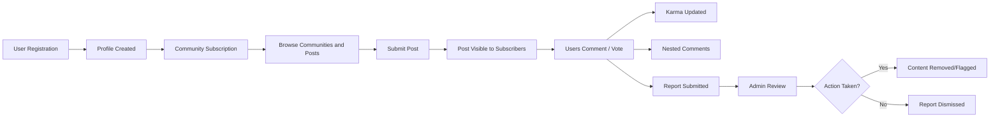
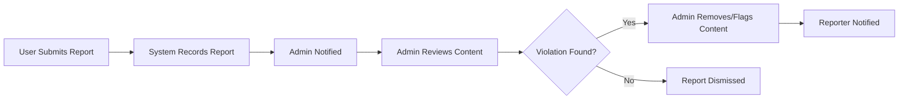

# Data Flow and Lifecycle of Community Platform

## High-level Data Flows

The community platform conceptualizes several key data entities—users, communities (subreddits), posts, comments, votes, subscriptions, karma points, reports, and profiles. Data moves through these entities via clear business processes triggered by user actions or administrator interventions. The platform maintains strict separation of concerns, enabling traceable flows from original creation to long-term persistence or removal.

### Major Data Entities
| Entity        | Description                                                                 |
|--------------|-----------------------------------------------------------------------------|
| User         | A registered member with authentication and a persistent profile            |
| Admin        | A privileged actor managing moderation and platform settings                |
| Community    | Themed space where users may subscribe, post, and interact                  |
| Post         | User-generated content in text, links, or images, linked to a community     |
| Comment      | User-generated message under a post, supporting nested replies              |
| Vote         | Binary value (upvote/downvote) attached to posts or comments                |
| Subscription | User's opt-in to receive updates from a community                           |
| Karma        | Point value summarizing a user's positive contributions                     |
| Report       | User-initiated flag for inappropriate or rule-breaking content              |
| Profile      | Aggregation of a user's posts, comments, and karma                         |

### Conceptual Data Flow Overview

## Information Lifecycle of Posts, Comments, Votes

This section details how major data entities are created, modified, interacted with, retained, and (where possible) removed or archived according to business requirements. All possible events are described using EARS-style behavioral statements.

### Posts
*WHEN a user writes and submits content to a community, THE platform SHALL create a new post entity linked to the author and the community.*

*WHEN a post is created, THE system SHALL timestamp the creation and record the initial vote score (zero by default).* 

*WHEN a user requests a post list from a community, THE system SHALL return posts ordered per the user's sorting criteria (hot, new, top, controversial).* 

*WHEN a user upvotes/downvotes a post, THE system SHALL update the post's score and the author's karma as per defined karma rules.* 

*WHEN a post is deleted by its author or removed by admin for policy violations, THE system SHALL perform soft deletion when possible, retaining post record for data retention policy.*

*IF a post is found to violate community or platform rules, THEN THE admin SHALL be able to remove the post and flag it for future reference.*

*WHEN a post is deleted, THE system SHALL cascade removal or orphaning of related votes, comments, and reports in accordance with data retention requirements.*

### Comments and Nested Replies
*WHEN a user submits a comment to a post, THE system SHALL create a new comment entity linked to the post, author, and optionally a parent comment for nesting.*

*WHEN a user replies to a comment, THE system SHALL record the reply as a nested comment (with parent-child relationship).*

*WHEN comments are listed for a post, THE system SHALL provide them in hierarchical, chronological, or popular order per user selection.*

*WHEN a comment is upvoted/downvoted, THE system SHALL update the comment's vote tally and affect the author's karma accordingly.*

*WHEN a comment is deleted by the author or removed by admin, THE system SHALL flag or remove the comment according to retention policy, recursively applying action to nested replies if relevant.*

### Votes (Upvote/Downvote)
*WHEN a user votes on a post or comment, THE platform SHALL allow only a single active vote (up or down) per entity per user at any time.*

*IF a user attempts to vote again on the same entity, THEN THE system SHALL update (change or remove) the user's original vote as specified in business rules.*

*WHEN a vote is cast or changed, THE system SHALL immediately reflect the new score on UI (upon next fetch) and update karma calculations.*

### Karma System
*WHEN a user's post or comment receives upvotes or downvotes, THE system SHALL aggregate these and modify the user's overall karma score.*

*WHEN a post/comment is removed due to rule violation, THE system SHALL adjust karma scores to remove credit for invalid content.*

### Subscriptions
*WHEN a user subscribes to a community, THE system SHALL create a subscription entity linking the user and community.*

*WHEN a user unsubscribes, THE system SHALL remove the subscription entity, but retain anonymized logs as per retention rules.*

### Profiles
*WHEN a profile is requested, THE system SHALL aggregate the user's posts, comments, karma, and subscribed communities into a displayable summary.*

## Content Reporting Process

This describes the business process for reporting, reviewing, and acting upon inappropriate or rule-breaking content.

### Report Creation
*WHEN a user observes inappropriate content, THE platform SHALL allow the user to submit a report linked to the post/comment, including reason and timestamp.*

*WHEN a report is submitted, THE system SHALL acknowledge receipt and notify admins for follow-up.*

### Report Review
*WHEN an admin reviews a report, THE platform SHALL display relevant context, reason, and prior actions for the content in question.*

*WHEN multiple reports are received for the same content, THE platform SHALL aggregate these for efficient moderation.*

*WHEN a decision is made, THE admin SHALL mark the report as resolved (action taken or dismissed) and notify the original reporter if appropriate.*

### Admin Actions
*WHEN action is warranted, THE admin SHALL be able to remove or flag content, with rationale recorded.*

*WHERE admins act on reported content, THE system SHALL log the action, actor, and content history for auditability.*

*WHEN a report is dismissed, THE system SHALL record decision and close the report, maintaining a record for future reference.*

### Reporting Flow Diagram

## Data Retention Policies

Data persists on the community platform in compliance with business and possible regulatory needs. The following rules define data retention periods, anonymization, and deletion flows:

*THE platform SHALL retain user posts, comments, votes, and reports for the duration required by platform policy or regulatory obligations (e.g., 2 years), even after soft deletion.*

*WHEN a user account is deleted, THE system SHALL anonymize user-identifying fields where legally required while retaining aggregate data for analytics and abuse prevention.*

*WHEN a post or comment is deleted (by the user or admin), THE system SHALL flag the data and enforce actual removal only after the required retention window.*

*WHERE content has active reports or is under review, THE system SHALL prohibit deletion until investigation is complete.*

*ALL audit logs for admin actions, content moderation, and reporting SHALL be retained for a minimum policy duration for compliance and security auditing.*

## Summary

This document has described the business-driven flow and lifecycle of all core data on the community platform, ensuring backend engineers understand every creation, interaction, and retention event conceptually, without specifying architecture, data models, or interface details. All requirements are expressed in EARS for clarity and measurability, providing a single source of truth for all conceptual data processes relevant to communities, posts, comments, votes, reports, subscriptions, profiles, and administrative interventions.