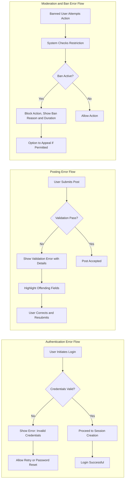

# Error Handling and Exception Management Specification

## 1. Overview of Error Handling Principles
THE communityPlatform SHALL provide clear, consistent, and actionable feedback to users in all error scenarios. Error messages SHALL describe the error in plain language, recommend recovery actions, and never expose technical/internal details. The system SHALL respond to all user-triggered errors within 2 seconds.

---

## 2. Authentication Error Scenarios
### 2.1 Invalid Credentials
WHEN a user submits invalid credentials during login, THE system SHALL display a message indicating authentication failure and offer a retry option.

### 2.2 Account Not Verified
WHEN a user account is not email-verified, THE system SHALL prompt verification before allowing login or restricted actions.

### 2.3 Session Expired
WHEN a user's session token is expired or revoked, THE system SHALL require re-authentication and inform the user.

### 2.4 Permission Denied
WHEN a user attempts an action for which they lack the required role or permission (e.g., guest posting, member moderation), THE system SHALL return a clear permission-denied message, specifying the required role for that action.

### 2.5 Login/Registration Rate Limit
IF a user exceeds allowed attempts at login/registration (e.g., five consecutive failures within 1 minute), THEN THE system SHALL temporarily block further attempts and display a rate-limit warning.

### 2.6 Banned or Suspended User
IF a user is banned or suspended, THEN THE system SHALL prevent login and inform the user of their restriction, including ban duration and appeal process if applicable.

---

## 3. Posting and Commenting Failures
### 3.1 Input Validation Failures
WHEN a user submits a post or comment with invalid or missing data (e.g., empty body, excessive length, forbidden words, invalid links or images), THE system SHALL reject the submission, indicate the specific validation error, and highlight the offending field(s).

### 3.2 Duplicate Submission
WHEN a user attempts to submit duplicate content within a short time frame, THE system SHALL prevent the duplicate, inform the user, and suggest reviewing previously submitted content.

### 3.3 Post/Comment Limit Reached
IF a user exceeds their allowed number of posts/comments per defined business rule, THEN THE system SHALL block additional submissions and provide the time when they may try again.

### 3.4 Community Posting Restricted
IF a user tries to post/comment in a community where posting is currently restricted (e.g., due to moderation settings or bans), THEN THE system SHALL deny the action and specify the restriction reason.

### 3.5 Attachment or Media Upload Error
WHEN a user uploads unsupported file types, exceeds size limits, or the upload fails, THE system SHALL reject the file and describe the requirements for uploads.

### 3.6 Comment Thread Depth Exceeded
IF a user attempts to reply beyond the allowed nesting level (e.g., max 5 levels), THEN THE system SHALL prevent the reply and display an explanatory message.

---

## 4. Voting and Content Reporting Errors
### 4.1 Duplicate or Invalid Vote
WHEN a user attempts to upvote/downvote the same post or comment multiple times, THE system SHALL block redundant votes and inform the user their vote has already been registered.

### 4.2 Voting Not Permitted
IF a user is not allowed to vote (e.g., not a member, voting locked in that community), THEN THE system SHALL deny the vote and specify the cause.

### 4.3 Rate Limiting on Voting/Reporting
IF a user exceeds allowed voting or reporting actions per minute/hour, THEN THE system SHALL enforce rate limits, inform the user, and indicate when they may try again.

### 4.4 Reporting Failure
WHEN a user attempts to report content but provides invalid reason/category or triggers a system error, THE system SHALL reject the report and provide corrective feedback.

### 4.5 Reporting Not Allowed
IF a user attempts to report content in a context where reports are disallowed (e.g., guests, locked threads), THEN THE system SHALL block the report and explain the policy.

---

## 5. Moderation Errors
### 5.1 Insufficient Moderator Authority
IF a moderator tries to perform actions outside their authorized communities, THEN THE system SHALL block the action and specify authority boundaries.

### 5.2 Action Conflict/Error
WHEN two (or more) moderators or admins attempt conflicting actions (e.g., simultaneous removals or bans), THE system SHALL reconcile the actions (resolve by last-in or by role priority), notify all involved, and log the conflict.

### 5.3 Failed Content Removal
IF a moderation action fails due to technical or policy conflict (e.g., trying to remove a post already deleted), THEN THE system SHALL provide an explicit error and suggest possible resolutions.

### 5.4 Escalation Failure
IF a moderation report cannot be escalated (e.g., due to no available admin), THEN THE system SHALL queue the escalation and notify the moderator of the delay.

---

## 6. User Ban and Restriction Scenarios
### 6.1 Attempted Access by Banned User
IF a banned user attempts to access restricted areas (community or platform), THEN THE system SHALL block the action and display details of the ban scope and expiry (if temporary).

### 6.2 Action by User under Temporary Restriction
WHEN a user under a time-based restriction tries a prohibited action, THE system SHALL prevent it and inform them when the restriction will be lifted.

### 6.3 Permanent Ban Notification
IF a permanently banned user accesses the platform, THEN THE system SHALL display a prominent notification and inform about the appeal process if permitted.

### 6.4 Ban Appeal Process Failures
WHEN a banned user initiates an appeal and it cannot be processed (e.g., missing information, ineligible for appeal), THE system SHALL reject the request and specify corrective steps.

---

## 7. User-Facing Outcome Principles
- THE system SHALL always use clear, plain language for error feedback (avoid jargon).
- THE system SHALL guide the user toward recovery or support resources when errors occur.
- THE system SHALL never reveal sensitive/internal error information in outputs.
- For all errors, THE system SHALL provide a unique reference code or message ID for support follow-up.
- Where multiple errors occur, THE system SHALL enumerate all issues in a single response.

---

## 8. Error Recovery and Feedback Flows
- THE system SHALL allow retry-in-place for transient failures (e.g., network, server errors) and provide a retry button or flow.
- IF server-side errors occur repeatedly, THEN THE system SHALL suggest alternate actions (e.g., save draft, contact support).
- THE system SHALL always return the user to the previous valid state after an error, never leaving them in a lost or undefined state.

---

## 9. Mermaid Diagrams for Error and Recovery Flows

---

# End of Error Handling and Exception Specification Document